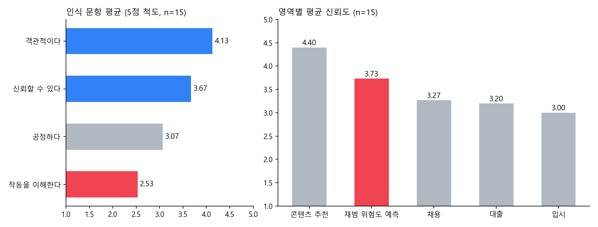

# AGDecision.

> "알고리즘 기반 의사결정은 정말 객관적인가"를 질문지(15명)와 면접(6명)으로 검증한 사회·문화 탐구. 알고리즘이 무엇을 차별하는지보다, 사람들이 그 판정을 왜 의심 없이 받아들이는지에 초점을 맞췄다

---

## 1. 프로젝트 개요 (Overview)

| 항목 | 내용 |
|---|---|
| 프로젝트명 | AGDecision. (알고리즘 기반 의사결정의 객관성 검증) |
| 한 줄 요약 | 질문지법과 면접법을 함께 쓴 혼합 연구로, 알고리즘을 믿는 방식에서 네 가지 패턴을 찾았다: ① 이해할수록 덜 믿는다 ② 모르면서 믿는다 ③ 고위험 결정까지 맡긴다 ④ '객관'과 '공정'을 구분한다 |
| 진행 기간 | 2026.06 (2학년 사회와 문화 수행평가 ①·②) |
| 참여 인원 | 개인 탐구 |
| 본인 역할 | 주제 선정, 문헌 조사, 질문지·면접 설계, 자료 수집, 통계 분석, 보고서 작성 |
| 기여도 | 100% |

알고리즘은 이제 콘텐츠 추천뿐 아니라 채용 서류 심사, 신용 평가, 입시, 재범 위험도 예측까지 맡는다. 그 배경에는 "AI는 감정에 휘둘리지 않으니 사람보다 객관적"이라는 통념이 있다. 하지만 알고리즘은 사람이 쌓은 데이터로 배우고 데이터에 새겨진 차별도 함께 배운다.

출발점은 내가 만든 [HowTo](HowTo_README.md)였다. 쓰레기 사진을 판별하는 모델은 촬영 각도·조명·배경이 바뀌거나 학습 데이터에 드문 형태가 나오면 같은 물건을 다른 종류로 반복해서 잘못 분류했다. 쓰레기처럼 위험 부담이 작은 대상도 틀린다면, 채용이나 대출처럼 사람을 판정하는 알고리즘은 어떨까. 그 오판이 무작위가 아니라 특정 집단에 몰린다면 어떨까. 이 의문을 사회와 문화 교과의 성찰적 태도(보이는 현상의 이면을 의심하는 태도)로 끌고 간 것이 이 탐구다.

선행 연구는 대부분 알고리즘 **출력**이 편향돼 있음을 보였다. 이 탐구는 그 차별이 **왜 의심 없이 받아들여지는지**를 사용자 인식 쪽에서 설명한다.

## 2. 기술 스택 (Tech Stack)

사회과학 탐구라 코드 대신 연구 방법과 분석 도구를 적는다.

| 구분 | 방법·도구 | 선택 이유 |
|---|---|---|
| 연구 설계 | 혼합 연구 (양적 + 질적) | 질문지로 "무엇이 일어나는가"를, 면접으로 "왜 그런가"를 보고 서로의 빈틈을 메운다 |
| 양적 자료 | 질문지법: 18문항 · 6영역 · 5점 척도 (동일 학년 15명) | 객관성에 대한 추상적 태도 → 영역별 신뢰 → 편향 인지와의 괴리 순서로 단계적으로 잰다 |
| 질적 자료 | 면접법: 반구조화 (6명) · 공통 질문 4개 + 성향별 심화 질문 | 수치 뒤에 있는 판단 논리를 끌어낸다 |
| 분석 | 평균 비교, 상관계수, 교차분석, 맨-휘트니 U 검정 | 표본이 작고 정규성을 가정하기 어려워 비모수 검정을 썼다 |
| 문헌 | 캐시 오닐 『대량살상수학무기』, ProPublica COMPAS, Gender Shades, 아마존 AI 채용, 사회·문화 교과서 | 인식 조사로 직접 잴 수 없는 "출력의 차별"을 사례로 보강한다 |

## 3. 핵심 기능 및 담당 업무 (Key Features & Contributions)

### 질문지 설계 (15명 · 18문항)

| 섹션 | 영역 | 측정 내용 |
|:---:|---|---|
| 0 | 기본 정보 | 성별 · AI 사용 시간 · 코딩 경험 |
| 1 | 객관성 인식 | "AI가 인간보다 객관적인가", "감정·편견 없이 공정한가" |
| 2 | 영역별 신뢰도 | 채용 · 대출 · 입시 · 재범 예측 · 콘텐츠 추천 |
| 3 | 편향·차별 인지 | 특정 집단에 불리하게 작동할 가능성, 차별 사례 인지 여부 |
| 4 | 인식 괴리 | "편향을 알면서도 신뢰하는가", "차별적이어도 수정되어야 하는가" |
| 5 | 자유 응답 | 신뢰·불신의 이유를 한 문장으로 |

### 면접 설계 (6명)

공통 질문 4개(AI 신뢰 정도, 객관성 동의 여부, 의사결정 과정 이해, 특정 집단 차별 가능성)를 먼저 묻고 응답 성향에 따라 심화 질문을 다르게 던졌다. 응답자는 세 유형으로 나뉘었다.

| 유형 | 핵심 논리 |
|---|---|
| 부분 신뢰형 (2명) | **소거법적 신뢰.** "사심 없는 AI가 불투명한 인간 주관성보다는 확률적으로 낫다." 쓰는 이유도 신뢰보다 책임 회피와 편의에 가깝다 |
| 강한 신뢰형 (2명) | **통계적 최적해.** 방대한 데이터의 평균이 개인의 편견을 걸러 낸다고 본다. 차별 사례도 기술의 결함이 아니라 일시적 오류로 해석한다 |
| 강한 불신형 (2명) | **기계적 무관심.** 불평등한 현실 데이터를 복사하는 시스템은 객관적일 수 없다고 본다. 소외계층은 데이터 자체가 부족해 주류의 기준이 표준이 된다고 지적한다 |

### 객관성 확보 장치

- 질문지는 긍정·부정 진술을 섞고 표준화된 5점 척도를 썼으며 특정 응답을 유도하는 표현을 뺐다.
- 면접에서는 연구자의 가설을 드러내지 않고 중립적으로 묻고 응답을 그대로 기록했다.

### 주요 업무

- 탐구 주제 설정과 가설 수립 ("알고리즘은 사회의 편향을 학습·증폭해 객관성의 외형 아래 차별을 재생산한다")
- 문헌 조사와 교과 개념(객관적 태도·상호 주관성, 정보 격차, 비판 범죄학) 연결
- 질문지 18문항·면접 문항 설계, 자료 수집, 통계 분석과 유형 분류
- 양적·질적 결과와 문헌을 교차한 해석, 보고서(11쪽) 작성

## 4. 성과 및 결과 (Results & Metrics)

### 정량적 성과

보고서 수치로 다시 그린 그래프. 왼쪽은 객관성·신뢰에 비해 이해도가 낮은 "블랙박스 신뢰", 오른쪽은 재범 예측이 채용·대출·입시보다 높은 "고위험 위임"

| 패턴 | 근거 |
|---|---|
| ① 이해할수록 덜 신뢰한다 | 코딩 경험자(5명) 이해도 4.0 · 신뢰도 2.8, 비경험자(10명) 이해도 1.8 · 신뢰도 4.1. 이해도–신뢰도 상관계수 −0.26. 맨-휘트니 U: 이해도 차이 p = 0.013(유의), 신뢰도 차이 p = 0.152(방향은 같으나 비유의) |
| ② 모르면서 믿는다 | "AI는 객관적이다" 4.13, "신뢰할 수 있다" 3.67, "작동 과정을 이해한다" 2.53 |
| ③ 고위험 결정까지 맡긴다 | 영역별 신뢰도: 콘텐츠 추천 4.40 > 재범 예측 3.73 > 채용 3.27 > 대출 3.20 > 입시 3.00 |
| ④ 객관 ≠ 공정 | "객관적이다" 4.13 대 "공정하다" 3.07. 15명 중 6명이 객관성을 공정성보다 2점 이상 높게 매겼다. "차별적이어도 수정되어야 한다" 3.73 (6명이 5점) |

| 항목 | 결과 |
|---|---|
| 차별 가능성 인식 / 직접 불공정 경험 | 3.53 / 5명 |
| 자유 응답 | 신뢰의 이유 4갈래(일관성, 통계적 합리성, 처리 능력, 데이터 신뢰), 불신의 이유 5갈래(불투명성, 오정보, 책임 부재, 맥락·윤리 결여, 악용 가능성) |
| 수행평가 점수 | (확인 필요) |

### 정성적 성과

- **네 패턴을 면접과 문헌으로 교차 확인했다.** 이해할수록 덜 믿는 패턴(①)은 코딩 중급자 면접자들의 "세부 로직은 블랙박스"라는 진술과 맞물리고 오닐이 말한 알고리즘의 불투명성이 인식 쪽에서 "모르기 때문에 믿는" 신뢰(②)로 나타난다는 해석으로 이어졌다.
- **"데이터가 많으면 공정하다"는 논리의 허점을 교과서 사례로 짚었다.** 천만 명을 조사하고도 예측이 빗나간 『리터러리 다이제스트』 사례는 표본에서 저소득층이 빠진 탓이었다. 강한 신뢰형의 논리를 데이터 대표성 문제로 반박하고 Gender Shades의 과소 대표 오류와 연결했다.
- **신뢰와 불신의 근거가 성격부터 다르다는 점을 찾았다.** 신뢰의 이유는 "일관성·효율·통계"라는 막연한 기대였고 불신의 이유는 "불투명성·맥락 결여"라는 구체적 관찰이었다.
- **대안을 세 갈래로 냈다.** 알고리즘 리터러시 교육, 고위험 영역의 설명 가능성과 인간 최종 검토 의무화, 학습 데이터 대표성 확보와 차별 영향평가.

### 확인된 한계

- **표본이 동일 학년 남학생 15명뿐이다.** 성별·계층 차별을 다루는 탐구인데 표본 자체가 한쪽으로 쏠려 있어 결론을 일반화하기 어렵다.
- **인식만 쟀다.** 실제 알고리즘 출력의 차별은 직접 측정하지 않고 문헌 사례로 보강했다.
- **패턴 ①은 경향이다.** 코딩 경험자가 5명뿐이고 신뢰도 차이는 유의하지 않았다.
- 제출본의 참고문헌 [2](사회·문화 교과서)는 저자·출판사·연도가 빈칸으로 남아 있다. (확인 필요)

## 5. 트러블슈팅 경험 (Troubleshooting)

### ① 5명과 10명을 비교할 방법이 필요했다

**문제** 코딩 경험 유무로 나누면 한쪽이 5명, 다른 쪽이 10명이다. 5점 척도 응답이라 분포도 정규분포와 거리가 멀다.

**원인** 평균만 비교하면 몇 명의 극단적인 응답에 결과가 크게 흔들린다. 표본이 작고 정규성을 가정하기도 어려웠다.

**해결** 교차분석으로 집단별 응답 분포를 먼저 대조하고 두 집단의 차이는 순위에 기반한 비모수 검정인 맨-휘트니 U로 확인했다.

**결과** 이해도 차이는 유의했고(p = 0.013), 신뢰도 차이는 방향만 같고 유의하지 않았다(p = 0.152). 교차표에서는 경험자의 절반 이상이 낮은 신뢰를, 비경험자의 80%가 높은 신뢰를 보였다.

### ② 원하던 결론이 통계로 확정되지 않았다

**문제** 가설과 가장 잘 맞는 패턴 ①("이해할수록 덜 신뢰한다")의 핵심인 신뢰도 차이가 유의 수준을 넘지 못했다.

**원인** 경험자 표본이 5명이라 차이가 있어도 검정력이 부족하다.

**해결** 결론의 강도를 낮췄다. 패턴 ①은 "확정된 결과"가 아니라 "표본을 늘려 다시 확인해야 할 경향"으로 적고 상관계수(−0.26)와 면접 진술을 보조 근거로 붙였다. 한계 절에도 따로 적었다.

**결과** 검정으로 확인된 것(①의 이해도 차이), 평균 비교에 머무는 것(②③④), 경향에 그친 것(①의 신뢰도 차이)을 나눠 읽을 수 있게 됐다.

### ③ 인식 조사만으로는 "실제로 차별하는가"를 말할 수 없었다

**문제** 가설은 "알고리즘이 차별을 재생산한다"인데, 질문지와 면접은 사람들의 인식만 잰다.

**원인** 고등학생이 채용·재범 예측 알고리즘의 출력을 직접 얻어 측정할 방법이 없다.

**해결** 역할을 나눴다. 출력의 차별은 COMPAS, Gender Shades, 아마존 채용 사례로 보강하고 이 탐구는 "그 차별이 왜 받아들여지는가"를 인식 차원에서 설명하는 데 집중했다. 후속 과제로는 HowTo 모델에서 학습 이미지가 많은 종류와 적은 종류의 오인식률을 비교해 "데이터가 부족한 대상일수록 더 틀린다"를 기술 차원에서 확인하는 실험을 설계했다.

**결과** 가설 검증 범위를 "인식과 태도 차원"으로 명시하고 출력 차원은 문헌과 후속 실험으로 넘겼다.

## 6. 링크 및 산출물 (Links & Deliverables)

| 구분 | 링크 |
|---|---|
| GitHub 저장소 | 없음 |
| 산출물 | 수행평가 ① 탐구 계획서, 수행평가 ② 연구 보고서(11쪽), 자기평가서 |
| 관련 프로젝트 | [HowTo](HowTo_README.md) (탐구 동기, 후속 실험 대상) |

<b>용어</b>

- **혼합 연구**: 양적(질문지법)·질적(면접법) 방법을 함께 써서 서로의 빈틈을 메우는 설계
- **반구조화 면접**: 공통 질문에 응답자별 심화 질문을 더하는 방식
- **맨-휘트니 U 검정**: 표본이 작거나 정규성을 가정하기 어려울 때 두 집단의 차이를 순위로 확인하는 비모수 검정
- **상호 주관성**: 연구자들이 공유하는 관점까지 포함하는 객관성. "누구의 관점이 표준이 되었는가"에 대한 성찰
- **정보 격차**: 디지털 접근·활용 능력의 차이가 또 다른 불평등으로 이어지는 현상
- **비판 범죄학(갈등 이론)**: 형사 사법 제도가 사회적 강자에게 유리하게 작동할 수 있다고 보는 관점
- **블랙박스 신뢰** (이 탐구의 정의): 작동 원리를 모르는 채로 알고리즘을 객관적이라 여기고 믿는 양상
- **수학으로 표현된 의견** (오닐): 객관적으로 보이는 수식 안에 개발자와 데이터의 가치 판단이 담겨 있다는 규정

<b>참고문헌</b>

[1] 캐시 오닐 저, 김정혜 역, 『대량살상수학무기: 어떻게 빅데이터는 불평등을 확산하고 민주주의를 위협하는가』, 흐름출판, 2017. (원서: C. O'Neil, *Weapons of Math Destruction*, Crown, 2016.)
[2] 『고등학교 사회·문화』 교과서 (저자·출판사·연도 확인 필요)
[3] J. Angwin, J. Larson, S. Mattu, and L. Kirchner, "Machine Bias," *ProPublica*, May 23, 2016.
[4] J. Buolamwini and T. Gebru, "Gender Shades: Intersectional Accuracy Disparities in Commercial Gender Classification," *Proceedings of Machine Learning Research*, vol. 81, pp. 77–91, 2018.
[5] J. Dastin, "Amazon scraps secret AI recruiting tool that showed bias against women," *Reuters*, Oct. 10, 2018.
[6] stx4R, "HowTo: 이미지 인식 기반 분리배출 안내 웹 애플리케이션," GitHub.

---

+++

## 고객여정지도 (Journey Map)

여기서 "사용자"는 알고리즘의 판정을 받는 일반 시민이다. 면접 유형과 질문지 결과로 한 사람이 알고리즘을 받아들이는 과정을 재구성했다.

| 단계 | 행동 | 생각 | 탐구에서 확인한 것 |
|---|---|---|---|
| 접촉 | 추천 서비스를 하루 3시간 이상 쓴다 | "편하고 잘 맞는다" | 콘텐츠 추천 신뢰도 4.40 |
| 일반화 | 추천의 경험을 다른 영역으로 넓힌다 | "기계니까 객관적이겠지" | "객관적이다" 4.13, "이해한다" 2.53 |
| 위임 | 사람을 판정하는 결정도 맡긴다 | "사람보다는 낫겠지" | 재범 예측 3.73으로 채용·대출·입시보다 높음. 부분 신뢰형의 소거법적 신뢰 |
| 균열 | 차별 사례를 접한다 | "일시적 오류겠지" / "원래 그런 구조다" | 강한 신뢰형은 오류로, 강한 불신형은 구조로 해석 |
| 요구 | 시정을 원한다 | "차별이면 고쳐야 한다" | "수정되어야 한다" 3.73, 6명이 5점 |

## DREAD 취약성 관리 (DREAD Risk Assessment)

탐구에서 다룬 "고위험 영역 위임"을 DREAD로 정리했다. 점수는 탐구 결과와 문헌 사례를 바탕으로 한 정성적 평가다.

| 위협 | D | R | E | A | D | 점수 | 대응 (탐구의 제언) |
|---|---|---|---|---|---|---|---|
| 재범 예측의 집단별 오분류 (COMPAS) | 3 | 3 | 2 | 3 | 2 | 2.6 | 설명 가능성 확보, 인간 최종 검토 의무화 |
| 채용 모델의 과거 편향 재생산 (아마존 사례) | 3 | 3 | 2 | 2 | 2 | 2.4 | 학습 데이터 대표성 점검, 사전·사후 차별 영향평가 |
| 이해 없는 신뢰로 인한 검증 부재 (블랙박스 신뢰) | 2 | 3 | 3 | 3 | 1 | 2.4 | 알고리즘 리터러시 교육 |

D·R·E·A·D = 피해·재현성·악용 난이도·영향 범위·발견 가능성 (1~3). 점수는 평균.
