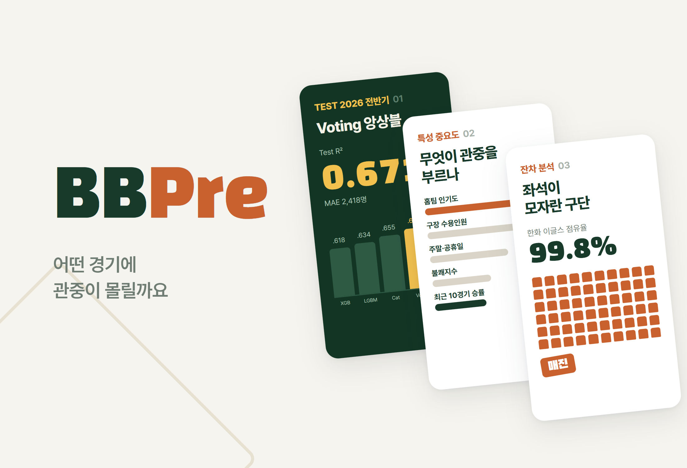
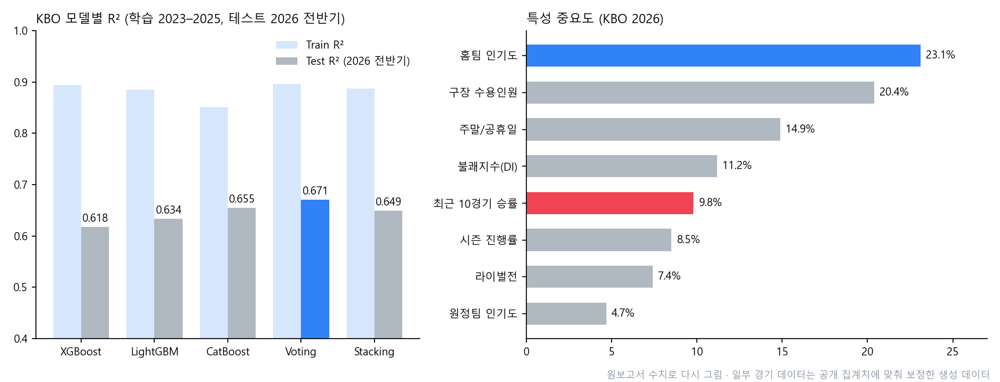

# BBPre.

> KBO·MLB 경기 데이터로 "어떤 경기에 관중이 몰리는가"를 예측한 머신러닝 탐구. 2026 전반기를 완전히 떼어 둔 시간적 홀드아웃으로 검증했고 매진이 일상이 된 시즌에서 예측 문제의 성격이 바뀌는 지점(절단)을 찾았다

---

## 1. 프로젝트 개요 (Overview)

| 항목 | 내용 |
|---|---|
| 프로젝트명 | BBPre. (KBO & MLB 관중 수 예측) |
| 한 줄 요약 | Gradient Boosting 3종과 앙상블 2종으로 경기별 관중 수를 예측했다. KBO 2026 전반기 Test R² 0.671, MAE 2,418명. 홈팀 인기도가 최근 성적보다 두 배 이상 강한 변수였다 |
| 진행 기간 | 2026.03.10 ~ 2026.07.13 |
| 참여 인원 | 개인 탐구 |
| 본인 역할 | 문제 설정, 데이터 수집·전처리, 특성 공학, 모델링, 결과 분석, 보고서(25쪽)·발표 자료 작성 |
| 기여도 | 100% |
| 진행 맥락 | 2학년 비교과 활동 (DDC, 활동 성격은 확인 필요) |

2026년 KBO는 전반기 424경기 만에 763만 3,775명(경기당 18,004명)을 모아 전반기 최다 관중 기록을 세웠다. 관중 수는 티켓 매출에서 끝나지 않고 구장 F&B, 머천다이징, 스폰서십, 중계권 협상력까지 이어진다. 그런데 "관중이 많다"는 사실만으로는 아무것도 결정할 수 없다. 어떤 경기에, 어떤 요인 때문에 몰리는지, 매진 뒤에 숨은 수요가 얼마인지를 알아야 가격·마케팅·인력 배치·구장 증축을 데이터로 판단할 수 있다.

**연구 질문.** 관중 수는 단순한 시계열 추세인가, 아니면 날씨·라이벌전·순위·인기도가 얽힌 경기별 조건의 함수인가?

| 가설 | 내용 | 확인 방법 |
|---|---|---|
| 1. 이벤트 상호작용 | 경기별 조건을 입력으로 하는 회귀 모델이 R² 0.6 이상을 낸다 | 테스트 R² |
| 2. 브랜드 우위 | 단기 성적보다 오래 쌓인 구단 인기도가 더 강한 예측 변수다 | 특성 중요도 순위 |
| 3. 일반화 | 2023–2025로 배운 모델이 2026 전반기에서도 무너지지 않되, 매진 상한만큼 성능이 떨어진다 | 기존 분할 대비 변화폭, 잔차 패턴 |

> **데이터에 관해.** 원보고서 한계 절에 적은 대로, 경기 단위 상세 데이터 일부는 공개 집계치(전반기 424경기, 총 763만 명, 구단별 평균 관중·점유율)에 맞춰 보정한 **생성 데이터**다. 아래 성능 수치는 이를 바탕으로 한 추정치다. 실측 경기 단위 데이터를 확보하면 같은 파이프라인으로 다시 계산해야 한다.

## 2. 기술 스택 (Tech Stack)

| 구분 | 기술 | 선택 이유 |
|---|---|---|
| 모델 | XGBoost, LightGBM, CatBoost | 표 형태 데이터에서 비선형 상호작용(폭염 × 실외 구장 등)을 잘 잡는다. 세 방식의 성향 차이도 비교할 수 있다 |
| 앙상블 | Voting(단순 평균), Stacking(Ridge 메타 모델) | 단일 모델의 편향을 서로 상쇄한다 |
| 검증 | 시간 순서 보존 CV(튜닝), 2026 전반기 시간적 홀드아웃(최종 1회 평가) | 무작위 분할은 미래 정보로 과거를 맞히는 누수가 생긴다 |
| 데이터 | KBO 공식·네이버 스포츠, 기상청 기상자료개방포털, MLB Stats API·pybaseball, Retrosheet 형식 게임로그 | 경기·날씨·세이버메트릭스를 한 경기 단위로 붙인다 |
| 지표 | R², MAE, RMSE, 과적합 격차(Train R² − Test R²) | MAE는 "몇 명 틀리는가"로 바로 읽히고 격차는 새 시즌 일반화 능력을 보여 준다 |

## 3. 핵심 기능 및 담당 업무 (Key Features & Contributions)

### 데이터

| 데이터 | 기간 | 규모 |
|---|---|---|
| KBO 경기 기록 | 2023 ~ 2026 전반기 | 2,584경기 (학습 2,160 · 테스트 424) |
| 기상 | 2023 ~ 2026 | 경기일 × 구장 관측소 매핑 (기온·강수·습도·풍속·운량) |
| MLB 경기 기록 | 2020 ~ 2026 전반기 | 14,456경기 (학습 13,046 · 테스트 약 1,410) |
| MLB 게임로그 | 2020 ~ 2026 | 28,912 팀-경기 |

- 기상 결측은 인접 관측소 값이나 월평균으로 채우고 관중 수가 없는 경기는 뺐다.
- 우천 노게임, 서스펜디드, 개막전, 어린이날 같은 특수 경기는 따로 표시했다.
- 돔 구장(고척)은 돔 더미와의 상호작용으로 날씨 영향을 분리했다. MLB 2020년(60경기 단축, 무관중 포함)은 제외하거나 더미로 처리했다.
- 범주형 변수는 CatBoost 자체 처리, XGBoost·LightGBM은 Label/One-hot으로 인코딩했다. 누수 위험이 있는 타깃 인코딩은 쓰지 않았다.

### 특성 공학

원칙은 하나였다. **경기 시작 전에 마케팅 담당자가 알 수 있는 정보만 쓴다.**

| 분류 | 특성 |
|---|---|
| 환경 | 불쾌지수 `DI = 9/5·T − 0.55·(1 − RH/100)·(9/5·T − 26) + 32` |
| 일정 | `is_weekend`, `is_holiday`, `holiday_weight` |
| 시즌 | `season_progress`, `race_intensity = 진행률 × 홈팀 승률` |
| 모멘텀 | `home_recent10_wr = rolling_mean(win, 10).shift(1)` |
| 인기도 | `home_pop / away_pop = expanding_mean(attendance).shift(1)` |
| 구장 | `capacity`, `is_dome` |
| 라이벌전 | 잠실 더비, 엘롯라시코, 클래식 시리즈, 금강 시리즈 이진 표시 |

### 모델링

- 하이퍼파라미터는 학습 구간 안에서 시간 순서를 지킨 CV로 찾았다(트리 깊이 4–8, 학습률 0.03–0.1, 트리 수 300–1,200, 서브샘플 0.7–1.0). 테스트 세트는 최종 평가에 한 번만 썼다.
- KBO와 MLB에 같은 파이프라인을 돌려 결과가 리그를 넘어 재현되는지 봤다.
- MLB 게임로그로 팀-시즌 단위 OPS, wRC+, WAR, BABIP, ISO, 피타고리안 승률을 계산해 관중 모델과의 관계를 따로 분석했다.

### 주요 업무

- KBO·MLB·기상 데이터 수집과 경기 단위 결합, 전처리 규칙 수립
- 누수 없는 특성 설계(`shift(1)`, expanding mean)와 시간 정렬 단조성 검증
- 5개 모델 학습·튜닝·비교, 특성 중요도·잔차 분석, 서울 3구단 연도별 분석
- 세이버메트릭스 확장 분석, 보고서와 발표 자료 작성

## 4. 성과 및 결과 (Results & Metrics)

### 정량적 성과

원보고서 수치로 다시 그린 그래프

**KBO (학습 2023–2025, 테스트 2026 전반기 424경기)**

| 모델 | Train R² | Test R² | 과적합 격차 |
|---|---|---|---|
| XGBoost | 0.894 | 0.618 | 0.276 |
| LightGBM | 0.885 | 0.634 | 0.251 |
| CatBoost | 0.851 | 0.655 | **0.196 (최소)** |
| **Voting** | 0.896 | **0.671 (최고)** | 0.225 |
| Stacking | 0.887 | 0.649 | 0.238 |

**MLB (테스트 2026 전반기)**: CatBoost RMSE **6,941명**(최저) · LightGBM 6,988 · Stacking 7,063 · Voting 7,120

| 항목 | 결과 |
|---|---|
| 최고 성능 | Voting Test R² 0.671, MAE 2,418명 (평균 관중 18,004명 대비 약 13.4%) |
| 기존 분할 대비 | 2023–2025 안에서 2025 후반기를 테스트로 쓴 기존 최고 R² 0.697 → 2026 완전 홀드아웃 0.671 (−0.026) |
| 가설 1 | 지지 (Test R² 0.671 > 0.6) |
| 가설 2 | 지지 (홈팀 인기도 23.1% vs 최근 10경기 승률 9.8%) |
| 가설 3 | 지지 (붕괴 없이 소폭 하락) |

**서울 3구단 연도별 R²**

| 연도 | LG | 두산 | 키움 | 해석 |
|---|:---:|:---:|:---:|---|
| 2023 | 0.6091 | 0.5810 | 0.5340 | 정상 시즌 |
| 2024 | 0.3887 | 0.4120 | 0.3650 | 리그 급성장기 분포 변화로 전 팀 급락 |
| 2025 | 0.5707 | 0.5420 | 0.5150 | 신기록 흥행 속 회복 |
| 2026 전반 | 0.5210 | 0.4980 | 0.4640 | 매진 상한으로 분산 축소 |

### 정성적 성과

- **브랜드가 성적을 이긴다.** 관중 유치는 이번 주 순위 싸움보다 수년간 쌓인 팬 기반의 함수였다. 리빌딩 시즌에도 팬 경험 투자를 줄이면 안 되는 근거가 된다.
- **CatBoost의 안정성이 두 리그에서 재현됐다.** KBO에서는 과적합 격차가 가장 작았고 MLB에서는 단일 모델로 앙상블을 앞섰다. XGBoost는 학습 성능이 최상위였지만 격차 0.276으로 새 시즌 일반화에 가장 약했다.
- **정교한 세이버 지표는 관중 모델에서 약했다.** 팀 OPS와 득점은 강하게 연결되고 출루율이 장타율보다 득점에 더 크게 기여했다. 하지만 이 지표들을 관중 모델에 넣으면 중요도가 낮게 나왔다. 팬은 wRC+보다 순위·연승·스타 같은 보이는 신호에 반응하고 경기력은 장기 인기도를 거쳐 흥행으로 이어진다고 해석했다.
- **MLB의 오차가 큰 이유를 구조로 설명했다.** 평균 약 2.8만 명에 RMSE 6,941명은 큰 편인데, 30개 구단·구장의 이질성이 10구단 KBO보다 훨씬 크기 때문이다.

### 확인된 한계

- **일부 경기 데이터가 생성 데이터다.** 성능 수치는 실측이 아닌 보정 데이터 기반 추정치다. 원자료와 코드는 로컬에 남아 있지 않다. (확인 필요)
- **절단을 진단만 하고 풀지는 않았다.** 매진 경기의 잠재 수요를 추정하려면 Tobit 회귀나 절단 인지 손실함수 같은 방법이 필요하다.
- **2026은 전반기만 반영했다.** 후반기 순위 싸움과 가을야구를 넣은 풀시즌 재검증이 필요하다.
- **티켓 가격 변수가 없어** 가격탄력성을 추정하지 못했다.

## 5. 트러블슈팅 경험 (Troubleshooting)

### ① 무작위로 나누면 성능이 부풀려진다

**문제** 관중 데이터는 시간 순서가 있다. 무작위로 학습·테스트를 나누면 모델이 미래 경기의 정보로 과거를 맞히게 된다. 최근 승률이나 인기도 같은 동적 변수에는 그 경기 자체의 결과가 섞여 들어간다.

**원인** 누수가 두 층에서 생긴다. 특성 쪽에서는 "그 경기까지 포함한" 승률·평균 관중이, 평가 쪽에서는 테스트보다 뒤의 경기가 학습에 들어간다.

**해결** 두 겹으로 막았다. 특성은 모든 동적 변수에 `shift(1)`을 걸어 그 경기 **이전** 정보만 쓰게 했다. 정렬이 틀어지면 `shift`가 무력해지므로 경기 일시의 단조성을 코드로 검증했다. 평가는 2023–2025 학습, 2026 전반기 테스트로 시간을 완전히 갈랐고 튜닝도 학습 구간 안의 시간 순서 CV로만 했다.

**결과** 기존 분할의 0.697보다 낮은 0.671이 나왔다. 이 차이를 성능 저하가 아니라 "누수 없는 일반화 성능과 과거 재현 능력의 차이"로 읽었다. 높은 R²보다 어떤 조건에서 쟀는지가 먼저라는 결론이다.

### ② 매진이 늘자 모델이 "수요"가 아니라 "좌석"을 배우기 시작했다

**문제** 2026 전반기에 성능이 떨어지고, 수용인원의 특성 중요도가 18.3%에서 20.4%로 뛰었다. 서울 3구단 R²도 모두 내려갔다.

**원인** 관측되는 관중은 `min(수요, 수용인원)`이다. 매진 경기에서는 실제 수요가 수용인원에서 잘려(절단) 보이지 않는다. 그러면 관중 수의 분산 자체가 줄어 "설명할 분산"이 사라지고 예측 문제가 수요 예측에서 공급 제약 예측으로 바뀐다.

**해결** 잔차를 구단·요일·점유율 구간별로 쪼개 절단의 흔적을 찾았다. 한화 홈경기의 잔차가 체계적으로 음수(예측 > 실제 상한)에 몰려 있었다. 조건만 보면 모델은 수용인원 이상을 예측하는데 실제 값은 상한에서 잘린다. 반대로 월요일 이동일 뒤 화요일 경기는 잔차가 양수로 쏠려 모델이 주중 효과를 과하게 반영한다는 것도 찾았다.

**결과** 한화는 평균 관중이 중위권인데 점유율은 리그 최고로, 좌석을 늘리면 채워질 수요가 있다는 근거를 얻었다. 관중 모델이 마케팅 도구에 그치지 않고 좌석 증설 같은 투자 판단의 출발점도 될 수 있다는 결론에 이르렀다. 잠재 수요의 크기를 직접 추정하는 Tobit 계열 방법은 후속 과제로 남겼다.

### ③ 기온 하나로는 여름 관람의 불쾌감을 담지 못한다

**문제** 한여름 실외 구장의 관중 둔화는 기온만의 문제가 아니다. 같은 기온도 습도에 따라 체감 더위가 크게 다르다. 돔 구장은 날씨 영향을 아예 받지 않는다.

**원인** 기온과 습도를 따로 넣으면 모델이 둘의 결합 효과를 스스로 찾아야 하고 돔과 실외 구장을 같은 규칙으로 다루게 된다.

**해결** 기온(`T`)과 습도(`RH`)를 결합한 불쾌지수를 파생 변수로 넣고 돔 구장은 돔 더미와의 상호작용으로 날씨 효과를 분리했다.

**결과** 불쾌지수는 중요도 4위(11.2%)였다. 트리 모델은 DI가 80을 넘는 폭염 구간에서 실외 구장 관중이 둔화되는 비선형 패턴을 잡아냈다.

## 6. 링크 및 산출물 (Links & Deliverables)

| 구분 | 링크 |
|---|---|
| GitHub 저장소 | 없음 |
| 산출물 | 탐구 보고서(25쪽, 부록: 데이터 명세서·용어 정리), 발표 자료 `KBO & MLB.pptx` |

<b>주요 변수</b>

| 변수 | 유형 | 설명 |
|---|---|---|
| `date` / `dow` | 날짜 / 범주 | 경기 날짜, 요일 |
| `home` / `away` | 범주 | 홈팀, 원정팀 |
| `stadium` / `capacity` | 범주 / 수치 | 구장, 수용인원 |
| `attendance` | 수치 (타깃) | 관중 수 |
| `temp` / `rain` / `humid` / `wind` | 수치 | 기온, 강수량, 습도, 풍속 |
| `DI` | 수치 (파생) | 불쾌지수 |
| `is_weekend` / `is_holiday` / `holiday_weight` | 이진 / 수치 | 주말, 공휴일, 연휴 가중 |
| `season_progress` / `race_intensity` | 수치 (파생) | 시즌 진행률, 순위 경쟁도 |
| `home_recent10_wr` | 수치 (파생) | 홈팀 최근 10경기 승률 (shift 1) |
| `home_pop` / `away_pop` | 수치 (파생) | 홈·원정 인기도 (expanding mean, shift 1) |
| `is_rivalry` / `is_dome` | 이진 | 라이벌전, 돔 구장 |
| `occupancy` | 수치 (분석용) | 점유율 = 관중 수 / 수용인원 |

<b>용어</b>

- **시간적 홀드아웃**: 학습과 테스트를 시간 순서대로 갈라 미래 데이터로만 평가하는 방식
- **데이터 누수**: 예측 시점에 알 수 없는 정보가 학습에 쓰여 성능이 부풀려지는 현상
- **절단(Truncation)**: 관측값이 상·하한에서 잘려 실제 값을 알 수 없는 상태 (매진 경기의 관중 수)
- **Tobit 모형**: 절단된 종속변수의 잠재값을 추정하는 계량경제 모형
- **과적합 격차**: Train 성능과 Test 성능의 차이
- **Ordered Boosting**: 무작위 순서에서 각 샘플보다 앞선 샘플만으로 그 샘플의 잔차를 계산해 누수를 줄이는 CatBoost의 학습 방식
- **Expanding Mean**: 시점 *t*까지 모든 과거 값의 평균. 누적 팬 기반의 대리 지표

---

+++

## 고객여정지도 (Journey Map)

이 탐구의 "고객"은 모델을 쓰는 구단 마케팅 담당자다.

| 단계 | 행동 | 생각 | 모델이 주는 것 |
|---|---|---|---|
| 시즌 전 | 홈경기 일정을 받는다 | "어느 경기에 힘을 줘야 하지?" | 요일·공휴일·라이벌전·상대 인기도로 경기별 예상 관중 |
| 경기 주간 | 날씨 예보를 확인한다 | "폭염이면 얼마나 빠질까?" | 불쾌지수 반영 예측, 경기당 오차 약 2,400명 |
| 경기 당일 | 매점 재고·보안 인력을 배치한다 | "몇 명 기준으로 준비하지?" | MAE 2,418명 수준의 인원 계획 근거 |
| 시즌 중 | 성적이 떨어진다 | "관중도 빠지겠지?" | 최근 승률보다 인기도가 두 배 이상 강하다는 근거 |
| 시즌 후 | 증축·가격을 검토한다 | "좌석을 늘리면 찰까?" | 매진 구단의 음수 잔차로 본 잠재 수요의 존재 |
