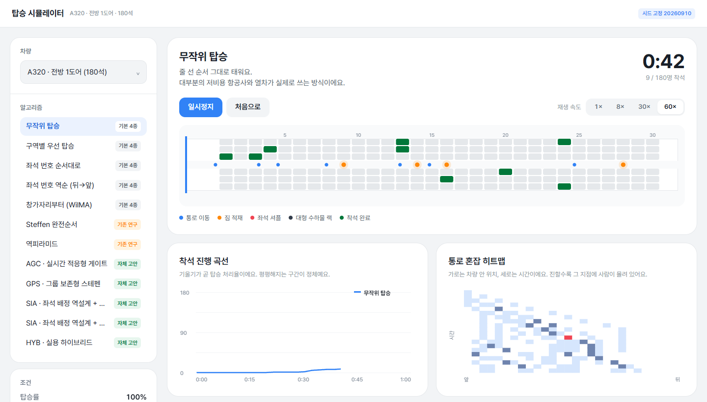
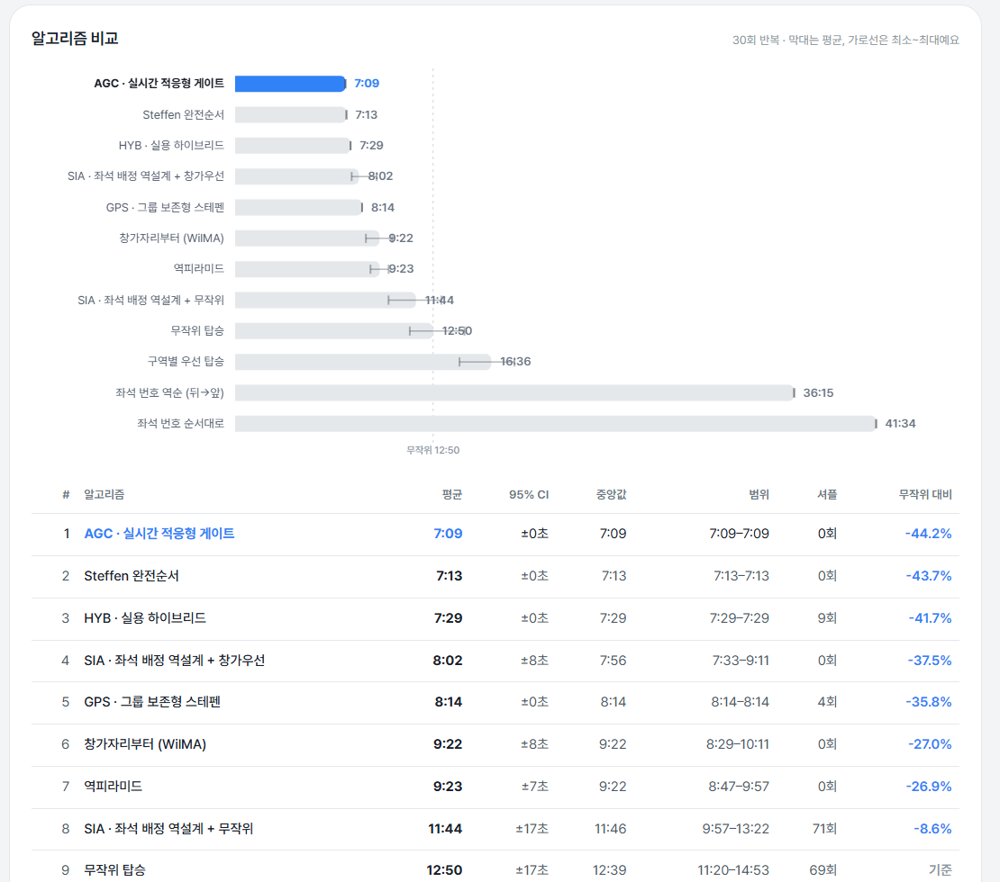
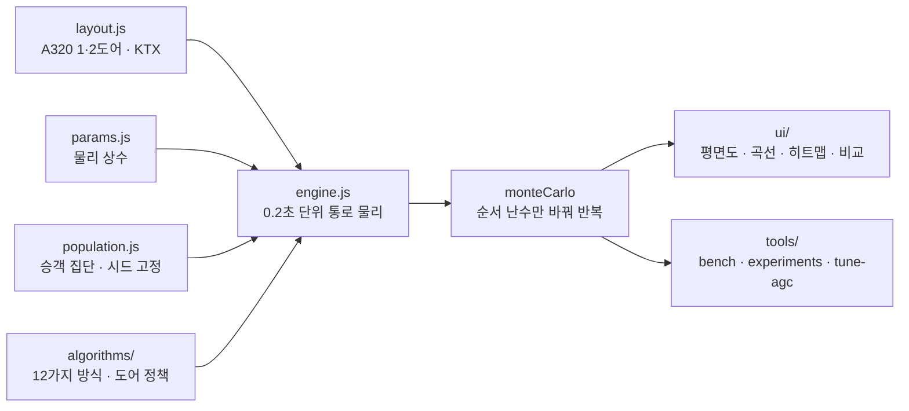

# BoardinG

> "비행기와 기차에 사람을 가장 빨리 태우는 순서는 무엇인가"를 통로 물리·짐 적재·좌석 셔플까지 모델링한 에이전트 기반 시뮬레이터로 실험한 프로젝트

---

## 1. 프로젝트 개요 (Overview)

| 항목 | 내용 |
|---|---|
| 프로젝트명 | BoardinG (탑승 시뮬레이터) |
| 한 줄 요약 | 탑승 방식 12가지를 같은 승객 집단으로 비교하고, 자체 고안한 4가지 방식으로 "순서 최적화 이후"의 개선 축(교란 내성·좌석 배정·문 개수·승강장 안내)을 찾았다 |
| 진행 기간 | 2026.09.10 (v1.0.0 → v1.1.4, 하루) |
| 참여 인원 | 개인 프로젝트 (기본 4종 비교는 과제 요구사항, 과제 맥락은 확인 필요) |
| 본인 역할 | 모델 설계, 시뮬레이션 엔진·알고리즘·실험 도구·시각화 구현, 결과 분석 |
| 기여도 | 100% (저장소 커밋 6건 전부 본인) |

항공사는 대부분 뒤쪽 구역부터 태운다. 그게 정말 빠른지, 더 빠른 방법이 있다면 왜 안 쓰는지 궁금했다. 답하려면 사람이 통로에서 서로를 어떻게 막는지부터 모델링해야 한다. 앞사람이 짐을 올리는 동안 뒷사람은 기다리고, 창가 자리 승객이 늦게 오면 이미 앉은 사람이 일어나 비켜 줘야 한다. 이 시뮬레이터는 그 마찰을 물리로 재현하고, 그 위에서 탑승 방식을 겨룬다.

## 2. 기술 스택 (Tech Stack)

| 구분 | 기술 | 선택 이유 |
|---|---|---|
| 시뮬레이션 | Vanilla JavaScript (ES 모듈), 시드 고정 난수 | 엔진을 브라우저와 Node가 함께 쓴다. 같은 시드면 같은 결과가 나와 비교가 재현된다 |
| 시각화 | Canvas 2D (객실 평면도·착석 곡선·혼잡 히트맵·비교 막대) | 차트 라이브러리 없이 직접 그렸다 |
| 실험 도구 | Node 스크립트 (`bench` · `experiments` · `tune-agc`) | 몬테카를로 비교와 실험 4종을 명령 한 줄로 재현한다 |
| 배포 | GitHub Pages · 로컬 정적 서버(`tools/serve.mjs`) | ES 모듈은 `file://`에서 막혀 정적 서버로 띄운다 |

외부 의존성은 없다. `package.json`에는 스크립트만 있다.

## 3. 핵심 기능 및 담당 업무 (Key Features & Contributions)

로컬에서 캡처. 위: 무작위 탑승 60배속 재생 중(통로 이동·짐 적재·좌석 셔플이 색으로 구분되고 아래에 착석 곡선과 통로 혼잡 히트맵). 아래: "전체 비교하기" 30회 반복 결과

### 무엇을 모델링했는가

통로를 1차원 연속 공간으로 보고 0.2초 단위로 전진시킨다.

| 요소 | 모델 |
|---|---|
| 통로 이동 | 추월 불가. 앞사람과 `bodyGap`(0.45 m)을 유지해 정체가 뒤로 전파된다 |
| 짐 적재 | 자기 열에 도착하면 `stowBase + 가방당 시간`만큼 통로를 막는다 |
| 적재 시 팔 폭 | 짐 올리는 사람 뒤로 `stowGap`(0.95 m)이 필요하다. 좌석 피치(0.81 m)보다 크다 |
| 좌석 셔플 | 안쪽 자리로 들어갈 때 이미 앉은 바깥쪽 승객 b명이 통로로 나온다 |
| 일행 | 인접 좌석 배정. 창가부터 들어가 일행 내부 셔플은 0 |
| 도어 처리율 | 문 하나가 넘기는 최대 속도(항공 2.0초/인, 열차 1.0초/인) |
| 대형 수하물 랙 | 열차 전용. 큰 짐 승객이 승강문 옆에서 멈춰 출입구를 막는다 |
| 교란 | 줄 순서 이탈(σ)과 호명 때 게이트에 없는 지각 비율 |

`stowGap > pitch`가 가장 중요한 한 줄이다. "인접한 두 열에서 동시에 짐을 올릴 수 없다"가 규칙으로 정해진 게 아니라 물리에서 나온다. 그래서 Steffen 방식이 한 열씩 건너뛰는 이유도 가정이 아닌 결과로 드러난다.

### 구현 기능

- **차량 3종**: A320 전방 1도어·앞뒤 2도어(180석), KTX-산천(360석 10호차).
- **탑승 방식 12가지**: 기본 4종(무작위 · 구역별 뒤→앞 · 좌석 번호순과 역순 · 창가부터 WilMA), 기존 연구 2종(Steffen 완전순서 · 역피라미드), 자체 고안 4종(AGC · GPS · SIA · HYB)과 SIA 변형.
- **재생**: 1× · 8× · 30× · 60× 배속, 승객 상태(통로 이동 · 짐 적재 · 좌석 셔플 · 대형 수하물 랙 · 착석 완료)를 색으로 구분한다.
- **분석 차트**: 착석 진행 곡선(기울기가 곧 처리율), 통로 혼잡 히트맵(가로 위치 × 세로 시간), 전체 비교 막대(평균과 최소~최대).
- **조건 조절**: 탑승률, 도어 처리율, 순서 이탈 σ, 지각 비율, 일행 유지 여부, 반복 횟수. 결과를 CSV로 내보낸다.

### 자체 고안 4종

기존 방식은 모두 좌석의 기하학(몇 번째 열인가, 창가인가)만 본다. 아래 넷은 각자 다른 지렛대를 잡는다.

| 방식 | 핵심 |
|---|---|
| **AGC** 실시간 적응형 게이트 | 줄 순서를 미리 정하지 않는다. 게이트가 빌 때마다 통로 상태를 보고 다음 한 명을 고른다. 국소 판단만으로 Steffen의 구조(12웨이브 × 15명, 셔플 0)를 스스로 재발견한다 |
| **GPS** 그룹 보존형 Steffen | 일행을 한 단위로 묶어 대표의 Steffen 순위로 정렬한다. "일행을 안 쪼갠다"는 제약의 가격을 잰다 |
| **SIA** 좌석 배정 역설계 | 체크인에서 짐 많은 승객·큰 일행을 뒤쪽 창가로, 짐 없는 승객을 앞쪽 통로 쪽으로 배정한다. 탑승 순서와 직교하는 지렛대다 |
| **HYB** 실용 하이브리드 | SIA + GPS. 일행을 흩지 않으면서 좌석 배정까지 쓴다 |

### 주요 업무

- 통로·적재·셔플·도어·교란 물리 모델과 시뮬레이션 엔진
- 탑승 방식 12가지 구현, 공정 비교를 위한 승객 집단 고정
- 실험 도구 4종(도어 병목 · 2도어 분할점 · 교란 내성 · KTX 승강장)과 AGC 파라미터 튜닝 스크립트
- 객실 평면도·착석 곡선·히트맵·비교 차트 UI

## 4. 성과 및 결과 (Results & Metrics)

### 정량적 성과

**A320 · 180석 · 1도어 · 30회 반복** (`node tools/bench.mjs --runs 30`, 2026.09 재실행 결과가 README와 일치)

| # | 방식 | 평균 | 셔플 | 무작위 대비 |
|---|---|---|---|---|
| 1 | **AGC** 실시간 적응형 게이트 | **7:09** | 0 | **−44.2%** |
| 2 | Steffen 완전순서 | 7:13 | 0 | −43.7% |
| 3 | **HYB** 실용 하이브리드 | 7:29 | 9 | −41.7% |
| 4 | **SIA** + 창가우선 | 8:02 | 0 | −37.5% |
| 5 | **GPS** 그룹 보존형 Steffen | 8:14 | 4 | −35.8% |
| 6 | 창가자리부터 (WilMA) | 9:22 | 0 | −27.0% |
| 7 | 역피라미드 | 9:23 | 0 | −26.9% |
| 8 | **SIA** + 무작위 | 11:44 | 71 | −8.6% |
| 9 | 무작위 탑승 | 12:50 | 69 | — |
| 10 | 구역별 우선 탑승 | 16:36 | 71 | **+29.4%** |
| 11 | 좌석 번호 역순 | 36:15 | 60 | +182.5% |
| 12 | 좌석 번호 순서대로 | 41:34 | 60 | +223.9% |

| 실험 | 결과 |
|---|---|
| 1. 도어 병목 | 도어 2.0초/인에서 Steffen이 이론 하한(6:00)에 73초 차이까지 붙는다. 순서 최적화는 사실상 끝났다 |
| 2. 앞뒤 2도어 | 최적 분할은 30열 중 16열(전방 96명 · 후방 84명). 1도어 7:13 → 2도어 4:19 (−40%) |
| 3. 교란 내성 | 순서 이탈 σ=25 + 지각 10%에서 Steffen은 +35%(9:44), AGC는 +6%(7:35). 차이 2분 9초 |
| 4. KTX 승강장 | 승객을 자기 호차 문으로 유도하기만 해도 어떤 방식이든 46~51% 단축(AGC 3:09 → 1:42) |
| 실측 캘리브레이션 · 실제 탑승 비교 | (확인 필요) |

모델의 타당성은 문헌(Steffen 2008)이 보고한 상대 순서로 확인했다. Steffen ≪ WilMA < 무작위 < 구역별 뒤→앞 ≪ 좌석 번호순이 재현되고, 무작위 대비 비율도 문헌 구간(Steffen −39%, 구역별 +24%)과 맞는다.

### 정성적 성과

- **업계 표준이 무작위보다 느리다는 것을 보였다.** 구역별 뒤→앞 탑승은 무작위보다 29% 느리다. 히트맵에서 원인이 바로 보인다. 같은 구역 승객이 통로의 같은 지점에 몰려 서로를 막는 동안 통로의 나머지 80%는 비어 있다.
- **"순서 이후"의 축을 찾았다.** 좌석이 고정된 상태에서는 Steffen이 이미 물리적 최적에 가깝다. 그래서 목표를 더 빠른 정렬에서 실현 가능성(GPS), 교란 내성(AGC), 별개의 지렛대(SIA·문 개수·승강장 안내)로 옮겼다.
- **제약의 가격을 숫자로 만들었다.** 일행을 흩지 않는 GPS는 Steffen보다 61초(+14%) 느리다. HYB는 일행을 흩지 않고도 Steffen과 16초 차이다. Steffen이 현실에서 안 쓰이는 이유가 속도가 아니라 사회적 제약이라는 근거다.

### 확인된 한계

- **통로를 1차원으로 본다.** 실제로는 폭 방향으로 살짝 비껴가는 동작이 있어 셔플 시간이 과대평가될 수 있다.
- **물리 상수는 문헌 구간에 맞췄을 뿐 실측으로 보정하지 않았다.** 절댓값보다 상대 순서를 믿어야 한다.
- **승객 집단이 하나다.** 벤치는 승객 속성(짐·보행 속도·적재 시간)을 시드 하나로 한 번만 뽑고, 30회 반복은 탑승 순서의 무작위성만 바꾼다. 그래서 Steffen처럼 순서가 정해진 방식은 30회 모두 같은 값(±0초)이 나온다. 다른 승객 집단에서도 순위가 유지되는지는 확인하지 않았다.
- **하차와 동시 승하차는 모델에 없다.** 열차 중간역 정차 분석에는 필요하다.
- **지시를 따르는 정도를 σ 하나로 뭉쳤다.** 개인 호명과 구역 호명에 따라 σ가 달라지는 모델이 더 정확하다.

## 5. 트러블슈팅 경험 (Troubleshooting)

### ① 그리디 게이트가 "창가부터"를 찾지 못했다

**문제** AGC는 게이트가 빌 때마다 비용이 가장 작은 승객을 고르는 그리디 방식이다. 비용에 "내가 치를 셔플"만 넣으면 창가부터 채우는 순서가 나오지 않는다.

**원인** 창가 승객을 먼저 태우는 이득은 그 승객 자신이 아니라 나중에 올 같은 열의 가운데·통로 승객에게 돌아간다. 자기 비용만 보는 그리디는 이 이득을 모른다.

**해결** 비용을 양방향으로 바꿨다. 내가 치를 셔플에 내가 남에게 물릴 셔플(같은 열 안쪽에 아직 남은 대기자 수)까지 더한다. 여기에 "앞사람보다 문 쪽 자리에 앉는 승객은 앞사람을 지나칠 일이 없어 절대 막히지 않는다"는 단조 감소 체인 규칙을 더했다. 투입 목적지를 계속 문 쪽으로 당기되 `stowGap`만큼은 띄우고, 더 당길 자리가 없으면 체인을 끊고 맨 뒤에서 새로 시작한다. 가중치 네 개는 튜닝 스크립트(`tools/tune-agc.mjs`)로 96개 조합을 그리드 서치해 골랐다.

**결과** AGC는 Steffen 순서를 외우지 않고도 12웨이브 × 15명, 셔플 0이라는 같은 구조를 스스로 찾았다(7:09, Steffen 7:13). 구조가 깨지는 교란 상황에서는 그 자리에서 다시 최적을 찾아 Steffen보다 2분 9초 빨랐다.

### ② "짐 많은 사람을 뒤로 미루면 빨라질 것"이라는 가설이 틀렸다

**문제** BLW(짐 가중 웨이브)는 Steffen의 각 웨이브 안에서 짐 많은 앞자리 승객을 뒤로 미루면 웨이브 전환 비용이 줄 것이라는 가설이었다. 결과는 Steffen보다 53초 느렸다.

**원인** Steffen의 속도는 대기열의 목표 열 번호가 단조 감소한다는 성질 하나에서 나온다. 웨이브 안에서 누군가를 뒤로 미루면 그 지점에서 목표 열이 뒤로 튀고, 그 사람은 앞사람 전원을 지나쳐야 한다. 짐 가중치로 얻는 이득보다 단조성이 깨진 손실이 컸다.

**해결** 가설을 버리고 실패를 README에 기록했다. 여기서 얻은 결론으로 자체 방식의 목표를 바꿨다. 좌석이 고정된 상태에서 순서를 더 다듬는 것은 의미가 없으므로 Steffen이 무시하는 축인 실현 가능성(GPS), 교란 내성(AGC), 좌석 배정(SIA)을 겨냥했다.

**결과** 이 방향 전환에서 나온 AGC가 1위, HYB가 3위, SIA가 "줄을 세울 수 없는 상황에서도 −8.6%"라는 별도 결과를 냈다.

### ③ 방식끼리 비교하는데 승객이 매번 달랐다

**문제** 방식마다 승객을 새로 뽑으면 짐 많은 승객이 어디에 몇 명 앉느냐에 따라 결과가 흔들려 방식 사이의 차이가 운에 묻힌다.

**원인** 탑승 시간의 분산 대부분이 방식이 아니라 승객 속성에서 나온다.

**해결** 승객의 개별 속성(짐 개수, 보행 속도, 적재 시간)은 시드 하나로 한 번만 뽑아 모든 방식이 정확히 같은 사람들을 태우게 했다. 방식이 바꾸는 변수는 순서와(SIA의 경우) 좌석 배정뿐이다.

**결과** 차이가 방식에서만 나오므로 1·2위의 4초 차이까지 비교할 수 있게 됐다. 대신 결과가 한 승객 집단에 묶였다는 한계가 생겼다(위 "확인된 한계").

## 6. 링크 및 산출물 (Links & Deliverables)

| 구분 | 링크 |
|---|---|
| GitHub 저장소 | [stx4R/BoardinG](https://github.com/stx4R/BoardinG) (비공개) |
| 배포 URL | https://stx4r.github.io/BoardinG/ |
| 재현 | `node tools/bench.mjs --runs 30` · `node tools/experiments.mjs bound / split / disruption / train` |

### 구조

새 방식은 `algorithms/`에 파일을 추가하고 `index.js`에 등록하면 UI·벤치·실험에 자동으로 들어간다.

---

+++

## 고객여정지도 (Journey Map)

사용자는 탑승 방식을 비교해 보려는 학생이나 수업 청중이다.

| 단계 | 사용자의 행동 | 사용자의 생각 | 시뮬레이터의 대응 |
|---|---|---|---|
| 관찰 | 무작위 탑승을 재생한다 | "왜 이렇게 막히지?" | 짐 적재(주황)와 셔플(빨강)이 통로를 막는 모습이 평면도에 보인다 |
| 비교 | 구역별 탑승으로 바꿔 재생한다 | "항공사 방식이니까 빠르겠지" | 히트맵에서 한 지점에만 사람이 몰리고 착석 곡선이 더 늦게 오른다 |
| 확인 | 전체 비교하기를 누른다 | "그럼 뭐가 제일 빠른데?" | 12가지 방식의 30회 평균과 범위를 막대로 보여준다 |
| 실험 | 순서 이탈 σ와 지각 비율을 올린다 | "현실에선 줄을 안 지키잖아" | Steffen은 크게 느려지고 AGC는 거의 그대로다 |
| 공유 | CSV로 내보낸다 | "발표 자료에 쓰고 싶어" | 방식별 통계가 파일로 나온다 |

## 모션 디자인 (Motion Design)

- 승객 점은 상태에 따라 색이 바뀐다(통로 이동 파랑 · 짐 적재 주황 · 좌석 셔플 빨강 · 대형 수하물 랙 짙은 회색). 정체가 뒤로 전파되는 모습이 움직임으로 보인다.
- 재생 속도를 1×~60×로 바꿔 전체 흐름과 한 지점의 마찰을 번갈아 볼 수 있다.

## 적응형 디자인 (Adaptive Design)

- 왼쪽에 차량·방식·조건·실행 패널을, 오른쪽에 재생 화면과 분석 차트를 두었다. 비교 결과는 막대와 표를 함께 보여 준다.
