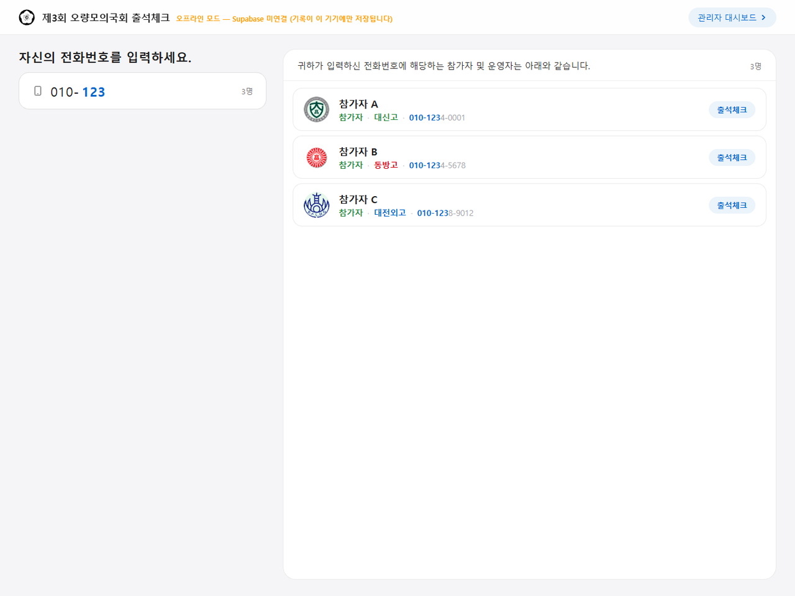
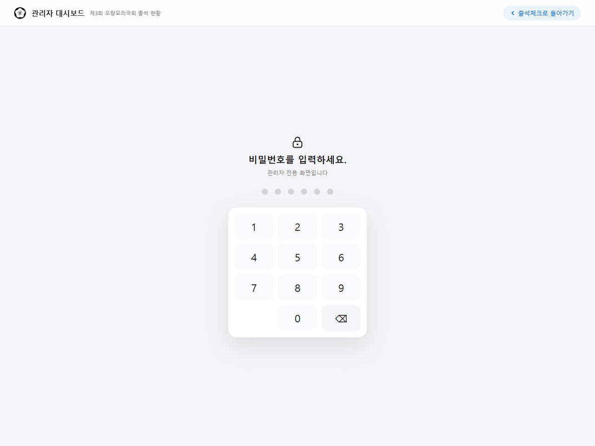
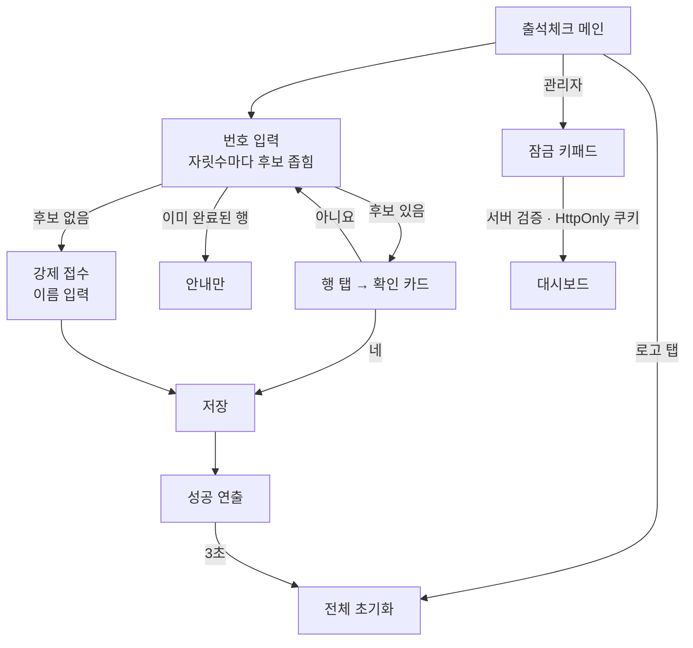

# CSCK

> 제3회 오량모의국회 행사장 입구의 공용 태블릿에서, 처음 보는 사람도 설명 없이 3초 안에 출석을 마치도록 설계한 출석체크 키오스크

---

## 1. 프로젝트 개요 (Overview)

| 항목 | 내용 |
|---|---|
| 프로젝트명 | CSCK (제3회 오량모의국회 출석체크 · MoGuk Attendance Check) |
| 한 줄 요약 | 전화번호를 한 자리씩 누를 때마다 명단이 좁혀지고 이름을 눌러 확인하면 끝난다. 서버가 없거나 네트워크가 끊겨도 같은 빌드가 그대로 돈다 |
| 진행 기간 | 2026.07.11 ~ 2026.07.20 (10일) · 행사(상임위원회 07.18, 본회의 07.25) 입장용 |
| 참여 인원 | 개인 프로젝트 |
| 본인 역할 | 기획, UX 설계, 전체 구현, 배포 |
| 기여도 | 100% (저장소 커밋 16건 전부 본인) |

행사장 입구의 출석체크는 보통 종이 명단과 볼펜으로 한다. 줄이 길어지고, 누가 왔는지 실시간으로 알 수 없고, 끝난 뒤 명단을 다시 옮겨 적어야 한다. 그런데 전자화한 것이 종이보다 느려지는 경우도 흔하다. 앱을 깔라고 하면 줄이 멈추고, 로그인을 요구하면 더 멈추고, QR을 나눠 주면 QR을 잃어버린 사람에서 완전히 멈춘다.

이 행사에는 대신고·동방고·대전외고 세 학교의 참가자와 운영자 133명이 명단에 있었다. 설계 기준은 한 문장이었다. **처음 보는 사람이, 설명 없이, 3초 안에 끝낸다.** 여기에 기여하지 않는 기능은 넣지 않았다.

| 현장 제약 | 설계에 미친 영향 |
|---|---|
| 기기가 공용이다 | 로그인이 없다. 개인 계정을 전제할 수 없다 |
| 사용자가 매번 바뀐다 | 배울 기회가 없다. 두 번째 사용이 첫 번째보다 빠를 수 없다 |
| 줄이 서 있다 | 한 사람의 지연이 뒤 전체의 지연이다. 막다른 길이 있으면 안 된다 |
| 운영자가 붙어 있지 않다 | 설명 없이 끝나야 하고 잘못 눌러도 되돌릴 수 있어야 한다 |
| 현장 네트워크를 믿을 수 없다 | 서버가 죽어도 접수는 계속돼야 한다 |

## 2. 기술 스택 (Tech Stack)

| 구분 | 기술 | 선택 이유 |
|---|---|---|
| 프레임워크 | Next.js 15 (App Router) · React 19 · TypeScript | 키오스크 화면과 관리자 대시보드, 잠금 API를 한 프로젝트에 둔다. 미들웨어로 대시보드를 서버에서 잠근다 |
| 데이터 | Supabase (Postgres · Realtime) ↔ `localStorage` 자동 전환 | 환경변수가 있으면 원격 DB, 없으면 브라우저 저장소로 동작한다. 데이터 계층 파일 하나만 이 차이를 안다 |
| 스타일 | 직접 작성한 CSS (디자인 토큰 · 애니메이션) | 런타임 의존성을 4개(Next · React · React DOM · Supabase SDK)로 묶었다 |
| 인증 | 서버 라우트 + `HttpOnly` 쿠키 (8시간) | 대시보드 비밀번호를 서버에서만 확인한다. 클라이언트 검사는 번들을 열면 보인다 |
| 배포 | Vercel · iPad Safari "홈 화면에 추가" | 앱 스토어 심사도 설치 파일도 없이 주소 하나로 전체 화면 키오스크가 된다 |

## 3. 핵심 기능 및 담당 업무 (Key Features & Contributions)

<p align="center"></p>
<p align="center"><sub>로컬 빌드로 캡처. 명단은 가상 참가자 12명으로 바꿨다. "010-123"까지 입력한 상태로, 서버 설정이 없어 헤더에 오프라인 모드 경고가 떠 있다.</sub></p>

### 구현 기능

- **점진적 좁힘**: 전화번호 전체를 받지 않는다. 한 자리를 누를 때마다 명단을 앞자리 일치로 거르고 남은 인원을 입력칸 옆에 보여준다. 목록의 각 행은 입력한 자릿수를 파란색으로, 나머지를 흐리게 표시해서 왜 이 사람이 나왔는지가 읽힌다. 자기 이름이 보이는 순간이 멈출 때다.
- **확인 카드**: 행을 누르면 바로 기록하지 않고 "OO님으로 출석체크를 하시겠습니까?" 카드를 띄운다. 이름을 가장 크게 적는다. 확인할 대상은 행위가 아니라 사람이기 때문이다.
- **완료된 사람도 목록에 남긴다**: 이미 체크한 사람은 버튼이 `출석 완료` 배지로 바뀐 채 남는다. 목록에서 지우면 다시 온 사람이 자기 기록을 확인할 방법이 없어 운영자를 찾게 된다.
- **강제 접수**: 명단에 없는 번호면 "강제로 진행하시겠습니까?"를 띄우고 이름을 받아 같은 저장소에 `forced` 표시를 달아 기록한다. 이름도 모르면 `(이름 미입력)`으로 남긴다. 현장은 막지 않고 사후 구분은 가능하다.
- **3초 자동 복귀**: 저장되면 체크 애니메이션과 색종이 효과가 나오고 3초 뒤 입력·키패드·패널이 모두 닫힌다. 다음 사람은 이전 화면을 지우는 법을 몰라도 된다.
- **중복 3중 방어**: 저장 중 플래그로 연타를 막고, 클라이언트가 이미 체크한 사람인지 대조하고, DB 유일 인덱스(`attendance_once_idx`)의 위반 코드(`23505`)를 받아 "이미 출석" 안내로 바꾼다. 강제 접수는 중복을 허용한다.
- **터치 가드**: 핀치 줌·더블탭 줌·길게 눌러 복사·텍스트 선택·이미지 끌기·탭 하이라이트를 막는다. 입력칸만은 예외로 풀어 두었다.
- **관리자 대시보드**: 출석 현황과 기록 표를 실시간으로 보여준다. 정상 체크와 강제 체크가 같은 이름으로 둘 다 있으면 다른 색으로 표시한다. 대시보드는 미들웨어가 잠그고, 비밀번호 키패드는 자릿수를 채우면 자동으로 제출되며 틀리면 카드가 좌우로 흔들린다.

### 주요 업무

- 현장 제약에서 출발한 UX 설계 (점진적 좁힘, 확인 카드, 강제 접수, 자동 복귀)
- 데이터 계층 설계: 원격 DB ↔ 로컬 저장소 자동 전환, 호출부 분기 0
- 실시간 갱신 이중화 (Realtime 구독 + 5초 폴링 + 화면 복귀 이벤트 3종)
- 대시보드 서버 측 잠금 (미들웨어 · 서버 라우트 · `HttpOnly` 쿠키)
- 명단 개인정보를 저장소에서 걷어내는 작업 (아래 트러블슈팅 ②)

## 4. 성과 및 결과 (Results & Metrics)

### 정량적 성과

| 항목 | 결과 |
|---|---|
| 대상 | 명단 133명 (참가자·운영자, 3개 학교) |
| 입력 | 전화번호 전체(8자리) 대신 후보가 1명이 될 때까지만 입력 |
| 화면 | 키오스크 · 잠금 · 대시보드 3개, 코드 1,140줄 |
| 런타임 의존성 | 4개 |
| 실시간 갱신 | 구독 + 5초 폴링 + 복귀 이벤트 3종 |
| 실제 출석 처리 인원 · 강제 접수 비율 · 1인당 소요 시간 | (확인 필요) |

"3초 안에 끝낸다"는 설계 목표이지 현장에서 잰 값이 아니다.

### 정성적 성과

- 학습이 불가능한 사용자를 전제로 하자 튜토리얼·설정·기억되는 상태가 모두 필요 없어졌다. 남는 것은 지금 화면에 보이는 것뿐이고 그것만으로 끝나게 만들었다.
- 데이터 계층을 파일 하나로 격리해 행사 전날 노트북에서 인터넷 없이 리허설할 수 있었고 서버 설정이 끝나기 전에 화면을 완성할 수 있었다.
- 폴백 상태를 숨기지 않았다. 로컬 저장 모드일 때 헤더에 경고를 띄운다. 조용히 로컬에 저장하면 운영자는 서버에 쌓이고 있다고 믿다가 행사가 끝난 뒤에 알게 된다.
- 개정을 거치며 화면마다 조금씩 다르던 같은 요소를 하나로 맞췄다(07.18, 207줄 추가·236줄 삭제). 키오스크에서 같은 것이 다르게 생기면 사용자는 다른 것으로 읽는다.

### 확인된 한계 (2026.09 코드 기준)

- **명단이 여전히 브라우저에 노출될 수 있다.** 폴백 명단을 `NEXT_PUBLIC_ROSTER_JSON` 환경변수로 옮겼지만 `NEXT_PUBLIC_` 값은 빌드할 때 클라이언트 번들에 들어간다. 원격 DB 쪽도 앞자리 검색을 브라우저에서 하려고 명단 테이블을 익명 키로 읽을 수 있게 열어 두었다(`anon can read roster ... using (true)`). 익명 키는 번들에 있으므로 누구나 전화번호가 담긴 명단을 조회할 수 있다. 검색을 서버 함수로 옮기고 결과에는 마스킹한 번호만 돌려줘야 한다. 비공개 저장소의 이력에도 명단이 남아 있다.
- **대시보드 기본 비밀번호가 코드와 README에 적혀 있다.** 환경변수를 설정하지 않으면 그 값으로 열린다. 쿠키 토큰도 비밀번호의 SHA-256 값 하나라 모든 관리자가 같은 토큰을 쓰고 개별로 끊을 수 없다.
- **표준 PWA 요건은 미충족이다.** 웹 매니페스트와 서비스워커가 없어 첫 로드에는 네트워크가 필요하고 오프라인 동작은 기록 저장 폴백에 한정된다.
- **가로 대화면 전용이다.** 최소 폭 1024px라 세로 태블릿과 휴대폰에서는 레이아웃이 성립하지 않는다.
- **확대 차단은 접근성과 맞바꾼 값이다.** 키오스크 조작감을 위해 확대를 막았고 이는 저시력 사용자의 요구와 충돌한다.
- **기록 수정 화면이 없다.** 잘못 들어간 기록은 DB 콘솔에서 지워야 하고 강제 접수를 정상 기록으로 바꾸는 화면도 없다.

## 5. 트러블슈팅 경험 (Troubleshooting)

### ① 네트워크가 흔들리면 대시보드가 조용히 멈춘다

**문제** 관리자 대시보드는 Realtime 구독으로 새 출석을 즉시 받는다. 그런데 행사장 네트워크가 잠깐 끊기거나 태블릿 화면이 꺼졌다 켜지면 구독이 끊긴 채 화면은 멀쩡해 보인다. 운영자는 아무도 안 들어오는 줄 안다.

**원인** 구독은 끊겨도 오류를 화면에 드러내지 않는다. 키오스크용 태블릿은 화면이 꺼졌다 켜지는 것이 정상 운영이라 이 상황이 자주 생긴다.

**해결** 갱신 경로를 겹쳐 두었다. 구독과 별개로 5초마다 폴링하고 탭이 다시 보일 때·창에 포커스가 올 때·온라인으로 돌아올 때 즉시 다시 읽는다. 폴링 때문에 화면이 주기적으로 다시 그려지지 않도록, 받은 기록을 직렬화해 직전 값과 같으면 상태를 바꾸지 않는다.

**결과** 구독이 살아 있으면 즉시, 죽었어도 5초 안에, 화면이 다시 켜지면 그 자리에서 최신 상태가 된다. 달라진 것이 없으면 화면은 그대로다.

### ② 참가자 133명의 전화번호가 저장소에 들어 있었다

**문제** 첫 버전은 명단을 시드 SQL(`supabase/seed.sql`)과 폴백용 `lib/roster.ts` 두 곳에 코드로 넣었다. 둘 다 이름과 전화번호 133건을 담고 있었다. 서버 설정 없이도 데모가 돌게 하려는 선택이었지만 저장소를 여는 사람은 모두 참가자 연락처를 볼 수 있었다.

**원인** "서버가 없어도 같은 빌드가 돈다"는 목표를 명단 데이터에도 그대로 적용했다. 화면 코드와 데이터를 같은 저장소에 두면서 코드와 개인정보의 경계가 흐려졌다.

**해결** 두 번에 나눠 걷어냈다. 07.13에 시드 SQL과 스키마 파일을 저장소에서 지웠고 07.20에 `roster.ts`를 지운 뒤 명단을 배포 환경변수에서 읽도록 바꿨다. 명단은 이제 저장소 밖에서 주입된다.

**결과** 현재 코드에는 개인정보가 없다. 다만 위 "확인된 한계"처럼 환경변수가 클라이언트용이고 저장소 이력과 DB 조회 정책이 남아 있어, 완전한 해결은 명단 검색을 서버로 옮기고 이력을 정리하는 것이다.

### ③ "바깥을 누르면 닫힌다"가 "아무 데나 누르면 닫힌다"가 되지 않게

**문제** 키패드는 바깥을 탭하면 닫히게 했다. 닫기 버튼을 찾게 하지 않으려는 것이다. 그런데 문서 전체에서 바깥 탭을 받으면 목록의 이름이나 확인 카드를 누를 때도 키패드가 닫히고 정작 누르려던 탭은 먹지 않는다.

**원인** 문서 전체에 건 "바깥 탭" 처리기가 목록·카드·키패드 안의 탭까지 받았다. 이벤트가 안쪽 요소에서 바깥으로 전파되기 때문이다.

**해결** 목록·확인 카드·키패드 내부의 탭은 각각 전파를 끊어 진짜 바깥을 누른 경우에만 닫히게 했다. 터치 가드도 같은 원칙으로 짰다. 복사 메뉴와 텍스트 선택을 전역으로 막되 입력칸만 명시적으로 풀었다. 전역으로 잠그기만 하면 이름 입력이 불가능해진다.

**결과** 키패드는 빈 곳을 누르면 닫히고 목록과 카드는 정상적으로 눌린다.

## 6. 링크 및 산출물 (Links & Deliverables)

| 구분 | 링크 |
|---|---|
| GitHub 저장소 | [stx4R/CSCK](https://github.com/stx4R/CSCK) (비공개) |
| 배포 URL | https://csck.vercel.app |

<p align="center"></p>

### 화면 흐름



데이터 계층:

```
                ┌─ 환경변수 있음 → Supabase (원격 테이블 · 구독 + 폴링)
화면 코드 ──→ lib/attendance.ts ─┤
                └─ 환경변수 없음 → localStorage (저장 이벤트 + 폴링) + 헤더 경고
```

---

+++

## 고객여정지도 (Journey Map)

| 단계 | 사용자의 행동 | 사용자의 생각 | 키오스크의 대응 |
|---|---|---|---|
| 도착 | 줄을 서서 태블릿 앞에 선다 | "뭘 하라는 거지?" | 화면 첫 줄이 "자신의 전화번호를 입력하세요." 하나다 |
| 입력 | 번호를 누르기 시작한다 | "다 눌러야 하나?" | 자릿수마다 후보가 줄고 남은 인원이 보인다. 자기 이름이 보이면 멈춘다 |
| 선택 | 이름을 누른다 | "잘못 눌렀으면?" | 이름을 크게 적은 확인 카드가 뜬다 |
| 예외 | 명단에 없다고 나온다 | "나 신청했는데?" | 강제 접수로 이름만 받고 통과시킨다 |
| 완료 | 체크 애니메이션을 본다 | "된 건가?" | 과장된 성공 연출로 확신을 준다. 3초 뒤 다음 사람 화면으로 돌아간다 |
| 재확인 | 다시 와서 번호를 누른다 | "내가 한 게 맞나?" | `출석 완료` 배지가 그대로 남아 있다 |

## 적응형 및 예측형 디자인 (Adaptive & Predictive Design)

- **적응형**: 가로 iPad(최소 폭 1024px)를 기준으로 화면을 고정 설계했다. 공용 기기 한 종류에 맞춘 배치라 창 크기에 따라 흐트러지지 않는다.
- **예측형**: 사용자가 번호를 어디까지 눌러야 할지 화면이 대신 판단하지 않는다. 남은 후보 수와 강조된 자릿수를 보여 주면 사용자가 스스로 멈출 때를 안다. 성공 뒤의 자동 초기화도 "다음 사람이 이 화면을 이어받는다"는 것을 앞서 짚은 설계다.

## 제스처링 (Gesturing)

- 입력은 화면 키패드 탭뿐이다. 브라우저 기본 제스처 가운데 키오스크를 망가뜨리는 것들(핀치 줌·더블탭 줌·길게 눌러 복사·이미지 끌기)은 전부 막았다. 확대된 채 남은 화면은 다음 사용자가 되돌리지 못하고 더블탭을 확대로 오인하면 연타가 씹힌다.
- 키패드는 바깥을 탭하면 닫히고 잠금 화면의 실패는 카드가 좌우로 흔들리는 동작으로 전해진다. 글을 읽지 않아도 실패를 안다.

## 모션 디자인 (Motion Design)

- 성공하면 체크 애니메이션과 36조각 색종이가 떨어진다. 화면이 조용히 목록으로 돌아가면 사용자는 자기 조작이 반영됐는지 확신하지 못하고 한 번 더 누른다. 과장된 피드백은 장식이 아니라 재시도를 막는 장치다.
- 잠금 키패드는 틀리면 좌우로 흔들리고 입력이 지워진다.

## 보안 취약성 관리 (DREAD)

| 위협 | 손상 | 재현성 | 오용성 | 영향 사용자 | 발견성 | 판단 |
|---|---|---|---|---|---|---|
| 익명 키로 명단(전화번호) 전체 조회 | 상 | 상 | 상 | 133명 | 중 | 가장 먼저. 검색을 서버 함수로 옮기고 명단 테이블의 익명 읽기를 닫는다 |
| `NEXT_PUBLIC_` 명단이 번들에 포함 | 상 | 상 | 중 | 133명 | 중 | 폴백 명단을 빈 명단 + 수동 입력으로 바꾼다 |
| 저장소 이력에 남은 명단 | 상 | 하 | 중 | 133명 | 하 | 이력 정리 (저장소 접근자로 범위가 좁다) |
| 기본 비밀번호로 대시보드 열림 | 중 | 상 | 상 | 관리자 | 상 | 환경변수가 없으면 대시보드를 아예 잠그도록 변경 |
| 익명 키로 출석 기록 임의 삽입 | 중 | 상 | 중 | 행사 기록 | 중 | 삽입을 RPC로 좁히고 명단 대조를 서버에서 |

손상과 영향 범위가 큰 앞의 세 항목이 모두 명단 개인정보다. 기록 삭제는 처음부터 익명 키로 막아 두었고(초기화는 서비스 롤로만) 행사 당일 필요할 때만 정책을 여는 방식이었다.
