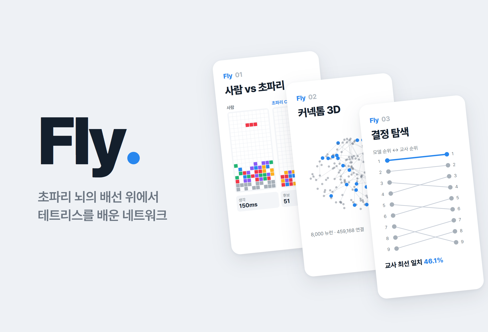
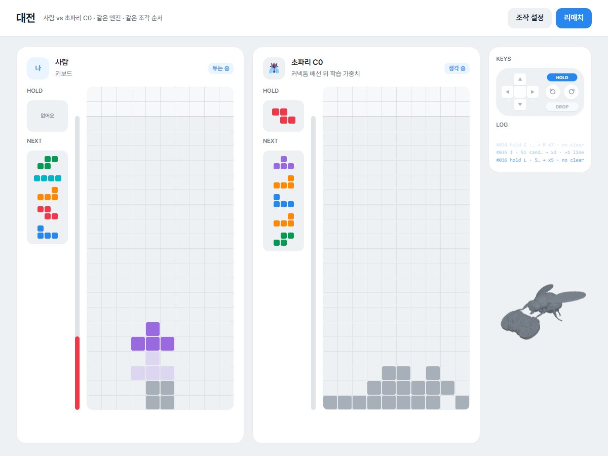
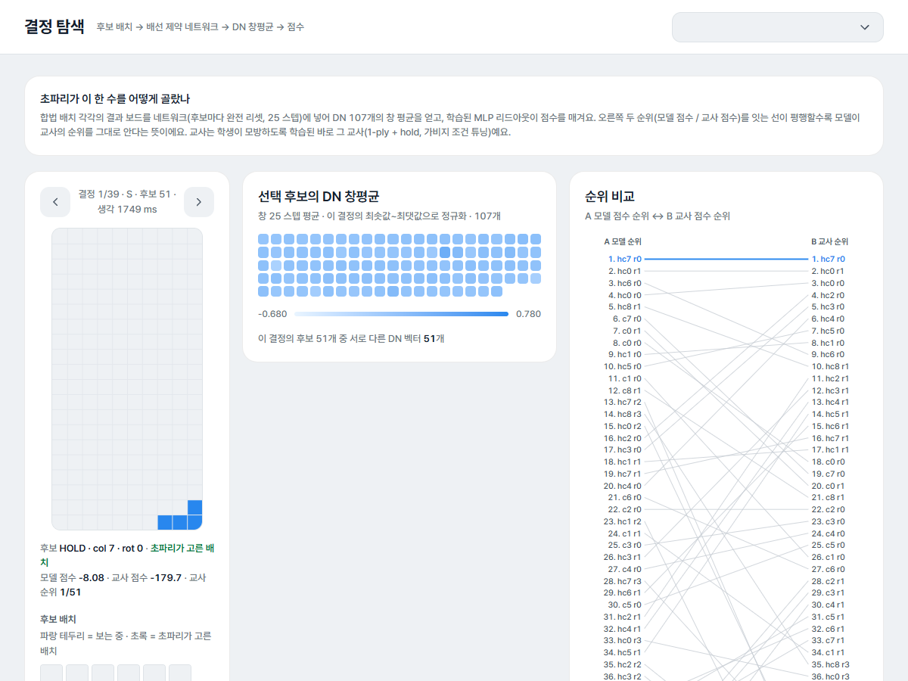
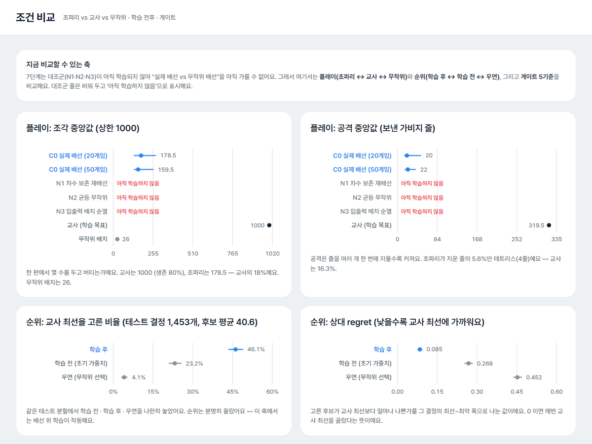
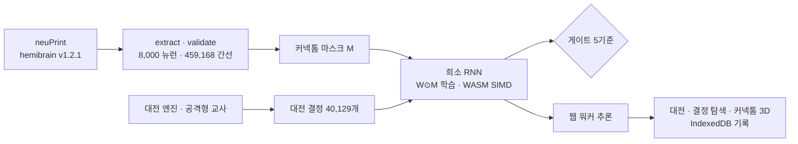

# Fly

> 초파리 뇌 커넥톰(hemibrain)의 배선을 제약으로 둔 네트워크에 테트리스 대전을 가르치고 그 결과를 웹에 공개해 사람과 직접 겨뤄 볼 수 있게 한 연구형 프로젝트

---

## 1. 프로젝트 개요 (Overview)

| 항목 | 내용 |
|---|---|
| 프로젝트명 | Fly (VFB-Tetris) |
| 한 줄 요약 | 초파리 뉴런 8,000개·연결 459,168개의 배선을 희소성 마스크로 쓰고 그 위의 가중치를 학습시켜 테트리스 대전 정책을 얻었다. 게이트는 미달했고 미달한 결과를 그대로 보여 주는 대전 웹을 배포했다 |
| 진행 기간 | 2026.09.15 ~ 2026.09.24 (v0.1.0 → v0.13.6, 커밋 26건) |
| 참여 인원 | 개인 프로젝트 |
| 본인 역할 | 연구 설계, 데이터 추출, 시뮬레이션·학습 코드, 실험과 판정, 웹 구현·배포 |
| 기여도 | 100% |

출발 질문은 "실제 초파리의 뇌 배선이 테트리스를 두는 데 쓸모가 있을까"였다. 처음에는 커넥톰의 시냅스 수를 그대로 고정 가중치로 쓰는 리저버(스파이킹 뉴런 네트워크)를 만들었다. 5단계까지 결과는 음성이었다. 그래서 6단계에서 주장을 바꿨다. 커넥톰에서는 "어느 뉴런이 어느 뉴런에 연결되는가"만 가져오고 가중치는 학습한다. 보고서와 웹 어디에도 "초파리가 테트리스를 배웠다"는 표현은 쓰지 않는다.

| 단계 | 내용 | 결과 |
|---|---|---|
| 1 | neuPrint에서 hemibrain v1.2.1 추출 (입력 LC/LPLC · 중간층 · 출력 DN) | 8,000 뉴런 · 459,168 간선 |
| 2–3 | 스파이킹 리저버(LIF) + 캘리브레이션 | 스펙 범위 통과 0/1200, 프로브 게이트 미달 |
| 4–5 | afterstate 평가, null model 6종 비교 | 후보는 구분하지만 순위 정보가 없다 (τ ≤ 0.075) |
| 6 | 대전 엔진 · 공격형 교사 · 랭킹 손실 검증 | 원인은 손실이 아니라 고정 가중치의 표현력 |
| 7 | 커넥톰 마스크 위 가중치 학습 (A → A-2 → A-3 → A-4′) | 순위 지표는 통과, 플레이 게이트는 미달 |
| 8 | 사람 vs 초파리 실시간 대전 웹 | 배포 |

## 2. 기술 스택 (Tech Stack)

| 구분 | 기술 | 선택 이유 |
|---|---|---|
| 데이터 | neuPrint Cypher API (hemibrain v1.2.1) | 초파리 반뇌 커넥톰을 뉴런 type·ROI·시냅스 수까지 받을 수 있다. 응답은 로컬에 캐시한다 |
| 시뮬레이션·학습 | Node.js (ES 모듈), `node:test`, worker_threads | 학습 라이브러리 없이 희소 RNN·BPTT·Adam·DAgger를 직접 구현했다. 같은 코드가 브라우저 추론에도 쓰인다 |
| 커널 | WebAssembly SIMD (f64x2) | 12 워커가 가중치를 동시에 읽을 때 생기는 메모리 대역폭 병목을 줄였다. 외부 도구 없이 바이너리를 직접 조립했다 |
| 웹 | Vanilla JS 해시 라우터, three.js, esbuild, Web Worker, IndexedDB | 10화면을 한 앱으로 묶었다. 초파리 추론은 워커에서 돌고 대전 기록은 브라우저 밖으로 나가지 않는다 |
| 디자인 | 토스 디자인 시스템 토큰, Pretendard self-host | 외부 요청 없이 번들(7.3 MB)만으로 동작한다 |
| 배포 | GitHub Pages (`gh-pages` 브랜치) | 정적 사이트로 충분하다 |

## 3. 핵심 기능 및 담당 업무 (Key Features & Contributions)

배포된 사이트에서 캡처. 왼쪽이 사람, 오른쪽이 학습된 C0 모델. 같은 엔진, 같은 조각 순서로 둔다. 오른쪽 KEYS·LOG는 초파리가 고른 배치를 버튼 입력으로 역산해 보여 준다

### 커넥톰 추출 (1단계)

- 입력층은 시각 투사 뉴런(LC·LPLC), 출력층은 하강뉴런(DN)이다. 이름은 비슷하지만 역할이 다른 뉴런(LCNO는 중앙복합체 뉴런, DN1~3은 일주기 시계 뉴런)은 제외했다.
- 중간층은 입력에서 2-hop, 출력까지 2-hop 안에 있는 뉴런이다. 시냅스 3개 이상인 간선만 남기고 8,000개를 넘으면 시냅스 총량 순으로 잘랐다.
- 뉴런마다 primary ROI(뇌 영역)를 붙였다. 8,000개 중 null은 3개, 영역은 44개다.

### 고정 가중치 리저버 (2–5단계)

- 이벤트 구동 LIF 뉴런(dt 1 ms), 스파이크 빈도 적응(SFA), ROI 단위 지역 억제, 결정적 난수(xorshift128+).
- 보드는 입력 뉴런마다 가우시안 수용장으로 전류가 되고 DN 107개의 발화 수로 행동을 고른다.
- null model 6종(차수 보존 재배선, 가중치 순열, 층 블록 무작위 그래프, Kenyon cell 제거, 직접 간선 제거, 활동량 통제)과 비교했다.

### 대전 엔진과 교사 (6단계)

- 가이드라인 규칙을 배치 단위로 구현했다. hold, next 5, 가비지 큐와 상쇄, 콤보, T-스핀(3-corner + BFS로 구한 도달 가능 위치), 퍼펙트 클리어가 들어간다.
- 공격형 교사는 특징 11개와 빔 서치를 쓰고 CEM으로 튜닝했다. 1000조각 공격 중앙값 377, 생존 100%.
- 교사 플레이로 대전 결정 40,129개(후보 1.70 M)를 모았다. 게임 단위로 60/20/20 분할하고 누수 검사를 거쳤다.

### 배선 제약 학습 (7단계)

- 모델: 레이트 RNN `x(t+1) = (1−lr)x + lr·tanh((W⊙M)x + W_in·u + b)`. M은 커넥톰 인접 마스크로 고정이고 W는 마스크가 있는 자리에서만 학습된다. 파라미터는 1,067,041개다.
- 학습: 결정마다 교사가 고른 수와 음성 후보 7개를 비교하는 pairwise 손실, BPTT(T 25), AdamW, 드롭아웃, DAgger. 평가는 언제나 후보 전체로 한다.
- 대조군: 같은 파라미터 수의 밀집 MLP(D0), 배선 null 3종(차수 보존 재배선 · 균등 무작위 · 입출력 배치 순열). 세 null은 뉴런·간선·파라미터 수가 C0와 정확히 같다.

### 대전 웹 (8단계)

결정 탐색. 한 수의 후보 51개를 네트워크에 넣어 나온 DN 107개 창평균(가운데)과 모델 순위와 교사 순위를 잇는 bump chart(오른쪽)

- **대전**: 사람은 키보드로, 초파리는 150 ms 간격으로 둔다. 추론은 조각당 한 번, 워커에서 비동기로 돈다.
- **대전에서 나오는 화면**: 대전 기록, 커넥톰 3D(층화 표본 907 뉴런 · 5,963 시냅스를 활성 세기로 점등), 결정 탐색, 신경 활동 래스터, 플레이 분석. 한 판도 두지 않았으면 빈 상태를 그리고 값을 지어내지 않는다.
- **오프라인 실측 화면**: 홈(게이트 5기준), 실험, 조건 비교. 아직 학습하지 않은 null 3종의 자리는 "아직 학습하지 않음"으로 비워 둔다.
- 모바일에서는 사이드바가 상단 바로 접힌다. reduced-motion을 존중하며 WebGL이 없어도 3D를 뺀 나머지 화면은 동작한다.

### 주요 업무

- neuPrint 추출·검증 파이프라인, 뉴런 층 판정과 ROI 부여
- LIF 리저버·ESN·희소 RNN과 BPTT·Adam·DAgger 직접 구현, WASM SIMD 커널
- 실험 설계와 게이트 판정, 부트스트랩 95% CI, 단계별 문서 6편(`docs/`)
- 실험 예산 추정기(실측 단위 비용 × 계획 축, 8시간 초과 시 줄일 축 제안)
- 대전 웹 10화면, 초파리 3D 모델 경량화(Blender 스크립트), GitHub Pages 배포

## 4. 성과 및 결과 (Results & Metrics)

### 정량적 성과

조건 비교. 플레이 지표는 초파리·교사·무작위를, 순위 지표는 학습 전·학습 후·우연을 나란히 놓았다

**최종 모델 C0 (7단계 A-4′, 테스트 1,453 결정 · 후보 평균 40.6개, 플레이 20게임 × 1000조각 · 가비지 주입 포함)**

| 지표 | 학습 전 | 학습 후 [95% CI] | 교사 | 게이트 |
|---|---|---|---|---|
| 교사 최선 일치 (top-1) | 23.2% | **46.1%** [43.6, 48.8] | — | — |
| 상대 regret (낮을수록 좋음) | 0.268 | **0.085** [0.077, 0.092] | 0 | ≤ 0.10 통과 |
| 조각 수 중앙값 | — | 178.5 [134.5, 270.5] | 1000 | ≥ 700 **미달** |
| 공격 중앙값 | — | 20 [15.5, 49] | 319.5 | ≥ 191.7 **미달** |
| 테트리스/게임 중앙값 | — | 1 [0, 2] | 41.5 | ≥ 1 통과 |

게이트 5개 중 3개를 통과했다(표에 없는 하나는 가비지로 죽은 게임 비율 ≤ 50%, 실측 50%). 순위를 매기는 능력은 학습 전의 두 배가 됐는데 한 판을 버티는 쪽은 교사의 18%에 그쳤다. Phase B(배선 null 비교)는 게이트 통과가 조건이라 돌리지 않았다가 대전 웹을 먼저 만들기로 방향을 바꾸면서 N1 학습 도중(라운드 0, 에폭 10/15) 중단했다.

| 항목 | 결과 |
|---|---|
| 단위 테스트 | `npm test` 151/151 통과 (2026.09 재실행) |
| 6단계 원인 분리 | 같은 리저버 특징에서 손실을 mse → listwise로 바꿔도 τ 변화 −0.011. 같은 손실을 원 보드에 주면 τ 0.31 |
| 밀집 MLP 대조 (D0, Phase A 파일럿) | 같은 파라미터 수, 같은 프로토콜에서 top-1 35.6%, 조각 80으로 같은 방식으로 실패. 배선 마스크가 없어도 실패했으니 당시 미달은 학습 설정 탓이었다 |
| 학습된 가중치 | 커넥톰 초기값과 상관 0.537, 간선 46.9%가 억제성으로 바뀜(초기 0%). 입력→중간층이 초기값에서 가장 멀어졌고(상관 0.14) 중간층끼리는 0.36 |
| WASM SIMD 커널 | 결정당 BPTT 325–423 ms → 199–223 ms (×1.6–1.9), JS 커널과 결과 차이 ≤ 1e-18 |
| Node ↔ 브라우저 추론 일치 | 최대 차이 1.42e-14 |
| 배포 | https://stx4r.github.io/Fly/ (응답 200 확인) |
| 사용자·방문 수 | (확인 필요) |

### 정성적 성과

- **음성 결과를 근거 삼아 주장을 바꿨다.** 고정 가중치 리저버가 안 되는 이유를 손실 탓과 표현력 탓으로 나눠 확인한 뒤에 "배선만 제약, 가중치는 학습"으로 넘어갔다. 앞 단계 문서는 지우지 않고 근거 장으로 남겼다.
- **모든 판정에 사전 게이트와 CI를 걸었다.** 결과를 보고 기준을 고치지 않도록 단계마다 기준을 먼저 정하고 미달이면 멈춘 뒤 원인과 다음 축을 문서로 남겼다.
- **웹은 실패를 숨기지 않는다.** 홈 첫 화면에 게이트 3/5를 띄우고 학습하지 않은 대조군은 빈칸으로 둔다.

### 확인된 한계

- **플레이 게이트 미달.** 20게임 모두 1000조각 전에 죽었고 죽을 때 구멍 수 중앙값이 19였다. 교사를 한 수씩 흉내 내는 학습이라 우물 유지 같은 긴 흐름이 약하다. 우물을 유지한 연속 구간의 중앙값이 교사는 6수, 모델은 2수다.
- **배선이 쓸모 있었는지는 아직 답하지 못했다.** Phase B의 null 3종 학습이 끝나야 "실제 배선 vs 무작위 배선"을 말할 수 있다.
- **입력 수용장 배정은 임의적이다.** 실제 LC 뉴런의 시야 지도(망막위상)와 관계없이 격자에 균등하게 뿌렸다.
- **대전 물리는 배치 단위 근사다.** 중력·락 딜레이·180° 회전·B2B는 없다.
- 9단계(최종 보고서)는 아직 쓰지 않았다.

## 5. 트러블슈팅 경험 (Troubleshooting)

### ① 스펙대로 설정한 네트워크가 전부 침묵했다

**문제** 3단계 캘리브레이션에서 스펙 범위(ρ 0.8–1.3)의 탐색점 1,200개가 하나도 제약을 통과하지 못했다. 중간층 뉴런이 거의 발화하지 않았다(발화율 중앙값 0 Hz).

**원인** ρ는 선형화한 스펙트럼 반경으로 정했는데 문턱과 누설이 있는 LIF 뉴런은 입력 단위당 스파이크 이득이 1보다 훨씬 작다. 선형 판정이 실제 절벽(g ≈ 0.07)을 4배 낮게(g = 0.0169) 예측하고 있었다. 게다가 SFA가 없으면 소수 뉴런이 발화를 독점했다(평균 30–50 Hz인데 중앙값 0 Hz).

**해결** 탐색 범위를 ρ ≤ 5로 넓힌 결과는 스펙 범위와 섞지 않고 `extended`로 따로 기록했다. b = 0, k_local = 0으로 고정한 부분 탐색을 함께 돌려 무엇이 승자독식을 깨는지 분리했다.

**결과** 통과점은 모두 SFA가 켜진 경우였다. 승자독식은 SFA가 깼다. 지역 억제는 k_local > 0.5에서 네트워크를 통째로 끈다는 사실도 확인했다. 원 입력을 그대로 넣은 선형 프로브도 +4.3%p에 그친다는 점을 밝혀 이 게이트(+10%p)가 이 과제에서 애초에 넘을 수 없는 기준이었다는 것도 기록했다.

### ② 고정 가중치 리저버가 수의 순위를 매기지 못했다

**문제** 4–5단계에서 후보 수마다 DN 발화는 달랐지만(서로 다른 벡터 70–90%) 결정 안에서 교사 순위와의 상관은 τ ≤ 0.075였다. 플레이는 모든 조건에서 무작위 수준이었다.

**원인** 손실 함수가 순위를 가르치지 못하는 것인지, 고정 가중치 표현에 순위 정보가 애초에 없는 것인지부터 가려야 했다.

**해결** 6단계에서 같은 리저버 특징에 손실만 바꿔 끼우고(mse · centered · listwise · pairwise) 같은 손실을 원 보드 200칸에도 적용해 비교했다.

**결과** 리저버 위에서는 어떤 손실이든 τ 0.00–0.03이었는데 원 보드에서는 τ 0.31이 나왔다. 손실의 기여는 0이고 고정 가중치의 표현력이 문제였다. 이 근거로 7단계에서 가중치를 학습하는 구조로 바꿨다. 고정 리저버에서 16–20%였던 top-1이 첫 학습(Phase A)에서 37.8%, 최종 모델에서 46.1%가 됐다(최종 모델은 교사와 테스트 분할이 바뀐 A-4′ 기준).

### ③ 몇 시간짜리 학습이 중간에 두 번 사라졌다

**문제** 7단계 본 학습은 5–6시간이 걸리는데 라운드 0이 두 번 유실됐다. 실행을 띄운 터미널 세션이 끝나면서 그 프로세스 트리까지 정리됐기 때문이다.

**원인** 학습 상태가 프로세스 메모리에만 있었고 실행도 세션에 묶여 있었다.

**해결** 에폭마다 파라미터·최선 파라미터·Adam 상태(m, v, t)·이력을 체크포인트로 쓰고, 같은 설정이면 다음 에폭부터 잇게 했다. 이어 달리면 결과가 달라지는 버그도 여기서 찾았다. 에폭 셔플이 앞 에폭의 순열을 이어받고 있어서 에폭 시드에만 의존하도록 고쳤다. 실행은 Windows 작업 스케줄러로 세션과 떼어 놓고 비정상 종료 코드면 러너가 최대 5번 다시 띄운다.

**결과** 재실행 테스트를 작성했다. 자식 프로세스를 에폭 중간에 강제 종료한 뒤 다시 띄우는 방식이다. 최종 파라미터와 Adam 상태, 에폭별 검증 손실이 중단 없이 돈 실행과 1e-9 안에서 일치한다. 이후 A-2(5.01 h), A-3(6.36 h), A-4′(5.85 h)는 모두 끝까지 돌았다.

### ④ 브라우저에서 모델이 느리고, WASM이 꺼져 있었다

**문제** 학습에서 12 워커를 돌리면 실측 에폭 시간이 계산값의 2.9배였다. 브라우저 추론에서는 WASM 백엔드가 꺼진 채 JS로만 돌고 있었다.

**원인** 워커 12개가 매 스텝 가중치(3.7 MB)와 인덱스(1.8 MB)를 동시에 읽느라 메모리 대역폭에 걸렸다. 브라우저 쪽은 WASM 커널 코드에 Node 전용 `Buffer`가 남아 있어서 WASM이 꺼져 있었다.

**해결** 희소 행렬곱과 역전파의 원소별 단계를 WebAssembly SIMD로 옮기고 배열을 WASM 메모리 안에 뒀다. `Buffer`는 `TextEncoder`로 바꾸고 SharedArrayBuffer가 없는 브라우저를 위해 `ArrayBuffer` 폴백을 넣었다. 대전에서는 초파리 착수를 조각당 한 번만 워커에서 비동기로 돌린다.

**결과** 결정당 BPTT가 1.6–1.9배 빨라졌다. Node와 브라우저의 추론 결과는 최대 1.42e-14 차이로 일치한다.

## 6. 링크 및 산출물 (Links & Deliverables)

| 구분 | 링크 |
|---|---|
| GitHub 저장소 | [stx4R/Fly](https://github.com/stx4R/Fly) (비공개) |
| 배포 URL | https://stx4r.github.io/Fly/ |
| 단계별 문서 | `docs/stage3-calibration.md` ~ `docs/stage8-web-v1.md` (6편) |
| 데이터 출처 | [neuPrint](https://neuprint.janelia.org) hemibrain v1.2.1 |

### 구조

---

+++

## 고객여정지도 (Journey Map)

사용자는 커넥톰이나 신경망을 잘 모르지만 초파리와 테트리스를 한 판 둬 보려는 방문자다.

| 단계 | 사용자의 행동 | 사용자의 생각 | 사이트의 대응 |
|---|---|---|---|
| 도착 | 홈을 연다 | "초파리가 테트리스를 한다고?" | 첫 문단에서 배선만 가져왔고 가중치는 학습했다고 밝힌다. 게이트 3/5도 같이 띄운다 |
| 대전 | 방향키와 스페이스로 둔다 | "생각보다 잘 두네 / 금방 죽네" | 초파리는 150 ms 간격으로 두고 KEYS·LOG가 그 수를 버튼 입력으로 풀어 보여 준다 |
| 궁금증 | 결정 탐색을 연다 | "저 수는 왜 뒀지?" | 후보 전체의 DN 반응, 모델 순위와 교사 순위를 잇는 선을 보여 준다 |
| 깊이 보기 | 커넥톰 3D·신경 활동을 연다 | "뇌 안에서 뭐가 켜진 거지?" | 방금 둔 수의 활성으로 뉴런을 점등하고 25스텝을 재생한다 |
| 판단 | 조건 비교를 연다 | "그래서 배선이 쓸모 있었어?" | 아직 답할 수 없다는 사실을 빈칸("아직 학습하지 않음")으로 보여 준다 |

## 적응형 디자인 (Adaptive Design)

- 한 판도 두지 않은 사용자에게는 대전 화면들이 빈 상태와 "대전하기" 버튼을 보여 준다. 한 판을 두면 같은 화면이 그 판의 값으로 채워진다.
- 좁은 화면에서는 사이드바가 상단 바로 접히고 두 판이 세로로 쌓인다. WebGL이 없으면 3D만 빠진다.
- 조작 키와 표시 옵션은 설정 화면에서 바꾸고 브라우저에 저장한다.

## 모션 디자인 (Motion Design)

- 대전 화면 옆의 초파리 3D 모델이 착수에 맞춰 패드를 두드린다. 원본 모델은 Blender 스크립트로 폴리곤을 줄이고 2초 루프 애니메이션으로 만들었다.
- 커넥톰 3D는 드래그로 회전하고 휠로 확대하며 결정 하나의 활성을 스텝 단위로 재생한다.
- reduced-motion 설정을 존중한다.

## DREAD 취약성 관리 (DREAD Risk Assessment)

| 위협 | D | R | E | A | D | 점수 | 대응 |
|---|---|---|---|---|---|---|---|
| neuPrint API 토큰 유출 | 2 | 1 | 1 | 1 | 2 | 1.4 | 토큰은 환경변수나 `.env`로만 받고 `.gitignore`로 커밋을 막는다. 배포 번들에는 추출 결과만 들어간다 |
| 대전 기록의 외부 전송 | 1 | 1 | 1 | 1 | 1 | 1.0 | 기록은 IndexedDB(최근 20판)에만 두고 서버로 보내지 않는다. 사이트는 외부 요청이 0건이다 |

D·R·E·A·D = 피해·재현성·악용 난이도·영향 범위·발견 가능성 (1~3). 점수는 평균.
