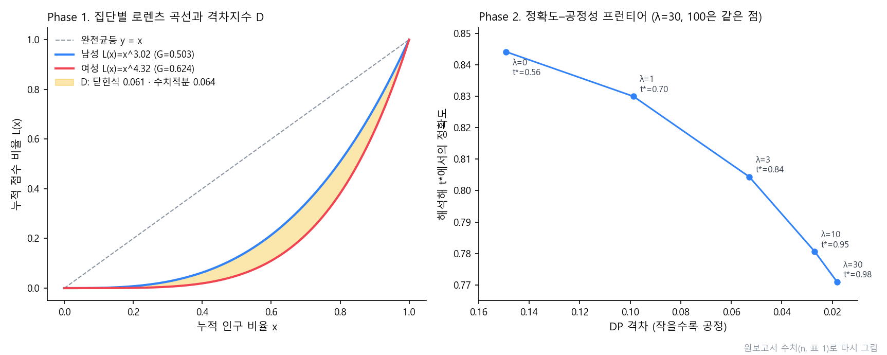

# Gini.

> 성별을 빼고 학습한 "블라인드" 소득 분류기가 성별 격차를 그대로 재현하는지 미적분으로 감사한 두 단계 탐구. 정적분으로 차별을 재는 지표를 만들고, 그 지표를 미분해 정확도와 공정성을 함께 고려한 판정 임계값을 해석적으로 구했다

---

## 1. 프로젝트 개요 (Overview)

| 항목 | 내용 |
|---|---|
| 프로젝트명 | Gini. (수행② 「지니계수가 숨긴 차별」 → 수행③ 「공정성 적분 감사기」) |
| 한 줄 요약 | 지니계수는 집단 간 평균 격차를 보지 못한다는 것을 보이고 두 로렌츠 곡선 사이 넓이 `D`를 제안했다. 이어서 `J(t) = Acc(t) − λD(t)`의 1계 조건으로 최적 임계값 `t*`를 유도하고 실데이터 격자탐색과 정확도 1.9% 이내로 맞췄다 |
| 진행 기간 | 2026.06 (2학년 미적분학 수행평가 ②·③, 수학적 분석 요약서) |
| 참여 인원 | 개인 탐구 |
| 본인 역할 | 주제 설계, 수식 유도, Python 분석 파이프라인, 결과 해석, 보고서·포스터 작성 |
| 기여도 | 100% |

활동지에서 정적분으로 로렌츠 곡선과 지니계수를 구하다가, 불평등을 수 하나로 압축하는 이 도구를 인공지능에도 쓸 수 있을지 궁금해졌다. **AI 모델의 공정성도 이렇게 잴 수 있을까? 그 측정은 믿을 만할까?**

대출·채용·복지 선별에 AI 자동심사가 퍼지면서 "디지털 약자" 문제가 커지고 있다. 알고리즘이 특정 집단을 구조적으로 불리하게 판정하는 문제다. 흔한 대응은 성별 같은 보호변수를 학습에서 빼는 것이다. 하지만 다른 변수가 성별과 상관돼 있으면 성별 정보는 그 변수를 거쳐 간접적으로 들어온다. 그래서 배포 전에 모델 출력을 직접 뜯어보는 사후 감사 도구가 필요하다고 봤다.

| 가설 | 내용 | 검증 |
|---|---|---|
| 1. 대리변수 | 보호속성을 빼도 모델은 현실 격차와 비슷한 결과를 낸다 | 집단별 모델 평균 점수 vs 현실 기저율 |
| 2. 평균 불변성 | 단일 지니계수는 집단 간 평균 격차에 둔감해 차별적 모델을 공정하다고 오판한다 | 통합 지니계수의 반응 |
| 3. 적분 격차지수 | 두 로렌츠 곡선 사이 넓이 `D`는 지니가 놓치는 격차를 잡고, 닫힌식과 수치적분이 일치한다 | 닫힌식 vs 사다리꼴 적분 |
| 4. 미분 최적화 | `J′(t*) = 0`의 해석해는 격자탐색 최적점과 같은 성능을 낸다 | 두 `t*`에서의 정확도 차 |
| 5. trade-off | 임계값만으로 완전 공정에 가면 `t*`가 상한에 포화해 분류기가 쓸모없어진다 | λ 스윕 |

## 2. 기술 스택 (Tech Stack)

| 구분 | 기술 | 선택 이유 |
|---|---|---|
| 데이터 | UCI Adult (Census Income) 32,561건, 결측 제거 후 학습 21,113 · 검증 9,049 (7:3 층화 분할) | 연소득 5만 달러 초과 여부를 맞히는 공개 벤치마크. 사람을 판정하는 자동심사의 대리 과제로 쓸 수 있다 |
| 모델 | scikit-learn Logistic Regression (표준화 + 원-핫, 성별·인종 제외), 검증 AUC 0.900 | 점수 `s = P(소득 > 50K)`가 확률로 나오고 로짓이 정규에 가까워 해석이 쉽다 |
| 수학 | 정적분(로렌츠·선택률·정확도), 미적분의 기본정리, 연쇄법칙, 로짓정규 분포 | 누적량으로 지표를 정의하면 미분 한 번에 경계의 밀도만 남는다 |
| 수치 해석 | SciPy `brentq`(구간 이분법), `norm`, 격자탐색 | 1계 조건이 `t*` 근처에서 부호를 바꾸는 연속함수라는 성질을 그대로 쓴다 |
| 시각화 | matplotlib (밀도·격차·`J(t)`·프런티어 4종) | 수식 결과를 그림으로 한 번 더 확인한다 |

## 3. 핵심 기능 및 담당 업무 (Key Features & Contributions)

### 설정

- 모델이 각 사람에게 준 고소득 점수 `s`를 분배되는 자원으로 본다. 소득 대신 점수를 분배 대상으로 놓으면 소득 불평등 지표를 그대로 AI 감사에 옮길 수 있다.
- 성별로 집단을 나눈다: A(남, 인구비 0.680, 기저율 0.315) · B(여, 0.320, 0.108). **기저율 격차 +0.207**이 뒤에서 모든 격차의 근원으로 드러난다.

### Phase 1 — 정적분으로 재기

```
G = 2 ∫₀¹ ( x − L(x) ) dx,    L(x) = xⁿ  ⇒  G = (n − 1)/(n + 1),   n = (1 + G)/(1 − G)
D = ∫₀¹ | L_M(x) − L_F(x) | dx = | 1/(n_M + 1) − 1/(n_F + 1) |
```

집단별 점수를 정렬·누적해 사다리꼴 적분으로 `G`를 구하고, `n`을 역산했다. 곡선 사이 넓이라는 기하적 정의가 `xⁿ` 모델에서 닫힌식으로 떨어지므로 수치적분과 해석해를 서로 검증할 수 있다.

### Phase 2 — 미분으로 고치기

```
SR_g(t) = ∫ₜ¹ f_g(s) ds,   Δ(t) = SR_A(t) − SR_B(t),   D(t) = Δ(t)²
Acc(t)  = Σ_g π_g [ p_g ∫ₜ¹ f_{g,1} ds + (1 − p_g) ∫₀ᵗ f_{g,0} ds ]

J′(t) = Acc′(t) + 2λ Δ(t) [ f_A(t) − f_B(t) ] = 0
```

- 선택률·정확도를 모두 점수밀도의 정적분으로 정의하고 미적분의 기본정리로 미분하면 **경계 `t`의 밀도값만 남는다.** `D′`에는 연쇄법칙과 기본정리가 겹쳐 들어간다.
- λ = 0이면 1계 조건이 고전적인 **베이즈 임계값**으로 환원돼 모형을 점검할 수 있다.
- 로짓이 정규를 따른다고 보면(로짓정규) 선택률이 `Φ((μ − logit t)/σ)`로 닫힌다. 이때 클래스조건부 밀도가 집단과 무관하면 **`D ∝ (p_A − p_B)²`**, 즉 격차의 근원이 기저율 차라는 것이 식으로 보인다.

| 집단·클래스 | μ | σ |
|---|:---:|:---:|
| A1 (남·양성) | +0.78 | 2.39 |
| A0 (남·음성) | −2.63 | 2.12 |
| B1 (여·양성) | +0.47 | 2.39 |
| B0 (여·음성) | −3.58 | 1.74 |

### 분석 파이프라인

블라인드 LR 학습 → 집단·클래스별 로짓정규 적합 → `J′(t*) = 0` 해석해(`brentq`) → 실데이터 격자탐색 → λ 스윕·시각화. 한 스크립트(206줄)로 전 과정을 돌리고 결과를 `results.json`에 남긴다.

### 주요 업무

- 지니계수의 평균 불변성 논증과 격차지수 `D` 설계
- 선택률·정확도의 적분 정의, FTC·연쇄법칙을 이용한 1계 조건 유도, 로짓정규 구체화와 `D ∝ (p_A − p_B)²` 따름정리
- Python 분석 파이프라인과 해석해–격자탐색 교차 검증
- 보고서(수행② 3쪽, 수행③ 8쪽)와 수학적 분석 요약 포스터 작성

## 4. 성과 및 결과 (Results & Metrics)

### 정량적 성과

<p align="center"></p>
<p align="center"><sub>원보고서 수치로 다시 그린 그래프. 왼쪽은 두 집단 로렌츠 곡선 사이 넓이 D, 오른쪽은 λ를 키울수록 격차와 정확도가 함께 줄어드는 프런티어</sub></p>

**Phase 1**

| 집단 | 실제 > 50K | 모델 평균 점수 | 지니 (집단 내) | `n` |
|---|:---:|:---:|:---:|:---:|
| 남성 | 30.4% | 30.1% | 0.503 | 3.02 |
| 여성 | 10.9% | 11.5% | 0.624 | 4.32 |

- 전체를 한 덩어리로 보면 통합 지니 0.569라는 수 하나만 남고 성차별의 흔적은 보이지 않는다.
- 집단을 나누면 **평균 격차 18.6%p**와 **격차지수 `D` = 0.064**가 새로 드러난다. 닫힌식 값과 0.06 수준에서 일치했다.
- 모델의 `D`(0.064)는 현실 기저율로 계산한 `D`(0.097)보다 작았다.

**Phase 2 (λ 스윕)**

| λ | `t*` 해석해 | `t*` 격자탐색 | Acc @ 해석 | Acc @ 격자 | \|ΔAcc\| | DP 격차 |
|:---:|:---:|:---:|:---:|:---:|:---:|:---:|
| 0 | 0.5633 | 0.4703 | 0.8442 | 0.8478 | 0.0036 | +0.1491 |
| 1 | 0.7041 | 0.6069 | 0.8300 | 0.8436 | 0.0136 | +0.0987 |
| 3 | 0.8407 | 0.7485 | 0.8044 | 0.8235 | 0.0191 | +0.0529 |
| 10 | 0.9516 | 0.8880 | 0.7806 | 0.7956 | 0.0149 | +0.0270 |
| 30 | 0.9800 | 0.9851 | 0.7710 | 0.7700 | 0.0010 | +0.0182 |
| 100 | 0.9800 | 0.9851 | 0.7710 | 0.7700 | 0.0010 | +0.0182 |

| 항목 | 결과 |
|---|---|
| 베이즈 환원 검증 | λ = 0에서 `Acc′(t*) ≈ 4.6 × 10⁻¹⁷` |
| 해석해 vs 격자탐색 | 모든 λ에서 정확도 차 1.9%p 이내 |
| trade-off | DP 격차 0.149 → 0.018에 정확도 0.844 → 0.771 (약 7%p), `t*`는 0.98에서 포화 |
| 가설 | 1–5 모두 지지 |
| 수행평가 점수 | (확인 필요) |

### 정성적 성과

- **"민감 변수를 빼면 공정하다"는 통념을 숫자로 반박했다.** 성별을 뺀 모델이 여성 11.5% · 남성 30.1%로 현실(10.9% · 30.4%)을 거의 그대로 그렸다.
- 모델이 만든 격차는 현실과 비슷한 크기였는데 흔히 쓰는 지표(통합 지니)에서는 보이지 않았다.
- "적분으로 재고 미분으로 고친다"는 한 줄로 두 수행평가를 이었다. 앞 단계에서 표준 지표가 차별을 못 본다는 점을 보였고 뒤 단계에서는 그렇다면 어디서 잘라야 하는지에 답했다.
- 정책 결정표도 만들었다. λ를 조직의 정책 파라미터로 두면 공정성을 얼마나 얻으려고 정확도를 얼마나 내줄지를 프런티어 표에서 고를 수 있다.

### 확인된 한계

- **블라인드 모델에 `relationship` 변수가 들어 있다.** 이 변수의 값(Husband · Wife)은 성별을 거의 그대로 드러낸다. 가설 1이 말한 대리변수를 통한 간접 유입은 혼인상태·근로시간 같은 약한 대리변수보다 이 변수의 영향이 클 수 있다. 이 변수를 빼고 다시 돌려 봐야 한다.
- 해석해와 격자탐색의 `t*` 위치 차이 일부는 로짓정규 가정의 근사오차에서 온다.
- **임계값 조정만으로는 기저율 격차를 건드릴 수 없다.** 전처리(재가중)나 학습 중 공정성 제약을 함께 써야 한다.
- 공정성 기준은 선택률 격차(Demographic Parity) 하나만 최적화했다. 기회 균등·균등 오즈와 동시에 만족할 수 없다는 불가능성 정리는 다루지 않았다.
- 성별 하나만 감사했고 인종·연령과의 교차 격차는 다루지 않았다.
- 표 1의 수치는 보고서에 이미지로 들어 있어 이번에 원자료와 다시 대조하지 못했다. 스크립트는 남아 있으나 데이터 파일(`adult.data`)이 로컬에 없어 재실행하지 않았다. (확인 필요)

## 5. 트러블슈팅 경험 (Troubleshooting)

### ① 지니계수로는 차별이 보이지 않았다

**문제** 성별을 뺀 모델의 점수로 통합 지니계수를 구하니 0.569라는 수 하나만 나왔다. 이 값에서는 여성이 남성보다 훨씬 낮은 점수를 받는다는 사실을 읽을 수 없었다.

**원인** 지니계수는 분포의 집중도만 잰다. 모든 점수를 `c`배 해도 `G`는 변하지 않는다(평균 불변성). 한 집단의 점수를 통째로 절반으로 깎아도 지니는 그대로다.

**해결** 집단별로 로렌츠 곡선을 따로 그리고, 두 곡선 사이 넓이를 새 지표 `D`로 정의했다. `L(x) = xⁿ`으로 모델링하면 `D`가 닫힌식으로 떨어져 사다리꼴 수치적분과 해석해를 서로 검증할 수 있게 했다.

**결과** `D` = 0.064가 닫힌식과 0.06 수준에서 일치했다. 지니 0.569 뒤에 숨어 있던 평균 격차 18.6%p를 `D`로 드러냈다.

### ② 해석해와 격자탐색의 `t*`가 서로 달랐다

**문제** 해석해로 구한 `t*`와 실데이터 격자탐색의 `t*`가 λ가 작은 구간에서 꽤 벌어졌다. λ = 3에서는 0.8407 대 0.7485였다.

**원인** 로짓정규 가정의 근사오차도 있지만 더 큰 이유는 정확도 목적함수가 최적점 근처에서 평평해서다. 평평한 봉우리에서는 위치가 달라도 높이(정확도)는 거의 같다.

**해결** 검증 기준을 바꿔 위치가 같은지 대신 그 위치의 성능이 같은지를 봤다. 두 `t*`에서 잰 정확도를 나란히 비교했고 λ = 0에서 1계 조건이 베이즈 임계값으로 환원되는지(`Acc′(t*) ≈ 0`)도 함께 확인했다.

**결과** 모든 λ에서 정확도 차가 1.9%p 이내였고, λ = 0에서 `Acc′(t*) ≈ 4.6 × 10⁻¹⁷`이 나왔다. 유도한 1계 조건이 옳다는 근거를 두 방향에서 얻었다.

### ③ λ를 아무리 키워도 격차가 0이 되지 않았다

**문제** λ를 30, 100으로 올려도 `t*`는 0.98에 멈추고 DP 격차는 0.018에서 더 줄지 않았다. 그사이 정확도만 0.844에서 0.771로 떨어졌다.

**원인** 로짓정규 모형에서 클래스조건부 밀도가 집단과 무관하면 `D ∝ (p_A − p_B)²`다. 격차의 근원은 모델이 아닌 기저율 격차(+0.207)다. 임계값을 어디에 두든 이 상수항은 사라지지 않는다.

**해결** 임계값 조정이라는 후처리의 한계를 식으로 보이고, 결론에 "완전공정은 공짜가 아니다"를 명시했다. 전처리(재가중)와 학습 중 공정성 제약을 함께 써야 한다는 후속 방향을 제시했다.

**결과** 임계값만으로 완전 공정에 다가가면 분류기(`t*` = 0.98)가 거의 모든 사람을 떨어뜨리게 된다는 점을 정량적으로 보였다.

## 6. 링크 및 산출물 (Links & Deliverables)

| 구분 | 링크 |
|---|---|
| GitHub 저장소 | 없음 |
| 산출물 | 수행② 보고서 「지니계수가 숨긴 차별」, 수행③ 보고서 「공정성 적분 감사기」, 분석 스크립트(`.py`, 206줄), 수학적 분석 요약 포스터 |
| 데이터 | [UCI Adult](https://archive.ics.uci.edu/dataset/2/adult) |

<details>
<summary><b>기호</b></summary>

| 기호 | 설명 |
|---|---|
| `s` | 분류기 점수 `P(소득 > 50K)`, `s ∈ [0,1]` |
| `t`, `t*` | 판정 임계값(`s ≥ t`면 1), `J′(t*) = 0`을 만족하는 최적 임계값 |
| `π_g`, `p_g` | 집단 인구비, 기저율 `P(y=1 \| g)` |
| `f_{g,1}`, `f_{g,0}` | 집단·클래스별 점수밀도 (양성·음성) |
| `SR_g(t)`, `Δ(t)`, `D(t)` | 선택률, 선택률 차, 격차지수 `Δ²` |
| `Acc(t)`, `J(t)`, `λ` | 정확도, 목적함수 `Acc − λD`, 공정성 가중치 |
| `L(x)`, `G`, `n` | 로렌츠 곡선 `xⁿ`, 지니계수, 역산 지수 |
| `μ`, `σ` | 로짓 `logit(s)`의 정규 적합 모수 |

</details>

<details>
<summary><b>용어</b></summary>

- **평균 불변성**: 모든 값을 `c`배 해도 지니계수가 변하지 않는 성질
- **대리변수**: 보호속성과 상관이 높아 그 정보를 간접적으로 전달하는 변수
- **기저율**: 집단 안의 실제 양성 비율
- **DP 격차**: 두 집단 선택률의 차. 0이면 인구통계적 동등
- **미적분의 기본정리(FTC)**: 적분 상·하한을 변수로 미분하면 경계에서의 피적분함수 값만 남는다
- **로짓정규분포**: 로짓 변환값이 정규분포를 따르는 `[0,1]` 위의 분포
- **베이즈 임계값**: 정확도를 최대화하는 고전적 임계값. λ = 0일 때의 특수해
- **정확도–공정성 프런티어**: 격차를 줄일수록 정확도가 떨어지는 관계를 그린 곡선

</details>

---

+++

## DREAD 취약성 관리 (DREAD Risk Assessment)

이 탐구는 배포 전 감사 도구를 제안한다. 감사 없이 블라인드 모델을 배포할 때의 위험을 DREAD로 정리했다.

| 위협 | D | R | E | A | D | 점수 | 대응 (탐구의 제언) |
|---|---|---|---|---|---|---|---|
| 대리변수(`relationship` 등)를 통한 성별 정보 유입 | 3 | 3 | 2 | 3 | 1 | 2.4 | 데이터 단계에서 보호속성과의 상관을 재확인하고 강한 대리변수를 제거 |
| 통합 지니만 보고 "공정하다"고 오판 | 3 | 3 | 3 | 3 | 1 | 2.6 | 집단 격차 적분 지표 `D`를 감사 표준에 포함 |
| 임계값만으로 공정성을 맞추다 분류기가 무용해짐 | 2 | 3 | 2 | 2 | 2 | 2.2 | λ 프런티어로 비용을 먼저 보고, 전처리·학습 중 제약과 병행 |

<sub>D·R·E·A·D = 피해·재현성·악용 난이도·영향 범위·발견 가능성 (1~3). 점수는 평균.</sub>
