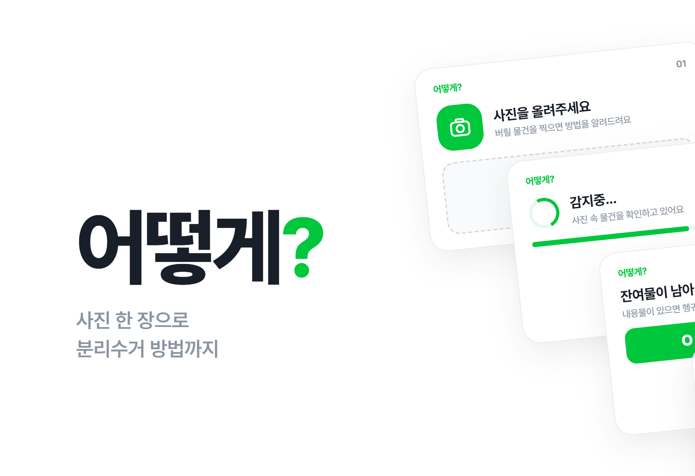
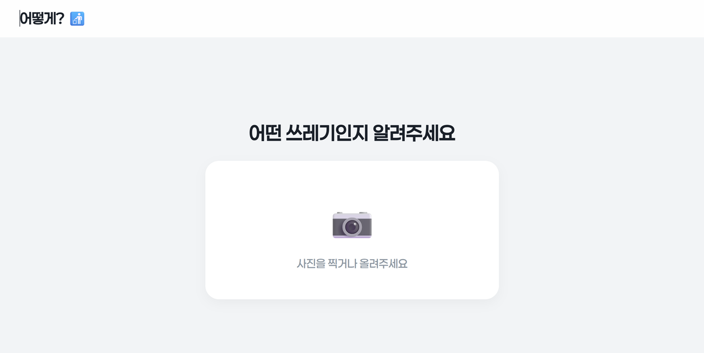
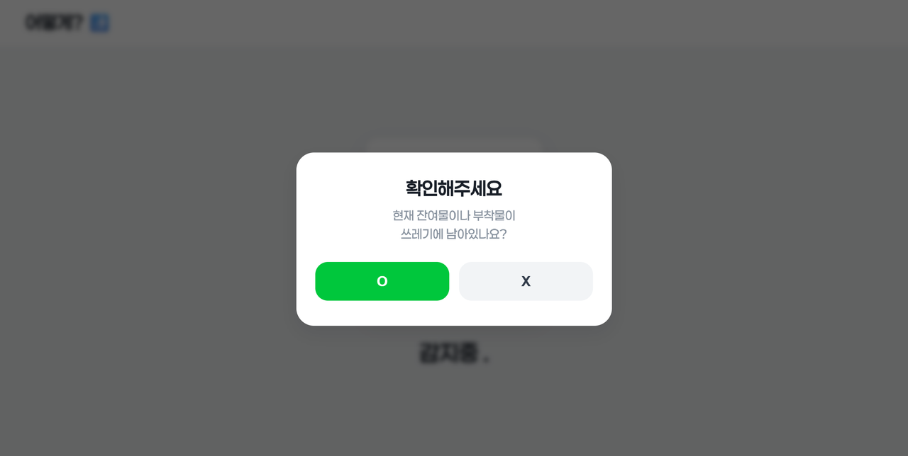
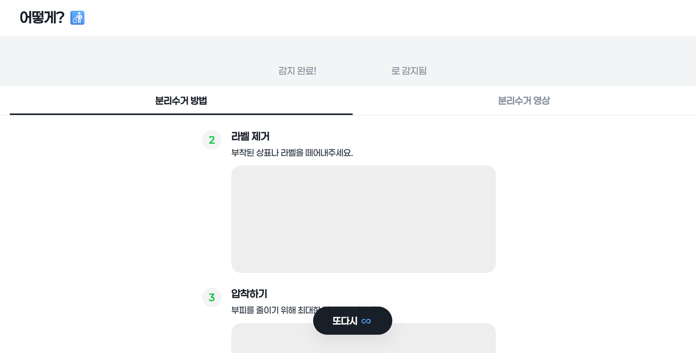
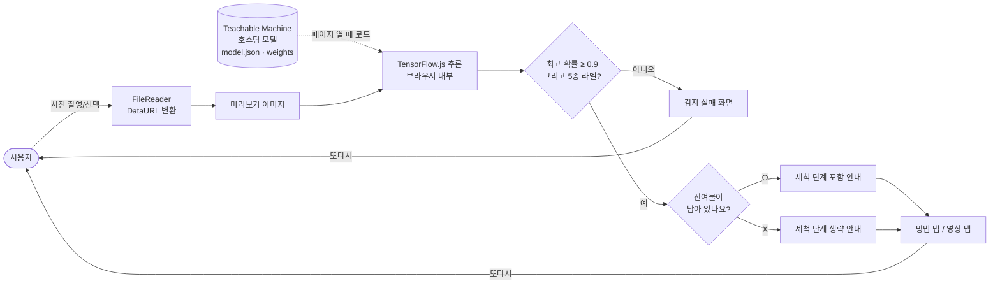

# HowTo

> 쓰레기 사진 한 장을 올리면 재질을 판별해 분리배출 순서와 영상을 보여주는 웹앱 「어떻게?」

---

## 1. 프로젝트 개요 (Overview)

| 항목 | 내용 |
|---|---|
| 프로젝트명 | HowTo (서비스명 「어떻게?」) |
| 한 줄 요약 | 브라우저 안에서 도는 이미지 분류 모델로 쓰레기 재질을 판별한다. 잔여물 유무까지 물어서 그 사람에게 필요한 배출 단계만 안내한다 |
| 진행 기간 | 2025.12.10 ~ 2025.12.18 (9일, 2025 DDC 연구 과제) · 이후 2025.12.22, 2026.03.03 소규모 수정 |
| 참여 인원 | 4인 팀 (대전대신고 1학년) |
| 본인 역할 | 팀장. 웹앱 설계와 개발 전체, 분류 모델 연동, UI 구현. 저장소 커밋 50건 모두 본인 계정 |
| 기여도 | (확인 필요) |

분리배출 규정이 복잡해서 사람들은 헷갈릴 때 주변에 묻거나(47.2%) 감으로 처리한다(38.9%). 팀 설문에서 응답자의 72.2%가 분리수거할 때 혼란을 많이 겪는다고 답했다. 검색창에 품목명을 쳐서 답을 찾는 과정 자체가 번거롭다고 보고 카메라를 들이대는 것만으로 답이 나오게 만드는 것을 목표로 잡았다.

## 2. 기술 스택 (Tech Stack)

| 구분 | 기술 | 선택 이유 |
|---|---|---|
| 화면 | HTML · CSS · Vanilla JavaScript (단일 `index.html`) | 9일 안에 끝내야 했고 서버가 필요 없는 구조였다. 빌드 도구 없이 파일 하나로 배포와 수정이 끝난다 |
| 추론 | TensorFlow.js + `@teachablemachine/image` | 모델이 사용자 브라우저에서 돈다. 사진이 외부 서버로 가지 않으니 추론 서버를 따로 운영할 필요도 없다 |
| 모델 학습 | Google Teachable Machine (이미지 분류, 입력 224px) | 클래스별 이미지만 넣으면 전이학습이 돌아가고 결과를 URL 하나로 불러올 수 있다. 짧은 기간에 모델을 여러 번 다시 학습하기 좋았다 |
| 데이터 | 쓰레기 이미지 11개 분류 20,773장 (출처 확인 필요) | 공개 쓰레기 분류 데이터셋 구성에 비닐 폴더를 더한 형태다. 최종 모델은 이 중 5개 재질을 쓴다 |
| 배포 | GitHub Pages | 정적 파일만 있으면 되므로 별도 호스팅 비용이 없다 |
| 디자인 | 자체 디자인 토큰 (CSS 변수) | 색·모서리·그림자를 변수로 묶어 화면 전체의 톤을 맞췄다 |

## 3. 핵심 기능 및 담당 업무 (Key Features & Contributions)

  
  
  

### 구현 기능

- **사진 판별**: 촬영하거나 앨범에서 고른 사진을 `FileReader`로 읽어 모델에 넣는다. 결과 라벨은 플라스틱, 비닐, 종이, 금속, 유리 5종이다.
- **판별 실패 처리**: 가장 높은 확률이 0.9 미만이거나 5종에 속하지 않으면 안내를 띄우지 않고 "감지 실패" 화면으로 보낸다. 하단 `또다시` 버튼 한 번이면 처음부터 다시 찍을 수 있다.
- **잔여물 확인 후 맞춤 안내**: 판별 직후 "잔여물이나 부착물이 남아 있나요?"를 묻는다. 없다고 답하면 세척·비우기 단계를 빼고 바로 배출 단계부터 보여준다.
- **배출 방법 / 영상 탭**: 재질별 2~3단계 텍스트 안내와 팀원이 촬영한 배출 영상을 탭으로 나눠 제공한다.
- **튜토리얼**: 첫 화면의 `이렇게!` 버튼으로 들어가는 6장짜리 사용 설명. 판별 실패 상황도 한 장을 따로 할애해 설명한다.
- **홈 화면 설치**: iOS 웹앱 메타 태그를 넣어 홈 화면에 추가하면 주소창 없이 전체 화면으로 열린다.

### 주요 업무

- 화면 흐름 설계 (인트로 → 업로드 → 감지 중 → 잔여물 확인 → 결과 / 실패)
- 모델 로딩·추론·임계값 판정 로직 작성, 모델 재학습 후 교체
- 재질별 안내 데이터 구조 설계. 단계마다 `isCleaning` 플래그를 달아 잔여물 답변에 따라 걸러지게 했다
- 디자인 토큰 정의와 전면 리디자인 (2025.12.16, 640줄 추가·538줄 삭제)
- 튜토리얼 슬라이드와 전환 애니메이션 구현

## 4. 성과 및 결과 (Results & Metrics)

### 정량적 성과

| 항목 | 결과 |
|---|---|
| 개발 기간 | 9일, 커밋 50건 |
| 학습 데이터 | 11개 분류 20,773장 수집 → 최종 모델 5개 재질 |
| 판정 기준 | 최고 확률 0.9 이상일 때만 안내 |
| 설문: 선호 방식 | "사진 촬영 후 안내" 방식 선호 85.7% |
| 설문: 이름·캐릭터 | 질문형 이름 「어떻게?」에 친근감 80.6%, 캐릭터가 있으면 더 쓰겠다 88.9% |
| 설문: 공공 도입 | 학교·지자체가 제공하면 쓰겠다 86.1% |
| 설문 응답자 수 | (확인 필요) |
| 모델 정확도 | 측정 기록 없음 (확인 필요) |

설문에서 유료 결제를 거부한 이유는 "앱 없이도 버릴 수 있다"(51.5%)와 "귀찮다"(48.5%)로 갈렸다. 개인에게 돈을 받는 모델은 어렵다는 뜻이라서 팀은 학교·지자체에 공급하는 B2G 방향을 결론으로 냈다.

### 정성적 성과

- 서버 없이 브라우저 하나로 끝나는 구조라 운영 비용이 0이다. 사용자 사진도 기기 밖으로 나가지 않는다.
- 모델이 판단하지 못하는 정보(잔여물 여부)를 질문 한 번으로 채웠다. 분류 클래스를 늘리지 않고도 안내가 사람마다 달라진다.
- 확신이 낮을 때 틀린 안내를 하는 대신 다시 찍게 해서 잘못된 배출을 부추기는 경우를 줄였다.

### 확인된 문제 (2026.09 코드 기준)

- 비닐로 판별되면 유리 안내와 유리 영상이 나온다. 안내 데이터의 `Vinyl` 항목이 유리 내용을 복사한 상태로 남아 있다. 이미 있는 `HowTo_Vinyl_Recycle.mp4`는 쓰이지 않는다.
- 종이 영상 경로가 `.mp4r`로 잘못 적혀 있어 종이 영상 탭이 재생되지 않는다.
- 튜토리얼에는 "O를 누르면 세척 단계가 생략된다"고 적혀 있지만 실제 코드는 X(잔여물 없음)를 눌렀을 때 생략한다. 동작은 코드 쪽이 맞고 설명문이 틀렸다.
- TensorFlow.js 스크립트를 `@latest`로 불러오고 있어 라이브러리가 갱신되면 예고 없이 동작이 바뀔 수 있다.

## 5. 트러블슈팅 경험 (Troubleshooting)

### ① 모델이 불러와지지 않는다

**문제** Teachable Machine 모델을 처음 연동했을 때 판별이 전혀 동작하지 않았다.

**원인** 두 가지가 겹쳐 있었다. 모델 주소를 붙여 넣으면서 주소 안에 주소가 한 번 더 들어갔고(`.../models/https://.../models/zEph8gOIH//`) 끝에 슬래시가 두 개 붙었다. 게다가 TensorFlow.js와 Teachable Machine 라이브러리를 부르는 `<script>` 태그가 빠져 있어서 주소가 맞았더라도 `tmImage`가 정의되지 않은 상태였다.

**해결** 세 번의 커밋에 걸쳐 주소를 바로잡고 CDN 스크립트 태그를 추가했다. 모델을 부르기 전에 `tmImage`와 `tf`가 있는지 먼저 확인한다. 없거나 로딩에 실패하면 콘솔에만 남기지 않고 화면(로고 옆)에 "모델 로딩 실패"를 띄우게 했다.

**결과** 로딩이 끝나면 클래스 수를 콘솔에 찍어 모델이 제대로 들어왔는지 바로 확인할 수 있게 됐다. 이후 모델을 다시 학습해 교체할 때(`zEph8gOIH` → `HPWXwtXOO`)는 주소 한 줄만 바꾸면 됐다.

### ② 음식물이 묻은 용기를 깨끗한 용기로 안내한다

**문제** 초기 모델은 음식물이 남은 배달 용기도 그냥 "플라스틱"으로 판별했다. 앱은 그대로 바로 배출하라고 안내했다. 실제로는 씻어야 재활용된다.

**원인** 이미지 분류 모델이 배운 것은 재질이지 상태가 아니었다. "더러운 플라스틱"과 "깨끗한 플라스틱"을 구분하려면 재질마다 오염 여부별 사진을 따로 모아 다시 학습해야 한다.

**해결** 모델에게 상태까지 맞히게 하는 대신, 판별이 끝나면 사용자에게 "잔여물이 남아 있나요?"를 한 번 묻는 2단계 구조로 바꿨다. 안내 데이터의 각 단계에 `isCleaning` 플래그를 달아 두고 잔여물이 없다고 답하면 해당 단계를 걸러낸다.

**결과** 같은 5종 모델로 상태에 따라 다른 안내를 줄 수 있게 됐다. 사진만으로는 알 수 없는 정보를 사용자가 채우니 모델을 키우지 않아도 됐다. 다만 이 변경으로 정확도가 얼마나 나아졌는지는 측정하지 않았다.

### ③ 알아볼 수 없는 사진에도 자신 있게 답한다

**문제** 흐릿한 사진이나 전혀 다른 물건을 올려도 앱은 항상 무언가로 안내했다.

**원인** 분류 모델은 확률의 합이 1이 되도록 출력한다. 어떤 사진이든 확률이 가장 높은 클래스가 하나는 나온다. 첫 연동 코드는 그 값이 얼마든 그대로 결과로 썼다.

**해결** 두 번에 나눠 고쳤다. 먼저 최고 확률 0.7 미만을 실패로 돌리는 임계값을 넣었다. 이때는 라벨이 안내 데이터에 없으면 "일반 쓰레기"로 안내했는데, 이것도 결국 근거 없는 답이었다. 그래서 임계값을 0.9로 올리고 라벨 밖 결과도 실패 화면으로 보내도록 바꿨다. 실패 화면에는 다시 찍으라는 문구와 `또다시` 버튼을 두었고 튜토리얼에도 실패 상황 설명을 한 장 넣었다.

**결과** 틀린 안내 대신 재촬영을 유도하게 됐다. 분리배출에서는 틀린 답이 모른다는 답보다 해롭다. 다만 0.7과 0.9를 고른 근거는 기록에 남아 있지 않다 (확인 필요).

## 6. 링크 및 산출물 (Links & Deliverables)

| 구분 | 링크 |
|---|---|
| GitHub 저장소 | [stx4R/HowTo](https://github.com/stx4R/HowTo) (비공개) |
| 배포 URL | https://stx4r.github.io/HowTo/ (2026.09 기준 접속 불가, 확인 필요) |
| 결과물 | 연구 결과보고서, 경영(시장 진입) 보고서, 탐구 포스터, 북 포스터 |

### 시스템 구성도

---

+++

## 고객여정지도 (Journey Map)

| 단계 | 사용자의 행동 | 사용자의 생각 | 앱의 대응 |
|---|---|---|---|
| 배출 직전 | 버릴 물건을 들고 수거함 앞에 선다 | "이거 어디에 버리지?" | 첫 화면 문구 하나("분리수거를 더 쉽게.")와 버튼 두 개만 둔다 |
| 첫 사용 | 처음 써 보는 앱이라 망설인다 | "뭘 누르면 되지?" | `이렇게!` 튜토리얼로 전체 흐름을 미리 보여준다 |
| 촬영 | 물건을 찍어 올린다 | "제대로 인식할까?" | 올린 사진을 크게 띄우고 "감지중..." 애니메이션으로 처리 중임을 알린다 |
| 확인 | 질문 팝업에 답한다 | "씻어야 하나?" | 잔여물 유무를 물어 필요한 단계만 남긴다 |
| 배출 | 순서대로 따라 한다 | "이렇게 하면 되는구나" | 번호 매긴 단계와 영상을 탭으로 나눠 보여준다 |
| 실패 | 인식이 안 된다 | "안 되네" | 틀린 답 대신 실패를 알리고 `또다시`로 바로 재시도하게 한다 |

## 적응형 및 예측형 디자인 (Adaptive & Predictive Design)

- **적응형**: 앱 컨테이너를 1920×1080 기준으로 고정하고 화면보다 크면 줄이게 했다. 창 크기가 바뀌어도 배치가 흐트러지지 않는다. 세로 태블릿·휴대폰(폭 1024px 이하, 세로 방향)에서는 튜토리얼만 이미지와 설명을 위아래로 쌓는 별도 배치를 쓴다.
- **예측형**: "잔여물이 남아 있나요?" 질문은 사용자의 다음 행동을 앞서 짚는 장치다. 이미 씻어 온 사람에게 세척 안내는 필요 없으므로, 답 하나로 그 사람이 할 일만 남긴다.

## 모션 디자인 (Motion Design)

- 인트로는 탭할 때마다 한 단계씩 열린다. 로고가 위로 올라간 다음 부제가, 그다음 버튼이 떠오른다.
- 튜토리얼 슬라이드는 현재 장이 위로 빠지고 다음 장이 아래에서 올라온다(0.5초). 전환 중 연타는 `isAnimating` 플래그로 막았다.
- 감지 중에는 점이 1~3개로 바뀌는 "감지중..." 문구를 띄우고 1.5초 뒤에 결과를 낸다. 초기에는 1~2초 사이 무작위 지연이었다가 고정값으로 바뀌었다.
- 팝업은 배경을 흐리게 하면서 아래에서 20px 올라온다. 버튼은 누르는 동안 살짝 줄어든다(scale 0.95).

## 보안 취약성 관리 (DREAD)

HowTo에는 서버와 계정이 없다. 사진도 기기 밖으로 보내지 않는다. 남는 위험은 외부에서 불러오는 코드와 모델이다.

| 위협 | 손상 | 재현성 | 오용성 | 영향 사용자 | 발견성 | 판단 |
|---|---|---|---|---|---|---|
| CDN 스크립트를 `@latest`로 불러와 새 버전이 앱을 깨뜨리거나 변조된 코드가 섞임 | 중 | 상 | 하 | 전체 | 중 | 버전을 고정하고 SRI(무결성 해시)를 붙이는 것이 가장 싼 조치 |
| 모델을 Teachable Machine 서버에서 매번 받아 옴. 서비스가 중단되면 판별 불가 | 중 | 중 | 하 | 전체 | 하 | 모델 파일을 저장소에 함께 올려 자체 호스팅 |
| 판별 결과를 믿고 잘못 배출 (오분류) | 하 | 중 | 하 | 개인 | 상 | 임계값 0.9와 실패 화면으로 일부 완화, 정확도 측정 필요 |

수정 순서는 SRI·버전 고정 → 모델 자체 호스팅 → 정확도 측정이 적당하다. 앞의 둘은 코드 몇 줄로 끝나는데 효과는 전체 사용자에게 돌아간다.
