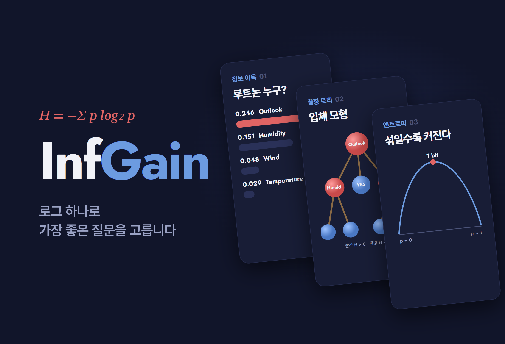
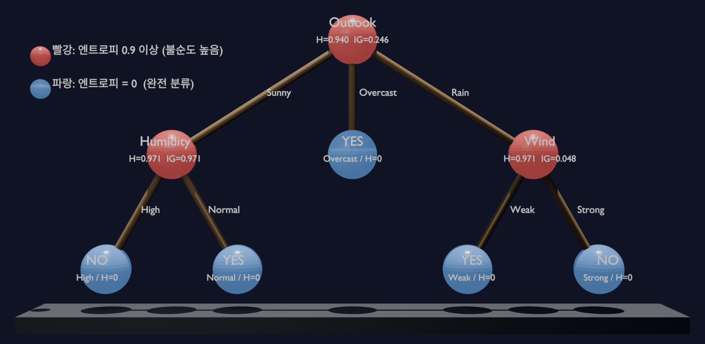

# InfGain.

<p align="center"></p>

> 고등학교 로그함수가 결정 트리의 "가장 좋은 질문"을 어떻게 고르는지, Play Tennis 14개 샘플로 엔트로피와 정보 이득을 전부 손으로 계산해 확인한 대수학 탐구. 결과는 엔트로피를 색으로 칠한 입체 트리 모형으로 만들었다

---

## 1. 프로젝트 개요 (Overview)

| 항목 | 내용 |
|---|---|
| 프로젝트명 | InfGain. (로그함수와 결정 트리의 정보 이득) |
| 한 줄 요약 | 섀넌 엔트로피 → 정보 이득 → ID3 트리 완성까지 손계산으로 따라가, 정보 이득이 가장 큰 Outlook(0.246)이 루트가 되고 Sunny는 Humidity, Rain은 Wind로 갈라진다는 것을 보였다. 루트부터 잎까지의 "누적 정보 이득"을 독자 지표로 제안했다 |
| 진행 기간 | 2026.06 (2학년 대수학 D.D.I.M.-O.P. 3차시) |
| 참여 인원 | 개인 탐구 |
| 본인 역할 | 주제 선정, 배경 조사, 전 과정 손계산, 입체 모형 설계·제작, 보고서(8쪽) 작성 |
| 기여도 | 100% |

앞선 HIU 탐구에서 이진 탐색의 최대 탐색 횟수가 `log₂N`임을 배웠다. 그러면서 로그가 효율을 표현할 뿐 아니라 인공지능 알고리즘 안에서도 핵심 역할을 한다는 데 흥미가 생겼다. 결정 트리는 스팸 필터, 의료 진단, 신용 평가에 두루 쓰이는 기초 알고리즘인데, 데이터를 어떤 기준으로 나눌지 정하는 계산에 고등학교 로그함수가 그대로 쓰인다.

**연구 질문.** 결정 트리가 "가장 좋은 질문"을 고르는 기준은 무엇이고, 그 기준은 로그함수의 어떤 성질에서 나오는가?

| 가설 | 내용 |
|---|---|
| 1. 분기 효율 | 정보 이득이 가장 큰 특성을 루트로 고를수록 더 적은 분기로 데이터를 정확히 분류한다 |
| 2. 로그의 성질 | `H = −Σ p log₂ p`에서 데이터가 한 종류로만 이뤄지면 엔트로피는 0, 두 종류가 반반이면 최댓값(1비트)이 된다 |

## 2. 기술 스택 (Tech Stack)

손계산 탐구라 도구 대신 수학 개념과 자료를 적는다.

| 구분 | 내용 | 쓰임 |
|---|---|---|
| 섀넌 엔트로피 | `H(X) = −Σ p(xᵢ) log₂ p(xᵢ)` | 노드의 불순도(섞인 정도)를 비트로 잰다 |
| 정보 이득 | `IG(S, A) = H(S) − Σ (\|Sᵥ\|/\|S\|) · H(Sᵥ)` | 분기 전후 엔트로피가 얼마나 줄었는지로 질문의 좋음을 잰다 |
| ID3 (Quinlan, 1986) | 정보 이득이 가장 큰 특성을 고르고 하위 노드에서 반복 | 트리를 재귀적으로 완성한다 |
| 데이터 | Play Tennis (Mitchell, *Machine Learning* 3장) 14개 샘플, Yes 9 / No 5 | 특성 4개: Outlook · Temperature · Humidity · Wind |
| 모형 | 구·이쑤시개 입체 모형, Blender 모형 | 엔트로피를 색으로, 누적 정보 이득을 라벨로 보여 준다 |

**밑이 2인 이유.** 엔트로피를 "한 샘플을 분류하려면 예/아니오 질문을 평균 몇 번 해야 하는가"로 읽을 수 있기 때문이다. 한 종류로 확정되면 질문이 필요 없어 `H = 0`, 반반이면 한 번이 필요해 `H = 1비트`다. HIU 탐구의 이진 탐색이 후보를 절반씩 줄여 `log₂n`번 만에 답을 찾던 것과 같은 원리다.

## 3. 핵심 기능 및 담당 업무 (Key Features & Contributions)

### 계산 절차

1. 전체 데이터의 루트 엔트로피 `H(S)` 계산
2. 네 특성 각각의 정보 이득 계산 → 가장 큰 특성을 루트로 선택
3. 루트의 각 가지에서 남은 특성으로 같은 계산을 반복해 트리 완성
4. 선택된 구조가 데이터를 가장 적은 분기로 분류하는지 확인

**루트.** Yes 9 · No 5이므로 `H(S) = −(9/14)log₂(9/14) − (5/14)log₂(5/14) ≈ 0.940`. 1에 가까워 불순도가 높다.

| 특성 | 가지별 (Yes : No → H) | 정보 이득 |
|---|---|:---:|
| **Outlook** | Sunny 2:3 → 0.971 · Overcast 4:0 → **0** · Rain 3:2 → 0.971 | **0.246** |
| Humidity | High 3:4 → 0.985 · Normal 6:1 → 0.592 | 0.151 |
| Wind | Weak 6:2 → 0.811 · Strong 3:3 → **1.000** | 0.048 |
| Temperature | Hot 2:2 → **1.000** · Mild 4:2 → 0.918 · Cool 3:1 → 0.811 | 0.029 |

**두 번째 분기.**

| 가지 | 남은 특성의 정보 이득 | 선택 |
|---|---|---|
| Sunny (2:3, H = 0.971) | Humidity **0.971** · Temperature ≈ 0.571 · Wind ≈ 0.020 | Humidity (High → 전부 No, Normal → 전부 Yes) |
| Rain (3:2, H = 0.971) | Wind **0.971** · Humidity 0.020 · Temperature ≈ 0.020 | Wind (Weak → 전부 Yes, Strong → 전부 No) |

```
                     [ Outlook ]  H=0.940, IG=0.246
                    /      |      \
              Sunny/   Overcast    \Rain
                  /         |        \
         [ Humidity ]     YES      [ Wind ]
          H=0.971         H=0       H=0.971
          IG=0.971      (n=4)       IG=0.971
          /      \                  /     \
      High      Normal          Weak      Strong
       |          |               |         |
      NO         YES            YES        NO
```

### 입체 모형

<p align="center"></p>
<p align="center"><sub>로컬에 남은 Blender 모형을 렌더링했다(받침대의 이름·학번 문구는 숨김). 빨간 구는 추가 분기가 필요한 내부 노드, 파란 구는 한 종류로 분류가 끝난 잎 노드</sub></p>

| 모형 요소 | 대응 |
|---|---|
| 구 / 이쑤시개 | 노드 / 분기 |
| 빨간 구 | 엔트로피 > 0: 아직 분류가 끝나지 않은 내부 노드 |
| 파란 구 | 엔트로피 = 0: 한 종류로 완전히 분류된 잎 노드 |
| 노드 라벨 | 특성명, 그 노드의 `H`, 그 지점의 `IG` |
| 잎 라벨 | 도달한 표본 수 `n`, 루트부터의 **누적 정보 이득** |

평면 도식과 다른 점은 두 가지다. 노드의 엔트로피를 빨강·파랑으로 칠해 불순도와 완전 분류 여부가 한눈에 보이게 했다. 또 노드별 정보 이득 대신 루트부터 잎까지의 정보 이득을 더해 적어 경로마다 완전 분류에 이르기까지 드는 총 정보량과 깊이를 바로 비교할 수 있게 했다.

### 주요 업무

- 엔트로피·정보 이득·ID3 배경 정리와 밑 2의 의미 해석(이진 탐색과의 연결)
- 루트와 두 번째 분기까지 전 과정 손계산, 엔트로피 참조표 작성
- 누적 정보 이득 지표 설계, 입체 모형 설계·제작
- 보고서 작성

## 4. 성과 및 결과 (Results & Metrics)

### 정량적 성과

| 경로 | 분기 횟수 | 누적 정보 이득 | 도달 |
|---|:---:|:---:|---|
| Overcast | **1회** | **0.246** | 파란 잎 (Yes, n = 4) |
| Sunny → Humidity | 2회 | 1.217 | 파란 잎 (No / Yes) |
| Rain → Wind | 2회 | 1.217 | 파란 잎 (Yes / No) |

| 항목 | 결과 |
|---|---|
| 가설 1 | 지지. 정보 이득 최대인 Outlook을 루트로 두자 Overcast 가지(4개)는 한 번에 분류되고 나머지 두 가지도 한 번씩만 더 나눠 모든 잎의 엔트로피가 0이 됐다 |
| 가설 2 | 지지. 한 종류로만 이뤄진 Overcast · Rain-Weak · Rain-Strong은 `H = 0`, 반반인 Wind-Strong · Temperature-Hot은 `H = 1.000` |
| 코드 재계산 (2026.09) | 트리 구조와 순위는 손계산과 같다. 루트의 정보 이득은 Outlook 0.247, Humidity 0.152로 손계산(0.246, 0.151)과 셋째 자리에서 1씩 다르다 (아래 §5-③) |
| 수행평가 점수 | (확인 필요) |

**엔트로피 참조표 (Yes : No)**

| 구성 | 0 | 6:1 | 3:1 · 6:2 | 4:2 | 9:5 | 2:3 · 3:2 | 3:4 | 2:2 · 3:3 |
|---|:---:|:---:|:---:|:---:|:---:|:---:|:---:|:---:|
| 엔트로피 | **0** | 0.592 | 0.811 | 0.918 | 0.940 | 0.971 | 0.985 | **1.000** |

("0"은 4:0, 0:2, 3:0처럼 한쪽만 있는 경우)

### 정성적 성과

- **엔트로피 공식이 곧 로그함수라는 것을 계산으로 확인했다.** 로그의 성질이 "한 종류면 0, 반반이면 최대"라는 불순도 척도의 성질과 정확히 맞아떨어진다.
- **로그를 계산을 빠르게 하는 함수가 아니라 불확실성을 재는 도구로 이해하게 됐다.** 밑 2를 "질문 횟수"로 읽으면 이진 탐색과 결정 트리가 같은 언어로 이어진다.
- **"AI가 학습한다"의 실체를 손으로 체감했다.** 분기마다 엔트로피를 비교해 정보가 가장 많은 선택을 되풀이하는 수학적 과정이었다.

### 확인된 한계

- **14개 샘플의 교과서 예제다.** 연속형 특성, 결측치, 과적합은 다루지 않았다.
- **다른 분기 기준과 비교하지 않았다.** CART의 지니 불순도, C4.5의 정보 이득 비율과의 비교는 후속 과제다.
- **Blender 모형의 Wind 노드 라벨이 `IG=0.048`이다.** 이 값은 루트에서 본 Wind의 정보 이득이고, Rain 가지에서 Wind의 정보 이득은 0.971이다. 실물 모형에 같은 라벨이 쓰였는지는 (확인 필요)
- **Blender 모형의 범례는 빨강을 "엔트로피 0.9 이상"으로 적었다.** 보고서의 정의(엔트로피 > 0)와 다르다. 이 트리에서는 내부 노드가 모두 0.94 이상이라 결과는 같다.

## 5. 트러블슈팅 경험 (Troubleshooting)

### ① 숫자만으로는 가설이 트리에서 어떻게 드러나는지 보이지 않았다

**문제** 엔트로피와 정보 이득을 표로 다 계산하고 나니 숫자가 너무 많고 추상적이었다. "정보 이득이 큰 특성을 루트로 둘수록 분기가 적어진다"는 가설이 트리 구조에서 실제로 어떻게 보이는지 확인하기 어려웠다.

**원인** 표는 특성별 값을 나란히 보여 줄 뿐, 그 값이 트리의 어느 가지를 얼마나 빨리 끝내는지는 보여 주지 않는다.

**해결** 평면 도식 대신 입체 모형을 만들었다. 노드를 구로, 분기를 이쑤시개로 두고 엔트로피가 0인 잎은 파랑, 아직 섞여 있는 내부 노드는 빨강으로 칠했다.

**결과** Overcast 가지는 한 번 만에 파란 잎에 닿고 Sunny와 Rain은 빨간 노드를 한 번 더 거쳐야 파란 잎에 닿는 모습이 색만으로 보였다.

### ② 노드별 정보 이득만으로는 경로끼리 비교할 수 없었다

**문제** 표준 결정 트리 그림은 노드마다 그 자리의 정보 이득만 적는다. 이것으로는 "어느 경로가 분류를 끝내는 데 더 많은 정보가 필요했는가"를 비교할 수 없다.

**원인** 정보 이득은 분기 한 번의 효과라, 경로 전체의 비용은 사람이 머릿속에서 더해야 한다.

**해결** 루트부터 각 잎까지의 정보 이득을 더한 "누적 정보 이득"을 잎마다 적었다.

**결과** Overcast 0.246(1회) 대 Sunny·Rain 1.217(2회)로, 경로별 깊이와 필요한 정보량을 숫자 하나로 비교할 수 있게 됐다.

### ③ 손계산과 코드 계산이 셋째 자리에서 달랐다 (재검증)

**문제** 이 보고서를 쓰면서 같은 데이터를 코드로 다시 계산했더니 루트의 정보 이득이 Outlook 0.247, Humidity 0.152로 나왔다. 손계산 값은 0.246, 0.151이었다.

**원인** 손계산은 가지별 엔트로피를 셋째 자리에서 반올림한 값(0.971, 0.985 등)으로 가중합을 구했다. 중간값의 반올림 오차가 마지막 자리에 쌓였다.

**해결** (보고서 v2.0에서 기록) 순위와 트리 구조에는 영향이 없음을 확인하고 두 값을 함께 적었다. 손계산에서는 중간값을 한 자리 더 두고 마지막에만 반올림하면 된다.

**결과** Outlook > Humidity > Wind > Temperature 순서와 두 번째 분기(Humidity, Wind)는 손계산과 코드가 완전히 같다.

## 6. 링크 및 산출물 (Links & Deliverables)

| 구분 | 링크 |
|---|---|
| GitHub 저장소 | 없음 |
| 산출물 | 탐구 보고서(8쪽), 결정 트리 입체 모형, Blender 모형(`.blend`) |
| 관련 탐구 | HIU 탐구 (이진 탐색과 `log₂N`) |

<details>
<summary><b>용어</b></summary>

- **정보량 `I(x) = log₂(1/p)`**: 확률이 낮은 사건일수록 커지는 값
- **섀넌 엔트로피**: 정보량의 기댓값. 데이터의 불순도를 비트 단위로 잰다
- **비트**: 예/아니오 질문 한 번에 해당하는 정보 단위
- **정보 이득(IG)**: 분기 전후 엔트로피의 감소량. 클수록 좋은 질문
- **ID3**: 1986년 로스 퀸런이 만든, 정보 이득으로 트리를 재귀 구성하는 알고리즘
- **루트 / 내부 / 잎 노드**: 트리의 시작점 / 더 나눠야 하는 노드(H > 0) / 분류가 끝난 노드(H = 0)
- **누적 정보 이득**: 루트부터 잎까지 각 분기의 IG를 더한 값. 이 탐구의 독자 지표
- **지니 불순도 / 정보 이득 비율**: 각각 CART, C4.5가 쓰는 분기 기준

</details>

<details>
<summary><b>참고문헌</b></summary>

- 제이 웬그로우, 『누구나 자료 구조와 알고리즘』, 이민석 역, 한빛미디어, 2018 (pp. 85–92)
- Tom M. Mitchell, *Machine Learning*, McGraw-Hill, 1997 (3장 Decision Tree Learning)
- J. R. Quinlan, "Induction of Decision Trees," *Machine Learning*, vol. 1, 1986
- Wikipedia, "Entropy (information theory)", "Information gain (decision tree)"

</details>
