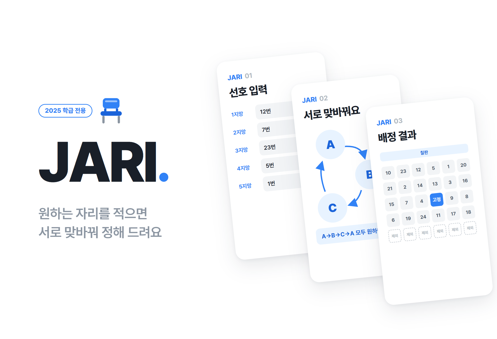
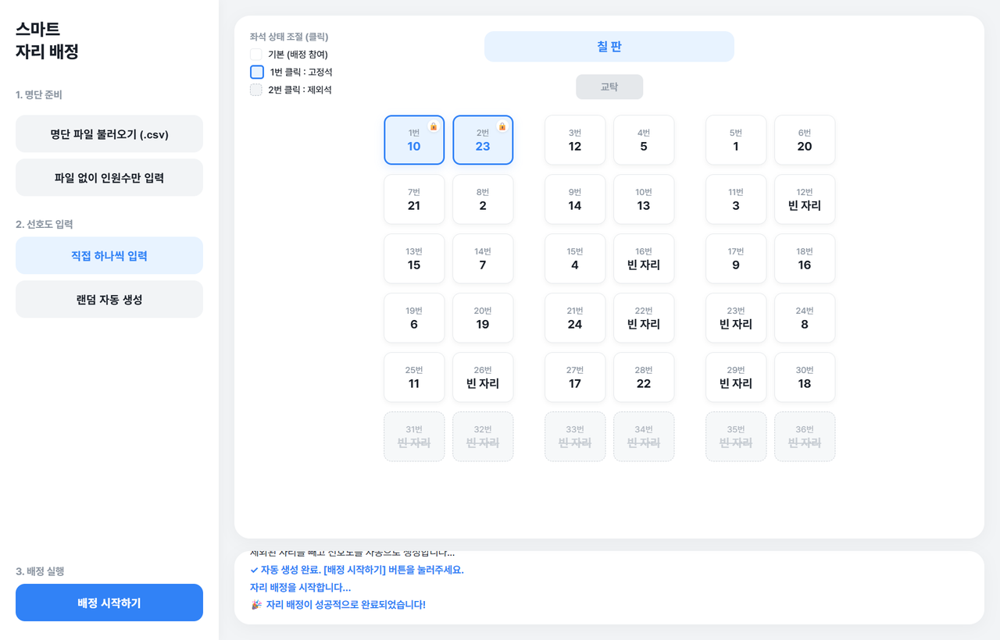
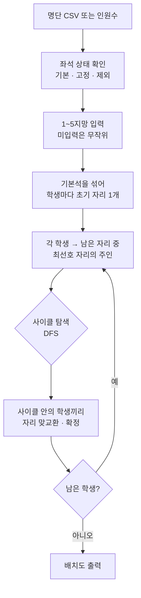

# Jari

<p align="center"></p>

> 학생마다 5지망까지 원하는 자리를 받고, Top Trading Cycles(TTC) 알고리즘으로 자리를 맞교환해 배정하는 교실 자리 배치 프로그램

---

## 1. 프로젝트 개요 (Overview)

| 항목 | 내용 |
|---|---|
| 프로젝트명 | Jari (데스크톱판 「우리반 자리 배정 시스템」, 웹판 「스마트 자리 배정」) |
| 한 줄 요약 | 제비뽑기 대신 학생의 선호를 받고 먼저 나눠 준 자리를 원하는 사람끼리 맞바꾸게 해서 자리를 정한다 |
| 진행 기간 | 2026.03.03 ~ 2026.03.06 (4일) · 03.03 데스크톱판(Python) → 03.06 웹판(HTML/JS) |
| 참여 인원 | 개인 프로젝트 |
| 본인 역할 | 알고리즘 선정과 구현, 데스크톱 GUI와 웹 UI 개발, 실행 파일 패키징 |
| 기여도 | 100% (저장소 커밋 5건 전부 본인) |

새 학기 자리 배정은 보통 제비뽑기로 한다. 공정하긴 하지만 원하는 자리가 있는 학생의 선호는 전혀 반영되지 않는다. 반대로 선호를 받아 선생님이 손으로 조정하면 누가 먼저 말했는지, 누구 사정을 봐줬는지가 결과를 가른다. 선호를 반영하면서도 규칙이 정해진 배정을 목표로 잡았다.

알고리즘은 매칭 이론에서 골랐다. 잘 알려진 Gale-Shapley는 양쪽 모두 선호를 가지는 양측 매칭(학생-학교, 지원자-회사)용이다. 자리는 학생을 고르지 않으므로 이 문제는 한쪽만 선호를 가지는 단방향 배정이다. 그래서 학생마다 자리를 하나씩 먼저 나눠 준 뒤 원하는 자리의 주인과 맞바꾸는 TTC를 택했다.

## 2. 기술 스택 (Tech Stack)

| 구분 | 기술 | 선택 이유 |
|---|---|---|
| 데스크톱판 | Python 3.13 · customtkinter (278줄) | 기본 tkinter보다 깔끔한 다크 테마 위젯을 쓸 수 있다. 파일 대화상자와 메시지 창은 tkinter 것을 그대로 쓴다 |
| 패키징 | PyInstaller 단일 실행 파일 (`.exe`, 약 14MB) | 교실 컴퓨터에 파이썬을 설치하지 않아도 바로 실행된다 |
| 웹판 | HTML · CSS · Vanilla JavaScript (단일 `index.html`, 579줄) | 설치 없이 브라우저로 연다. 교실 모양을 클릭으로 바꾸는 배치도는 웹이 만들기 쉬웠다 |
| 폰트 | Pretendard (jsDelivr CDN) | 한글 가독성 |
| 입력 | CSV (`번호,이름`) | 학교에서 쓰는 명단을 엑셀에서 바로 저장해 쓸 수 있다 |

## 3. 핵심 기능 및 담당 업무 (Key Features & Contributions)

<p align="center"></p>
<p align="center"><sub>웹판, 인원수 모드 24명. 1·2번은 고정석, 31~36번은 제외석으로 두고 배정한 결과</sub></p>

### 구현 기능

- **명단 준비**: `번호,이름` CSV를 불러온다. 웹판에는 명단 없이 인원수(최대 36명)만 넣는 모드가 있어 이름을 올리지 않고도 쓸 수 있다.
- **선호 입력**: 학생마다 1~5지망 자리를 고른다. 같은 자리를 두 번 고르면 저장하지 않는다. 입력을 다 못 받았으면 남은 학생의 선호를 무작위로 채울지 묻는다. 시연용으로 전체를 무작위 생성하는 버튼도 있다.
- **TTC 배정**: 라운드마다 학생은 "아직 남아 있는 자리 중 가장 원하는 자리의 주인"을 가리킨다. 가리킴을 따라가다 생기는 사이클 안의 학생들이 서로 자리를 맞바꾸고 빠진다. 원하는 자리가 모두 빠졌으면 자기 자리를 가리켜 그대로 앉는다.
- **배치도**: 칠판·교탁 아래 3분단 2열 배치로 결과를 보여준다.
- **좌석 상태 조절 (웹판)**: 책상을 한 번 누르면 고정석, 두 번 누르면 제외석이 된다. 고정석의 학생은 다음 배정에서 그 자리에 남고, 제외석은 선호 목록과 배정에서 빠진다. 남은 자리가 학생 수보다 적으면 배정을 막고 이유를 알려 준다.

### 주요 업무

- 문제 정의와 알고리즘 선정 (양측 매칭 Gale-Shapley가 아니라 단방향 배정 TTC)
- TTC 구현: 가리킴 그래프 구성, DFS 사이클 탐색, 라운드 반복
- customtkinter GUI (3단계 사이드바, 로그 창, 선호 입력 창, 배치도 창)와 PyInstaller 패키징
- 웹판 이식과 기능 추가 (무작위 초기 배정, 고정석·제외석, 인원수 모드, 좌석 부족 검사)

## 4. 성과 및 결과 (Results & Metrics)

### 정량적 성과

웹판의 배정 코드를 그대로 Node.js로 옮겨 학생마다 무작위 5지망을 주고 5,000회씩 돌린 결과다(2026.09 보고서 작성 중 측정, 스크립트는 [`assets/Jari/seat_sim.js`](assets/Jari/seat_sim.js)).

| 조건 (학생 / 좌석) | 1지망 배정 | 3지망 이내 | 5지망 이내 |
|---|---|---|---|
| 30명 / 30석 | 49.7% | 73.4% | 81.2% |
| 24명 / 30석 | 39.0% | 66.8% | 76.7% |
| 24명 / 36석 | 31.3% | 58.9% | 70.3% |

| 항목 | 결과 |
|---|---|
| 개발 기간 | 4일 (데스크톱판 1일, 웹판 1일) |
| 결과물 | 실행 파일 1개(약 14MB) + 웹 페이지 1개 |
| 지원 규모 | 웹판 최대 36석, 데스크톱판 배치도 35석 |
| 실제 교실 사용 | (확인 필요) |

학생 수와 좌석 수가 같을 때 절반가량이 1지망을, 80% 이상이 5지망 안의 자리를 받는다. 좌석이 남을수록 수치가 떨어지는 이유는 아래 "확인된 한계"에 정리했다.

### 정성적 성과

- 제비뽑기와 손 조정 사이의 문제를 매칭 이론 문제로 다시 정의하고 문제 구조(단방향)에 맞는 알고리즘을 골랐다.
- 같은 알고리즘을 Python GUI와 웹 두 가지로 구현해 교실 PC 사정에 맞춰 설치형과 브라우저형 중 고를 수 있게 했다.
- 웹판에서 교실마다 다른 책상 배치와 "이 학생은 앞자리 고정" 같은 현실 조건을 좌석 상태 3단계로 풀었다.

### 확인된 한계 (2026.09 코드 기준)

- **빈 좌석은 교환 시장에 들어가지 않는다.** 웹판은 사용 가능한 좌석을 섞은 뒤 학생 수만큼만 잘라 초기 자리로 나눠 준다. 나머지 빈 좌석은 누구의 것도 아니어서 학생이 1지망으로 적어도 받을 수 없다. 24명 / 36석에서는 1지망의 33.2%가 이런 빈 좌석을 가리켰다. 빈 좌석까지 시장에 넣는 변형(YRMH-IGYT: 빈 좌석은 우선순위가 가장 높은 학생을 가리킴)으로 같은 조건을 돌리면 결과가 크게 달라진다.

  | 조건 | 현재 1지망 / 5지망 이내 | 빈 좌석 포함 시 1지망 / 5지망 이내 |
  |---|---|---|
  | 24명 / 30석 | 39.0% / 76.7% | 61.4% / 95.7% |
  | 24명 / 36석 | 31.3% / 70.3% | 68.2% / 98.5% |

- **좌석을 섞는 방식이 균등하지 않다.** `sort(() => 0.5 - Math.random())`는 비교 함수가 일관되지 않아 순서마다 확률이 다르다. 30개를 섞을 때 첫 원소가 그대로 첫 자리에 남을 확률이 8.49%로, 균등할 때(3.33%)의 2.5배였다. 초기 자리 분배의 공정성이 여기에 달려 있으므로 Fisher-Yates 섞기로 바꿔야 한다.
- **5지망까지만 받는다.** TTC는 선호 전체를 받을 때 거짓으로 적어서 이득을 볼 수 없다는 성질이 증명돼 있다. 5개로 자르면 이 보장이 그대로 이어지는지는 따로 따져 봐야 한다.
- **웹판은 CSV를 UTF-8로만 읽는다.** 데스크톱판에 있던 CP949 대체 읽기가 옮겨지지 않아 엑셀에서 저장한 한글 명단이 깨질 수 있다.
- **데스크톱판 배치도는 35석 고정이다.** 36명 이상이면 배정은 되지만 배치도에 나오지 않는다.
- **학생이 없는 자리를 고정석으로 지정하면 사실상 제외석이 된다.** 고정석은 배정 대상 좌석에서 빠지기 때문이다.

## 5. 트러블슈팅 경험 (Troubleshooting)

### ① 명단 순서가 곧 초기 자리여서 앞번호가 유리하다

**문제** 데스크톱판은 명단의 k번째 학생에게 k번 자리를 초기 자리로 준다. TTC는 초기 자리에서 출발해 맞바꾸는 방식이라, 인기 있는 자리를 처음부터 가진 학생이 협상에서 유리하다.

**원인** 앞자리를 선호하는 학생이 많다고 가정하고(앞쪽일수록 선택 확률이 높은 가중치) 30명 / 30석으로 5,000회 돌렸다. 명단 1~5번은 66.5%가 1지망을 받았고 26~30번은 7.1%에 그쳤다. 번호가 앞이라는 이유만으로 앞자리 소유권을 얻고 그 자리를 가진 채로 교환에 들어가기 때문이다.

**해결** 웹판에서는 사용 가능한 좌석을 섞은 뒤 학생들에게 나눠 주도록 바꿨다(무작위 초기 배정).

**결과** 같은 조건에서 1~5번과 26~30번의 1지망 배정률이 31.6%와 31.8%로 같아졌다. 참고로 무작위 초기 배정을 한 TTC는 무작위 순서로 한 명씩 고르게 하는 방식(무작위 순차 독재)과 결과 분포가 같다는 것이 알려져 있다(Abdulkadiroğlu & Sönmez, 1998). 다만 위의 섞기 편향 때문에 현재 구현은 완전히 균등하지는 않다. 수치는 보고서 작성 중 모의실험([`seat_sim2.js`](assets/Jari/seat_sim2.js))으로 얻었다.

### ② 교실은 학생 수만큼만 책상이 있지 않다

**문제** 데스크톱판은 좌석 수를 학생 수와 같게 만들고 배치도는 35석으로 그렸다. 실제 교실에는 빈 책상이 있고, 쓰지 않는 자리와 시력·사정 때문에 미리 정해 둔 자리도 있다.

**원인** 좌석을 "학생 수만큼 있는 번호 목록"으로만 다뤘다. 좌석마다 상태를 둘 곳이 없었다.

**해결** 웹판에서 36석 격자를 먼저 그리고 좌석마다 상태(기본 · 고정 · 제외)를 두었다. 책상을 누를 때마다 상태가 돌아간다. 선호 입력 목록과 무작위 선호 생성은 제외석을 빼고 만든다. 배정 전에 `36 - 제외석 - 고정석`이 배정할 학생 수보다 적으면 멈추고 어떤 자리를 풀어야 하는지 알려 준다.

**결과** 명단을 올리기 전에 교실 모양부터 맞춰 둘 수 있다. 고정석 학생은 다시 배정해도 제자리에 남는다.

### ③ 엑셀로 저장한 명단의 한글이 깨진다

**문제** 학교 명단은 대개 엑셀에서 CSV로 저장해 쓴다. 이 파일을 UTF-8로만 읽으면 불러오기가 실패한다.

**원인** 한국어 윈도우의 엑셀은 CSV를 CP949(EUC-KR 계열)로 저장한다. UTF-8로 읽으면 한글 바이트에서 `UnicodeDecodeError`가 난다.

**해결** 데스크톱판에서 UTF-8로 먼저 읽고 디코딩 오류가 나면 CP949로 다시 읽게 했다. 두 경우 모두 파일은 `finally`에서 닫는다.

**결과** 엑셀에서 바로 저장한 명단과 UTF-8 명단을 둘 다 읽는다. 웹판에는 이 처리가 아직 없다.

## 6. 링크 및 산출물 (Links & Deliverables)

| 구분 | 링크 |
|---|---|
| GitHub 저장소 | [stx4R/Jari](https://github.com/stx4R/Jari) (비공개) |
| 배포 URL | https://stx4r.github.io/Jari/ |
| 실행 파일 | 저장소의 `SeatAutoAllocate.exe` (Windows) |
| 모의실험 | [`seat_sim.js`](assets/Jari/seat_sim.js), [`seat_sim2.js`](assets/Jari/seat_sim2.js) |

### 알고리즘 흐름



한 라운드의 예:

```
A는 B의 자리를, B는 C의 자리를, C는 A의 자리를 원한다
→ A → B → C → A 사이클 → 셋이 동시에 원하는 자리로 이동하고 빠진다
```

---

+++

## 고객여정지도 (Journey Map)

사용자는 자리를 배정하는 담임 선생님(또는 학급 임원)이다.

| 단계 | 사용자의 행동 | 사용자의 생각 | 프로그램의 대응 |
|---|---|---|---|
| 준비 | 교실 책상 배치를 떠올린다 | "우리 반은 뒷줄을 안 쓰는데" | 명단 없이도 책상을 눌러 제외석을 먼저 지정할 수 있다 |
| 명단 | 명단 파일을 찾는다 | "이름을 올려도 되나?" | 인원수만 넣는 모드로 번호만 써서 배정할 수 있다 |
| 선호 수집 | 학생들에게 원하는 자리를 받는다 | "다 못 받았는데" | 미입력 학생은 무작위로 채울지 물어본다 |
| 배정 | 버튼을 누른다 | "결과를 믿을 수 있나?" | 데스크톱판은 라운드별 사이클을 로그로 남긴다 |
| 조정 | 특정 학생을 앞자리에 둔다 | "이 학생만 고정하고 다시" | 고정석으로 지정하면 재배정에서 제자리에 남는다 |

## 적응형 디자인 (Adaptive Design)

- 데스크톱판은 1000×650 고정 창에 3단계 사이드바를 두어 위에서 아래로 버튼을 누르면 작업이 끝나게 했다. 앞 단계가 끝나기 전에는 다음 버튼이 비활성화된다.
- 웹판은 같은 3단계 사이드바에 배치도를 오른쪽에 두었다. 2026.03.06 두 번째 커밋에서 여백·글자·책상 크기를 일괄로 줄여(책상 84×70 → 78×64) 한 화면에 36석이 들어오게 했다.

## 보안 취약성 관리 (DREAD)

자리 배정에서는 결과의 공정성을 지켜야 한다. 조작이나 편향이 결과를 바꿀 수 있는 지점을 위협으로 본다.

| 위협 | 손상 | 재현성 | 오용성 | 영향 사용자 | 발견성 | 판단 |
|---|---|---|---|---|---|---|
| 편향된 섞기로 특정 좌석이 특정 순번의 학생에게 더 자주 감 | 중 | 상 | 하 | 반 전체 | 하 | Fisher-Yates로 교체. 코드 한 줄이지만 겉으로는 드러나지 않아 우선 수정 대상 |
| 운영자가 배정 결과가 마음에 들 때까지 다시 돌림 | 중 | 상 | 상 | 반 전체 | 하 | 난수 시드를 공개하고 결과와 함께 기록하면 재실행 여부를 확인할 수 있다 |
| CSV의 이름을 `innerHTML`로 그려 스크립트가 삽입될 수 있음 | 하 | 중 | 중 | 운영자 PC | 중 | 명단 파일은 운영자가 직접 고르므로 위험은 낮다. `textContent`로 바꾸면 끝난다 |

수정 순서는 섞기 교체 → 시드 기록 → `textContent` 전환이 적당하다. 앞의 두 개가 공정성과 직접 닿아 있다.
