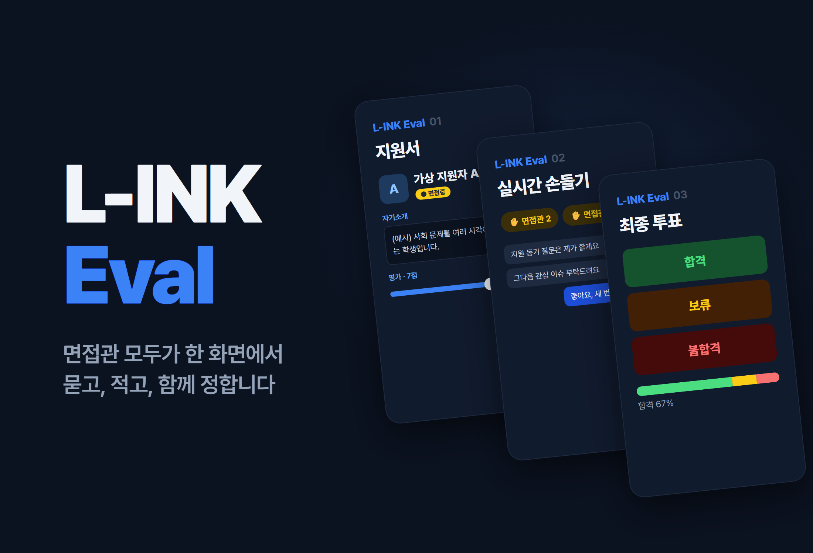
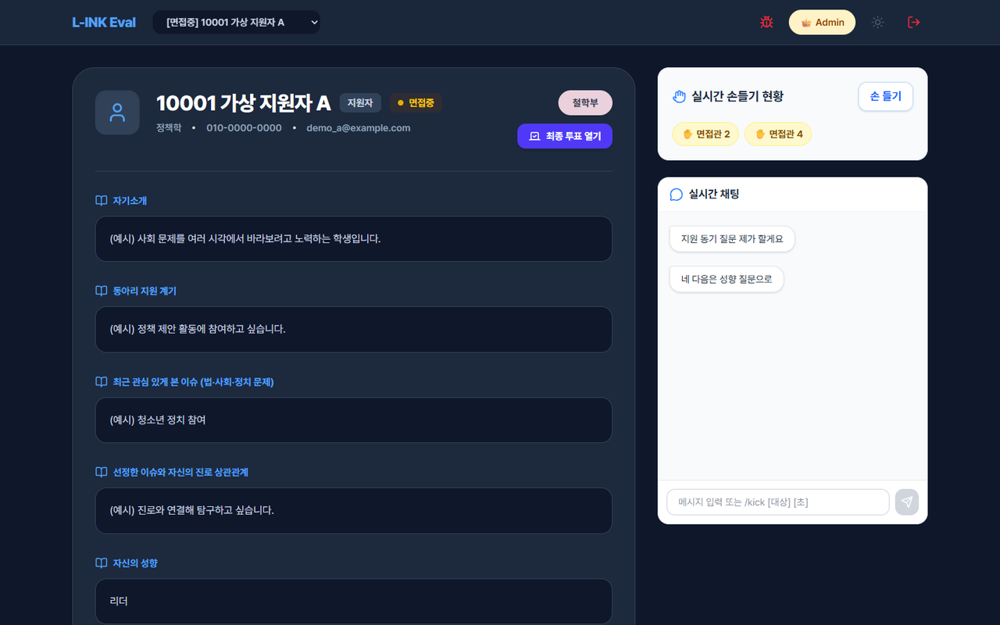
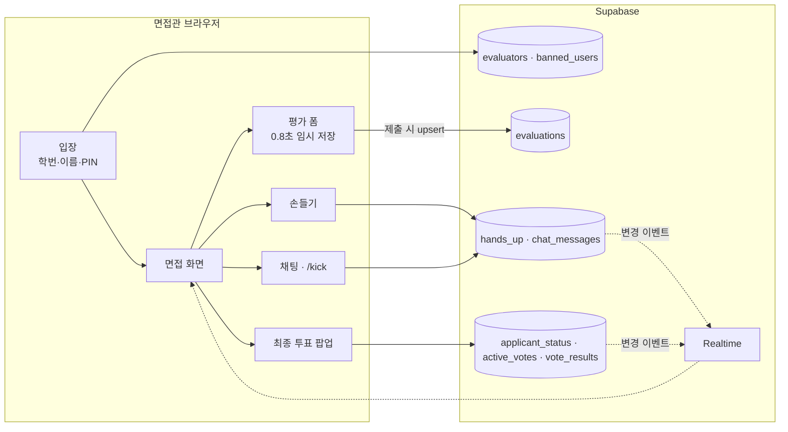

# L-INK Interview

<p align="center"></p>

> 동아리 신입 부원 면접을 여러 면접관이 한 화면에서 진행하고, 점수·질문 순서·합격 투표를 실시간으로 맞추는 면접 평가 웹앱 「L-INK Eval」

---

## 1. 프로젝트 개요 (Overview)

| 항목 | 내용 |
|---|---|
| 프로젝트명 | L-INK Interview (앱 이름 「L-INK Eval」) |
| 한 줄 요약 | 면접관마다 흩어지던 지원서·점수·메모·합불 의견을 한 곳에 모으고, 누가 다음 질문을 할지와 최종 합격 투표까지 실시간으로 공유한다 |
| 진행 기간 | 2026.03 (저장소 생성 2026.03.21, 면접 일정은 확인 필요) · 2026.07.20 동아리 조직 저장소로 코드 업로드 |
| 참여 인원 | 개발 1인 (본인). 사용자는 L-INK 면접관 |
| 본인 역할 | 기획·설계·전체 구현, 면접 당일 관리자(진행) |
| 기여도 | 100% (저장소 커밋 전부 본인). 단, 개발 이력은 업로드 커밋 1건으로 합쳐져 있다 |

L-INK는 대전대신고의 문·이과 융합 동아리다. 신입 부원 면접에서는 여러 면접관이 한 지원자를 동시에 보는데, 지원서는 종이나 파일로, 점수는 각자 메모로, 합불 의견은 면접이 끝난 뒤 말로 모였다. 누가 다음 질문을 할지도 눈치로 정했다. 면접이 진행되는 동안 면접관들이 같은 화면을 보며 점수를 남기고 질문 순서와 합격 여부를 그 자리에서 정하는 도구를 만들었다.

## 2. 기술 스택 (Tech Stack)

| 구분 | 기술 | 선택 이유 |
|---|---|---|
| 화면 | React 19 · TypeScript · Vite | 컴포넌트 10개 규모의 단일 페이지 앱이라 가벼운 빌드 도구로 충분했다 |
| 상태 | Zustand | 현재 면접관, 선택된 지원자, 임시 저장된 평가를 전역으로 공유한다. Redux보다 설정이 짧다 |
| 스타일 | Tailwind CSS v4 · lucide-react | 다크 모드(`dark:` 변형)를 시스템 설정에 맞춰 켠다 |
| 백엔드 | Supabase (Postgres · Realtime) | 서버 코드를 따로 쓰지 않고 테이블 구독만으로 채팅·손들기·투표를 여러 면접관 화면에 동시에 반영한다 |
| 배포 | Vercel (SPA 리라이트 설정) | 모든 경로를 `index.html`로 돌려 새로고침해도 앱이 열린다 |

## 3. 핵심 기능 및 담당 업무 (Key Features & Contributions)

<p align="center"></p>
<p align="center"><sub>로컬 빌드로 캡처. 지원자 정보·채팅은 모두 가상 데이터로 바꿔 렌더링했다.</sub></p>

### 구현 기능

- **면접관 입장**: 학번과 이름을 넣고, 처음이면 4자리 PIN을 정하고 다음부터는 그 PIN으로 들어온다. 채팅에서 내보내진 면접관은 입장 단계에서 막힌다.
- **지원서 보기**: 상단 드롭다운에서 지원자를 고르면 진로, 부서, 자기소개, 지원 동기, 관심 이슈, 이슈와 진로의 관계, 성향과 근거, 하고 싶은 활동, 각오가 한 화면에 카드로 펼쳐진다.
- **면접 상태**: 관리자가 지원자 배지를 누를 때마다 `면접 대기 → 면접중 → 면접 완료`로 바뀌고 상태 LED 색도 따라 바뀐다. 평가 입력은 `면접중`인 지원자에게만 열린다.
- **평가 입력**: 1~10점 슬라이더와 코멘트. 입력이 멈추고 0.8초가 지나면 앱 안에 임시 저장하고 제출 버튼을 누르면 DB에 `(면접관, 지원자)` 기준으로 덮어쓴다.
- **손들기**: 질문하고 싶은 면접관이 손을 들면 모든 화면의 "실시간 손들기 현황"에 이름이 뜬다.
- **실시간 채팅**: 면접관끼리 질문을 나눠 맡는다. 관리자는 `/kick [대상] [초]` 명령으로 특정 면접관을 일정 시간 내보낼 수 있다.
- **최종 투표**: 관리자가 투표를 열면 모든 면접관 화면에 합격·보류·불합격 팝업이 뜬다. 관리자가 마감하면 비율이 공개된다.
- **관리자 집계 화면**: 전체 평가를 지원자·면접관으로 검색하고 평균 점수를 본다.
- **건의 게시판**: 면접관은 버그·건의를 남기고 관리자는 처리 상태를 바꾼다.

### 주요 업무

- 면접 진행 흐름 설계 (입장 → 지원자 선택 → 상태 전환 → 평가 → 손들기·채팅 → 최종 투표)
- Supabase 테이블 구성과 Realtime 구독 (채팅 · 손들기 · 투표 · 투표 결과)
- 평가 임시 저장과 DB 제출 분리
- 최종 투표 팝업의 상태 관리 (아래 트러블슈팅 ①)

## 4. 성과 및 결과 (Results & Metrics)

### 정량적 성과

| 항목 | 결과 |
|---|---|
| 대상 면접 | 지원자 24명 (4개 부서: 창업부 14 · 정치부 5 · 철학부 4 · 상경부 1) |
| 지원서 항목 | 지원자당 10개 서술 항목을 한 화면에 표시 |
| 규모 | TS/TSX 2,331줄 (지원서 데이터 약 430줄 포함), 컴포넌트 10개 · 페이지 2개 |
| 실시간 채널 | 채팅 · 손들기 · 투표 상태 · 투표 결과 4개 |
| 참여 면접관 수 · 사용 시간 | (확인 필요) |

### 정성적 성과

- 면접이 끝난 뒤 점수와 의견을 다시 모으는 단계가 없어졌다. 투표 결과와 평균 점수가 면접 직후 한 화면에 남는다.
- 누가 다음에 질문할지를 손들기 목록으로 보이게 해서 면접관끼리 말이 겹치는 일을 줄였다.
- 이 프로젝트에서 드러난 인증·권한 문제(아래 한계)는 두 달 뒤 시작한 MoGuk에서 사전 명단 + 서버 검증 + RLS 구조로 풀었다.

### 확인된 한계 (2026.09 코드 기준)

- **지원자 개인정보가 소스 코드에 들어 있다.** 지원서 24건(연락처·학교 이메일 포함)이 `MOCK_APPLICANTS`라는 이름으로 코드에 박혀 있다. 빌드하면 자바스크립트 번들에 그대로 실려 배포 주소를 아는 누구나 개발자 도구로 읽을 수 있다. 지원서는 DB에서 권한 있는 사용자에게만 내려주고 저장소 이력에서도 지워야 한다.
- **PIN 확인이 브라우저에서 일어난다.** 로그인할 때 DB에 저장된 PIN을 브라우저로 가져와 입력값과 비교한다. 조회 한 번이면 다른 면접관의 PIN을 알 수 있고 PIN은 평문으로 저장된다.
- **관리자 판정도 브라우저에서 일어난다.** 특정 학번·이름 조합이거나 학번이 `admin`·`00000`이면 관리자가 된다. 값만 알면 누구나 관리자 화면을 연다.
- **DB 권한 규칙이 저장소에 없다.** 테이블 생성 SQL과 RLS 정책이 없어 클라이언트의 직접 쓰기가 어디까지 막혀 있었는지 확인할 수 없다(확인 필요).
- **개발 이력이 남아 있지 않다.** 저장소에는 완성본을 한 번에 올린 커밋만 있고 README도 Vite 기본 템플릿이다.

## 5. 트러블슈팅 경험 (Troubleshooting)

### ① 최종 투표 팝업이 멋대로 닫히고 다시 뜬다

**문제** 관리자가 투표를 열면 모든 면접관 화면에 팝업이 떠야 한다. 컴포넌트에 남은 수정 주석을 보면 면접관이 결과를 확인하고 팝업을 닫아도 다시 떴고, 다른 면접관의 표가 들어올 때마다 팝업이 흔들리는 문제가 있었다.

**원인** 팝업을 보일지 말지를 "현재 투표 데이터가 있는가"로 정하고 있었다. 팝업을 닫으려고 투표 데이터를 비우면 초기 로드 효과가 다시 돌아 데이터를 가져오고 팝업이 또 열렸다. 표가 추가되는 이벤트에서도 투표 상태를 새로 쓰면서 팝업 표시가 함께 흔들렸다. 구독을 거는 효과의 의존성에 상태가 들어가 구독이 반복되는 문제도 있었다.

**해결** 팝업 표시 여부를 별도 상태(`showModal`)로 떼어냈다. 팝업을 닫을 때는 `showModal`만 끄고 투표 데이터는 그대로 둔다. 표가 추가되는 이벤트는 집계 숫자만 갱신하고 팝업 상태는 건드리지 않는다. 투표 상태가 `voting → finished`로 바뀌는 순간에만 팝업을 다시 띄워 결과를 보여준다. 구독은 의존성 배열을 비워 화면이 처음 열릴 때 한 번만 건다.

**결과** 팝업이 열리는 때가 "새 투표 시작"과 "투표 마감" 두 순간으로 정리됐다. 그 사이에는 면접관이 닫으면 닫힌 채로 남는다. 이 과정은 컴포넌트 주석에 단계별로 남아 있다.

### ② 평가를 쓰는 중에 지원자를 바꾸면 입력이 사라진다

**문제** 면접관은 면접 중에 점수와 메모를 계속 고친다. 입력할 때마다 DB에 쓰면 요청이 너무 많다. 제출 버튼을 누를 때만 저장하면 다른 지원자를 잠깐 보고 돌아왔을 때 쓰던 내용이 사라진다.

**원인** 평가 폼의 입력값은 컴포넌트 상태라서 지원자를 바꾸면 새 지원자 기준으로 초기화된다.

**해결** 저장을 두 단계로 나눴다. 입력이 멈추고 0.8초가 지나면 전역 스토어에 `지원자-면접관` 키로 임시 저장하고 지원자를 다시 고르면 그 값을 불러온다. DB에는 면접관이 제출 버튼을 누를 때만 `(evaluator_id, applicant_name)` 기준으로 upsert해서 같은 면접관이 여러 번 제출해도 행이 하나만 남는다.

**결과** 지원자를 오가도 쓰던 평가가 남고 DB에는 면접관이 확정한 값만 들어간다.

### ③ 손들기 순서가 면접관끼리 공유되지 않는다

**문제** 코드에 남아 있는 첫 질문 대기열(`HandRaiseQueue`)은 손을 든 면접관이 자기 화면에서만 보이는 구조다.

**원인** 대기열을 브라우저 안의 Zustand 상태로만 관리했다. 코드에는 "DB INSERT", "DB DELETE" 주석만 있고 실제 저장은 없어 면접관마다 목록이 따로 놀았다.

**해결** 손들기를 Supabase `hands_up` 테이블로 옮기고(`HandUpSection`), 면접관 이름을 키로 upsert한다. 모든 화면이 이 테이블의 변경을 구독해 목록을 다시 불러온다.

**결과** 한 사람이 손을 들면 모든 면접관 화면에 바로 뜬다. 옛 대기열 컴포넌트는 쓰이지 않은 채 코드에 남아 있다.

## 6. 링크 및 산출물 (Links & Deliverables)

| 구분 | 링크 |
|---|---|
| GitHub 저장소 | [L-INK-dshs/L-INK-Interview](https://github.com/L-INK-dshs/L-INK-Interview) (비공개) |
| 배포 URL | (확인 필요) |

### 시스템 구성도



면접 한 명의 진행:

```
관리자: 지원자 배지 클릭 → 면접중 (평가 폼 열림)
면접관: 손들기 → 질문 → 점수·메모 → 제출
관리자: 최종 투표 열기 → 모든 화면에 팝업 → 마감 → 합격·보류·불합격 비율 공개
관리자: 배지 클릭 → 면접 완료
```

---

+++

## 고객여정지도 (Journey Map)

사용자는 면접관(동아리 부원)이다.

| 단계 | 사용자의 행동 | 사용자의 생각 | 앱의 대응 |
|---|---|---|---|
| 입장 | 학번·이름을 넣는다 | "비밀번호를 또 만들어야 하나?" | 처음 한 번 4자리 PIN만 정한다 |
| 준비 | 다음 지원자의 지원서를 연다 | "이 학생 지원서 어디 있지?" | 드롭다운에서 고르면 10개 항목이 한 화면에 |
| 질문 | 질문하려고 손을 든다 | "지금 말해도 되나?" | 손을 든 면접관 목록이 모두에게 보인다 |
| 평가 | 점수와 메모를 남긴다 | "나중에 정리해야지" | 자동 임시 저장, 제출하면 DB로 |
| 결정 | 합불을 정한다 | "다른 사람 생각은?" | 동시에 투표하고 마감과 함께 비율 공개 |

## 모션 디자인 (Motion Design)

- 투표 진행 중에는 합격·보류·불합격 버튼이 숨 쉬듯 밝아졌다 어두워지는 LED처럼 빛나고 누르면 살짝 커진다(`hover:scale-105`).
- 지원자 상태 배지의 LED 점은 `면접 대기`·`면접중`·`면접 완료`마다 색이 다르다.

## 적응형 디자인 (Adaptive Design)

- 운영체제가 다크 모드면 앱도 다크 모드로 시작하고 헤더의 버튼으로 바꿀 수 있다.
- 넓은 화면에서는 지원서(왼쪽)와 손들기·채팅(오른쪽)을 나란히 두어 면접관이 지원서를 보면서 채팅을 읽을 수 있게 했다.

## 보안 취약성 관리 (DREAD)

| 위협 | 손상 | 재현성 | 오용성 | 영향 사용자 | 발견성 | 판단 |
|---|---|---|---|---|---|---|
| 지원자 개인정보가 JS 번들에 포함 | 상 | 상 | 상 | 지원자 24명 | 상 | 가장 먼저. 지원서를 DB로 옮기고 권한 있는 면접관에게만 조회 허용, 저장소 이력 정리 |
| 저장된 PIN을 브라우저로 내려받아 비교 | 상 | 상 | 중 | 면접관 전체 | 중 | PIN 비교를 서버 함수로 옮기고 해시로 저장 |
| 클라이언트에서 관리자 판정 | 상 | 상 | 중 | 전체 | 중 | 관리자 여부를 DB 역할 컬럼과 RLS로 판정 |
| 투표·상태 테이블에 직접 쓰기 (RLS 확인 불가) | 중 | 중 | 중 | 전체 | 하 | 쓰기를 RPC로만 허용하고 RLS를 저장소에 기록 |

넷 모두 "브라우저를 믿었다"는 같은 원인에서 나온다. 수정 순서는 개인정보 → PIN → 관리자 판정 → 쓰기 권한이 맞다. 앞의 둘은 면접이 끝난 뒤에도 남는 피해라서 먼저 막아야 한다.
