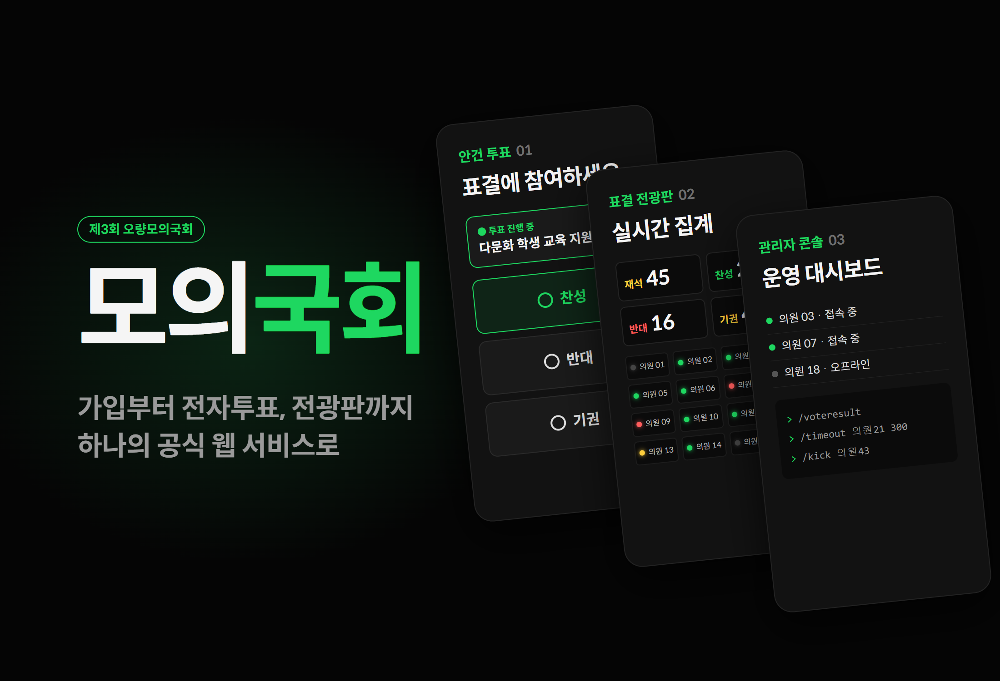
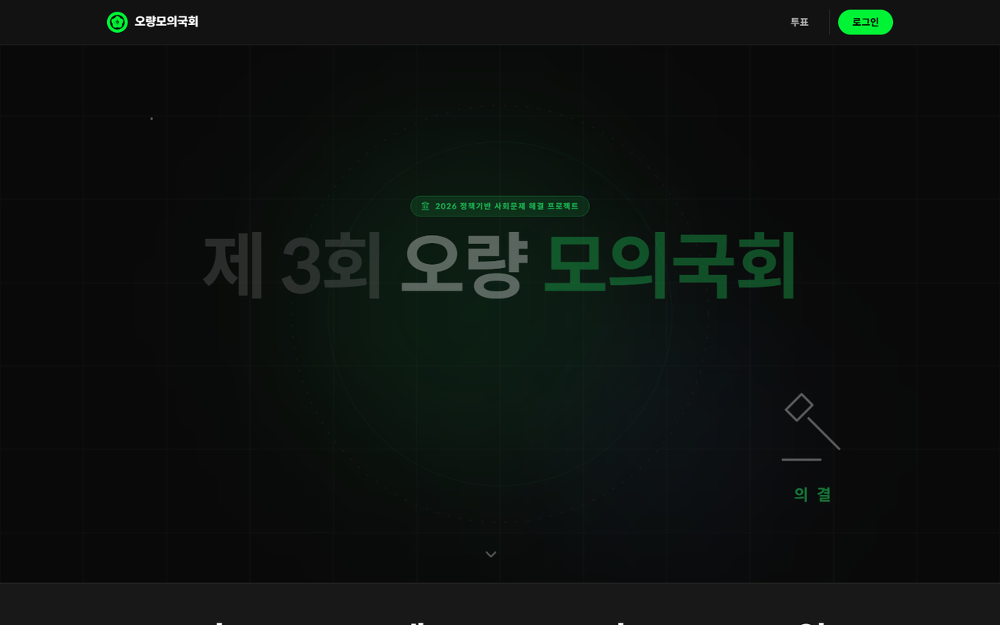
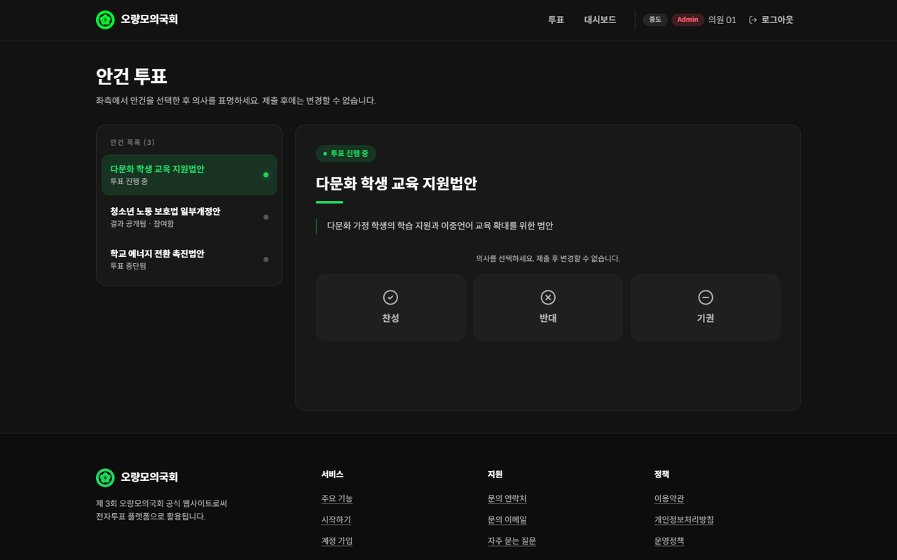
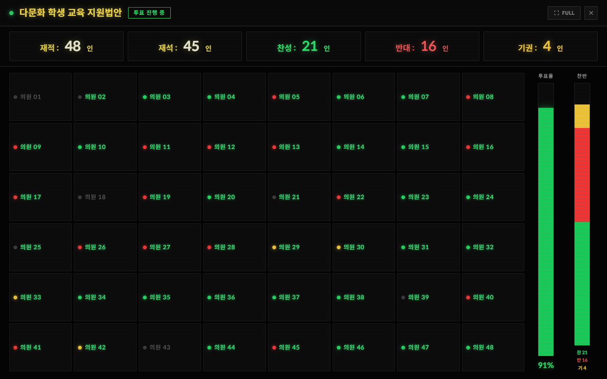
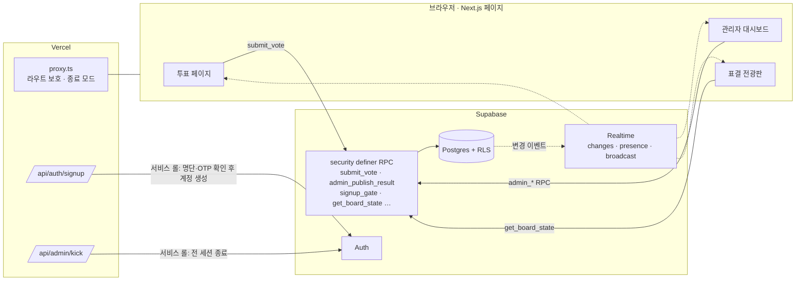

# MoGuk

<p align="center"></p>

> 의원 130명이 참여한 제3회 오량모의국회의 가입·전자투표·전광판·운영 도구를 하나로 묶은 공식 웹 서비스

---

## 1. 프로젝트 개요 (Overview)

| 항목 | 내용 |
|---|---|
| 프로젝트명 | MoGuk (제3회 오량모의국회 공식 웹사이트 · 전자투표 플랫폼) |
| 한 줄 요약 | 미리 등록된 의원만 가입해 안건에 한 번씩 투표하고, 운영진은 출석·표결을 전광판으로 관리하며, 결과는 서버가 직접 집계해 공개한다 |
| 대회 기간 | 2026.05.29 ~ 2026.07.25 (상임위원회 07.18, 본회의 07.25) · 대전대신고등학교 |
| 저장소 기간 | 2026.05.21 (v1.0) ~ 2026.07.24 (폐회 후 서비스 종료) · 커밋 32건 |
| 참여 인원 | 개발팀 3인 (사이트 푸터에는 stx4R · kmc11004 표기) |
| 본인 역할 | 개발 (저장소 커밋 32건 모두 본인 계정). 세부 분담은 (확인 필요) |
| 기여도 | (확인 필요) |

오량모의국회는 교내 12개 동아리가 함께 여는 청소년 모의국회다. 제3회 대회는 진보 40명 · 보수 40명 · 중도 50명의 3당 체제로 9개 상임위원회를 운영했다. 의안 탐구부터 본회의 전자투표까지 두 달 가까이 이어지는 행사라, 참가자 명단 관리와 투표의 공정성을 한 곳에서 책임질 시스템이 필요했다. 이 서비스는 행사 공식 웹사이트이면서 본회의 표결 시스템이다. 누가 투표할 수 있는지, 한 사람이 한 번만 투표하는지, 공개된 숫자가 실제 표와 같은지를 모두 서버와 데이터베이스가 보장하도록 설계했다.

## 2. 기술 스택 (Tech Stack)

| 구분 | 기술 | 선택 이유 |
|---|---|---|
| 프레임워크 | Next.js 16.2 (App Router) · React 19 · TypeScript | 페이지와 서버 API(`app/api`)를 한 저장소에 둔다. `proxy.ts`(Next 16의 미들웨어)에서 요청이 페이지에 닿기 전에 권한을 거른다 |
| 스타일 | Tailwind CSS v4 (`@theme` 토큰) · framer-motion · three.js(@react-three/fiber) | 다크 테마 디자인 토큰을 CSS 변수로 관리한다. 섹션 등장 애니메이션과 첫 화면 3D 배경에 쓴다 |
| 인증 | Supabase Auth + 사전 등록 명단(`allowed_names`) + OTP | 운영진이 미리 발급한 이름·OTP 쌍을 가진 사람만 계정을 만들 수 있다 |
| 데이터 | Supabase Postgres · Row Level Security · `security definer` RPC | 테이블 직접 쓰기를 막고 투표·집계·관리 동작을 전부 DB 함수로 처리한다. 클라이언트가 조작돼도 규칙은 DB에서 지켜진다 |
| 실시간 | Supabase Realtime (`postgres_changes` · Presence · Broadcast) | 안건 개폐와 결과 공개를 모든 화면에 즉시 반영한다. 접속자 현황을 보고 특정 사용자의 세션을 끊는다 |
| 배포 | Vercel · PWA 매니페스트(`standalone`) | 푸시하면 바로 배포된다. 휴대폰 홈 화면에 앱처럼 설치할 수 있다 |

## 3. 핵심 기능 및 담당 업무 (Key Features & Contributions)

<p align="center"></p>
<p align="center">
  
  
</p>
<p align="center"><sub>로컬 빌드로 캡처. 투표·전광판 화면은 Supabase 대신 가짜 데이터를 넣어 렌더링했다(안건명·의원명은 예시).</sub></p>

### 구현 기능

- **초대제 가입**: 이름 + 운영진이 나눠 준 OTP + 이메일 + 비밀번호(8자 이상)로 가입한다. 서버 API가 IP와 이름을 DB 게이트(`signup_gate`)에 넘겨 시도를 허용할지 먼저 판정하고, 명단에 있는 이름·OTP 쌍인지와 이미 가입된 이름인지를 확인한 뒤 서비스 롤 키로 계정을 만든다. 실패 이유는 구분하지 않고 같은 응답을 돌려준다.
- **안건 투표**: 열린 안건에 찬성·반대·기권 중 하나를 고른다. 제출은 `submit_vote` RPC 하나로만 가능하고 제출 후에는 바꿀 수 없다. 로그인·차단 여부·안건 개폐·중복을 DB 함수가 차례로 확인하며 `(agenda_id, user_id)` 유일 제약이 마지막으로 중복을 막는다.
- **결과 공개**: 투표 중에는 누구도 집계를 볼 수 없다. 관리자가 공개하면 서버가 `votes`를 직접 세어 결과 행을 만들고, 모든 접속자 화면에 실시간으로 뜬다.
- **표결 전광판**: 국회 전광판처럼 의원별 LED로 찬성·반대·기권·미투표를 보여주고 재적·재석·찬반 수와 투표율 막대를 함께 띄운다. 관리자는 출석 처리와 표결 보정을 할 수 있다. 결과가 공개된 안건은 의원들도 읽기 전용으로 볼 수 있다(기명 표결 공개).
- **관리자 대시보드**: 접속 중인 의원 목록(Presence), 안건 생성·열기·닫기·완료, `/kick` `/ban` `/timeout` `/voteresult` 명령어 콘솔.
- **강제 로그아웃**: RPC로 상태를 기록하고, 서버 API가 서비스 롤 키로 대상의 모든 세션을 끊고, Broadcast로 대상 화면에 알린다. 대상 화면은 방송을 받아도 곧바로 로그아웃하지 않고 서버에 세션을 다시 물어 실제로 끊긴 경우에만 로그인 화면으로 보낸다.
- **대회 정보·정책 페이지**: 일정·상임위원회·정당 구성, 이용약관·개인정보처리방침·운영정책, 가이드 영상, FAQ.
- **서비스 종료 모드**: 폐회 후 플래그 하나로 모든 페이지를 종료 안내로 돌리고 API는 `410 Gone`으로 닫는다.

### 주요 업무

- 인증·권한 흐름 설계 (사전 명단 + OTP 가입, `proxy.ts` 라우트 보호, 관리자 API의 출처 검사)
- Supabase 스키마·RLS 정책·RPC 설계와 보안 점검 반영 (V-1 · V-3 · V-4)
- 투표 페이지, 관리자 대시보드, 표결 전광판 구현
- 보안 헤더(CSP · HSTS · X-Frame-Options 등) 설정
- 기능 정리와 공개 저장소 정리 (v4.2 5,206줄 삭제, 07.13 DB 스크립트 제거)

## 4. 성과 및 결과 (Results & Metrics)

### 정량적 성과

| 항목 | 결과 |
|---|---|
| 대상 행사 | 의원 130명 (3당) · 동아리 12개 · 상임위원회 9개 · 대회 기간 58일 |
| 서비스 규모 | 페이지 11개 + 서버 API 2개, TS/TSX/CSS 4,471줄 |
| DB 설계 | 테이블 13개, RLS 정책 33개 (v4.2 직전 스키마 기준), 클라이언트가 호출하는 RPC 12종 |
| 개발 이력 | 커밋 32건, 버전 v1.0 → v7.2 → 폐회 |
| 기능 정리 | v4.2에서 채팅·공지·버그 제보 등 5,206줄 삭제 |
| 실제 가입자 수 · 투표 수 · 동시 접속 | (확인 필요) |

### 정성적 성과

- 투표의 세 가지 조건(자격 있는 사람만, 한 번만, 공개된 숫자가 실제 표와 같게)을 화면이 아니라 DB 규칙으로 보장했다. 클라이언트 코드를 고쳐도 우회할 수 없다.
- 본회의 전 보안 점검 항목(V-1 · V-3 · V-4 등)을 번호로 관리하며 하나씩 고쳤다.
- 쓰지 않는 기능을 과감히 걷어냈다. 채팅과 버그 제보 같은 기능은 모두 공격받을 수 있는 입구였고 행사에 꼭 필요하지 않았다.
- 폐회 후에는 서비스를 명시적으로 닫아 남은 계정과 데이터로 들어오는 경로를 없앴다.

### 확인된 한계 (2026.09 코드 기준)

- **DB 스크립트가 저장소에 없다.** 2026.07.13 커밋에서 스키마·RLS·보안 패치 SQL(1,366줄)을 공개 저장소에서 지웠다. 이후 추가된 `signup_gate` 같은 함수는 기록이 아예 없어 저장소만으로는 서비스를 다시 세울 수 없다.
- **클라이언트 개발자 도구 차단은 보안이 아니다.** F12·우클릭·`debugger` 차단 스크립트가 남아 있다. 코드 주석도 "서버 레벨 보호를 따로 둔다"고 적고 있듯 실제 방어는 CSP와 RLS다.
- **CSP에 `script-src 'unsafe-inline'`이 있다.** 위의 인라인 스크립트 때문에 필요하지만 스크립트 삽입 방어가 그만큼 약해진다.
- **폐회 커밋이 홈 레이아웃을 깨뜨린다.** 종료 안내 페이지를 가운데 정렬하려고 `main`을 가로 방향 `flex`로 바꿨다. 서비스를 다시 열면 여러 섹션으로 된 홈 화면이 가로로 눌린다. 위 스크린샷은 폐회 직전 레이아웃으로 되돌려 찍었다.
- **강제 로그아웃은 세 단계가 따로 실행된다.** RPC · 서버 API · Broadcast 사이에 트랜잭션이 없어 중간 단계가 실패해도 뒤 단계가 실행된다.

## 5. 트러블슈팅 경험 (Troubleshooting)

### ① 로그인만 하면 남의 표가 보이고, 결과 숫자를 클라이언트가 정했다 (보안 점검 V-1 · V-4)

**문제** 상임위원회(07.18)를 엿새 앞둔 보안 점검에서 두 가지가 나왔다. `votes` 테이블 조회 정책이 `to authenticated using (true)`라서, 로그인한 누구나 다른 의원의 선택을 읽을 수 있었다. 결과 공개도 관리자 화면에서 계산한 숫자를 그대로 결과 테이블에 넣는 구조였다.

**원인** 처음 정책의 이름은 "인증 유저는 투표 결과 조회 가능"이었다. 집계를 보여줄 목적으로 원본 표 테이블 자체를 열어 둔 것이다. 결과 공개는 "관리자만 누른다"는 화면 조건에만 기대고 있었다. 관리자 계정이 탈취되거나 요청이 조작되면 숫자를 바꿀 수 있었다.

**해결** (V-1) `votes` 조회를 본인 표와 관리자로 좁혔다. 투표 페이지는 자기 표만 읽고, 집계가 필요한 곳은 `security definer` 함수가 대신 센다. (V-4) 결과 공개를 `admin_publish_result` RPC로 옮겨, 관리자 권한을 확인한 뒤 서버가 `votes`를 직접 세어 결과 행을 만들게 했다. 클라이언트가 보낸 숫자는 받지 않는다.

**결과** 투표 중에는 관리자 외에 누구도 개별 표를 볼 수 없고 공개되는 숫자는 항상 DB의 실제 표와 같다. 이후 v7.1에서 결과가 공개된 안건만 의원별 표결을 읽기 전용으로 보여주는 별도 RPC(`get_published_board_state`)를 붙였다. 공개 전에는 비밀을 지키고 공개 후에는 기명 표결을 투명하게 보여주는 구조다.

### ② 가입 시도 제한이 서버리스 환경에서 제대로 걸리지 않는다 (V-3)

**문제** 가입 API는 IP마다 1분에 5번까지만 시도하도록 막고 있었다. OTP를 무차별 대입하는 공격을 늦추기 위한 장치였다.

**원인** 시도 횟수를 서버 메모리의 `Map`에 저장했다. Vercel의 서버리스 함수는 요청마다 다른 인스턴스에서 돌 수 있고 인스턴스가 식으면 메모리가 사라진다. 인스턴스마다 카운터가 따로 있으니 제한이 사실상 풀린다. IP도 `x-forwarded-for`의 마지막 값(가장 가까운 프록시)을 읽고 있었다.

**해결** 시도 기록과 판정을 DB 함수 `signup_gate`로 옮겨 모든 인스턴스가 같은 기록을 보게 했다. IP와 이름을 함께 넘기고 가입에 성공하면 `signup_mark_success`로 그 시도를 표시한다(함수 본문은 저장소에 없어 세부 규칙은 확인 필요). `x-forwarded-for`를 읽을 때도 마지막 값 대신 첫 값(원래 클라이언트)을 쓰도록 고쳤다. 같은 회차에 두 가지를 더 막았다.
- **이름 정규화**: 명단 대조 전에 이름을 NFC로 정규화하고 제어 문자·폭 없는 공백을 지운다. 눈에 보이지 않는 문자를 끼워 같은 이름으로 중복 가입하거나 명단 대조를 흔드는 것을 막는다.
- **OTP 흔적 삭제**: 계정을 만든 직후 사용자 메타데이터에서 OTP를 지운다. 메타데이터는 본인 토큰으로 읽을 수 있기 때문이다.

**결과** 인스턴스 수와 상관없이 같은 제한이 걸린다. 실패 응답은 이유와 관계없이 모두 같아서 응답만으로는 어떤 이름이 명단에 있는지 알 수 없다.

### ③ 실시간 전광판에서 미투표 처리와 응답 순서를 놓치지 않기

**문제** 표결 전광판(v7.0)은 `votes`와 출석 테이블의 변경을 실시간으로 받아 다시 그린다. 관리자가 어떤 의원의 표를 "미투표"로 되돌리는 경우와, 표가 몰려 조회가 연달아 나가는 경우에 화면이 실제 상태와 어긋날 수 있었다.

**원인** 미투표 처리는 `votes` 행을 지우는 동작이다. Realtime의 DELETE 이벤트에는 기본 키만 담겨 오므로 `agenda_id=eq.{안건}` 같은 서버 필터를 걸면 이 이벤트가 걸러져 버린다. 또 먼저 보낸 조회의 응답이 나중에 도착하면 새 상태를 옛 상태가 덮는다.

**해결** `votes`는 서버 필터 없이 구독하고, 받은 이벤트에 `agenda_id`가 없거나(DELETE) 현재 안건과 같을 때만 다시 불러오게 했다. 조회마다 순번(`fetchSeq`)을 매기고 가장 최근에 보낸 조회의 응답만 화면에 반영한다. 관리자의 출석·표결 보정은 화면에 먼저 반영하고 RPC가 실패하면 원래 값으로 되돌린다.

**결과** 추가·수정·삭제 어느 쪽이든 전광판이 따라오고 응답 순서가 뒤바뀌어도 마지막 상태가 남는다. 이 처리는 전광판을 처음 만든 커밋에 함께 들어갔다.

### ④ 링크 밑줄 유틸리티가 먹지 않는다

**문제** 푸터 링크에 `underline` 클래스를 줘도 밑줄이 생기지 않았다.

**원인** Tailwind v4는 CSS 캐스케이드 레이어를 쓴다. 전역 CSS의 `a { text-decoration: none }` 리셋이 레이어 밖에 있었는데, 레이어 밖 규칙은 레이어 안의 유틸리티보다 항상 우선한다.

**해결** 리셋을 `@layer base` 안으로 옮겼다.

**결과** 기본값은 밑줄 없음으로 두고 필요한 곳에서는 유틸리티로 덮어쓸 수 있게 됐다.

## 6. 링크 및 산출물 (Links & Deliverables)

| 구분 | 링크 |
|---|---|
| GitHub 저장소 | [L-INK-dshs/MoGuk](https://github.com/L-INK-dshs/MoGuk) (공개) |
| 배포 URL | https://moguk.vercel.app (2026.07.24 폐회 후 종료 안내 페이지) |

### 시스템 구성도



투표 한 건의 처리 순서:

```
submit_vote(안건, 선택)
 ├─ 로그인했는가        아니면 거절
 ├─ 차단·타임아웃인가    맞으면 거절
 ├─ 안건이 열려 있는가   아니면 "투표가 마감되었습니다"
 ├─ 이미 투표했는가      맞으면 거절
 └─ INSERT  ── (agenda_id, user_id) 유일 제약이 마지막 방어선
```

---

+++

## 고객여정지도 (Journey Map)

사용자는 대회에 참가한 의원이다.

| 단계 | 사용자의 행동 | 사용자의 생각 | 서비스의 대응 |
|---|---|---|---|
| 가입 | 운영진에게 받은 OTP로 가입한다 | "아무나 가입하면 어떡하지?" | 명단에 있는 이름·OTP 쌍만 계정이 된다 |
| 대기 | 본회의 전 사이트를 둘러본다 | "언제 뭘 하지?" | 첫 화면에 일정·상임위원회·정당 구성과 가이드 영상 |
| 투표 | 열린 안건을 골라 찬반을 누른다 | "제대로 들어갔나?" | 초록 점이 깜빡이는 안건이 진행 중인 안건이고 제출하면 내 선택이 고정 표시된다 |
| 결과 | 결과 공개를 기다린다 | "다른 사람은 어떻게 했지?" | 공개 순간 모든 화면에 결과가 뜨고 의원별 전광판을 볼 수 있다 |
| 폐회 | 행사가 끝난 뒤 다시 들어온다 | "내 정보는?" | 서비스 종료 안내와 문의처만 남는다 |

## 적응형 디자인 (Adaptive Design)

- 투표 페이지는 넓은 화면에서 왼쪽 안건 목록 + 오른쪽 상세의 2단, 좁은 화면(`md` 미만)에서는 안건을 가로로 넘기는 칩 목록 + 상세 1단으로 바뀐다.
- 전광판은 1280×720 기준 화면을 만들어 두고 부모 폭에 맞춰 비율 그대로 축소한다(`ResizeObserver`). 휴대폰에서도 강당 스크린과 같은 배치가 보인다. 전체 화면 버튼으로 프로젝터에 바로 띄울 수 있다.
- 데스크톱에서 창 높이가 700px 이상이면 본문을 화면 높이에 맞춰 고정한다(`md:[@media(min-height:700px)]`).

## 모션 디자인 (Motion Design)

- 섹션은 화면에 들어올 때 framer-motion으로 아래에서 떠오르고 숫자 통계는 0부터 목표값까지 올라간다.
- 진행 중인 안건의 초록 점은 1.6초 주기로 맥박처럼 깜빡인다.
- 전광판 LED는 찬성·반대·기권 색으로 은은하게 빛나서(glow) 멀리서도 상태가 구분된다.
- 첫 화면 배경은 three.js로 그린 3D 장면이다.

## 보안 취약성 관리 (DREAD)

| 위협 | 손상 | 재현성 | 오용성 | 영향 사용자 | 발견성 | 조치 |
|---|---|---|---|---|---|---|
| 개별 표 열람 (비밀투표 침해) | 상 | 상 | 상 | 전체 | 중 | V-1로 조회 정책을 본인+관리자로 제한 — **해결** |
| 결과 숫자 조작 | 상 | 중 | 중 | 전체 | 하 | V-4로 서버 집계 RPC만 허용 — **해결** |
| OTP 무차별 대입으로 남의 이름 선점 | 상 | 중 | 중 | 해당 의원 | 중 | V-3 DB 게이트 · 통일된 실패 응답 · 이름 정규화 — **해결** |
| 중복 투표 | 상 | 하 | 하 | 전체 | 하 | RPC 검사 + 유일 제약 이중 방어 — **설계 단계부터** |
| 위조된 강제 로그아웃 방송 | 중 | 중 | 중 | 개인 | 중 | 방송을 받으면 서버에 세션을 다시 확인 — **설계 단계부터** |
| 인라인 스크립트 허용(`unsafe-inline`) | 중 | 하 | 하 | 전체 | 중 | 개발자 도구 차단 스크립트를 걷어내고 nonce 기반 CSP로 전환 — **남은 과제** |

손상도와 영향 범위가 가장 큰 앞의 세 항목을 본회의(07.25) 전 7월 12일~21일에 고쳤다. 남은 과제는 인라인 스크립트 한 가지다.
