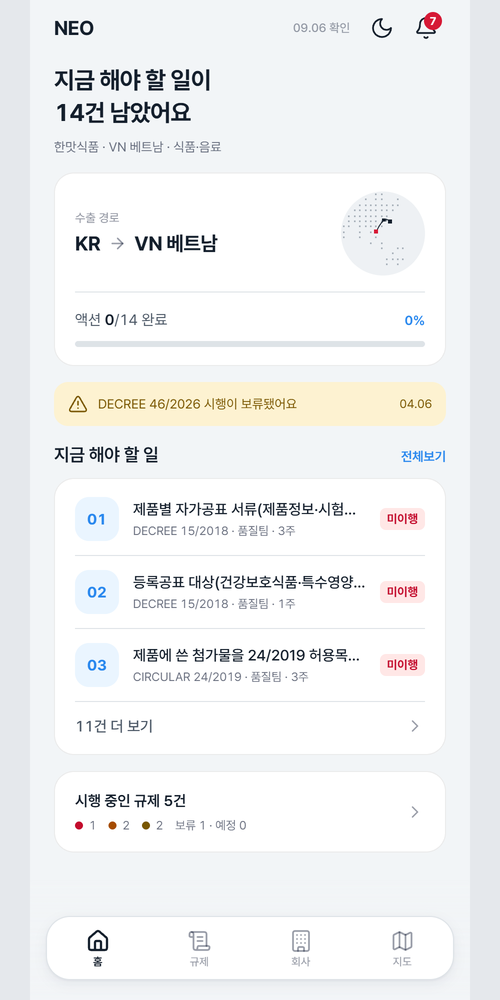
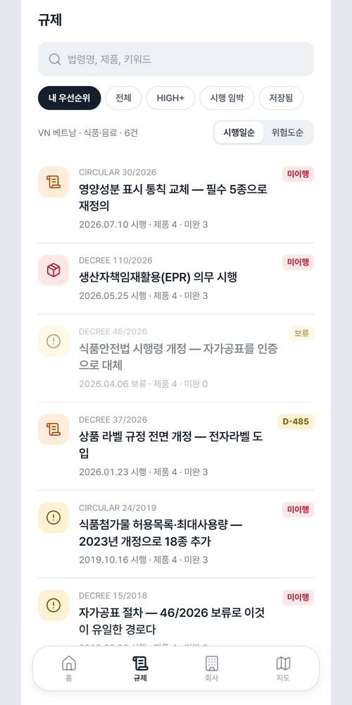
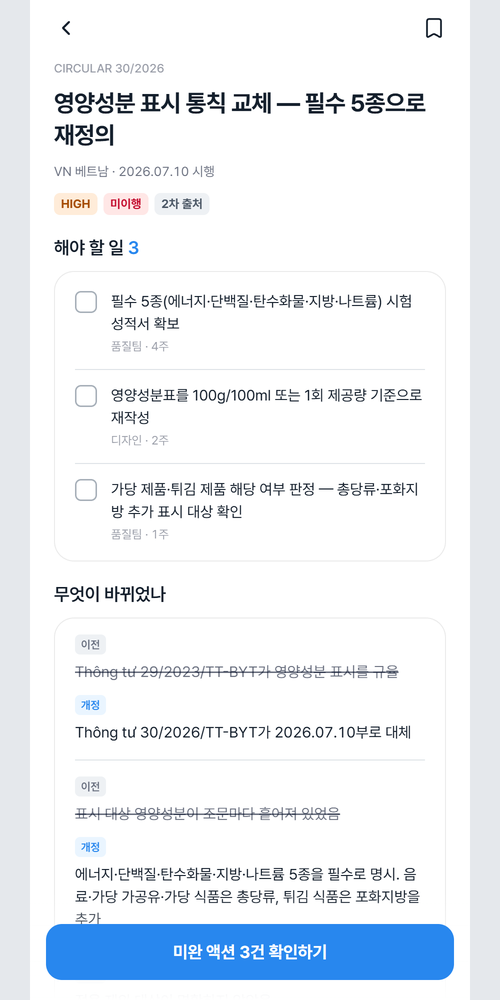
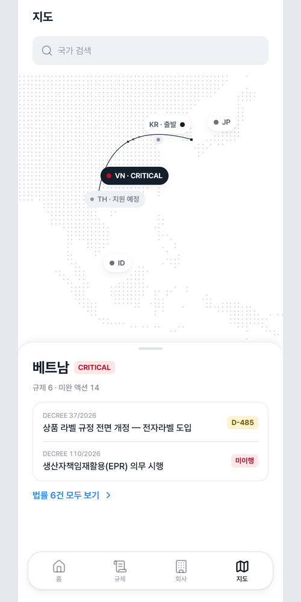
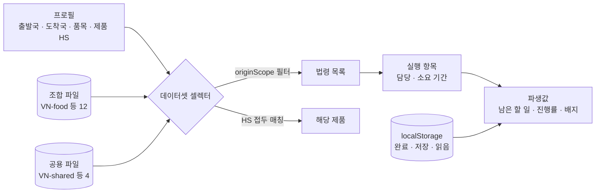

# Neo

> 해외 수출 규제를 "이 법이 바뀌었다"가 아니라 "그래서 당신은 이걸 해야 한다"로 바꿔 주는 PWA. 법령 61건·실행 항목 174건을 사람이 교차검증해 넣었고, 설치 후에는 네트워크가 끊겨도 모든 화면이 열린다

---

## 1. 프로젝트 개요 (Overview)

| 항목 | 내용 |
|---|---|
| 프로젝트명 | Neo (해외 수출 규제 대응 PWA) |
| 한 줄 요약 | 법률·규제 대응팀이 없는 수출 중소기업 담당자가 조문을 읽지 않고도 "우리 제품에 걸리는가 → 무엇을 언제까지 누가"를 확인하고 완료하게 한다 |
| 진행 기간 | 2026.09.05 ~ 2026.09.10 (저장소 생성 → v1.0.0 → 같은 날 v2.0 디자인 전면 교체, v2.0.4) |
| 참여 인원 | 개인 프로젝트 |
| 본인 역할 | 문제 정의, 법령 조사·교차검증 데이터셋 구축, 설계·구현·배포 전체 |
| 기여도 | 100% (저장소 커밋 전부 본인) |

물건을 배에 실은 뒤에도 수출은 도착국의 규제를 통과해야 끝난다. 규제는 나라와 품목마다 갈라져 있고 원문은 베트남어·일본어·인도네시아어로 되어 있으며 예고 없이 바뀐다. 대기업에는 이걸 맡는 팀이 있지만 중소기업에는 없다. 수출 담당자는 대개 품질이나 영업을 함께 맡고 있어 조문을 읽을 시간이 없다. 그런데 실수하면 통관 거부·리콜·과징금으로 돌아온다.

정보는 모자라지 않다. 법령은 관보에 공개돼 있고 법령 뉴스레터도 많다. 다만 "그래서 우리 제품에 걸리는가"의 판정은 어디에도 없다. 이 앱이 파는 것은 정보가 아니라 변환이다. **조문 → 우리 제품 해당 여부 → 무엇을 언제까지 누가.**

## 2. 기술 스택 (Tech Stack)

| 구분 | 기술 | 선택 이유 |
|---|---|---|
| 프레임워크 | Next.js 16 (App Router) · React 19 · TypeScript | 법령 상세 61개를 정적으로 미리 생성해 서버 없이 배포된다 |
| 데이터 | 정적 JSON 19개 파일 + `localStorage` | 법령은 사람이 검증한 데이터셋이라 서버가 필요 없다. 프로필·완료한 액션·저장한 법령만 브라우저에 둔다 |
| 지도 | `d3-geo` · `topojson-client` (원본 스크립트를 npm으로 이식) | 지도 데이터를 정적 파일로 넣어 CDN 의존을 없앴다. 오프라인에서도 지구본이 그려진다 |
| 스타일 | Tailwind CSS 4 · 디자인 토큰(`--tds-*`) · Pretendard | v2.0에서 토스 디자인 시스템(TDS) 기반으로 교체. 라이트 기본, 다크는 선택 |
| PWA | 직접 작성한 서비스워커 · 웹 매니페스트 | 프레임워크 플러그인 없이 프리캐시·런타임 캐시를 직접 설계했다 |
| 검증 | 자체 데이터 무결성 검사기(`scripts/check-data.mjs`) | JSON은 타입 검사를 통과하지 못하므로 참조를 따로 검사한다 |
| 배포 | Vercel | 정적 산출물 |

런타임 의존성은 `next` · `react` · `react-dom` · `d3-geo` · `topojson-client` 다섯 개뿐이다. UI 라이브러리와 바텀시트 라이브러리는 쓰지 않았다. CDN 의존을 없애기로 한 결정은 오프라인 요구에서 나왔다.

## 3. 핵심 기능 및 담당 업무 (Key Features & Contributions)

<p align="center">
  
  
  
  
</p>
<p align="center"><sub>로컬 빌드로 캡처. 저장소에 들어 있는 예시 회사(한맛식품, 한국 → 베트남, 식품·음료)로 설정한 상태. 왼쪽부터 홈 · 규제 목록 · 법령 상세 · 지도</sub></p>

### 구현 기능

- **초기 설정 4단계**: 출발국 → 도착국 → 품목군 → 제품 목록(HS 코드)을 고른다. 이 프로필이 모든 화면의 데이터를 결정한다.
- **홈**: "지금 해야 할 일이 14건 남았어요"처럼 남은 액션 수, 수출 경로, 액션 진행률, 보류된 법령 알림, 할 일 목록, 시행 중인 규제 수를 보여준다. 화면의 숫자는 모두 데이터에서 계산된다.
- **규제 목록**: 우선순위·전체·HIGH 이상·시행 임박·저장됨 필터와 시행일순·위험도순 정렬. 법령마다 번호, 제목, 시행일, 해당 제품 수, 미완 액션 수, 상태 배지(`미이행` · `D-485` · `보류`)를 단다.
- **법령 상세**: 위험도, 상태, 출처 등급(1차·2차) 배지. "해야 할 일"을 체크리스트로 보여 주고 담당 부서와 소요 기간을 붙인다. "무엇이 바뀌었나"는 이전·개정을 대조해 보여준다.
- **지도**: 출발국에서 도착국까지의 경로와 국가별 위험도. 지원하지 않는 나라도 흐리게 남긴다.
- **회사·알림**: 회사 정보와 제품 목록, 기한·보류 알림.
- **PWA**: 설치 안내, 오프라인 바, 라이트·다크 테마 전환(선택 기억, 200ms 전환).

### 데이터 설계

- **단위는 조합이다.** 같은 나라라도 품목마다 규제의 축이 다르다. 베트남 화장품은 제품 신고가, 일본 화장품은 처방과 등록이 벽이다. 그래서 도착국 4개 × 품목 3군 = 12조합 파일과 나라별 공용 법령 4파일로 나눴다.
- **HS 코드가 실제 매칭 키다.** 법령은 `["16","17","18","19","20","21","2202"]`처럼 길이가 제각각인 접두 목록을 들고 있고 제품의 HS 코드가 그중 하나로 시작하면 걸린다. 없는 세분을 지어내지 않고 법령이 정한 만큼만 좁힌다.
- **출발국도 요건을 가른다.** 한미 FTA 특혜관세는 출발국이 한국일 때만 성립한다. `originScope`로 걸러내고, 빠진 법령 수를 목록 아래에 한 줄로 적는다. 바뀐 것은 바뀌었다고 그대로인 것은 그대로라고 적는다.
- **위험도**는 제재 강도 × 대응 시급성 × 자사 제품 해당 범위로 매기되 화면에는 네 단계 라벨만 보인다. 담당자에게는 곱셈값보다 순서가 필요하다.

### 조사 규칙 7항

| # | 규칙 |
|:---:|---|
| 1 | 모르는 건 비운다. 지어내지 않는다 |
| 2 | 독립된 출처 2개 이상으로 교차확인한다. 번호·시행일·핵심 변경이 일치해야 기록한다 |
| 3 | 1차 출처(관보·소관 부처)와 2차 출처(로펌·법률DB·시험인증기관)를 구분해 화면에 표시한다 |
| 4 | `최종 확인` 날짜는 그 URL을 실제로 연 날이다 |
| 5 | 기한은 법령에 명시된 것만 넣는다. 화면 숫자를 맞추려고 역산하지 않는다 |
| 6 | 그 날짜가 우리 품목의 날짜인지 확인한 뒤에 넣는다 |
| 7 | 제외한 법령과 그 사유까지 기록한다 |

### 주요 업무

- 4개국 × 3품목 법령 조사와 교차검증, 제외 사유·미확인 값 기록
- 데이터 스키마(조합 파일 + 공용 파일), 프로필 → 데이터셋 셀렉터, 파생값 계산
- 데이터 무결성 검사기, 서비스워커·오프라인 설계와 실측 검증
- 8화면 구현, v2.0 디자인 전면 교체(토큰·공용 부품·문구 해요체 통일)
- 실기기 확인과 iOS 홈 화면 앱 결함 수정

## 4. 성과 및 결과 (Results & Metrics)

### 정량적 성과

| 항목 | 결과 |
|---|---|
| 데이터 | 조합 16개(12조합 + 공용 4) · 법령 **61건** · 실행 항목 **174건** |
| 출처 | 1차 **47** / 2차 **14** · 상태 시행중 60 · 보류 1 |
| 무결성 | 검사기 결과 "참조무결성 통과" (2026.09 재실행) |
| 오프라인 | 서버를 내린 상태에서 6화면 + 설정 + 법령 상세 61개 전부 열림 |
| 접근성 | 터치 타겟 44px(6화면 전수), 위험도 색면 위 글자 대비 최저 5.05:1 (v1 측정) |
| 규모 | 코드 7,393줄, 런타임 의존성 5개, CDN 의존 0 |
| 실제 사용자 · 사용자 테스트 | (확인 필요) |

| 도착국 \ 품목 | 식품·음료 | 화장품 | 전기·전자 |
|---|:---:|:---:|:---:|
| VN 베트남 | 4 | 4 | 5 |
| JP 일본 | 5 | 5 | 4 |
| US 미국 | 5 | 5 | 4 |
| ID 인도네시아 | 4 | 4 | 4 |

여기에 공용 법령 8건(VN 전자라벨·EPR, JP 포장재 식별·재상품화, US 강제노동 추정 배제·원산지 표시·한미 FTA, ID 할랄 인증)이 더해진다.

### 정성적 성과

- **없는 것을 없다고 적는 데이터셋을 만들었다.** 조사 문서에서는 제외한 법령과 그 사유(초안 단계, 의무자가 수입자, 다른 법령에 이미 포함), 비워 둔 미확인 값이 채택한 법령보다 더 많은 지면을 차지한다.
- **화면의 숫자를 모두 파생값으로 돌렸다.** 디자인 산출물에 박혀 있던 `대응 필요 3건`, `규제 5 · 미완 액션 10` 같은 숫자를 전부 계산으로 바꿨으므로 액션 하나를 체크해도 틀리는 숫자가 생기지 않는다.
- **지어낸 값을 화면에서 걷어냈다.** 목 데이터에 맞춰 그린 `D-45` · `D-14`를 폐기하고 실재하는 날짜에서만 배지를 만든다. 서버가 없으니 "마지막 동기화" 시각도 지웠다. 앱은 "이 출처들을 언제 열어 봤는가"만 말할 수 있다.
- **디자인을 하루 만에 통째로 바꿀 수 있었다.** 색·라운드·그림자를 토큰으로만 쓰는 규칙 덕분에 v2.0 교체에서 공용 부품과 8화면을 다시 쓰고 문구를 해요체로 통일했다.

### 확인된 한계

- **법률 분석 엔진은 없다.** 화면·흐름의 정합성과 데이터 변환 방법론까지만 검증했다. 조문을 자동으로 해석하지 않고 해석하는 척하는 화면도 두지 않았다.
- **데이터 갱신 경로가 없다.** 법령이 바뀌면 사람이 다시 조사해 커밋해야 한다.
- **범위가 좁다.** 4개국 × 3품목이고 출발국 데이터는 한국뿐이다. 확장의 부담은 코드보다 조사 비용에 있다.
- **사용자 테스트를 하지 못했다.** "신규 사용자가 60초 안에 자사 영향 법령 1건과 액션 1건에 닿는다"는 성공 기준을 화면 흐름 카운트로만 대신 확인했다.
- **확대를 막아 두었다.** 앱처럼 다뤄지게 하려는 선택으로 WCAG 1.4.4(200% 확대)에 어긋난다. 본문 최소 15px로 완화했고 되돌리는 방법을 문서에 적었다.
- **알림은 앱 안에만 있다.** 기한이 다가와도 앱을 열어야 보인다. "그래서 당신은 이걸 해야 한다"를 끝까지 가져가려면 앱을 열지 않아도 닿는 경로가 필요하다.

## 5. 트러블슈팅 경험 (Troubleshooting)

### ① 열어 본 화면만 오프라인에서 열렸다

**문제** 계획서는 `data/*.json`을 캐싱하라고 적었다. 그런데 프로덕션 빌드를 띄우고 홈만 연 다음 서버를 내리자, 나머지 화면이 청크 로드 실패로 빈 화면이 됐다.

**원인** 두 겹이었다. 첫째, JSON은 정적으로 임포트되어 JS 청크 안에 들어 있어서 따로 캐싱할 URL이 없었다. 둘째, cache-first 런타임 캐싱은 실제로 요청된 것만 담는다. 그래서 온라인에서 이미 열어 본 화면만 오프라인에서 열렸다.

**해결** 빌드 훅 없이 해결했다. 프리캐시한 문서 HTML에서 정적 청크 참조를 뽑아 함께 담는다. 해시 파일명을 알려고 빌드 매니페스트를 만들 필요가 없다. 라우트 문서는 URL이 고정되지 않으므로 앱이 서비스워커에 알려 준다. 클라이언트 내비게이션 페이로드는 쿼리 해시가 빌드마다 달라서 문서와 다른 캐시에 담는다.

**결과** 홈을 한 번 연 뒤 서버를 내려도 6화면·설정·법령 상세 61개가 모두 열리고 지도까지 그려진다. 검증 방법 자체를 "실제로 끊어 본다"로 정했다.

### ② 디자인 산출물의 숫자가 틀려 있었다

**문제** 디자인 아트보드에는 `규제 5 · 미완 액션 10` 같은 숫자와 `D-45` · `D-14` 같은 기한이 그려져 있었다.

**원인** 목 데이터에 맞춰 손으로 적은 값이었다. 검산해 보니 법령 5건의 전체 액션은 10건이 아니라 9건이었다. 기한 배지들도 실재하는 날짜가 아니었다.

**해결** 화면의 모든 숫자를 데이터에서 계산하게 바꾸고, 기한 배지는 규칙을 정해 실재하는 날짜에서만 만들었다.

| 조건 | 배지 |
|---|---|
| 법령에 명시된 기한이 있다 | 그 날짜까지 카운트다운 |
| 기한이 없는데 이미 시행 중이다 | `미이행` |
| 아직 시행 전이다 | 시행일까지 카운트다운 |
| 보류된 법령이다 | 배지 없음 |

두 번째 줄이 미묘하다. 상시 의무는 시행일이 지났어도 "기한 경과"를 붙이면 틀린 말이 된다. 놓친 날짜는 없고 이미 지켜야 하는 의무를 아직 안 한 상태다.

**결과** 사용자가 액션을 체크하면 홈·목록·상세·지도의 숫자가 함께 바뀐다. 모두 파생값이라 계산이 맞는 한 틀릴 수 없다.

### ③ 법령에 적힌 날짜가 우리 품목의 날짜가 아니었다

**문제** 한 법령의 경과규정에 적힌 날짜를 그대로 기한으로 넣으려 했다.

**원인** 그 날짜는 다른 품목의 유예 종료일이었다. 경과규정은 품목마다 종료일이 다를 수 있다. 그대로 넣었다면 담당자는 존재하지 않는 마감에 맞춰 움직였을 것이다.

**해결** 조사 규칙에 "그 날짜가 우리 품목의 날짜인지 확인한 뒤에 넣는다"(6항)를 추가했다. 확인하지 못한 기한은 비워 두고, 비워 둔 사실을 조사 문서에 적는다.

**결과** 데이터셋의 기한은 모두 해당 품목에 대해 확인된 날짜다. 자동 수집은 조문을 긁어 올 수 있어도 "이 날짜가 우리 품목의 날짜인가"는 판정하지 못하므로 이 문제에서 사람보다 부정확하다.

### ④ 홈 화면 앱에서 탭바 아래가 잘렸다

**문제** 브라우저에서는 멀쩡한데, iPhone 홈 화면에 설치해 열면 하단 탭바의 라벨과 홈 인디케이터 자리가 화면 밖으로 밀려났다. 흰 바탕 화면들 위에는 회색 띠가 남았다.

**원인** 홈 화면 앱 모드에서 iOS는 뷰포트 단위(`lvh`)를 상태바까지 포함한 화면 전체로 재는데, 웹뷰는 상태바 아래에서 시작한다. 그 차이만큼 프레임이 길어졌다. 상태바 자리는 앱이 그리지 못하고 iOS가 `theme-color`로 칠하는데, 그 값이 연회색 하나로 고정돼 있었다.

**해결** 뷰포트 단위로 추측하지 않고 `window.innerHeight`를 첫 페인트 전에 재서 `--app-h`에 넣는다. 키보드가 올라와도 iOS는 `innerHeight`를 줄이지 않으므로 입력 중에도 프레임이 흔들리지 않는다. `theme-color`는 화면을 옮길 때마다 그 화면의 바탕색을 따라가게 했다(라이트·다크 모두).

**결과** 설치형에서도 탭바가 온전히 보이고, 상태바와 화면이 한 색으로 이어진다(v2.0.4).

## 6. 링크 및 산출물 (Links & Deliverables)

| 구분 | 링크 |
|---|---|
| GitHub 저장소 | [stx4R/Neo](https://github.com/stx4R/Neo) (비공개) |
| 배포 URL | https://neo-tau-six.vercel.app |

### 데이터 흐름



```ts
interface Dataset {
  profile, today, country, category
  laws, actions, products     // 출발국 필터를 이미 통과한 것
  hiddenByOrigin: number      // originScope로 빠진 법령 수
  empty: boolean              // 이 조합에 데이터가 아예 없는가
}
```

화면은 "현재 데이터셋" 같은 전역 변수를 보지 않고 이 값을 인자로 받는다. `null`은 "데이터 없음"과 다르게 "아직 모른다"를 뜻한다. 프로필은 `localStorage`에 있어 하이드레이션 렌더에서는 읽히지 않는다. 그 한 프레임 동안 화면은 없는 데이터를 0으로 채우지 않고 스켈레톤을 그린다.

---

+++

## 고객여정지도 (Journey Map)

사용자는 수출 중소기업에서 품질·영업을 겸하는 수출 담당자다.

| 단계 | 사용자의 행동 | 사용자의 생각 | 앱의 대응 |
|---|---|---|---|
| 설정 | 도착국·품목·제품을 고른다 | "HS 코드가 뭐였더라?" | 품목군을 고르면 대표 제품과 HS 코드가 기본값으로 들어온다 |
| 파악 | 홈을 연다 | "우리한테 걸리는 게 있나?" | "지금 해야 할 일이 14건 남았어요" 한 문장과 진행률 |
| 우선순위 | 규제 목록을 본다 | "뭐부터 해야 하지?" | 위험도·시행일순 정렬, `미이행`·`D-485` 배지 |
| 실행 | 법령 상세에서 할 일을 체크한다 | "누가 하는 건데?" | 할 일마다 담당 부서와 소요 기간 |
| 확신 | 출처를 확인한다 | "이거 믿어도 되나?" | 1차·2차 출처 배지, 최종 확인 날짜 |
| 이동 중 | 현장에서 다시 연다 | "지금 인터넷이 안 되는데" | 설치해 두면 오프라인에서도 모든 화면이 열린다 |

## 적응형 디자인 (Adaptive Design)

- 402 · 375 · 1400 세 폭에서 조합을 바꿔 가며 확인했다. 넓은 화면에서도 모바일 폭 프레임을 가운데 둔다.
- 안전영역은 고정값을 쓰지 않고 `env()`로 읽는다. 브라우저 탭에서는 안전영역이 0이고 그때 상태바 띠가 사라지는 것이 맞다. 없는 상태바를 흉내 내면 빈 띠만 남는다.
- 홈 화면 앱에서는 화면 높이를 실측값으로 쓰고(트러블슈팅 ④), 화면마다 상태바 색을 맞춘다.
- 라이트가 기본이고 다크는 홈 상단 버튼으로 켠다. 고른 테마는 기억하고, 첫 페인트 전에 적용해 깜빡임이 없다.

## 모션 디자인 (Motion Design)

- 테마를 바꾸면 200ms 동안 색이 넘어간다.
- 프로필을 읽기 전 한 프레임은 스켈레톤이 맥박처럼 뛴다. `prefers-reduced-motion`이면 펄스를 끈다.
- 지도에서는 출발국에서 도착국까지 경로가 선으로 그려지고, 겹치는 나라 마커는 서로 비켜 자리를 잡는다.

## 보안 취약성 관리 (DREAD)

서버와 계정이 없고 사용자 데이터는 기기 밖으로 나가지 않는다. 이 앱에서 가장 큰 위험은 해킹이 아니라 **틀린 정보가 사실처럼 보이는 것**이다. 그래서 정보 무결성을 위협으로 본다.

| 위협 | 손상 | 재현성 | 오용성 | 영향 사용자 | 발견성 | 조치 |
|---|---|---|---|---|---|---|
| 다른 품목의 날짜를 기한으로 표시 | 상 | 중 | — | 해당 조합 사용자 | 하 | 조사 규칙 6항 — **적용** |
| 법령 개정 후 옛 데이터를 계속 표시 | 상 | 상 | — | 전체 | 중 | 출처별 최종 확인 날짜 표시. 갱신 절차는 **남은 과제** |
| 2차 출처를 1차처럼 보이게 함 | 중 | 하 | — | 전체 | 하 | 출처 등급 배지 — **적용** |
| 참조가 끊겨 액션이 조용히 사라짐 | 중 | 중 | — | 해당 법령 | 하 | 무결성 검사기(한 액션이 두 법령에 걸리거나 고아 액션이면 실패) — **적용** |

오용성 칸은 비웠다. 표의 위협은 누군가의 악용에서 오지 않고 조사와 표시 과정의 오류에서 생긴다.
