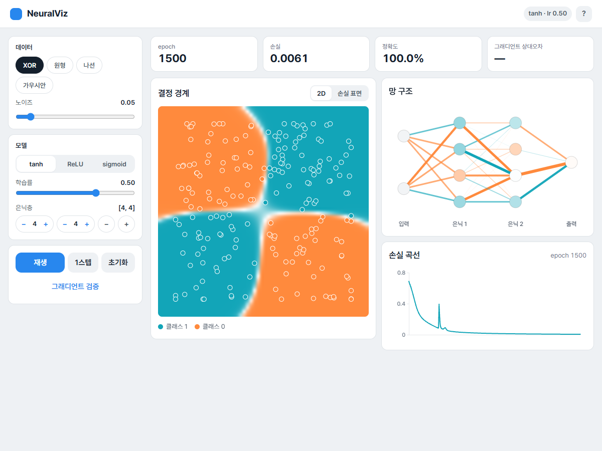
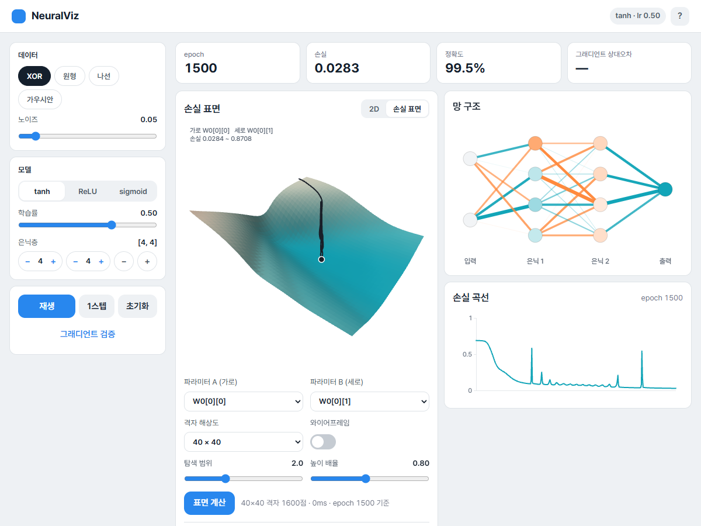
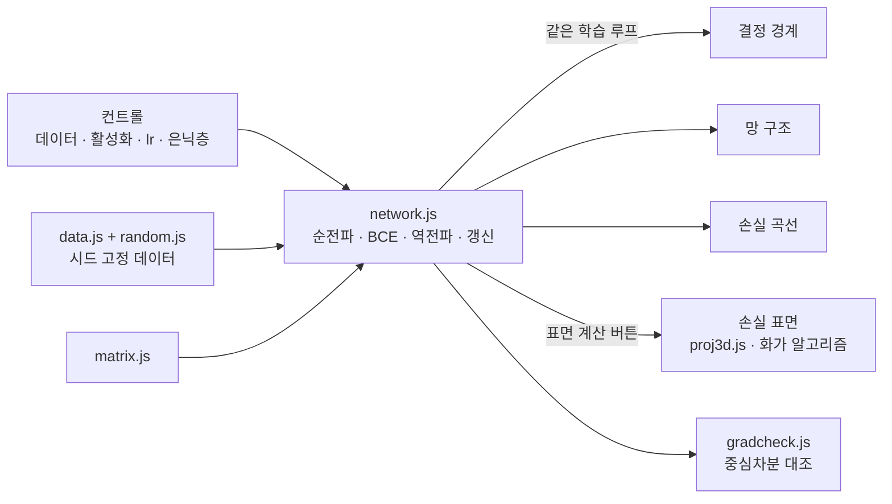

# NeuralVisualizer

<p align="center"></p>

> 외부 라이브러리 없이 행렬 연산부터 역전파, 3D 투영까지 직접 구현해 브라우저에서 다층 퍼셉트론이 학습하는 모습을 네 가지 화면으로 보여 주는 교육용 도구 「NeuralViz」

---

## 1. 프로젝트 개요 (Overview)

| 항목 | 내용 |
|---|---|
| 프로젝트명 | NeuralVisualizer (앱 이름 「NeuralViz」) |
| 한 줄 요약 | 데이터·활성화·학습률·은닉층을 바꾸면 결정 경계, 망 구조, 손실 곡선, 3D 손실 표면이 같은 학습 루프를 따라 실시간으로 바뀐다 |
| 진행 기간 | 2026.09.09 ~ 2026.09.11 (v1.0.0 → v1.0.6) |
| 참여 인원 | 개인 프로젝트 |
| 본인 역할 | 설계, 신경망 엔진·3D 렌더러·시각화·UI 구현, 검증 실험 |
| 기여도 | 100% (저장소 커밋 7건 전부 본인) |

신경망 수업에서 역전파는 수식으로 배운다. 그런데 수식만으로는 은닉층이 왜 필요한지, 학습률이 크면 왜 발산하는지, ReLU와 sigmoid가 왜 다르게 수렴하는지를 눈으로 보기 어렵다. 이 도구는 그 차이를 화면에서 직접 비교하게 한다.

외부 라이브러리를 하나도 쓰지 않은 것은 이 프로젝트의 본질이 "직접 구현"이기 때문이다. 텐서 라이브러리를 쓰면 역전파는 한 줄이 되고 무엇을 배웠는지가 사라진다.

## 2. 기술 스택 (Tech Stack)

| 구분 | 기술 | 선택 이유 |
|---|---|---|
| 언어 | Vanilla JavaScript (ES 모듈) · HTML · CSS | 빌드 도구 없이 `index.html` 하나로 연다. 툴체인이 "직접 구현"을 방해하지 않게 했다 |
| 수치 연산 | 직접 작성한 `number[][]` 행렬 연산 (float64) | 차원이 안 맞으면 형태를 찍어 throw한다. JS 기본 float64라 그래디언트 체킹 기준 1e-7을 쓸 수 있다 |
| 렌더링 | Canvas 2D | 3D도 WebGL 없이 회전·원근 투영·램버트 조명·화가 알고리즘을 직접 계산해 그린다 |
| 난수 | mulberry32 + Box–Muller | 시드가 같으면 같은 데이터·같은 초기 가중치가 나와 실험을 재현할 수 있다 |
| 배포 | GitHub Pages | 정적 파일뿐이다 |

## 3. 핵심 기능 및 담당 업무 (Key Features & Contributions)

<p align="center"></p>
<p align="center"></p>
<p align="center"><sub>로컬에서 XOR · [4,4] · tanh · lr 0.5로 1500 epoch 학습한 뒤 캡처. 위: 결정 경계, 아래: 두 가중치 방향의 손실 표면과 학습 경로</sub></p>

### 구현 기능

- **데이터 4종**: XOR(사분면), 원형, 나선, 가우시안 두 군집. 선형으로 나뉘는 것과 안 나뉘는 것을 대비시켜 은닉층의 필요성을 보여준다. 노이즈를 조절할 수 있다.
- **모델 설정**: 은닉 활성화 tanh / ReLU / sigmoid, 학습률, 은닉층 수와 층별 뉴런 수를 바꾼다. 출력은 sigmoid, 손실은 이진 교차 엔트로피로 고정했다. 초기화는 tanh·sigmoid에 Xavier, ReLU에 He를 쓴다.
- **결정 경계**: 격자 3,600점을 순전파 한 번으로 계산해 히트맵으로 칠한다. 데이터 점은 라벨 색으로 채우고 흰 테두리를 둘러 맞게 분류된 점은 배경에 묻히고 틀린 점만 도드라진다.
- **망 구조**: 선 두께는 가중치 크기, 색은 부호, 원 채움은 편향이다.
- **손실 곡선**: 폭보다 점이 많아지면 균등하게 솎아 그린다.
- **3D 손실 표면**: 두 파라미터를 골라 현재 값 주변을 40×40 격자로 훑고, 그 위에 학습 경로를 그린다. 드래그로 돌려 볼 수 있다.
- **그래디언트 검증 버튼**: 역전파의 기울기를 중심차분 수치 미분과 대조해 상대오차를 보여준다.

### 구현한 수식

```
순전파   z[l] = W[l]·a[l-1] + b[l],   a[l] = f(z[l])
손실     J = -(1/m) Σ [ y·log(a) + (1-y)·log(1-a) ]      a는 [1e-12, 1-1e-12]로 클리핑
역전파   δ[L] = a[L] - y
         δ[l] = (W[l+1]ᵀ·δ[l+1]) ⊙ f'(z[l])
         dW[l] = (1/m)·δ[l]·a[l-1]ᵀ,   db[l] = (1/m)·Σ δ[l]
3D       Ry(yaw) → Rx(−pitch) 합성, 원근 s = f / (z + d), 조명 I = 0.35 + 0.65·max(0, n·l)
```

출력층 델타가 `a - y`로 단순해지는 것은 BCE의 `∂J/∂a = (a-y) / (a(1-a))`와 시그모이드의 `σ'(z) = a(1-a)`가 연쇄법칙에서 곱해지며 분모가 상쇄되기 때문이다.

### 주요 업무

- 행렬 연산·MLP(순전파·BCE·역전파·갱신)·데이터 생성·시드 난수 구현
- 그래디언트 체킹과 ReLU 꺾임 판정(아래 트러블슈팅 ①②)
- 3D 투영·법선·램버트 조명·화가 알고리즘 렌더러
- 네 가지 시각화와 컨트롤, 학습 루프 연결, v1.0.6 UI 재구성
- 실험(은닉층과 XOR, 학습률, 활성화별 수렴, 나선의 용량 한계)과 README 정리

## 4. 성과 및 결과 (Results & Metrics)

### 정량적 성과

| 항목 | 결과 |
|---|---|
| 외부 라이브러리 | 0개 · 코드 약 2,800줄 |
| 엔진 테스트 (`tests/run.html`) | **5/5 통과** (2026.09 재실행). tanh 그래디언트 상대오차 9.622e-10, ReLU 2.788e-10, sigmoid 1.732e-10 |
| 그래디언트 체킹 스윕 | 데이터 4 × 활성화 3 × 층구성 7 = 84조합을 3회 반복(252건) + 학습 뒤 4건, 실패 0건, 최대 상대오차 1.2e-8 (README 기록. 스윕 스크립트는 저장소에 없음) |
| 3D 검증 | 회전 후 길이 보존 오차 8.88e-16, `R(θ)R(-θ) = I` 오차 2.22e-16. yaw 36종 × 31,408픽셀에서 화가 알고리즘의 깊이 역전 0건 |
| XOR 학습 | [2,4,4,1] tanh, 2000 epoch 후 손실 0.0043 · 정확도 100% (265ms) |
| 실제 수업·사용자 활용 | (확인 필요) |

**활성화별 수렴** (XOR 200개, [2,4,4,1], lr 0.5, 2000 epoch, 시드 1~8 중앙값)

| 활성화 | 손실 < 0.1 도달 | 도달 epoch | 최종 손실 | 정확도 |
|---|---|---|---|---|
| tanh | 8/8회 | 226 | 0.0043 | 100% |
| ReLU | 7/8회 | **162** | 0.0105 | 100% |
| sigmoid | **0/8회** | — | 0.3040 | 87.0% |

ReLU가 가장 빠르지만 8번 중 1번은 죽은 유닛 때문에 기준에 닿지 못했다. sigmoid는 도함수 최댓값이 0.25라 은닉층 두 개를 지나면 기울기가 16분의 1 이하로 줄어 한 번도 기준에 닿지 못했다.

### 정성적 성과

- **2D와 3D가 같은 사실을 다른 말로 보여준다.** 은닉층을 모두 빼고 XOR을 학습시키면 손실이 0.6849(ln 2 ≈ 0.6931 부근)에서 멈추고 정확도는 49.5%다. 결정 경계에서는 직선 하나가 점들 사이를 헤매는 모습으로, 손실 표면에서는 최저점이 0.6852로 현재 손실과 사실상 같은 평평한 접시로 보인다. 표면을 함께 보면 "더 돌려도 소용없다"는 것이 분명해진다.
- **나선에서 어디가 먼저 풀리는지 쟀다.** `[6,6]` tanh로 5,370 epoch에 94.5%에 닿는데, 반지름 구간별로 보면 바깥쪽이 500 epoch에 이미 81%로 가장 먼저 정리되고 중간 띠가 2000 epoch까지 20%대로 가장 늦다. 두 갈래 사이 간격은 일정하지만 안쪽일수록 곡률이 커서 은닉 유닛 몇 개로 만들 수 있는 굴곡이 모자라기 때문이다. 20%대는 못 맞히는 게 아니라 반대로 맞히고 있다는 뜻이다.
- **"보인다"가 아니라 "쟀다"로 검증했다.** 리팩터링 전후 출력을 바이트 단위로 비교했고 뉴런 원의 겹침은 캔버스 알파 채널을 스캔해 픽셀로 쟀다(`[2,8,8,1]`이 280px 안에서 지름 26px, 최소 간격 3px).

### 확인된 한계

- **손실 표면은 2차원 단면이다.** 고른 두 파라미터만 움직이고 나머지는 현재 값에 고정한다. 실제 학습에서는 나머지도 함께 움직이므로 표면 위의 경로는 근사다.
- **학습이 충분히 진행된 뒤에는 그래디언트 검증이 기준을 넘을 수 있다.** 보고서를 쓰며 XOR · [4,4] · tanh로 1500 epoch를 학습시킨 뒤 검증 버튼을 누르자 상대오차가 2.8e-7로 기준(1e-7)을 넘어 "실패"로 표시됐다. 손실이 0.005 수준으로 떨어지면 기울기 자체가 작아져 부동소수점 반올림이 상대오차에서 차지하는 비중이 커지는 것으로 보인다(추정, 확인 필요). 기준을 절대오차와 함께 보거나 ε을 기울기 크기에 맞춰 보완해야 한다.
- **252건 스윕은 재현 경로가 없다.** 저장소에 남은 테스트는 5건이다. 스윕 스크립트를 함께 커밋해야 README의 수치를 다른 사람이 확인할 수 있다.
- **화가 알고리즘은 높이장 전제에 기댄다.** 오버행이 있는 형상으로 넓히면 z-버퍼나 셀 분할이 필요하다.

## 5. 트러블슈팅 경험 (Troubleshooting)

### ① ReLU만 그래디언트 체킹에 실패했다

**문제** tanh와 sigmoid는 상대오차 1e-10대로 통과하는데 ReLU만 2e-2로 실패했다.

**원인** 역전파가 아니라 수치 미분 쪽 문제였다. ReLU는 `z = 0`에서 미분할 수 없다. 편향을 0으로 초기화하면 앞 층 출력이 전부 0인 죽은 유닛의 z가 정확히 0이 된다. 그 점에서 중심차분은 꺾임을 가로질러 좌미분 0과 우미분 1을 평균내므로, 수치 기울기 자체가 틀린 값이 된다. 대조 실험으로 확정했다. 시드 30개를 훑자 `min|z| = 0`인 17건은 전부 실패했고 `min|z| > 0`인 13건은 전부 통과했다. 예외는 없었다.

**해결** 검사하기 전에 "이 지점이 꺾임에서 충분히 먼가"를 판정하게 했다. 꺾임에 걸린 지점이면 꺾임 없는 시드로 옮겨 다시 재고 그 사실을 화면과 로그에 적는다.

**결과** 꺾임에서 떨어진 지점만 골라 재면 상대오차가 1e-8~1e-10대로 떨어진다. 테스트 로그에도 "시드 3 지점은 꺾임에 걸림 → 꺾임 없는 시드 1로 재검사 → 2.788e-10 통과"가 그대로 남는다.

### ② 꺾임 판정이 너무 낙관적이었다

**문제** 판정을 넣은 뒤에도 252건 중 2건이 최대 상대오차 5.17e-4로 실패했다.

**원인** 처음 판정은 "파라미터를 ε 흔들면 다음 층의 z는 최대 `ε·max|a|`만큼 움직인다"만 보았다. 그런데 앞 층에서 생긴 흔들림은 뒤 층으로 갈수록 가중치만큼 증폭된다.

**해결** 흔들림의 상한을 층마다 누적하도록 바꿨다.

```
R[l] = ‖W[l]‖∞ · R[l-1] + ε · max(|a[l-1]|, 1)
```

tanh·sigmoid·ReLU 모두 도함수의 절댓값이 1 이하라는 성질을 쓴 립시츠 상한이다. 각 층에서 `min|z| > R[l]`이면 어떤 파라미터를 흔들어도 꺾임을 넘지 않는다.

**결과** 남아 있던 실패 2건이 사라졌다. "실패하면 시드를 다시 뽑아 통과할 때까지 돌리는" 방식은 일부러 쓰지 않았다. 그 방식은 진짜 역전파 버그가 있어도 우연히 통과하는 지점을 찾아내 검증을 무력화한다. 측정이 유효한 지점인지를 먼저 판정하고 결과와 분리해 두면, 통과는 믿을 수 있고 꺾임에 걸렸다는 사실도 숨겨지지 않는다.

### ③ z-버퍼 없이 3D 표면이 제대로 가려지는가

**문제** 손실 표면을 Canvas 2D로 그리려면 가려지는 면을 처리해야 한다. z-버퍼를 픽셀 단위로 구현하면 느리고 코드가 커진다.

**원인** 일반적인 형상에서는 셀 A가 B를 가리면서 동시에 B가 A를 가리는 순환 겹침이 생길 수 있어 셀 단위로 정렬만 해서는 안전하지 않다.

**해결** 이 표면은 격자 위의 높이장을 위에서 내려다보는 형상이라 순환 겹침이 생길 수 없다는 점을 이용했다. 셀 네 꼭짓점의 평균 깊이로 내림차순 정렬해 먼 셀부터 칠한다(화가 알고리즘). 그 전제가 맞는지는 실측으로 확인했다. yaw 36종에서 31,408픽셀마다 화가 알고리즘의 결과와 무게중심 보간으로 구한 실제 최근접 셀을 비교했다.

**결과** 깊이 역전 0건. 셀 하나당 대푯값 하나로 전순서를 만들 수 있다는 전제가 이 형상에서는 성립한다.

## 6. 링크 및 산출물 (Links & Deliverables)

| 구분 | 링크 |
|---|---|
| GitHub 저장소 | [stx4R/NeuralVisualizer](https://github.com/stx4R/NeuralVisualizer) (비공개) |
| 배포 URL | https://stx4r.github.io/NeuralVisualizer/ |
| 엔진 테스트 | 저장소 `tests/run.html` (정적 서버로 열고 콘솔 확인) |

### 구조



| 파일 | 역할 |
|---|---|
| `src/matrix.js` | 행렬 연산. 차원이 안 맞으면 형태를 찍어 throw |
| `src/network.js` | MLP 본체 |
| `src/gradcheck.js` | 수치 미분과 해석적 기울기의 상대오차 비교 |
| `src/proj3d.js` | 3D 회전·원근 투영·법선·램버트 음영 (순수 함수) |
| `src/viz-*.js` | 결정 경계 · 망 구조 · 손실 곡선 · 손실 표면 |
| `src/main.js` | 컨트롤·학습 루프·뷰 전환 |

---

+++

## 고객여정지도 (Journey Map)

사용자는 신경망을 처음 배우는 학생이다.

| 단계 | 사용자의 행동 | 사용자의 생각 | 도구의 대응 |
|---|---|---|---|
| 시작 | XOR을 고르고 재생을 누른다 | "뭐가 움직이는 거지?" | 결정 경계 색이 번지고 손실 곡선이 내려간다 |
| 실험 1 | 은닉층을 모두 뺀다 | "왜 안 되지?" | 손실이 0.69에서 멈추고 표면은 평평한 접시다 |
| 실험 2 | 학습률을 3.0으로 올린다 | "더 빨라지겠지?" | 손실 곡선이 0.3~0.8 사이에서 톱니처럼 튄다 |
| 실험 3 | sigmoid로 바꾼다 | "활성화가 뭐가 다르지?" | 같은 설정에서 손실이 한참 느리게 내려간다 |
| 확인 | 그래디언트 검증을 누른다 | "이 계산 맞는 거야?" | 해석적 기울기와 수치 기울기의 상대오차가 뜬다 |

## 모션 디자인 (Motion Design)

- 학습 중에는 매 프레임 네 화면이 같은 학습 루프를 따라 함께 움직인다. 결정 경계는 흰색(출력 0.5)에서 시작해 두 색으로 갈라진다. 학습 전 배경이 흰색인 것은 Xavier 초기화로 가중치가 작아 출력이 전 구간에서 0.5에 붙기 때문이다.
- 손실 표면은 드래그로 돌린다(pitch 5°~85°). 계산은 "표면 계산" 버튼을 눌렀을 때만 해서 학습 루프를 느리게 하지 않는다.

## 제스처링 (Gesturing)

- 손실 표면을 마우스나 손가락으로 끌어 수직축(yaw)과 기울기(pitch)를 바꾼다. 위에서 내려다보는 각도를 5°~85°로 제한해 표면이 뒤집혀 보이지 않게 했다.

## 적응형 디자인 (Adaptive Design)

- v1.0.6에서 상단 막대에 몰려 있던 컨트롤을 왼쪽 카드(데이터 · 모델 · 재생)로 옮기고 오른쪽에 지표 카드(epoch · 손실 · 정확도 · 그래디언트 상대오차)와 네 시각화를 배치했다.
