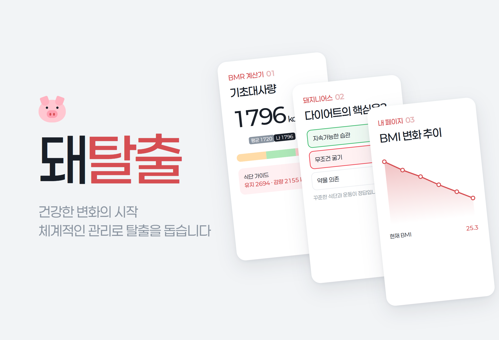
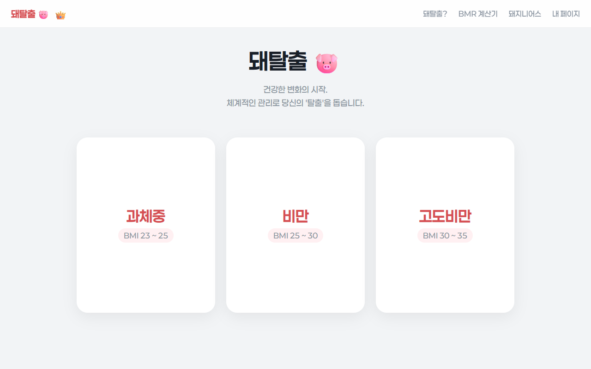
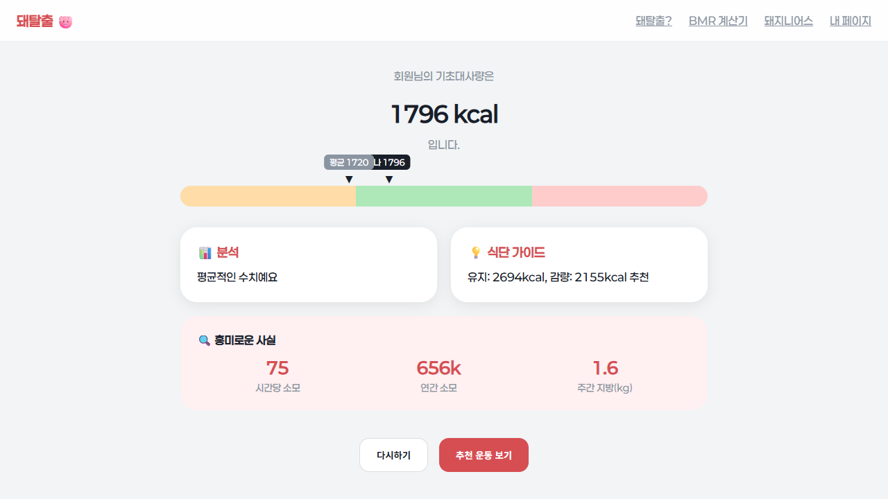
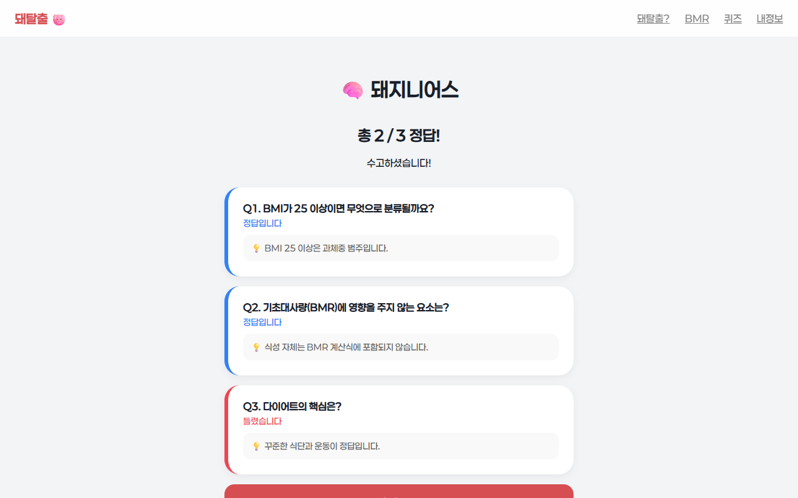
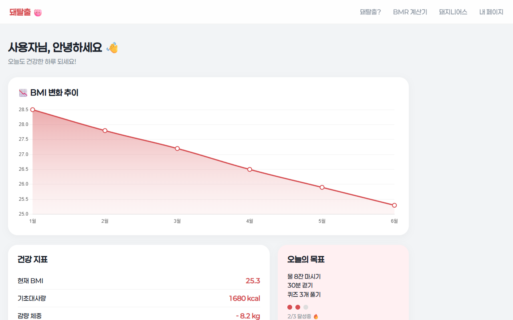

# PigScape.

> 기초대사량 계산, 다이어트 상식 퀴즈, 개인 기록 화면을 묶은 다이어트 도우미 웹 "돼탈출"을 팀 프로젝트로 기획하고 기술 파트에서 세 번에 걸쳐 다시 만든 프로젝트

---

## 1. 프로젝트 개요 (Overview)

| 항목 | 내용 |
|---|---|
| 프로젝트명 | PigScape. (돼탈출 🐷) |
| 한 줄 요약 | 비만과 스트레스를 함께 다루는 다이어트 서비스를 기획하고 BMR 계산기·퀴즈·마이 페이지·멤버십 소개로 이루어진 6페이지 웹 프로토타입을 만들었다 |
| 진행 기간 | 2025.08 ~ 2025.12 (파일 기준. Flask 1차 2025.08–09 → Flask 리워크 2025.09 → 정적 웹 ReReWork 2025.12) |
| 참여 인원 | 6명 (Team 뒷동네: 기술부 3 · 운영부 3) + 멘토 1명 |
| 본인 역할 | 기술부 "기술 & 제작". 페이지별 요구사항 명세 작성, 웹 구현, 세 차례 재구성 |
| 기여도 | (확인 필요) |
| 진행 맥락 | 1학년 2학기 TMD 활동 (확인 필요) |

팀은 다이어트를 "꾸준하게(Continuous), 체계적으로(Systematic)" 돕는 서비스를 내세웠다. 기술부는 그 서비스를 눈으로 보여 줄 웹 프로토타입을 맡았다. 나는 페이지마다 레이아웃, 문구, 색, 애니메이션, 예외 동작까지 적은 명세를 쓰고 이를 바탕으로 페이지를 제작했다. 명세는 "모든 구성요소가 한 화면 안에 꽉 차게 들어간다"는 원칙을 기준으로 썼다.

저장소는 없다. 이 보고서는 로컬에 남은 세 버전의 소스와 기획 메모를 근거로 썼다.

## 2. 기술 스택 (Tech Stack)

| 구분 | 기술 | 선택 이유 |
|---|---|---|
| 1·2차 (Flask) | Python Flask 3.0.2, Jinja 템플릿, gunicorn 21.2.0 + Procfile | 페이지를 라우트로 나눠 두고 서버 배포까지 염두에 뒀다 |
| 3차 (ReReWork) | HTML · CSS · Vanilla JavaScript (페이지 6개, 약 1,480줄) | 서버가 하는 일이 없어서 정적 파일로 옮겼다 (§5-③) |
| 차트 | Chart.js (CDN) | 마이 페이지의 BMI 변화 추이 선 그래프 |
| 디자인 | Paperlogy 폰트 self-host, 파스텔 버건디(#D64E52)·핑크 + 토스 스타일 회색 배경 | 기획 단계에서 "연한 파스텔톤 붉은색 계열 네 가지"로 색을 정했다 |

## 3. 핵심 기능 및 담당 업무 (Key Features & Contributions)

로컬에서 캡처(3차 ReReWork). BMI 구간별 카드 세 장은 마우스를 올리거나 누르면 뒤집혀 구간별 운동 팁을 보여 준다

| 페이지 | 기능 |
|---|---|
| 홈 | 로고 인터랙션, BMI 구간(과체중 23–25 · 비만 25–30 · 고도비만 30–35)별 팁 카드, 👑을 누르면 프리미엄 안내 모달 |
| 돼탈출? | 스크롤 스냅으로 한 화면씩 넘기는 소개 페이지: 문제 제기 → 가치(Continuous · Systematic) → 주요 기능 → 팀·멘토 → 저작권 |
| BMR 계산기 | 성별·나이·키·체중 입력 팝업 → 기초대사량 산출 → 성별 구간 막대 위에 "나"와 "연령대 평균" 화살표 → 분석 · 식단 가이드 · 흥미로운 사실 → 추천 운동 영상 |
| 돼지니어스 | 다이어트 상식 3지선다 퀴즈. 누르면 정답·오답을 색으로 보여 주고 끝에 문항별 해설과 점수 |
| 내 페이지 | 로그인 후 대시보드: BMI 변화 추이 그래프, 건강 지표, 오늘의 목표 진행도, 달성 배지 |
| 프리미엄 | 구독 요금제 3종과 구독료 일부를 상금으로 돌리는 챌린지 구상 |

BMR 계산 결과 (예시 입력: 남성 · 17세 · 175 cm · 72 kg). 막대의 세 구간과 두 화살표로 연령대 평균과의 차이를 보여 준다

### BMR 계산 방식

- 공식은 개정 Harris-Benedict 식이다. 남성 `88.362 + 13.397W + 4.799H − 5.677A`, 여성 `447.593 + 9.247W + 3.098H − 4.330A`.
- 연령대 평균은 성별 × 5세 구간 표(예: 남성 25세 미만 1,720 kcal)에서 가져오고 평균 ±100 kcal 안이면 "평균적인 수치"로 판정한다.
- 식단 가이드는 BMR × 1.5를 유지, BMR × 1.2를 감량 섭취량으로 제시한다. 흥미로운 사실은 BMR을 시간당·연간 소모량과 주간 지방 환산량(7,700 kcal = 1 kg)으로 바꿔 보여 준다.

### 주요 업무

- 페이지 6개의 요구사항 명세 작성 (레이아웃, 문구, 색, 전환 애니메이션, 예외 동작)
- Flask 1차 구현: 홈·소개·BMR 계산기 (퀴즈·마이 페이지는 "개발 중" 안내)
- Flask 리워크: 6페이지 완성, 배포용 `Procfile`·`requirements.txt` 구성
- 정적 웹 ReReWork: 디자인 정리, 판정 로직 수정, 서버 없이 열리는 구조로 전환

## 4. 성과 및 결과 (Results & Metrics)

### 정량적 성과

| 항목 | 결과 |
|---|---|
| 페이지 | 6개 (홈 · 소개 · BMR 계산기 · 퀴즈 · 내 페이지 · 프리미엄) |
| 버전 | 3회 재구성 (Flask 1차 5페이지 중 3개 구현 → 리워크 6/6 → 정적 ReReWork 6/6) |
| 퀴즈 | 3문항, 문항별 해설 |
| 발표·평가 결과 | (확인 필요) |
| 실사용자 수 · 배포 주소 | (확인 필요) |

### 정성적 성과

- **기획을 명세로 옮기는 연습을 했다.** "왼쪽 절반에 로고, 오른쪽에 주제·부주제 두 쌍, 주제는 굵게 부주제는 얇게"처럼 화면마다 배치와 위계를 글로 먼저 정의한 뒤 만들었다.
- **같은 서비스를 세 번 다시 만들었다.** 버전이 바뀔 때마다 페이지 전환 방식, 판정 로직, 파일 구조 가운데 하나씩 문제를 찾아 고쳤다(§5).

### 확인된 한계

- **내 페이지는 목업이다.** 로그인은 코드에 박힌 계정 하나와 비교하고 그래프·지표·배지는 모두 고정값이다. 입력한 BMR이 저장되거나 기록으로 이어지지 않는다.
- **연령대 평균 BMR 표의 출처를 코드에 남기지 않았다.** (확인 필요)
- **BMI 구간 표현이 페이지마다 다르다.** 홈 카드는 23–25를 과체중, 25–30을 비만으로 나누는데 퀴즈 해설은 "25 이상은 과체중"이라고 쓴다.
- **추천 운동 영상은 항상 첫 번째 파일만 연다.** 원본이 iPhone `.MOV`라 브라우저에 따라 재생되지 않을 수 있다. (확인 필요)
- **프리미엄 요금제는 구상 단계다.** 결제 버튼은 동작하지 않는다.
- 우클릭·복사·개발자 도구를 막는 스크립트를 넣었지만 브라우저 쪽 장치라 실제 보호는 되지 않는다.

## 5. 트러블슈팅 경험 (Troubleshooting)

### ① 소개 페이지가 마우스 휠로만 넘어갔다

**문제** 1차 소개 페이지는 한 화면씩 넘어가는 구조였다. 휠을 굴리면 다음 섹션으로 이동하고 팀 소개 페이지에 닿으면 2초 뒤 다음 페이지로 자동으로 넘어갔다.

**원인** `wheel` 이벤트를 받아 컨테이너를 `translateY(-N×100vh)`로 옮기고 0.8초 잠금을 거는 방식이었다. 휠 이벤트만 받았기 때문에 터치 스크롤이나 키보드로는 페이지를 넘길 수 없었다. 트랙패드처럼 이벤트가 연달아 들어오는 입력은 잠금 시간에 따라 넘어가는 칸 수가 달라졌다.

**해결** 리워크부터 CSS `scroll-snap-type: y mandatory`로 바꿨다. 섹션마다 `scroll-snap-align: start`를 지정하고 스크롤 자체는 브라우저에 맡겼다. 3차에서는 팀·멘토 제목만 있던 중간 화면을 없애고 팀 소개를 바로 보여 주도록 섹션을 여섯 개에서 다섯 개로 줄였다.

**결과** 휠·트랙패드·터치·키보드 모두 같은 방식으로 한 화면씩 넘어간다. 전환 스크립트가 사라져 소개 페이지에 남은 JS는 내비게이션 효과와 보안 스크립트뿐이다.

### ② "평균보다 낮습니다"가 평균과 비교한 결과가 아니었다

**문제** 1·2차 BMR 계산기는 결과 아래에 "평균보다 낮습니다 / 평균입니다 / 평균보다 높습니다"를 띄웠다. 그런데 나이를 바꿔도 같은 BMR이면 판정이 똑같았다.

**원인** 판정이 연령대 평균이 아니라 성별로 고정한 구간(남성 1,600 · 1,900 kcal, 여성 1,300 · 1,700 kcal)으로 이뤄지고 있었다. 성별·연령대 평균 표는 화살표 위치를 그리는 데만 쓰였다.

**해결** 3차에서 판정 기준을 사용자의 성별·연령대 평균으로 바꿨다. 평균 ±100 kcal 안이면 "평균적인 수치예요", 그보다 낮거나 높으면 그대로 알려 준다. 막대에는 "나"와 "평균" 화살표를 나란히 올렸다.

**결과** 문구와 화살표가 같은 기준을 가리킨다. 17세 남성 72 kg · 175 cm는 1,796 kcal로, 평균 1,720 kcal의 +100 안이라 "평균적인 수치"로 판정된다.

### ③ 서버가 하는 일이 없었다

**문제** Flask 리워크는 배포용 `Procfile`까지 갖췄지만 페이지를 열려면 항상 Python 서버를 띄워야 했다.

**원인** 라우트 6개가 모두 `render_template`만 반환했다. 계산·퀴즈·로그인은 전부 브라우저 JS에서 돌고 있었다. 반면 링크(`/info`, `/bmr`)와 리소스 경로(`/static/...`)는 서버 루트를 기준으로 적혀 있었다.

**해결** 3차에서 템플릿을 정적 HTML로 옮기고 링크는 `info_pigscape.html`처럼 파일 이름으로, 리소스는 `static/...` 상대 경로로 바꿨다.

**결과** 서버 없이 폴더째로 열거나 정적 호스팅에 그대로 올릴 수 있게 됐다.

## 6. 링크 및 산출물 (Links & Deliverables)

| 구분 | 링크 |
|---|---|
| GitHub 저장소 | 없음 |
| 배포 URL | (확인 필요) |
| 산출물 | 정적 웹 6페이지(ReReWork), Flask 버전 2종, 로고·운동 영상 8개, 페이지별 기획 명세 |

 

왼쪽: 돼지니어스 결과(문항별 정답·해설). 오른쪽: 내 페이지 대시보드(고정 목업 데이터, 캡처 시 이름은 "사용자"로 바꿈)

---

+++

## 고객여정지도 (Journey Map)

사용자는 체중 관리를 시작하려는 사람이다.

| 단계 | 사용자의 행동 | 사용자의 생각 | 서비스의 대응 |
|---|---|---|---|
| 도착 | 홈을 연다 | "내 BMI면 뭘 해야 하지?" | 구간별 카드 세 장을 뒤집으면 걷기·근력·관절 보호처럼 구간에 맞는 첫 행동이 나온다 |
| 이해 | 돼탈출? 페이지를 스크롤한다 | "이건 어떤 서비스야?" | 문제 → 가치 → 기능 → 만든 사람 순서로 한 화면씩 보여 준다 |
| 측정 | BMR 계산기에 입력한다 | "나는 평균보다 많이 태우나?" | 내 값과 연령대 평균을 한 막대 위에 놓고 섭취 가이드를 준다 |
| 학습 | 돼지니어스를 푼다 | "굶으면 되는 거 아니야?" | 오답이면 정답을 함께 칠하고 해설로 바로잡는다 |
| 지속 | 내 페이지를 연다 | "잘하고 있나?" | 추이 그래프와 오늘의 목표, 배지로 진행 상황을 보여 준다 (목업) |

## 제스처링 (Gesturing)

- 팁 카드는 마우스를 올리면 뒤집히고 터치 기기에서는 누르면, 키보드에서는 Enter·Space로 뒤집힌다(`tabindex="0"`).
- 로고의 🐷와 제목 글자는 누르면 튀어 오르고 👑은 누르면 프리미엄 모달을 연다.
- 내비게이션 항목에 마우스를 올리면 나머지 항목이 흐려지고 올린 항목 아래에 한 줄 설명이 나타난다.

## 모션 디자인 (Motion Design)

- 카드는 `fadeUp`으로 0.1초 간격을 두고 차례로 올라온다. 뒤집을 때는 `rotateY(180deg)` 전환을 쓴다.
- 퀴즈는 선택 후 1.2초 동안 정답·오답 색을 보여 주고 다음 문항으로 넘어간다.
- 로그인에 실패하면 카드가 좌우로 흔들린다.

## DREAD 취약성 관리 (DREAD Risk Assessment)

| 위협 | D | R | E | A | D | 점수 | 대응 |
|---|---|---|---|---|---|---|---|
| 로그인 계정이 클라이언트 코드에 평문으로 있음 | 1 | 3 | 3 | 1 | 3 | 2.2 | 지금은 목업 대시보드뿐이라 피해가 작다. 실제 기록을 붙이려면 서버 인증과 해시 저장이 먼저다 |
| 개발자 도구 차단을 보호 장치로 오인 | 1 | 3 | 3 | 1 | 2 | 2.0 | 코드 열람을 막을 수 없다는 전제로 민감한 값은 클라이언트에 두지 않는다 |

D·R·E·A·D = 피해·재현성·악용 난이도·영향 범위·발견 가능성 (1~3). 점수는 평균.
