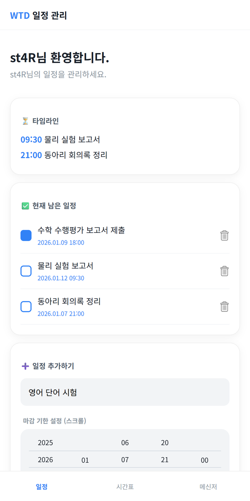
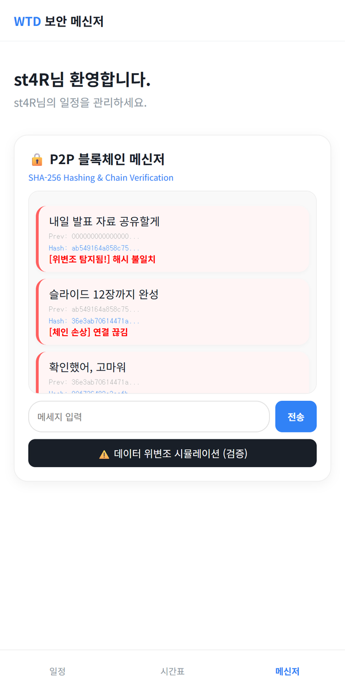

# Plan-ME

> 학교 이메일로 들어가 마감 기한이 있는 할 일을 관리하고 해시 체인으로 메시지 위변조 개념을 체험하는 학생용 일정 앱 「WTD」

---

## 1. 프로젝트 개요 (Overview)

| 항목 | 내용 |
|---|---|
| 프로젝트명 | Plan-ME (앱 이름 「WTD」 — What To Do → All in One School Manager) |
| 한 줄 요약 | 서버 없이 브라우저 저장소만으로 사용자별 할 일·마감 기한·메모를 관리하고 SHA-256 해시 체인 메신저로 블록체인의 위변조 탐지 원리를 보여주는 단일 페이지 앱 |
| 진행 기간 | 2025.12.19 (1차 버전, 하루 10커밋) · 2026.01.05 (탭 3개로 확장) · 2026.01.13, 2026.03.03 (주석 정리) |
| 참여 인원 | 개인 프로젝트 |
| 본인 역할 | 기획, 화면 설계, 전체 구현 |
| 기여도 | 100% (저장소 커밋 13건 전부 본인) |

처음에는 이름 그대로 "무엇을 해야 하는가"만 답하는 할 일 목록이었다. 학교 이메일로 들어가 내 일정만 보고 마감이 언제인지 한눈에 보이는 것이 목표였다. 겨울방학 중 시간표·메모·메신저 탭을 붙이며 "학교생활 올인원"으로 범위를 넓혔고 메신저에는 블록체인의 해시 체인 구조를 직접 구현해 넣었다.

## 2. 기술 스택 (Tech Stack)

| 구분 | 기술 | 선택 이유 |
|---|---|---|
| 화면 | HTML · CSS · Vanilla JavaScript (단일 `index.html`, 463줄) | 파일 하나로 열어 바로 쓸 수 있는 구조를 원했다. 프레임워크 없이 화면 전환은 `section`과 탭의 `active` 클래스로 처리한다 |
| 저장 | `localStorage` (사용자 이메일별 키) | 서버와 DB 없이 새로고침·재접속 후에도 데이터가 남는다. 이메일을 키에 넣어 한 기기에서 여러 계정을 구분한다 |
| 해시 | Web Crypto API `crypto.subtle.digest('SHA-256')` | 브라우저 표준 API라 라이브러리가 필요 없다. 해시 체인 메신저의 블록 해시를 만든다 |
| 입력 UI | CSS `scroll-snap` 기반 자체 스크롤 피커 | 연·월·일·시·분을 휠처럼 굴려 고른다. 모바일 브라우저마다 모양이 다른 기본 날짜 입력 대신 앱 톤에 맞는 입력기를 직접 만들었다 |
| 폰트 | Noto Sans KR (Google Fonts) | 한글 가독성 |
| 배포 | 없음 (확인 필요) | 저장소에 Pages 설정이 없다 |

## 3. 핵심 기능 및 담당 업무 (Key Features & Contributions)

<p align="center">
  
  
</p>
<p align="center"><sub>로컬에서 실행해 캡처. 로고 이미지는 저장소에 포함되지 않아 가렸다.</sub></p>

### 구현 기능

- **단계형 첫 화면**: 첫 탭에 안내 문구가 바뀌고 두 번째 탭에 로그인 버튼이 나타난다.
- **학교 계정 진입**: `@dshs.kr`로 끝나는 이메일만 받는다. 처음 들어온 계정은 이름(닉네임)을 한 번 묻고 다음부터는 저장된 이름으로 바로 대시보드를 연다.
- **할 일 + 마감 기한**: 할 일을 입력하기 시작하면 스크롤 피커가 펼쳐진다. 연(2025~2030)·월·일·시·분 다섯 열을 굴려 마감을 정하고 완료 체크와 삭제를 지원한다.
- **타임라인**: 아직 끝내지 않은 일만 마감 시각과 함께 따로 모아 보여준다.
- **시간표 탭**: 방학 기간 안내 카드와 방학 계획 메모장. 정규 시간표는 개학 후 NEIS API로 연동할 계획으로 자리만 잡아 두었다.
- **메모장**: 주제별 메모를 저장한다.
- **해시 체인 메신저**: 메시지마다 `이전 블록 해시 + 본문 + 시각`을 SHA-256으로 해시해 블록을 만들고 체인에 잇는다. 말풍선마다 이전 해시와 현재 해시 앞부분을 보여준다.
- **위변조 시뮬레이션**: 버튼을 누르면 첫 블록 내용을 바꾼 뒤, 그 블록은 "해시 불일치", 뒤 블록들은 "체인 손상"으로 표시해 한 블록의 변조가 뒤 전체로 번지는 구조를 보여준다.

### 주요 업무

- 화면 흐름 설계 (첫 화면 → 로그인 → 이름 등록 → 대시보드 3탭)
- 사용자별 데이터 저장 구조 설계 (`wtd_name_{email}`, `wtd_todos_{email}`, `wtd_memo_{주제}`)
- 스크롤 피커 구현 (열 생성, 현재 시각으로 초기 위치 맞춤, 스크롤 위치 → 값 변환)
- SHA-256 해시 체인 구현과 위변조 시각화
- 2026.01.05 확장 개편 (256줄 추가·55줄 삭제)

## 4. 성과 및 결과 (Results & Metrics)

### 정량적 성과

| 항목 | 결과 |
|---|---|
| 1차 버전 완성 | 하루(2025.12.19), 커밋 10건 |
| 최종 규모 | `index.html` 463줄, 외부 JS 라이브러리 0개 |
| 기능 | 탭 3개 (일정 · 시간표 · 메신저), 저장 키 3종 |
| 해시 | 블록마다 SHA-256 (256비트) 해시, 이전 해시로 연결 |
| 실사용자 | (확인 필요) |

### 정성적 성과

- 서버 없이도 사용자별로 분리된 데이터가 새로고침 후에도 남는 구조를 만들었다.
- 블록체인을 "각 블록이 앞 블록의 해시를 품는다"는 한 가지 성질로 좁혀 직접 구현했다. 앞 블록 하나가 바뀌면 뒤가 전부 어긋난다는 점을 화면으로 보여줄 수 있다.
- 브라우저 기본 입력기를 쓰지 않고 스크롤 피커를 직접 만들면서 스크롤 위치와 값 사이의 변환을 스스로 설계했다.

### 확인된 한계 (2026.09 코드 기준)

- **로그인은 인증이 아니다.** 이메일이 `@dshs.kr`로 끝나는지와 비밀번호 칸이 비었는지만 본다. 비밀번호는 검증하지도 저장하지도 않는다.
- **"공유"와 "P2P"는 아직 이름뿐이다.** 메모장에는 "P2P 동기화됨"이라고 적혀 있지만 모든 데이터가 그 기기의 `localStorage`에만 있다. 다른 사람과 공유되지 않는다.
- **위변조 검증은 해시를 다시 계산하지 않는다.** 버튼을 누르면 첫 블록과 그 뒤 블록을 무조건 손상으로 표시한다. 2026.03.03에 지워진 초기 주석에도 원래는 이전 해시·본문·시각으로 해시를 다시 구해 비교해야 하지만 시뮬레이션이라 강제로 탐지 상태로 만든다고 밝혀 두었다. 메신저 체인은 메모리에만 있어 새로고침하면 사라진다.
- **NEIS 시간표는 연동되지 않았다.** 안내 문구만 있다.
- **피커의 날짜 범위가 월과 무관하다.** 2월에도 31일까지 고를 수 있다.
- **타임라인에 날짜가 없다.** 시각만 보여주고 마감 순으로 정렬하지 않아서 날짜가 다른 일이 같은 날 일정처럼 보인다(위 스크린샷의 09:30은 1월 12일, 21:00은 1월 7일이다).

## 5. 트러블슈팅 경험 (Troubleshooting)

### ① 새로고침하면 할 일과 이름이 전부 사라진다

**문제** 1차 버전은 할 일을 추가해도 페이지를 새로 고치면 목록이 비었다. 이름도 로그인할 때마다 다시 물었다.

**원인** 할 일 배열과 이름을 자바스크립트 변수에만 들고 있었다. 페이지가 다시 로드되면 변수는 초기화된다.

**해결** `localStorage`에 저장하고 키에 로그인한 이메일을 넣어 사용자별로 나눴다(`todos_{email}`, `name_{email}`). 로그인할 때 그 이메일의 이름이 이미 있으면 이름 입력 창을 건너뛴다.

**결과** 같은 기기에서 다시 들어와도 일정이 남고 한 기기를 여러 사람이 써도 서로의 목록이 섞이지 않는다.

### ② 스크롤 위치를 날짜 값으로 바꾸기

**문제** 마감 기한을 휠처럼 굴려 고르게 하려니, 사용자가 멈춘 위치에서 "지금 가운데 있는 값"을 읽어 와야 했다. 열이 처음 그려질 때 현재 시각에 맞춰 두는 것도 필요했다.

**원인** 선택 칸이 열의 가운데에 오도록 각 열의 위아래에 빈 칸을 하나씩 넣었다. 그래서 스크롤 위치로 구한 순번과 실제 자식 요소의 순번이 한 칸씩 어긋난다. 초기 위치도 열이 화면에 배치된 뒤에 지정해야 한다.

**해결** 칸 높이를 CSS와 스크립트에서 같은 값(34px)으로 맞추고 값은 `Math.round(scrollTop / 34) + 1`번째 자식에서 읽는다. `+1`이 위쪽 빈 칸을 건너뛴다. 초기 위치는 열을 붙이고 100ms 뒤에 `(현재값 - 시작값) × 34`로 지정하고 `scroll-snap`으로 칸 가운데에 딱 멈추게 했다. 끝까지 굴렸을 때 계산된 순번이 범위를 벗어나도 오류가 나지 않도록, 해당 요소가 없으면 `'00'`을 돌려주는 방어 코드를 확장 개편 때 넣었다.

**결과** 다섯 열 모두 현재 시각에서 시작하고 멈춘 칸의 값이 그대로 `2026.01.09 18:00` 형식의 마감으로 저장된다.

### ③ 저장 키가 다른 앱과 겹칠 수 있다

**문제** 초기 저장 키는 `todos_{email}`, `name_{email}`처럼 흔한 이름이었다.

**원인** `localStorage`는 출처(도메인) 단위로 공유된다. GitHub Pages에서는 `stx4r.github.io/앱이름` 형태의 여러 앱이 같은 출처를 쓰므로, 다른 앱이 같은 이름의 키를 쓰면 데이터를 덮어쓴다.

**해결** 모든 키 앞에 `wtd_`를 붙였다(`wtd_todos_{email}`, `wtd_name_{email}`, 이후 `wtd_memo_{주제}`).

**결과** 같은 출처에 다른 앱이 올라가도 이 앱의 데이터는 자기 접두어 안에만 머문다.

## 6. 링크 및 산출물 (Links & Deliverables)

| 구분 | 링크 |
|---|---|
| GitHub 저장소 | [stx4R/Plan-ME](https://github.com/stx4R/Plan-ME) (비공개) |
| 배포 URL | 없음 (확인 필요) |

### 시스템 구성도

```mermaid
flowchart TB
    L[첫 화면<br/>탭 2번] --> G[로그인<br/>@dshs.kr 확인]
    G -->|처음| N[이름 입력]
    G -->|저장된 이름 있음| D
    N --> D[대시보드]
    D --> T1[일정 탭<br/>할 일 · 스크롤 피커 · 타임라인]
    D --> T2[시간표 탭<br/>방학 카드 · 메모장]
    D --> T3[메신저 탭<br/>SHA-256 해시 체인]
    T1 <--> LS[(localStorage<br/>wtd_todos_email<br/>wtd_name_email)]
    T2 <--> LS2[(localStorage<br/>wtd_memo_주제)]
    T3 --> MEM[(메모리 배열<br/>새로고침 시 소멸)]
```

해시 체인 블록 구조:

```
블록 0: prev = 000…000 (64자)      hash = SHA256(prev + 본문 + 시각)
블록 1: prev = 블록 0의 hash        hash = SHA256(prev + 본문 + 시각)
블록 2: prev = 블록 1의 hash        …
```

---

+++

## 제스처링 (Gesturing)

- 첫 화면은 버튼이 아니라 화면 아무 곳이나 탭하는 동작으로 넘어간다. 첫 탭에 문구가 바뀌고 두 번째 탭에 로그인 버튼이 올라온다.
- 마감 기한은 숫자를 입력하지 않고 각 열을 위아래로 쓸어 고른다. `scroll-snap`이 손을 뗀 위치를 가장 가까운 칸에 맞춰 준다.

## 모션 디자인 (Motion Design)

- 첫 화면 문구는 사라질 때 아래로 20px 내려가며 흐려지고 다음 문구가 0.4초 뒤 제자리로 올라오며 나타난다(0.6초 전환).
- 탭을 바꾸면 내용이 아래에서 10px 올라오며 0.3초 동안 나타난다.
- 체크박스는 누르면 파랗게 채워지고 위변조가 탐지된 말풍선은 왼쪽 띠와 배경이 붉게 바뀐다.

## 적응형 디자인 (Adaptive Design)

- 모든 탭 내용의 최대 폭을 500px로 두어 휴대폰 화면을 기준으로 설계했다. 넓은 화면에서는 가운데 정렬된 휴대폰 폭 레이아웃으로 보인다.
- 하단 고정 탭 바와 상단 고정 헤더를 두고 본문에 그만큼 여백(`padding-bottom: 80px`)을 줘 마지막 카드가 탭 바에 가리지 않게 했다.

## 보안 취약성 관리 (DREAD)

| 위협 | 손상 | 재현성 | 오용성 | 영향 사용자 | 발견성 | 판단 |
|---|---|---|---|---|---|---|
| 할 일·메시지 본문을 `innerHTML`로 그대로 넣어 스크립트가 삽입될 수 있음 (XSS) | 중 | 상 | 상 | 해당 기기 사용자 | 상 | `textContent`로 바꾸면 끝나는 가장 싼 수정. 저장 데이터가 기기 밖으로 나가지 않아 피해 범위는 좁다 |
| 비밀번호 검증 없는 로그인. 다른 사람 이메일만 알면 그 사람의 목록을 연다 | 중 | 상 | 상 | 같은 기기 사용자 | 상 | 실제 인증(학교 계정 OAuth 등)을 붙이거나, 로그인 화면을 "사용자 선택"으로 정직하게 바꾼다 |
| 위변조 검증이 해시를 재계산하지 않아 탐지 결과가 실제 무결성을 반영하지 않음 | 하 | 상 | 하 | 전체 | 중 | 블록마다 해시를 다시 구해 저장값과 비교하는 검증 함수로 교체 |

수정 순서는 `textContent` 전환 → 해시 재계산 검증 → 인증 순이 적당하다. 앞의 두 개는 코드 몇 줄이면 되고 인증은 서버가 필요해 구조가 바뀐다.
