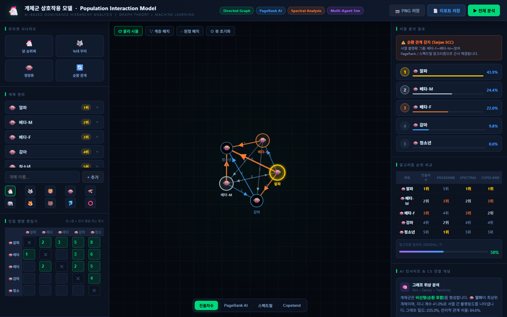
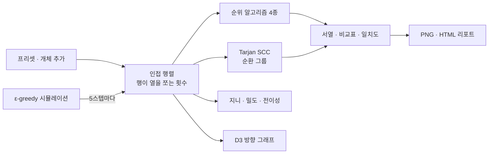

# PopInT.

> 동물 무리의 순위제(pecking order)를 방향 그래프로 옮기고, 순위 알고리즘 네 가지를 한 화면에서 비교해 보는 교육용 분석 도구

---

## 1. 프로젝트 개요 (Overview)

| 항목 | 내용 |
|---|---|
| 프로젝트명 | PopInT. (Population Interaction Model · 개체군 상호작용 모델) |
| 한 줄 요약 | "누가 누구를 몇 번 쪼았나"를 인접 행렬로 입력하면 그래프를 그리고 진출차수·PageRank·스펙트럴·Copeland 네 방식으로 서열을 매겨 나란히 보여 준다 |
| 진행 기간 | 2026.06 (파일 기준, 시작 시점은 확인 필요) |
| 참여 인원 | (확인 필요) |
| 본인 역할 | 기획, 알고리즘 구현, 시각화, UI |
| 기여도 | (확인 필요) |
| 진행 맥락 | 생명과학 순위제 단원과 그래프 이론을 잇는 교육용 도구 (수업·과제 맥락은 확인 필요) |

닭은 무리 안에서 쪼는 순서가 정해져 있다. 생물 교과서에서는 이것을 "A가 B를 쪼고 B가 C를 쫀다"는 사슬로 설명한다. 실제 관찰 기록은 그렇게 깔끔하지 않다. 서로 쪼기도 하고 A→B→C→A처럼 가위바위보 구조가 생기기도 한다. 이 도구는 관찰 횟수를 행렬에 넣으면 그래프와 서열을 바로 보여 주고 서열을 매기는 방식에 따라 결과가 어떻게 달라지는지 비교하게 한다.

저장소는 없다. 이 보고서는 로컬에 남은 단일 파일(`index.html`, 1,181줄)을 근거로 썼다.

## 2. 기술 스택 (Tech Stack)

| 구분 | 기술 | 선택 이유 |
|---|---|---|
| 구조 | 단일 HTML 파일, Vanilla JavaScript | 설치 없이 파일 하나로 열 수 있다. 수업에서 나눠 주기 쉽다 |
| 그래프 | D3.js v7.8.5 (force simulation · zoom · drag) | 방향 간선, 화살표, 물리 배치, 확대·이동을 직접 제어할 수 있다 |
| 내보내기 | html2canvas 1.4.1, Blob 다운로드 | 그래프를 2배 해상도 PNG로 저장하고 분석 결과를 HTML 리포트 한 장으로 내려받는다 |
| 알고리즘 | 직접 구현 (라이브러리 없음) | 진출차수, PageRank(반복 120회), 거듭제곱법 고유벡터, Copeland, Tarjan SCC, Floyd–Warshall, Kahn 위상 정렬 |

## 3. 핵심 기능 및 담당 업무 (Key Features & Contributions)

로컬에서 캡처(영장류 프리셋). 왼쪽은 개체와 인접 행렬 편집기, 가운데는 방향 그래프, 오른쪽은 서열·순환 경고·알고리즘 비교표. 비교표의 PageRank 열에 §5-③의 문제가 그대로 드러난다

| 영역 | 기능 |
|---|---|
| 프리셋 | 닭 순위제 · 늑대 무리 · 영장류 · 순환 관계 네 가지 시나리오를 한 번에 불러온다 |
| 개체·행렬 | 이름(8자)과 아이콘 10종으로 개체를 추가·삭제하고 "행이 열을 쪼는 횟수"를 칸마다 입력한다. 입력 후 0.28초 뒤 전체 분석을 다시 돌린다 |
| 그래프 | 물리 시뮬 · 계층 배치(위상 정렬 후 가장 긴 경로로 층을 나눔) · 원형 배치 세 가지 레이아웃. 간선 두께는 횟수에 비례하고 1위 개체에는 글로 효과를 입힌다. 드래그·확대(0.08–5배)·툴팁 |
| 서열 분석 | 선택한 알고리즘의 점수로 순위를 매기고 막대로 보여 준다. 순환이 있으면 Tarjan SCC로 찾아 "서열 불명확 그룹"을 경고한다 |
| 알고리즘 비교 | 네 방식의 순위를 한 표에 놓고 알고리즘 사이의 일치도를 막대로 보여 준다 |
| 인사이트 | 순위 불평등도(지니 계수), 그래프 밀도, 전이적 관계 비율로 무리의 순위제 유형(강한 선형 · 중간 선형 · 약한 · 순환 포함)을 판정한다 |
| 시뮬레이션 | 두 개체를 무작위로 만나게 하고 과거 승률대로 승자를 정하되 10%는 무작위로 정한다(ε-greedy). 120번 만나는 동안 서열이 굳어지는 과정을 로그로 보여 준다 |
| 내보내기 | 그래프 PNG, 알고리즘 비교표·인접 행렬·개념 설명을 담은 HTML 리포트 |

### 순위 알고리즘

| 알고리즘 | 점수 | 보는 것 |
|---|---|---|
| 진출차수 | 내가 쫀 횟수의 합 | 직접 지배의 양 |
| PageRank | 간선을 따라 점수가 흐르는 마르코프 체인의 안정 분포 (감쇠 0.85) | 간접 영향력 |
| 스펙트럴 | 인접 행렬의 주 고유벡터 (거듭제곱법) | 강한 개체를 이기는 것의 가치 |
| Copeland | 쌍마다 누가 더 많이 쪼았는지로 승 1 · 무 0.5 | 1:1 대결 전적 |

### 주요 업무

- 순위 알고리즘 4종과 순환 탐지(Tarjan SCC), 전이 폐쇄(Floyd–Warshall), 위상 정렬(Kahn) 구현
- D3 방향 그래프와 세 가지 레이아웃, 인접 행렬 편집기
- 프리셋 시나리오 네 가지와 ε-greedy 상호작용 시뮬레이션
- PNG·HTML 리포트 내보내기

## 4. 성과 및 결과 (Results & Metrics)

### 정량적 성과

프리셋 네 가지를 보고서 작성 중(2026.09)에 Node로 다시 돌린 결과다. 각 칸은 그 알고리즘이 1위로 매긴 개체다.

| 프리셋 | 진출차수 | PageRank | 스펙트럴 | Copeland | 순환 탐지 |
|---|---|---|---|---|---|
| 닭 순위제 (완전 선형) | 알파 | **엡실론** (최하위 개체) | 알파 (나머지 4마리 0점) | 알파 | 없음 |
| 늑대 무리 | 알파♂ | **오메가** (최하위 개체) | 알파♀ | 알파♂ · 알파♀ 동점 | 알파♂ ↔ 알파♀ |
| 영장류 | 알파 | **청소년** (최하위 개체) | 알파 | 알파 | 알파 · 베타-M · 베타-F |
| 순환 관계 | C | B | B | A · C 동점 | A–B–C–D 전체 |

| 항목 | 결과 |
|---|---|
| 코드 | 단일 파일 1,181줄, 외부 라이브러리 2개(CDN) |
| 사용자 · 활용 결과 | (확인 필요) |

### 정성적 성과

- **서열이 "정답이 하나인 값"이 아니라는 점을 화면으로 보여 준다.** 순환 관계 프리셋에서는 1위가 알고리즘마다 C, B, A·C 동점으로 갈린다. 같은 관찰 기록도 무엇을 지배로 보느냐에 따라 순위가 달라진다.
- **생물 개념과 CS 개념을 한 도구에 묶었다.** 순위제는 방향 그래프로, 순환 서열은 강한 연결 요소로, 서열의 불평등은 지니 계수로 옮겨 설명한다.

### 확인된 한계

- **PageRank가 서열을 거꾸로 매긴다.** 선형 순위제 프리셋 세 개 모두에서 가장 많이 쪼인 개체가 1위가 된다 (§5-③). 아직 고치지 않았다.
- **완전 선형 서열에서는 스펙트럴 점수가 무너진다.** 닭 프리셋처럼 순환이 전혀 없으면 인접 행렬을 거듭 곱할수록 0이 되어 1위만 100%이고 나머지는 모두 0점으로 동점이다.
- **계층 배치는 순환이 하나라도 있으면 층을 나누지 못한다.** 위상 정렬이 순환에서 멈춰 늑대 프리셋에서는 다섯 마리가 모두 한 층에 놓인다.
- **"그래프 밀도"가 100%를 넘는다.** 간선이 있는지가 아니라 쪼은 횟수를 합산해 나누기 때문에 영장류 프리셋에서 205.0%가 나온다.
- **"Kendall τ" 일치도는 τ가 아니다.** 일치하는 쌍의 비율(0–100%)이다. τ로 쓰려면 2 × 비율 − 1로 바꿔야 한다.
- 인사이트 패널의 개념 연결(GNN, 내쉬 균형 등)은 설명 문구이고 도구가 실제로 그 계산을 하지는 않는다.

## 5. 트러블슈팅 경험 (Troubleshooting)

### ① 순환이 있으면 줄 세우기 자체가 불가능하다

**문제** 교과서식 서열은 위상 정렬, 곧 "쪼는 쪽이 앞"이라는 규칙으로 한 줄을 세우면 된다. 그런데 A→B→C→A 같은 순환이 하나라도 있으면 위상 정렬이 끝나지 않는다. 늑대·영장류 프리셋처럼 상위 개체끼리 서로 쪼는 경우도 마찬가지다.

**원인** 위상 정렬은 순환이 없는 그래프(DAG)에서만 정의된다. 실제 관찰 기록에는 맞쪼기와 순환이 흔하다.

**해결** 줄 세우기와 순환 탐지를 분리했다. 서열은 모든 그래프에서 계산되는 점수 기반 알고리즘으로 매기고, 순환은 Tarjan 알고리즘으로 강한 연결 요소를 찾아 "서열 불명확 그룹"으로 따로 경고한다.

**결과** 순환 관계 프리셋에서는 A–B–C–D 전체가, 늑대 프리셋에서는 두 알파가 한 그룹으로 표시된다. 순위표는 그대로 나오되 어느 구간을 믿으면 안 되는지 함께 보인다.

### ② 알고리즘 하나의 결과만 보면 틀려도 모른다

**문제** 서열 점수는 식을 어떻게 세우느냐에 따라 달라지는데, 화면에 한 알고리즘의 순위만 있으면 그 순위가 이상해도 알아챌 방법이 없다.

**원인** 순위에는 비교할 정답이 없다. 알고리즘끼리의 합의가 사실상 유일한 기준이다.

**해결** 네 알고리즘의 순위를 개체별로 한 표에 놓고 두 알고리즘씩 순위 쌍이 일치하는 비율의 평균을 막대로 보여 주는 비교 패널을 만들었다.

**결과** 이 비교표 덕분에 ③의 문제가 드러났다. 영장류 프리셋에서 진출차수·스펙트럴·Copeland는 알파를 1위로 두는데 PageRank만 청소년을 1위로 두고 일치도가 50%로 떨어진다.

### ③ PageRank가 가장 약한 개체를 1위로 뽑았다 (재검증에서 발견, 수정 전)

**문제** 이 보고서를 쓰면서 프리셋을 다시 돌려 보니 PageRank가 선형 순위제 세 프리셋 모두에서 최하위 개체를 1위로 매겼다 (닭 엡실론 43.1%, 늑대 오메가 43.3%, 영장류 청소년 43.6%).

**원인** 행렬의 방향은 "행이 열을 쫀다"인데, PageRank 점수가 쫀 개체에서 쪼인 개체 쪽으로 흐르도록 구현돼 있다. 웹 페이지의 링크처럼 "받은 화살표가 많을수록 중요하다"는 원래 가정을 그대로 가져와서 쪼임을 많이 받은 개체가 점수를 모은다.

**해결** (미반영) 점수가 쪼인 쪽에서 쫀 쪽으로 흐르도록 행렬을 전치해 넣으면 고칠 수 있다. 우열 관계에서는 "진 쪽이 이긴 쪽을 가리킨다"로 간선을 읽어야 한다.

**결과** (확인 필요) 수정 후 네 알고리즘의 일치도와 순위를 다시 확인해야 한다.

## 6. 링크 및 산출물 (Links & Deliverables)

| 구분 | 링크 |
|---|---|
| GitHub 저장소 | 없음 |
| 배포 URL | (확인 필요) |
| 산출물 | 단일 파일 웹 도구 `index.html`, 내보내기 결과물(그래프 PNG · 분석 HTML 리포트) |

---

+++

## 고객여정지도 (Journey Map)

사용자는 순위제 단원을 배우는 학생이다.

| 단계 | 사용자의 행동 | 사용자의 생각 | 도구의 대응 |
|---|---|---|---|
| 시작 | 파일을 연다 | "뭘 넣어야 하지?" | 닭 순위제 프리셋이 이미 열려 있다 |
| 탐색 | 프리셋을 바꿔 본다 | "늑대는 알파가 둘이네?" | 그래프 모양과 순환 경고가 바로 바뀐다 |
| 입력 | 관찰한 횟수를 행렬에 넣는다 | "우리 반에서 본 걸로 해 보자" | 입력이 끝나면 0.28초 뒤 그래프와 순위가 다시 계산된다 |
| 비교 | 알고리즘 버튼을 눌러 본다 | "왜 순위가 달라지지?" | 비교표와 일치도로 차이를 보여 준다 |
| 제출 | 리포트를 저장한다 | "과제에 붙이고 싶어" | PNG와 HTML 리포트를 내려받는다 |

## 제스처링 (Gesturing)

- 노드를 끌면 물리 시뮬레이션이 따라 움직이고 휠로 0.08–5배까지 확대한다. "뷰 초기화"는 0.45초 전환으로 원위치한다.
- 노드에 마우스를 올리면 그 개체의 서열 점수와 진출·진입 차수가 툴팁에 뜬다.
- 행렬 칸은 값이 0보다 크면 입력하는 동안 바로 강조된다.

## 모션 디자인 (Motion Design)

- 물리 시뮬 레이아웃은 간선 길이 130, 반발력 −320으로 개체가 자리를 잡아 가는 과정을 그대로 보여 준다.
- 순위 목록은 `fadeUp`으로 올라오고 1위 개체는 글로 필터로 빛난다.
- 시뮬레이션은 0.55초마다 한 번 만나고 5번마다 행렬·그래프·순위를 갱신해 서열이 굳어 가는 흐름을 보여 준다.

## 적응형 디자인 (Adaptive Design)

- 3단 레이아웃(입력 · 그래프 · 결과)은 1,280px와 1,060px에서 양쪽 패널 폭을 줄이고 1,060px 이하에서는 헤더 태그를 숨긴다.
- 창 크기가 바뀌면 그래프를 새 크기로 다시 그린다.
- 순환이 있을 때만 순환 경고와 "비이행 관계" 인사이트 카드가 나타난다.
