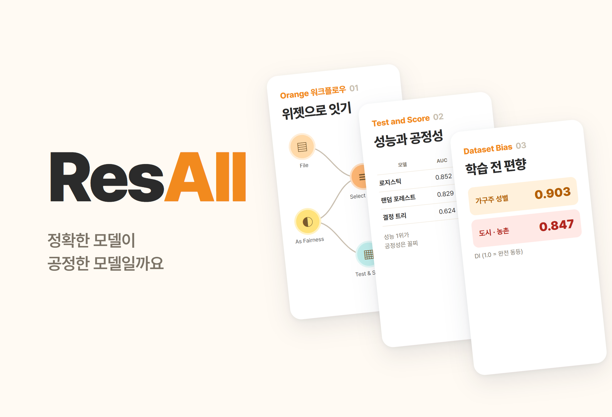
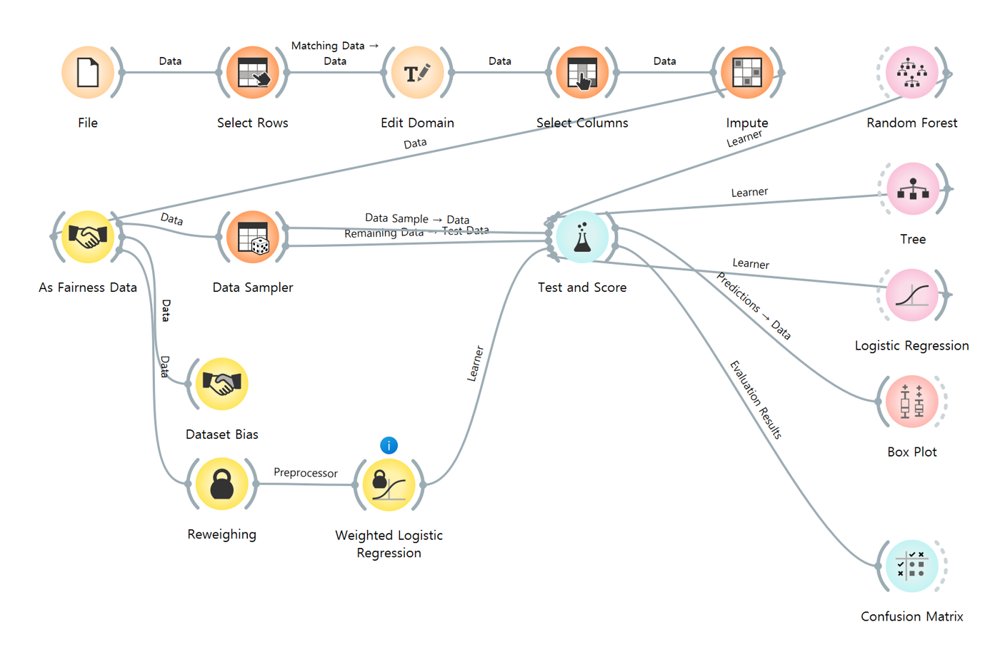
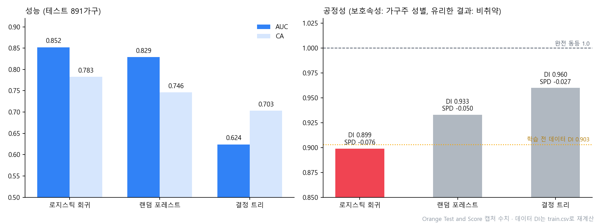

# ResAll.

> "한정된 복지 예산을 누구에게 줄 것인가"를 코스타리카 가구 빈곤 데이터의 분류 문제로 만든 Orange 탐구. 모델 세 개의 성능과 함께, 추가로 설치한 Fairness 애드온으로 가구주 성별·지역에 대한 공정성을 감사했다

---

## 1. 프로젝트 개요 (Overview)

| 항목 | 내용 |
|---|---|
| 프로젝트명 | ResAll. (Resource Allocation, 복지 자원 배분) |
| 한 줄 요약 | 소득 없이 주거·자산·교육·가구 구성만으로 취약 가구를 가려내는 분류기를 Orange로 만들었다. 성능 1위인 로지스틱 회귀(AUC 0.852)가 성별 공정성에서는 가장 나빴다(DI 0.899) |
| 진행 기간 | 2026.06 (2학년 인공지능 기초, 작업 파일 기준 2026.06.08–06.09) |
| 참여 인원 | 개인 탐구 |
| 본인 역할 | 문제 설정, 데이터 정제 설계, Orange 워크플로우 구성, Fairness 애드온 설치·감사, 결과 해석 |
| 기여도 | 100% |
| 진행 맥락 | 기계학습 모델 구현 과제 (평가 방식은 확인 필요) |

복지 예산은 한정돼 있는데, 가장 가난한 가구일수록 소득을 공식적으로 증빙하기 어렵다. 미주개발은행(IADB)은 이 문제를 대리소득조사(Proxy Means Test, PMT)로 푼다. 소득 대신 벽·지붕 재질, 가전 보유, 교육 수준처럼 눈으로 확인되는 특성으로 빈곤을 추정하는 방식이다. 이 탐구는 PMT를 머신러닝 분류 문제로 옮기고 그 모델이 여성 가구주나 농촌 가구를 체계적으로 놓치지 않는지까지 확인했다.

| 가설 | 내용 |
|---|---|
| 1. 식별 가능성 | 소득 변수 없이도 주거·자산·교육·가구 구성만으로 취약/비취약을 가를 수 있다 |
| 2. 지표 선택 | 복지에서는 도움이 필요한데 놓친 가구(위음성)의 비용이 더 크므로 정확도보다 Recall·F1이 핵심이다 |
| 3. 편향의 출발점 | 모델을 만들기 전부터 데이터 자체에 집단 편향이 있다 |
| 4. trade-off | 편향을 완화하면 정확도를 일부 내주고 공정성을 얻으며, 여러 공정성 기준을 한꺼번에 만족할 수는 없다 |

## 2. 기술 스택 (Tech Stack)

| 구분 | 기술 | 선택 이유 |
|---|---|---|
| 도구 | Orange Data Mining (위젯 기반 워크플로우) | 코드 없이 전처리 → 학습 → 평가를 연결하고 각 단계의 데이터를 바로 확인할 수 있다 |
| 공정성 | Orange **Fairness 애드온** (기본 설치에 없음): As Fairness Data, Dataset Bias, Reweighing, Weighted Logistic Regression | 공정성 지표(DI·SPD·EOD·AOD)를 성능 지표와 같은 표에서 본다 |
| 데이터 | Kaggle "Costa Rican Household Poverty Level Prediction" (IADB) `train.csv`, 9,557명 · 142개 변수 | 실제 복지 대상 선정에 쓰이는 PMT를 개선하려고 공개된 데이터 |
| 모델 | 결정 트리, 랜덤 포레스트, 로지스틱 회귀 | 규칙 기반·앙상블·선형 확률 모델로 성격이 서로 달라 비교하기 좋다 |

## 3. 핵심 기능 및 담당 업무 (Key Features & Contributions)

작업 당시 캡처한 Orange 워크플로우. 위쪽 줄이 전처리, 가운데가 학습·평가, 왼쪽 아래가 Fairness 애드온(Dataset Bias, Reweighing → Weighted Logistic Regression)

### 전처리

| 단계 | 위젯 | 처리 |
|:---:|---|---|
| ① | Select Rows | 가구주(`parentesco1 = 1`) 행만 남겨 한 행 = 한 가구로 만든다 (9,557명 → 2,973가구) |
| ② | Edit Domain | `Target` 4단계(극빈·중간빈곤·취약·비취약)를 취약(1–3) / 비취약(4)으로 합치고, `male`에 남성/여성 라벨을 붙인다 |
| ③ | Select Columns | 해석 가능한 약 20개 변수만 고른다. 문자·숫자가 섞인 `edjefe`·`edjefa`·`dependency`와 식별자 `Id`·`idhogar`는 meta로 빼 누수를 막는다 |
| ④ | Impute | 결측치를 평균·최빈값으로 채운다 |
| ⑤ | As Fairness Data | 보호속성 = 가구주 성별, 특권집단 = 남성, 유리한 결과 = 비취약 |
| ⑥ | Data Sampler | 70% 층화 추출(고정 시드) → 학습 2,082 / 테스트 891 |

| 변수 계열 | 변수 |
|---|---|
| 주거 | `epared1~3`(벽), `etecho1~3`(지붕), `eviv1~3`(바닥), `abastaguadentro`(수도), `noelec`(전기 없음), `v14a`(화장실) |
| 과밀·규모 | `rooms`, `overcrowding`, `hacdor`, `tamhog`, `hogar_nin`, `hogar_mayor` |
| 자산 | `refrig`, `computer`, `television`, `qmobilephone`, `v18q` |
| 교육·인구 | `meaneduc`, `escolari`, `age`, `male` |
| 지역 | `area1`(도시)·`area2`(농촌), `lugar1~6`(권역) |

### 모델

| 모델 | 특징 |
|---|---|
| 결정 트리 | 정보 이득이 최대가 되는 질문을 반복해 가지를 친다. 어떤 요인이 빈곤을 가르는지 사람이 읽을 수 있다 |
| 랜덤 포레스트 | 서로 다른 데이터·변수 부분집합으로 만든 여러 트리의 다수결. 안정적이지만 해석은 어려워진다 |
| 로지스틱 회귀 | 가중합을 시그모이드에 넣어 빈곤 확률을 낸다. 계수로 각 요인의 방향까지 해석할 수 있다 |

### 공정성 감사

- **Dataset Bias**로 모델을 만들기 **전** 데이터 자체의 편향을 쟀다.
- **Test and Score**에서 성능 지표와 공정성 지표(DI·SPD·EOD·AOD)를 한 표로 비교했다.
- **Weighted Logistic Regression**에 **Reweighing**을 전처리기로 붙여 편향 완화 모델을 만들었다.
- 지역(도시·농촌)은 보호속성을 바꾼 별도 Orange 파일로 분석했다.

### 주요 업무

- 복지 배분 문제를 PMT 기반 이진 분류로 정의하고 타깃 이진화·가구 단위 정규화 설계
- 누수 변수 제외, 결측 처리, 층화 분할을 포함한 전처리 워크플로우 구성
- Fairness 애드온 설치, 보호속성·특권집단·유리한 결과 지정, 성능·공정성 동시 비교
- 편향 완화 모델 제작과 결과 해석

## 4. 성과 및 결과 (Results & Metrics)

### 정량적 성과

Test and Score 캡처의 수치로 다시 그린 그래프. 점선은 모델 없이 데이터에서 잰 성별 DI(0.903)

**테스트 891가구, 클래스 평균**

| 모델 | AUC | CA | F1 | Prec | Recall | MCC | SPD | EOD | AOD | DI |
|---|:---:|:---:|:---:|:---:|:---:|:---:|:---:|:---:|:---:|:---:|
| **로지스틱 회귀** | **0.852** | **0.783** | **0.776** | **0.778** | **0.783** | **0.501** | −0.076 | −0.046 | −0.066 | 0.899 |
| 랜덤 포레스트 | 0.829 | 0.746 | 0.738 | 0.738 | 0.746 | 0.413 | −0.050 | −0.017 | −0.045 | 0.933 |
| 결정 트리 | 0.624 | 0.703 | 0.702 | 0.702 | 0.703 | 0.338 | **−0.027** | **−0.024** | **−0.011** | **0.960** |

**학습 전 데이터 편향 (보고서 v2.0 작성 중 `train.csv`로 재계산, 가구주 2,973가구)**

| 보호속성 | 유리한 결과(비취약) 비율 | DI | SPD |
|---|---|:---:|:---:|
| 가구주 성별 | 남성 68.3% · 여성 61.7% | 0.903 | −0.066 |
| 지역 | 도시 68.7% · 농촌 58.2% | 0.847 | −0.105 |

| 항목 | 결과 |
|---|---|
| 가설 1 | 지지. 소득 변수 없이 CA 0.783, AUC 0.852 |
| 가설 3 | 지지. 모델 없이도 데이터의 DI가 성별 0.903, 지역 0.847 |
| 가설 2 · 4 | 부분 확인 (아래 한계 참고) |
| 수행평가 점수 | (확인 필요) |

### 정성적 성과

- **정확한 모델이 곧 공정한 모델은 아니었다.** 공정성 네 지표 모두에서 성능 1위 로지스틱 회귀가 가장 나빴고 가장 좋은 쪽은 성능이 가장 낮은 결정 트리였다. 성능표 하나만 보고 모델을 골랐다면 차별까지 함께 배포했을 것이다.
- **모델은 데이터의 편향을 거의 그대로 옮겼다.** 로지스틱 회귀의 DI(0.899)는 학습 전 데이터의 DI(0.903)와 거의 같다. 편향은 알고리즘에서 새로 생기지 않았고 사회와 데이터에서 출발했다.
- 과제 범위에 없던 감사 단계까지 넣었다. 기본 Orange에 없는 Fairness 애드온을 직접 찾아 설치해 데이터 정제 → 모델 비교 → 공정성 감사 → 편향 완화까지 한 워크플로우로 이었다.

### 확인된 한계

- **표의 Recall은 취약 가구의 재현율이 아니다.** Test and Score가 "클래스 평균"으로 설정돼 있어 표의 Recall은 두 클래스 재현율의 가중평균이고 정확도(CA)와 값이 같다. 가설 2가 말한 "놓친 취약 가구"를 보려면 대상 클래스를 "취약"으로 바꾸거나 Confusion Matrix를 봐야 한다. (확인 필요)
- **편향 완화 모델의 결과가 남아 있지 않다.** Weighted Logistic Regression은 Test and Score에 연결돼 있지만 결과 캡처에는 세 모델만 있고, 위젯에 정보 표시가 떠 있다. 완화 전후 비교 수치는 (확인 필요)
- **랜덤 포레스트의 트리 수가 기록마다 다르다.** 이전 보고서에는 10개로 적었지만 저장된 워크플로우는 75개다. 성능 캡처 당시의 값은 (확인 필요)
- 코스타리카 데이터로 학습한 모델이라 다른 사회에 적용하려면 지역별로 다시 학습하고 공정성을 계속 점검해야 한다.
- 예측은 지원 대상 발굴에만 써야 한다. 낙인이나 제재에 쓰이면 안 되고 최종 판단에는 사람의 검토가 필요하다.

## 5. 트러블슈팅 경험 (Troubleshooting)

### ① 개인 단위 데이터를 그대로 쓰면 같은 가구가 여러 번 들어간다

**문제** 원자료는 한 행이 한 사람(9,557명)인데, 빈곤 등급과 주거·자산 특성은 가구 단위로 같은 값이다. 이 상태로 학습하면 가구원이 많은 집이 여러 번 세어지고 같은 가구가 학습과 테스트에 동시에 들어갈 수 있다.

**원인** 복지 지원의 단위는 가구인데 데이터의 단위는 개인이었다.

**해결** Select Rows로 가구주(`parentesco1 = 1`) 행만 남겨 한 행 = 한 가구로 맞췄다. 식별자 `Id`·`idhogar`와 문자·숫자가 섞인 변수는 meta로 빼서 학습에 들어가지 않게 했다.

**결과** 2,973가구로 정리됐고 층화 추출로 학습 2,082 / 테스트 891을 클래스 비율을 유지한 채 나눴다.

### ② 정확도만 보면 가장 "좋은" 모델이 가장 불공정했다

**문제** 성능 지표만 보면 로지스틱 회귀를 고르면 끝이었다. 그런데 이 모델이 여성 가구주를 어떻게 대하는지는 성능표에 나오지 않는다.

**원인** 기본 Orange에는 공정성 지표가 없다. 정확도·AUC는 전체 평균이라 집단 사이의 차이를 가린다.

**해결** Fairness 애드온을 설치하고 As Fairness Data로 보호속성(가구주 성별), 특권집단(남성), 유리한 결과(비취약)를 지정했다. 그러자 Test and Score 표 하나에 성능과 DI·SPD·EOD·AOD가 나란히 떴다. Dataset Bias로 모델 이전의 데이터 편향도 따로 쟀다.

**결과** 성능 순위(로지스틱 > 랜덤 포레스트 > 트리)와 공정성 순위(트리 > 랜덤 포레스트 > 로지스틱)가 정반대라는 것을 한 표에서 보였다.

### ③ 표의 Recall이 정확도와 똑같았다 (재검증)

**문제** 보고서를 다시 정리하면서 보니 세 모델 모두 Recall이 CA와 소수 셋째 자리까지 같았다(0.783, 0.746, 0.703). 가설 2는 "취약 가구를 얼마나 놓치는가"를 핵심으로 삼았는데 그 값이 따로 보이지 않았다.

**원인** Test and Score의 대상 클래스가 "None, show average over classes"로 돼 있었다. 클래스 비율로 가중평균한 재현율은 수학적으로 정확도와 같다.

**해결** (보고서 v2.0에서 기록) 원자료의 캡처로 원인을 확인하고, 표의 Recall을 "클래스 평균"으로 명시했다. 취약 가구의 재현율은 대상 클래스를 "취약"으로 바꿔 다시 뽑아야 한다.

**결과** 가설 2(지표 선택의 원칙)는 여전히 유효하지만 이번 수치로 "취약 가구를 몇 % 찾았는가"를 말할 수는 없다는 점을 한계에 적었다.

## 6. 링크 및 산출물 (Links & Deliverables)

| 구분 | 링크 |
|---|---|
| GitHub 저장소 | 없음 |
| 산출물 | Orange 워크플로우(`기계학습 모델 구현.ows`), 위젯·데이터 테이블·Data Sampler·Test and Score 캡처, 워크플로우 가이드 문서 |
| 데이터 | Kaggle "Costa Rican Household Poverty Level Prediction" (IADB) |

<b>지표</b>

| 지표 | 의미 |
|---|---|
| CA | 전체 정확도. 클래스 불균형에 취약 |
| Precision / Recall | 예측한 것 중 맞은 비율 / 실제 중 찾아낸 비율 |
| F1 | 정밀도와 재현율의 조화평균 |
| AUC | ROC 곡선 아래 면적. 임계값과 무관한 판별력 |
| MCC | 매튜스 상관계수. 불균형 데이터에서도 믿을 만한 종합 지표 |
| DI | 두 집단 유리한 결과 비율의 비. 1.0이 완전 동등 |
| SPD | 두 집단 유리한 결과 비율의 차. 0이 완전 동등 |
| EOD | 두 집단 재현율(TPR)의 차 |
| AOD | 두 집단 TPR·FPR 차의 평균 |

<b>용어</b>

- **대리소득조사(PMT)**: 소득 증빙이 어려울 때 주거·자산 등 관측 가능한 특성으로 빈곤을 추정하는 복지 대상 선정 방식
- **계층 추출**: 클래스·집단 비율을 유지한 채 표본을 나누는 방법
- **데이터 누수**: 예측 시점에 알 수 없거나 타깃 정보를 담은 변수가 학습에 섞여 성능이 부풀려지는 현상
- **위음성 / 위양성**: 실제 취약인데 비취약으로 판정(지원 배제) / 실제 비취약인데 취약으로 판정(과다 지원)
- **보호속성 / 특권집단**: 차별이 생겨서는 안 되는 기준 변수 / 유리한 결과를 더 받는 집단(지표 계산의 기준)
- **Reweighing**: 학습 전 샘플에 가중치를 다시 매겨 집단 간 불균형을 보정하는 전처리 기법

---

+++

## 고객여정지도 (Journey Map)

여기서 "사용자"는 모델을 쓰는 복지 담당자다.

| 단계 | 행동 | 생각 | 모델·감사가 주는 것 |
|---|---|---|---|
| 조사 | 가구를 방문해 주거·자산을 기록한다 | "소득 서류가 없는 집은 어떻게 판단하지?" | 관측 가능한 약 20개 특성만으로 판정 |
| 선별 | 모델 점수로 지원 후보를 뽑는다 | "이 목록을 믿어도 될까?" | AUC 0.852의 판별력 |
| 점검 | 후보 명단의 구성을 본다 | "여성 가구주나 농촌이 빠진 건 아닐까?" | 성별 DI 0.899, 데이터 자체의 지역 DI 0.847 |
| 결정 | 최종 지원 대상을 확정한다 | "모델이 틀렸으면 누가 책임지지?" | 예측은 발굴용이고 최종 판단은 사람이 한다는 원칙 |

## DREAD 취약성 관리 (DREAD Risk Assessment)

| 위협 | D | R | E | A | D | 점수 | 대응 |
|---|---|---|---|---|---|---|---|
| 농촌·여성 가구주 취약 가구의 체계적 누락 | 3 | 3 | 2 | 3 | 2 | 2.6 | 집단별 재현율 점검, Reweighing 등 편향 완화 |
| 클래스 평균 지표만 보고 누락을 못 봄 | 3 | 3 | 3 | 2 | 1 | 2.4 | 대상 클래스를 "취약"으로 둔 Recall과 Confusion Matrix로 감사 |
| 예측을 낙인·제재에 전용 | 3 | 2 | 2 | 3 | 1 | 2.2 | 용도를 지원 대상 발굴로 한정, 사람의 최종 검토 |

D·R·E·A·D = 피해·재현성·악용 난이도·영향 범위·발견 가능성 (1~3). 점수는 평균.
