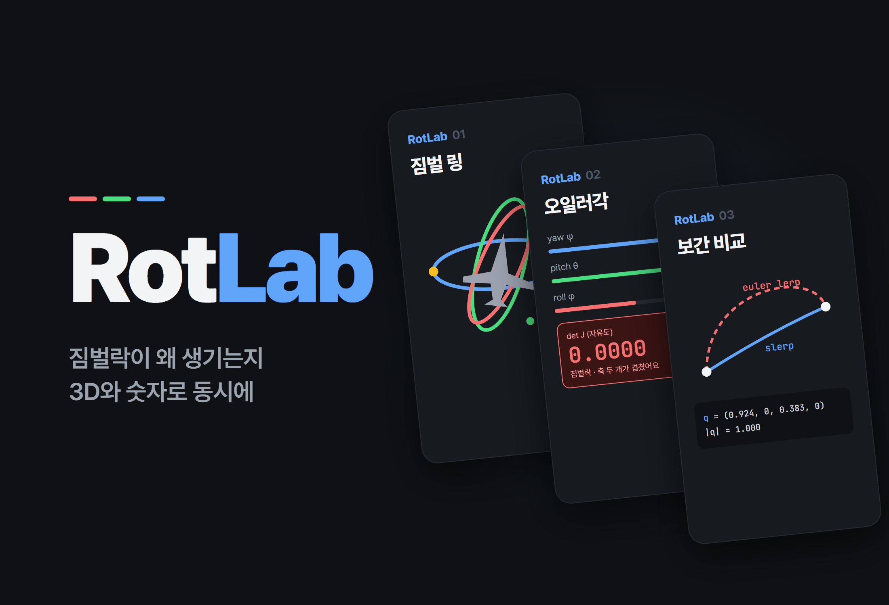
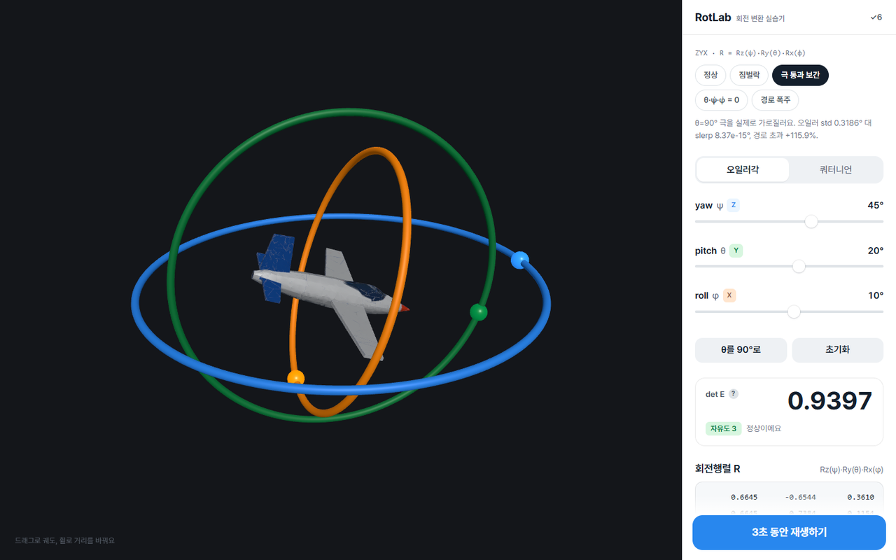
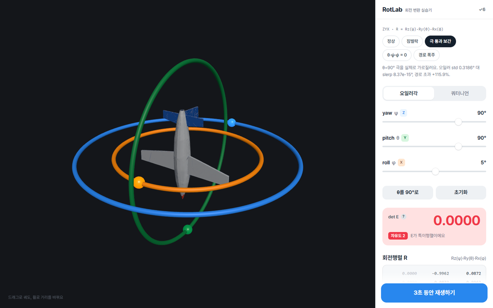
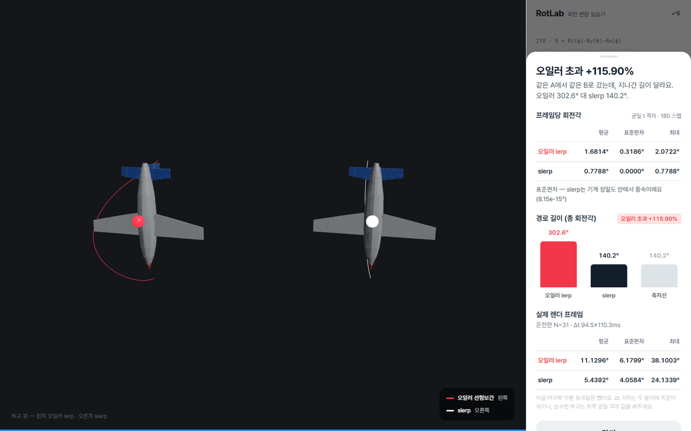
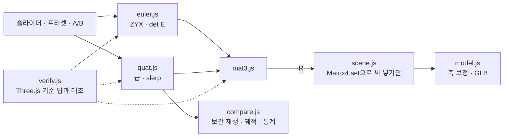

# RotLab

<p align="center"></p>

> 오일러각·회전행렬·쿼터니언을 라이브러리 없이 직접 구현하고 짐벌락과 보간 방식의 차이를 3D 화면과 숫자로 동시에 보여 주는 회전 변환 실험실

---

## 1. 프로젝트 개요 (Overview)

| 항목 | 내용 |
|---|---|
| 프로젝트명 | RotLab (회전 변환 실습기) |
| 한 줄 요약 | 비행기 모델을 짐벌 링 세 개에 태워 돌리며 θ가 ±90°에 가까워질 때 자유도가 사라지는 모습과 오일러 선형보간이 slerp보다 얼마나 먼 길로 도는지를 측정값으로 보여준다 |
| 진행 기간 | 2026.09.09 (v1.0.0 → v1.1.3, 하루) |
| 참여 인원 | 개인 프로젝트 |
| 본인 역할 | 회전 수학 구현, 검증 설계, 3D 씬·UI 구현, 측정 방법론 |
| 기여도 | 100% (저장소 커밋 6건 전부 본인) |

회전을 배우면 오일러각, 회전행렬, 쿼터니언을 차례로 만난다. 오일러각은 직관적이지만 짐벌락이 있다는 것, 쿼터니언은 보간이 매끄럽다는 것까지는 교과서에 나온다. 그런데 짐벌락에서 정확히 무엇이 사라지는지, 오일러 보간이 "매끄럽지 않다"는 게 속도의 문제인지 경로의 문제인지는 직접 재 봐야 안다. 이 도구는 그 두 질문에 숫자로 답한다.

Three.js는 렌더링(씬·카메라·조명·메시)에만 썼다. **회전 수학에는 라이브러리를 한 줄도 쓰지 않았다.** `THREE.Euler`·`THREE.Quaternion`·`Matrix4`의 회전 생성 메서드는 검증 모듈 안에서 직접 구현과 대조할 기준 답으로만 쓴다.

## 2. 기술 스택 (Tech Stack)

| 구분 | 기술 | 선택 이유 |
|---|---|---|
| 회전 수학 | Vanilla JavaScript 순수 함수 (`mat3` · `euler` · `quat`) | 구현 자체가 학습 목표다. 렌더러와 섞이지 않게 모듈을 나눴다 |
| 렌더링 | Three.js r185 (esbuild로 단일 파일 번들, `vendor/`에 고정) | 씬·조명·메시만 맡긴다. `npm install` 없이 클론 직후 동작하고 CDN을 쓰지 않는다 |
| 검증 | 자체 검증기 + Three.js 내장 회전을 기준 답으로 대조 (브라우저·Node 러너) | 독립적으로 구현된 답이 이미 있으니 성분 단위로 대조할 수 있다 |
| 3D 에셋 | GLB 비행기 모델 (Meshy AI 생성 → 리메시) | 원본 307만 폴리곤을 26,762 폴리곤으로 줄이고 텍스처도 축소했다 |
| 폰트 · 배포 | Pretendard (저장소에 포함) · GitHub Pages | 정적 파일뿐이다 |

## 3. 핵심 기능 및 담당 업무 (Key Features & Contributions)

<p align="center"></p>
<p align="center">
  
  </p>
<p align="center"><sub>로컬에서 캡처. 위: 정상 자세(det E 0.9397, 자유도 3). 아래 왼쪽: θ=90° 짐벌락(파랑 Z링과 주황 X링이 한 평면에 겹치고 det E 0.0000, 자유도 2). 아래 오른쪽: 극 통과 보간 결과(오일러 경로 초과 +115.90%)</sub></p>

### 구현 기능

- **자세 조절**: yaw·pitch·roll 슬라이더(오일러 모드) 또는 쿼터니언 모드로 기체를 돌린다. 짐벌 링 세 개(Z 파랑 · Y 초록 · X 주황)가 각 축을 보여준다.
- **계기판**: 회전행렬 R, 각속도 매핑 행렬의 행렬식 `det E = cos θ`, 남은 자유도를 실시간으로 표시한다. `|det E| < 0.05`면 경고색으로 바뀐다.
- **짐벌락 실증 버튼**: θ의 부호를 보고 "같은 회전이 되는 짝"을 자동으로 골라 일치·대조군·소멸 방향 세 가지를 숫자로 찍는다.
- **보간 비교**: A·B 자세를 지정하고 3초 동안 오일러 선형보간(빨강)과 slerp(흰색)를 나란히 재생한다. 기수 끝점의 궤적을 그리고 프레임당 회전각의 평균·표준편차·최대와 총 회전각, 측지선 대비 초과율을 결과 시트로 보여준다.
- **프리셋 5종**: 정상 · 짐벌락 · 극 통과 보간 · θ̇·ψ̇·φ̇=0 · 경로 폭주. 칩 하나로 자세를 잡거나 곧바로 재생한다.
- **검증 리포트**: 패널의 `✓6` 버튼을 누르면 브라우저에서 직접 돌린 대조 결과가 열린다.

### 좌표 규약과 핵심 수식

월드는 Z-up, 기체는 +x 기수 · +z 위 · +y 왼쪽 날개, 오일러 순서는 ZYX(yaw ψ → pitch θ → roll φ)다.

```
R = Rz(ψ) · Ry(θ) · Rx(φ)
E = [ Rz(ψ)Ry(θ)·e₁ ,  Rz(ψ)·e₂ ,  e₃ ]      ω = E · [φ̇, θ̇, ψ̇]ᵀ,     det E = cos θ
slerp(q₀,q₁,t) = ( sin((1−t)Ω)·q₀ + sin(tΩ)·q₁ ) / sin Ω,   Ω = arccos(q₀·q₁)
```

`matrixToEuler`는 θ가 ±90° 근처에서 조건수가 무너지는 `asin` 대신 `atan2`를 쓴다. 행렬 → 쿼터니언 변환은 Shepperd 방법으로 네 성분 중 절댓값이 가장 큰 것부터 뽑는다. w부터 뽑으면 180° 근처 회전에서 정밀도가 무너진다.

### 주요 업무

- 3×3 행렬·ZYX 오일러·쿼터니언(해밀턴 곱, 축-각, 회전 적용, slerp) 직접 구현
- Three.js 내장 회전과의 대조 검증 6항목 설계, 브라우저·Node 러너
- 짐벌락의 대수적 분석과 실증, 보간 비교의 측정 방법론
- 짐벌 링·궤적·계기판·결과 시트 UI, GLB 모델 축 보정과 폴백

## 4. 성과 및 결과 (Results & Metrics)

### 정량적 성과

**Three.js 내장과의 대조** (Node 러너, 2026.09 재실행, 6개 항목 전부 통과)

| # | 항목 | 대조 대상 | 표본 | 최대 오차 | 기준 |
|---|---|---|---|---|---|
| 1 | `eulerToMatrix` (ZYX) | `Matrix4.makeRotationFromEuler` | 200 | 2.220e-16 | 1e-12 |
| 2 | `quat.multiply` | `Quaternion.multiply` | 200 | 2.220e-16 | 1e-12 |
| 3 | `toMatrix`/`fromMatrix` 왕복 | 자기 무모순 | 200 | 1.110e-15 | 1e-12 |
| 4 | `quat.rotateVector` | `Vector3.applyQuaternion` | 200 | 8.882e-16 | 1e-12 |
| 5 | `quat.slerp` | `Quaternion.slerp` | 1100 | 3.331e-16 | 1e-9 |
| 6 | `gimbalMeasure` = det E | `cos θ` (해석해) | 200 | 2.220e-16 | 1e-14 |

5번 표본에는 대척점 쌍(`dot < 0`) 47/100이 들어 있다. 6번은 θ=±90°에서 `|det E| = 6.12e-17`도 함께 확인한다. 난수 씨앗 400개 전수로 돌려도 실패는 0건, 전 항목 최악 오차는 2.442e-15다.

**오일러 보간 대 slerp** (균일 t 격자 180스텝)

| 사례 | 오일러 표준편차 | slerp 표준편차 | 오일러 총 회전각 | slerp 총 회전각 | 초과 |
|---|---|---|---|---|---|
| 극 통과 (90, −45, 5) → (85, 95, 10) | 0.3186° | 8.37e-15° | 302.647° | 140.177° | **+115.9%** |
| θ̇·ψ̇·φ̇ = 0 (−70, 80, 0) → (100, −80, 0) | 1.24e-14° | — | 233.451° | 178.266° | **+31.0%** |
| 경로 폭주 (135, 85, 15) → (145, 95, 5) | 1.62e-14° | 5.70e-15° | 339.676° | 22.355° | **+1419.5% (15.19배)** |

| 항목 | 결과 |
|---|---|
| 규모 | 회전 수학·검증·씬 JS 약 2,700줄 |
| 3D 모델 | 307만 → 26,762 폴리곤 |
| 실제 수업·사용자 활용 | (확인 필요) |

### 정성적 성과

- **짐벌락을 세 가지 방식으로 보였다.** 수치(det E가 θ=0°에서 1, 60°에서 0.5, 90°에서 0), 대수(θ=+90°에서 R의 모든 성분이 `sin(φ−ψ)`, `cos(φ−ψ)`로만 표현돼 두 각이 하나로 뭉친다), 실증(θ=+90°에서 yaw +30°와 roll −30°의 차이가 1.110e-16, φ와 ψ를 같이 움직이면 5°~180° 어디서도 자세가 바뀌지 않는다).
- **오일러 보간의 실패 모드가 둘임을 밝혔다.** 각속도 크기를 전개하면 `|ω|² = ψ̇² + θ̇² + φ̇² − 2ψ̇φ̇·sin θ(t)`라서 세 각속도 중 하나라도 0이면 오일러 보간도 완벽한 등속이 된다. 그런데도 경로는 측지선의 15배까지 늘어난다. 속도 요동(표준편차)만 봤다면 가장 극적인 실패를 놓쳤을 것이다.
- **보정과 회전 수학을 분리했다.** GLB 모델의 로컬 축을 앱 규약으로 돌리는 상수(`MODEL_AXIS_FIX`, det = +1)는 모델 모듈 한 곳에만 있고 회전 수학 모듈은 이 파일을 모른다. 삼각대에서 GLB로 바꾼 뒤에도 짐벌락 실측치(`θ=+90°: 1.110e-16 / 0.9962`)가 그대로였다.

### 확인된 한계

- **pitch 부호가 항공 관례와 반대다.** 오른손 좌표계에서 x가 앞, z가 위면 y는 왼쪽으로 강제되고 `Ry(θ)·(1,0,0) = (cos θ, 0, −sin θ)`라서 +pitch에 기수가 내려간다. 구현 실수가 아니라 규약의 귀결이다. 슬라이더 부호만 뒤집으면 이미 잰 수치의 의미가 모두 바뀌어서 규약을 그대로 두고 문서화했다.
- **θ=±90°에서 오일러 분해는 유일하지 않다.** `|cos θ| < 1e-6`이면 `degenerate: true`로 표시하고 φ=0으로 고정한다.
- **정확히 ±180° 차이는 보간 방향이 정해지지 않는다.** 최단 방향이 둘이라 부동소수점 부호가 결정한다. A(20, 85, −10) → B(20, 95, −10)는 부호 조합에 따라 오일러 경로가 35.97배도, 1.57배도 된다. 그래서 모든 프리셋을 ±180°에서 5° 이상 떨어뜨렸다.
- **모드를 바꾸면 자세가 최대 약 0.9° 어긋난다.** 분해값을 슬라이더 단위로 반올림하기 때문이다. 보간 비교는 쿼터니언으로 따로 저장해서 영향이 없다.
- **README의 GIF 세 개가 저장소에 없다.** `hero.gif` 등을 참조하지만 파일이 커밋되지 않아 README에서 이미지가 깨진다.

## 5. 트러블슈팅 경험 (Troubleshooting)

### ① slerp가 가끔 먼 쪽 호로 돌았다

**문제** 쿼터니언 slerp를 명세의 공식 그대로 두면 일부 A·B 쌍에서 회전이 180°를 넘는 먼 길로 돈다. 부호 처리를 뺀 채 Three.js 기준 답과 대조하면 대척점 쌍에서 최대 오차가 1.95까지 벌어진다(기준 1e-9).

**원인** 쿼터니언의 이중 덮개 때문이다. q와 −q는 같은 회전이지만 4차원 구면에서는 정반대 점이다. `dot(q₀,q₁) < 0`이면 q₁이 반대쪽 반구에 있어서 `Ω = arccos(dot)`가 90°를 넘고 보간은 먼 쪽 호를 탄다.

**해결** `dot < 0`이면 q₁의 부호를 뒤집어 짧은 쪽을 택했다. 두 쿼터니언이 거의 같아 `dot > 0.9995`(Ω ≈ 1.81°)이면 sin Ω가 0에 가까워 나눗셈이 무너지므로, 선형보간 후 정규화(nlerp)로 대신한다. 이 구간에서 nlerp와 참 slerp의 차이는 최대 6e-5°다. 검증 표본에 대척점 쌍이 하나도 없으면 실패로 처리하게 해서 이 경우를 검사하지 못하고 통과하는 일을 막았다.

**결과** slerp 대조 1100표본의 최대 오차가 3.331e-16이 됐다. 대척점 쌍 47개가 포함된 결과다.

### ② 명세에 적은 짐벌락 검증 기준이 틀렸다

**문제** 처음 세운 기준은 "θ=90°에서 yaw +30°와 roll +30°가 같은 회전이 된다"였다. 그런데 실측하면 두 행렬의 차이가 0.9962로, 전혀 같지 않았다.

**원인** 부호를 따지지 않은 서술이었다. θ=+90°에서 R을 전개하면 모든 성분이 `(φ − ψ)` 하나에만 의존한다. 같은 회전이 되려면 차이가 같아야 하므로 yaw +30°의 짝은 roll **−30°**다. θ=−90°에서는 `(φ + ψ)`에 의존해 짝의 부호가 다시 뒤집힌다.

**해결** 전개식으로 기준을 바로잡고 짐벌락 실증 버튼이 θ의 부호를 보고 짝을 자동으로 고르게 했다. 결과에는 일치 쌍·대조군·소멸 방향 세 가지를 모두 찍는다.

**결과** θ=+90°에서 yaw +30° 대 roll −30°는 1.110e-16(같은 회전), roll +30°는 0.9962(다른 회전). θ=−90°에서는 정확히 반대로 나온다. 명세를 코드에 맞춘 것이 아니라, 수학으로 명세를 고쳤다.

### ③ 표준편차만으로는 가장 큰 실패를 놓친다

**문제** 오일러 보간이 나쁘다는 것을 "프레임당 회전각의 표준편차"로 보이려 했다. 그런데 경로 폭주 사례(135, 85, 15) → (145, 95, 5)에서는 오일러와 slerp의 표준편차가 둘 다 1e-14대로 구별되지 않았다.

**원인** 각속도 크기를 전개하면 시간에 따라 변하는 항은 `−2ψ̇φ̇·sin θ(t)` 하나뿐이다. 이 사례는 θ가 양쪽 모두 85°로 분해돼 θ̇ = 0이므로 오일러 보간도 완벽한 등속이다. 대신 경로가 크게 휘어 slerp가 22.4° 도는 동안 오일러는 339.7°를 돈다.

**해결** 지표에 총 회전각과 측지선 대비 초과율을 추가했다. 측정 방법도 다듬었다. 렌더 Δt 지터는 두 방식에 똑같이 섞여 차이를 가리므로 균일 t 격자로 통계를 냈다. 재생 시작과 끝 프레임은 구조적으로 부분 프레임이라 통계에서 뺐다. 빼기 전 slerp 표준편차 0.0493°는 180개 중 이상치 하나 때문이었고 빼고 나니 1.06e-14°였다. 실제 렌더 프레임 통계는 그 사실을 밝히고 따로 싣는다.

**결과** 결과 시트가 "속도 요동"과 "경로 폭주"를 따로 보여준다. 경로 폭주는 +1419.5%, 즉 15.19배로 드러난다.

### ④ 작은 각도에서 회전각 공식이 무너졌다

**문제** 프레임당 회전각을 회전행렬의 트레이스(`α = arccos((tr − 1)/2)`)로 구하면, A와 B가 거의 같은 재생에서 값이 틀어진다.

**원인** `arccos`의 도함수는 입력이 1에 가까울수록 발산한다. 트레이스 공식은 `arccos`에 `1 − α²/4`를 넣는 꼴이라 α가 작을수록 오차가 커진다. 참값을 축-각으로 정확히 만들어 두고 재 보니, 0.0001°에서 상대오차가 1.7e-4, 0.000001°에서는 1.0(0을 돌려줌)이었다.

**해결** 두 자세의 상대 쿼터니언으로 잰다. `q_rel = q_t ⊗ conj(q_{t−1})`, `α = 2·atan2(‖(x,y,z)‖, |w|)`. `|w|`를 쓰므로 이중 덮개도 저절로 처리된다.

**결과** A≈B(0.005°) 재생에서 최대 상대오차가 트레이스 3.10e-3 대 쿼터니언 1.01e-9로 갈렸다. 큰 각도에서는 두 공식이 기계 정밀도로 일치하므로, 공식을 바꿔도 기존 수치는 달라지지 않았다.

## 6. 링크 및 산출물 (Links & Deliverables)

| 구분 | 링크 |
|---|---|
| GitHub 저장소 | [stx4R/RotLab](https://github.com/stx4R/RotLab) (비공개) |
| 배포 URL | https://stx4r.github.io/RotLab/ |
| 검증 | `npm install && npm run verify` (Node) · `tests/run.html` (브라우저 콘솔) · 앱의 `✓6` 버튼 |

### 구조

```
payload (Group)     ← 회전 수학이 계산한 R 이 그대로 들어간다
  └ fixed (Group)   ← MODEL_AXIS_FIX · 배율 · 중심이동. 상수, 한 번만 적용
       └ GLB 씬      (로드 실패 시 삼각대로 자동 폴백, 화면에 표시)
```



---

+++

## 고객여정지도 (Journey Map)

사용자는 3D 회전을 배우는 학생이다.

| 단계 | 사용자의 행동 | 사용자의 생각 | 도구의 대응 |
|---|---|---|---|
| 탐색 | yaw 슬라이더를 끝까지 민다 | "링이 왜 따로 돌지?" | 바깥 Z링만 자전하고 안쪽 링과 기체는 거기 실려 돈다 |
| 발견 | "θ를 90°로" 버튼을 누른다 | "뭐가 잠긴다는 거지?" | 두 링이 한 평면에 겹치고 det E가 0.0000, 자유도가 2로 떨어진다 |
| 확인 | 짐벌락 실증을 누른다 | "정말 같은 회전이야?" | yaw +30°와 roll −30°의 차이 1.110e-16을 숫자로 보여준다 |
| 비교 | 극 통과 보간 프리셋을 재생한다 | "쿼터니언이 뭐가 나은데?" | 빨강 궤적이 크게 돌아가고 결과 시트에 초과 +115.9%가 뜬다 |
| 의심 | `✓6` 검증 리포트를 연다 | "이 계산 믿어도 돼?" | 브라우저에서 방금 돌린 대조 6항목의 오차가 나온다 |

## 모션 디자인 (Motion Design)

- 보간 재생은 3초 동안 두 기체가 나란히 움직이고 기수 끝점이 궤적선을 남긴다. 오일러는 빨강, slerp는 흰색이다.
- 재생은 `requestAnimationFrame`으로 돌지만 창이 합성되지 않는 환경에서는 rAF가 오지 않는다. 100ms 안에 오지 않으면 타이머로 진행시키고 통계에는 실제 Δt를 기록한다.
- det E 계기판은 0.05 밑으로 떨어지면 경고색으로 바뀐다.

## 제스처링 (Gesturing)

- 3D 화면을 드래그해 카메라를 궤도로 돌리고 휠로 확대·축소한다. OrbitControls 없이 카메라 궤도를 직접 구현했다.

## 적응형 디자인 (Adaptive Design)

- 3D 뷰를 왼쪽 넓은 영역에, 컨트롤과 계기판을 오른쪽 패널에 둔다. 보간 결과는 오른쪽에서 올라오는 시트로 띄워 3D 뷰를 가리지 않는다.
