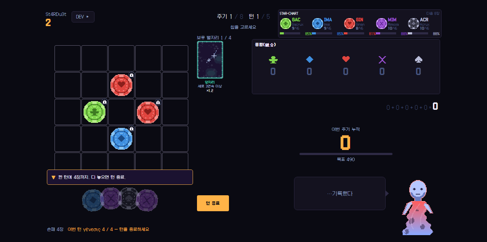
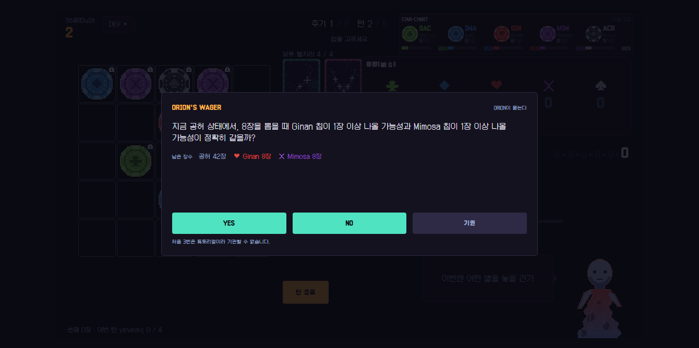
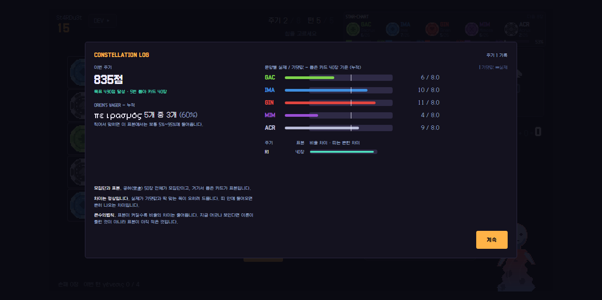
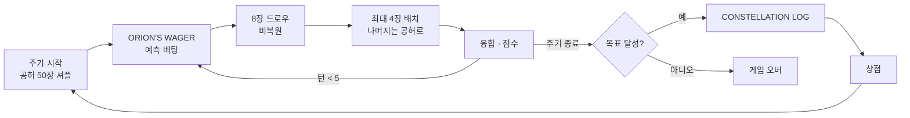

# Sirius

> 확률과 통계를 설명문이 아니라 판정 규칙에 심은 도트 그래픽 보드게임. 밸런스는 시드 고정 몬테카를로로 검증했고 부스 노트북용 단일 exe로 배포한다

---

## 1. 프로젝트 개요 (Overview)

| 항목 | 내용 |
|---|---|
| 프로젝트명 | Sirius (패키지명 STA-mble) |
| 한 줄 요약 | 중학생이 매 턴 "지금 어느 쪽을 고를지"를 확률로 판단하게 만드는 게임. 교과서 성취기준을 게임 규칙에 1:1로 대응시켰다 |
| 진행 기간 | 2026.08.05 ~ 2026.08.15 (11일) · 커밋 37건, v0.1.0 → v7.0.0 |
| 대상 행사 | GBL(Game Based Learning) 2026 Math 부문 · 주제 확률과 통계 · 대상 중학생 · 부스 시연 |
| 참여 인원 | 개인 프로젝트 |
| 본인 역할 | 게임 기획(GDD 3,400줄), 교과 연계 설계, 규칙 엔진·UI·시뮬레이터·패키징 전체 |
| 기여도 | 100% (저장소 커밋 전부 본인) |

학생은 `C(50,8)`을 계산할 줄 알지만 "그래서 지금 어느 쪽을 고를 것인가"는 배우지 않는다. 계산은 종이 위에서 끝나고 판단은 교실 밖에 있다. 게임은 선택을 강요하고 그 결과를 곧바로 돌려주므로 이 간극을 다루기 좋다.

교과서를 먼저 읽고 설계 기준을 정했다. 2022 개정 고등학교 『확률과 통계』는 대단원마다 중학교 연계 내용을 적어 두는데, 중학생은 이미 경우의 수·확률(중2)과 상대도수(중1)를 배웠다. 그래서 이 게임은 모르는 것을 가르치지 않는다. 이미 아는 것을 고교 개념(통계적 확률·기댓값)으로 잇는 다리 역할을 한다.

## 2. 기술 스택 (Tech Stack)

| 구분 | 기술 | 선택 이유 |
|---|---|---|
| 언어 · 빌드 | TypeScript (`strict`) · Vite 8 | 규칙 엔진을 타입으로 묶어 두면 "정답 확률을 문항에 싣지 않는다" 같은 설계 규칙을 자료구조로 강제할 수 있다 |
| 규칙 엔진 | 순수 TypeScript `core/` (React·DOM 의존 0) | 게임·시뮬레이터·테스트가 같은 상태 기계(`core/game.ts`) 하나를 공유한다 |
| UI | React 19 · Zustand · Tailwind CSS 4 · Framer Motion | 1120×630 고정 캔버스 위에 도트 그래픽을 그린다. 스토어는 상태 기계를 감싸기만 한다 |
| 시뮬레이션 | Node + tsx, 시드 기반 `mulberry32` | 같은 시드면 같은 결과가 나와야 밸런스 측정이 재현된다 |
| 테스트 | Vitest 4 | 확률 공식을 BigInt 정확 조합과 대조하는 검사 등 설계 규약 가드 포함 |
| 패키징 | Electron 43 · electron-builder 26 (`portable`) | 설치·런타임·네트워크가 필요 없는 exe 파일 하나. 부스 노트북에 복사만 하면 된다 |

## 3. 핵심 기능 및 담당 업무 (Key Features & Contributions)

<p align="center"></p>
<p align="center">
  
  
</p>
<p align="center"><sub>저장소의 자동 스크린샷 도구로 로컬에서 캡처(시드 고정). 위: 플레이 화면, 아래 왼쪽: 예측 베팅, 오른쪽: 주기 종료 통계 리포트</sub></p>

### 구현 기능

**코어 루프.** 한 주기는 5턴이다. 매 턴 공허(카드 50장)에서 8장을 뽑고 그중 최대 4장을 5×5 성단에 놓는다. 놓지 않은 조각은 공허로 돌아가 다시 섞인다. 놓은 조각이 같은 문양으로 이어지면 융합 점수가 나고 주기 누적 점수가 목표에 닿으면 다음 주기로 넘어간다. 드로우가 비복원이고 배치만이 카드를 모집단에서 빼는 사건이라, 이 루프 자체가 표본추출 실습이다.

**조각 구성이 곧 경우의 수다.** 기본 조각은 5종이다. 특수 조각은 두 문양을 반씩 합친 칩으로, ₅C₂ = 10종이다. 떠돌이 조각은 인접 4방향 중 3방향을 골라 판정하므로 ₄C₃ = 4가지 경우가 있다. 특수 조각 수는 임의로 정한 값이 아니라 조합의 수 그 자체다.

**학습 장치 4종.** 장치마다 맡는 단원과 통계 단위가 다르다.

| 장치 | 하는 일 | 교과 |
|---|---|---|
| `STAR-CHART` | 문양별 잔여 장수와 "다음 8장에 1장 이상 나올 확률"(계산)을 지금까지의 손패에서 관측한 비율(실제)과 나란히 상시 표시 | Ⅱ-1 확률의 뜻 · Ⅱ-2 여사건 · Ⅲ-5 모집단과 표본 |
| `ORION'S WAGER` | 드로우 직전 YES / NO / 기권 예측 베팅. 주기가 오를수록 단순 비교 → 여사건 → 조건부로 어려워진다 | Ⅱ-1 · Ⅱ-2 · Ⅱ-3 조건부확률 |
| `DRIFT ORACLE` | 떠돌이가 읽을 수 있는 경우를 표로 전부 보여주고 기댓값을 묻는다 | Ⅲ-2 기댓값 |
| `CONSTELLATION LOG` | 주기가 끝날 때 예측 적중률과 문양별 등장 횟수를 기댓값과 비교. 비율에는 반드시 표본 수를 붙인다 ("5문항 중 3문항") | Ⅱ-1 통계적 확률 · Ⅲ-3 |

**여사건으로 계산하고 팩토리얼은 만들지 않는다.** "적어도 1장"은 `1 − C(n−k, h) / C(n, h)`로 구하되 누적곱 `∏ (n−k−i)/(n−i)`로 계산한다. `C(50,8)`이 이미 5.4×10⁸이고 60!은 배정밀도를 넘으므로, 분자·분모를 따로 세우면 나눗셈 전에 `Infinity ÷ Infinity`가 된다. 누적곱은 각 인수가 0~1이라 확률 범위를 벗어날 수 없다.

### 주요 업무

- GDD 작성과 교과 매핑 (게임 시스템 9개 ↔ 성취기준)
- 헤드리스 상태 기계 `core/game.ts`, 융합 점수, 상점, 학습 장치 3종(`wager` · `oracle` · `report`)
- 몬테카를로 시뮬레이터(플레이어 정책 random · greedy · smart)와 밸런스 곡선 설계
- 도트 그래픽 절차 생성 파이프라인(칩·별자리 카드·캐릭터)
- Electron 셸과 portable exe 패키징, 부스 운영용 빌드 분기

## 4. 성과 및 결과 (Results & Metrics)

### 정량적 성과

| 항목 | 결과 |
|---|---|
| 테스트 | Vitest **493개 통과** (24개 파일, v7.0.0 기준 2026.09 재실행) · 타입 검사 클린 |
| 밸런스 측정 | 조합당 1,000회 × 9조합, 시드 20260101 |
| 코드 규모 | `src/` · `sim/` 15,178줄, GDD 3,409줄 |
| 부스 처리량 | 1인 소요 27.8분(계산), 노트북 3대 기준 시간당 5.5명 |
| 배포물 | Windows portable exe 1개 |
| 행사 결과 · 실제 참여 학생 수 | (확인 필요) |

**예측 베팅이 결과에 주는 영향** (이전 부스 목표 곡선 `[490, 630, 640]` 기준):

| 플레이어 정책 | 베팅 적중 0% | 50% | 100% |
|---|--:|--:|--:|
| greedy (부스판) | **71.3%** | 85.0% | 87.2% |
| smart (부스판) | 94.7% | 94.2% | 94.2% |
| smart (풀버전) | 4.2% | — | 40.4% (+36.2%p) |

부스판에서는 확률 문제를 하나도 못 맞혀도 greedy가 71.3% 클리어한다. 학습 장치가 진입 장벽이 되지 않는다. 풀버전에서는 예측 베팅이 승패를 가른다. 두 버전에 다른 원칙을 적용한 판단이 수치로 뒷받침됐다. 부스판 목표는 이후 설계자가 직접 플레이해 `[600, 900, 2000]`으로 의도적으로 올렸다.

### 정성적 성과

- **두 확률을 나란히 놓자 통계적 확률이 설명 없이 보였다.** 1주기 끝에 다섯 문양이 모두 10/51이라 계산값은 다섯 줄 모두 85%인데, 실제 관측은 100 / 80 / 100 / 60 / 100%로 흩어졌다. 표본이 작으면 계산과 관측이 갈라진다는 사실을 학생이 직접 본다.
- **교과서가 설계를 고쳤다.** 교과서 표기는 `큰수의법칙`(붙여 쓰기)이고 이항분포 단원의 학습 요소였다. 비복원추출은 조건부확률이 아니라 모집단과 표본 단원에 속했다. 지도상의 유의점이 조건부확률에서 시간 순서·인과 해석을 금지해서 "이미 3장 나갔으니 이제" 식 문항을 전부 "지금 공허가 이 상태일 때"로 다시 썼다.
- **표본이 작다는 사실을 숨기지 않는다.** 통계 리포트는 비율 옆에 표본 수를 쓰고 찍었을 때 나올 범위를 함께 보여준다. 3주기 누적으로 "흔한 차이"가 6.3% → 4.5% → 3.6%로 줄어드는 수렴이 관측됐다.

### 확인된 한계

- **동반성 30종은 효과가 없다.** 이름·설명·티어·가격만 있다. 밸런스 곡선이 모두 동반성 없이 측정돼서 여는 순간 9조합을 다시 재야 한다. 구매 액션 타입에 해당 변형을 아예 두지 않는 방식으로 봉인했다.
- **처리량 27.8분은 계산이지 측정이 아니다.** 읽기 속도(250자/분)와 판단 시간이 가정값이다.
- **학습 효과는 재지 않았다.** 검증한 것은 "개념이 규칙에 심겼는가"와 "게임이 돌아가는가"다. 사전·사후 검사가 다음 단계다.
- **자동 스크린샷 도구가 현재 제목 화면과 맞지 않는다.** v7의 새 제목 메뉴(게임 시작 · 부스 모드 · 도감 · 설정)를 도구가 모른다. 이 보고서의 화면은 도구의 시작 단계만 고쳐 찍었다.

## 5. 트러블슈팅 경험 (Troubleshooting)

### ① 학습 장치 둘이 서로를 무력화했다

**문제** 예측 베팅(`ORION'S WAGER`) 창이 뜨면 불투명도 85%의 배경막이 확률 패널(`STAR-CHART`)을 덮었다. 확률 문항에 답하려면 남은 장수를 봐야 하는데, 답하는 순간 그 값이 화면에 없었다. 시간이 넉넉해도 문항 자체를 풀 수 없었다.

**원인** 배경막만의 문제가 아니었다. 창 본체가 패널의 66%를 가렸다. 배경막을 투명하게 해도, 패널을 옮겨도 안 됐다. 패널을 옮기면 확률 % 열까지 보여 읽기만 하면 정답이 나온다.

**해결** 문항 창 안에 문양별 잔여 장수만 넣었다. 확률은 싣지 않는다. 조건문 대신 자료구조로 강제했다. 문항 타입에 확률을 담을 자리가 없어서 문항 생성기는 확률값을 알고 있으면서도 창에 넘길 방법이 없다. 명도 대비도 재 보니 배경막을 통과한 문양 색과 본문의 대비는 1.08~1.44:1로 기준(4.5:1)에 한참 못 미쳤다. 가려진 % 열은 어디에 있든 읽히지 않는다.

**결과** 단순 비교 문항은 "장수가 많으면 가능성이 크다"는 한 단계 추론이, 여사건 문항은 계산이 남는다. 정답이 새지 않으면서 문항이 다시 풀 수 있는 문제가 됐다.

### ② 시뮬레이터가 규칙 버그를 찾아냈다

**문제** 풀버전 클리어율이 설계 의도보다 높게 나왔고 규칙을 고칠 때 부스판과 다른 방향으로 움직였다.

**원인** 별자리 카드 보유 한도(4장) 처리에 결함이 있었다. 한도에 닿아도 카드를 걸러내지 못해 보유가 5·6·7장으로 늘었다. 풀버전 smart 정책은 상점 방문의 48%가 한도 상태여서 이 결함의 이득을 늘 받았다. 부스판은 한도에 닿지 않아 영향이 0이었다. 두 버전의 수치가 서로 다른 방향으로 움직인 것이 단서였다.

**해결** 한도 처리를 고치고 9조합을 다시 쟀다. 이 측정은 구조 덕분에 믿을 만했다. 시뮬레이터가 자기 루프를 따로 가지면 측정한 게임과 출시한 게임이 다른 구현이 된다. 그래서 `core/game.ts` 하나를 게임·시뮬레이터·테스트가 함께 쓰고 `Math.random()`을 어디서도 직접 부르지 않고 난수를 주입받는다. 대사 출력용 난수까지 게임 난수와 분리했다(`seed ^ 0x5ee0`). 대사가 게임 난수를 소비하면 시드 재현이 깨진다.

**결과** 풀버전 smart 클리어율이 28.1% → 11.7%로 바로잡혔다. 부스판 수치는 재측정에서 그대로 유효했다.

### ③ "부스판 15분"은 측정이 아니었다

**문제** 기획 초기에는 부스판 한 판을 15분으로 잡고 시간당 12명을 받는다고 생각했다.

**원인** 그 숫자는 어떤 계산에서도 나오지 않았다. 문항 글자 수와 읽기 속도로 다시 계산하니 한 판이 32.4분이었고 예측 베팅 15문항이 그중 44%(14.1분)를 차지했다. 읽기 속도는 한국 성인 최대 속도(약 589자/분)에 중학생 계수 0.8, 판단이 필요한 글이라는 계수 0.6을 곱해 250자/분으로 잡았다.

**해결** 정답을 맞히면 해설을 생략하고 해설 길이를 절반으로 줄였다(베팅 문항 3,030자 → 1,627자). 통계 리포트는 줄이지 않았다. 수렴을 보여주는 세 점이 큰수의법칙을 보여주는 장치의 전부라서 학습 장치를 깎아 시간을 버는 선택은 하지 않았다.

**결과** 한 판이 27.8분으로 줄었다. 회전 시간까지 합치면 노트북 3대에서 시간당 5.5명이다. GBL은 참여 학생 투표로 순위를 정하므로 처리량이 곧 성적이고 노트북 대수를 확보하는 일이 짐작보다 무거운 조건임을 행사 전에 알게 됐다.

### ④ 한글 경로에서만 빌드가 죽는다

**문제** 타입 검사와 테스트는 통과하는데 프로덕션 빌드만 `STATUS_STACK_BUFFER_OVERRUN`으로 크래시했다.

**원인** 프로젝트 경로에 한글·공백·클라우드 동기화 폴더가 섞여 있었다. 번들러가 이런 경로에서 죽고 빌드 단계에서만 드러났다.

**해결** 작업 트리를 ASCII·공백 없는 단순 경로로 옮기고 동기화 폴더로 되돌리지 않는 것을 프로젝트 규칙으로 문서에 남겼다.

**결과** 빌드와 패키징이 안정적으로 끝난다.

## 6. 링크 및 산출물 (Links & Deliverables)

| 구분 | 링크 |
|---|---|
| GitHub 저장소 | [stx4R/Sirius](https://github.com/stx4R/Sirius) (비공개) |
| 배포물 | `Sirius-v<version>-portable.exe` (electron-builder `portable`) |
| 설계 문서 | 저장소 `docs/GDD.md` (3,409줄), `sim/out/results.md` (시뮬레이션 결과) |

### 구조

```
core/game.ts  ←──  sim/     (시뮬레이터가 구동)
              ←──  store/   (Zustand가 감쌈)
              ←──  tests/   (테스트가 검증)

src/core/   순수 TypeScript. 규칙·확률 계산·학습 장치. React·DOM 의존 0
src/ui/     React 컴포넌트. 게임 규칙 로직 금지
sim/        Node 몬테카를로 시뮬레이터 (core만 import)
electron/   패키징 셸. 게임 로직 0줄
```



---

+++

## 고객여정지도 (Journey Map)

사용자는 부스를 찾은 중학생이다.

| 단계 | 사용자의 행동 | 사용자의 생각 | 게임의 대응 |
|---|---|---|---|
| 착석 | 노트북 앞에 앉는다 | "어떻게 하는 거지?" | 첫 판 첫 턴에 코치마크가 한 단계씩 조작을 짚는다. 처음 3번의 예측 베팅은 튜토리얼로 강제 |
| 첫 주기 | 조각을 놓아 본다 | "그냥 아무 데나?" | 첫 주기는 누구나 통과하게 설계. 탈락시키면 그 학생의 표를 잃는다 |
| 판단 | 베팅 문항을 읽는다 | "몇 장 남았더라?" | 문항 창 안에 잔여 장수가 있다. 확률은 스스로 추론한다 |
| 관찰 | 확률 패널을 본다 | "85%라더니 왜 60%지?" | 계산과 실제가 나란히 있어 작은 표본의 흔들림이 보인다 |
| 정리 | 주기 리포트를 본다 | "나 잘한 건가?" | "5문항 중 3문항"처럼 표본 수와 찍었을 때 범위를 함께 보여준다 |
| 퇴장 | 투표하러 간다 | | 끝날 때 투표 안내가 나온다 |

## 모션 디자인 (Motion Design)

- 손패는 부채꼴로 펼쳐지고 융합 정산은 문양별로 하나씩 점수가 올라간다. 한꺼번에 합산하지 않아 어떤 줄이 점수를 냈는지 눈으로 따라갈 수 있다.
- 캐릭터 ORION이 상황마다 표정을 바꾸며 말을 건다. 대사용 난수는 게임 난수와 분리해 연출이 게임 결과를 바꾸지 않는다.
- Electron 창은 첫 프레임 전에 배경색을 칠해 흰 화면이 아니라 어둠에서 게임이 떠오른다.

## 적응형 디자인 (Adaptive Design)

- 1120×630 고정 캔버스를 쓰고 화면에 맞춰 비율 그대로 확대·축소한다. 부스 노트북마다 해상도가 달라도 모든 화면에서 같은 게임이 보인다. 테스트가 고정 캔버스에서 상자 겹침과 넘침을 잰다.
- 배포 형태도 운영 환경에 맞췄다. 프로덕션 빌드는 부스판만 보여 준다(풀버전 8주기 약 40분은 좌석 하나가 표 하나를 잃는 시간). 시연용으로는 `?mode=full`로 연다. 런타임 설정 파일을 쓰지 않아 노트북마다 설정이 어긋날 수 없다.

## 보안 취약성 관리 (DREAD)

오프라인 게임이라 개인정보도 서버도 없다. 부스 PC 위에서 벌어질 수 있는 오용을 위협으로 본다.

| 위협 | 손상 | 재현성 | 오용성 | 영향 | 발견성 | 조치 |
|---|---|---|---|---|---|---|
| exe 안의 링크로 학교 PC가 브라우저가 됨 | 중 | 중 | 하 | 부스 PC | 중 | 새 창 열기를 시스템 브라우저로 넘기지 않고 거부(`setWindowOpenHandler`) — **적용** |
| 학생이 풀버전을 켜 좌석 40분 점유 | 중 | 하 | 하 | 대기 학생 | 하 | 프로덕션 빌드는 부스판만, 해제는 URL 파라미터로만 — **적용** |
| 개발자 도구로 점수 조작 | 하 | 중 | 중 | 해당 판 | 중 | 단축키를 수동 바인딩했지만 개발자 도구 단축키가 남아 있다. 배포 빌드에서 막는 것이 남은 과제 |
