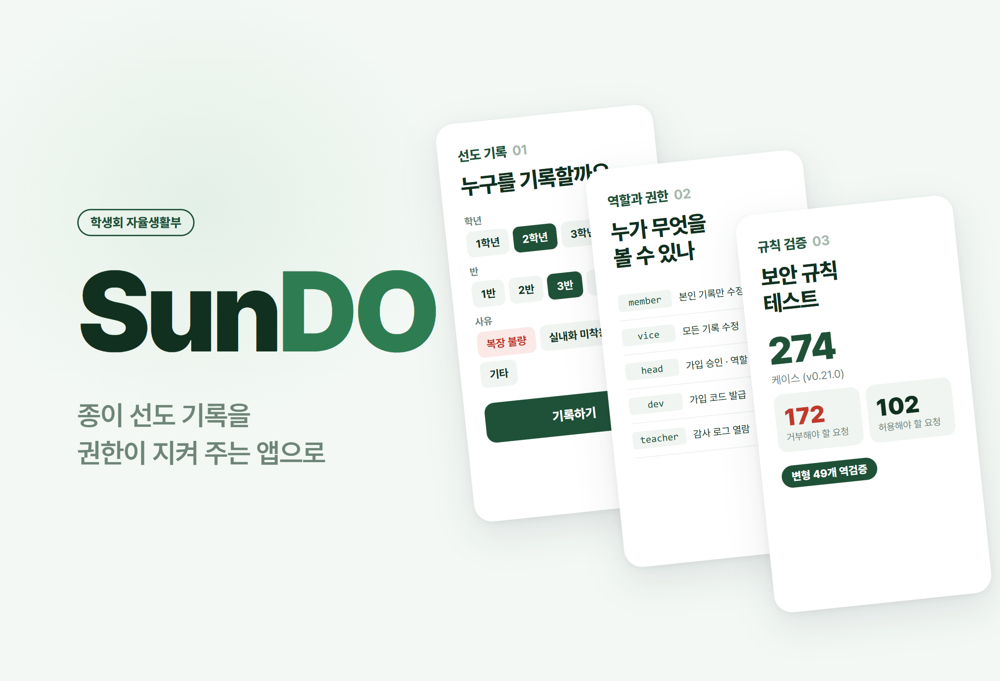
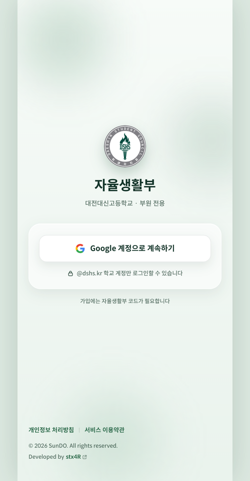
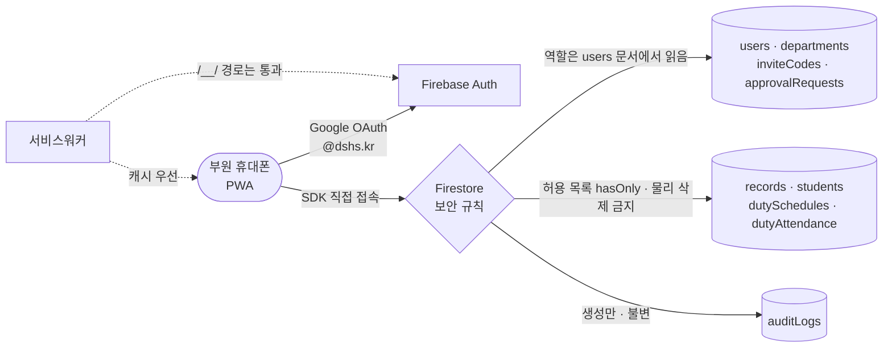

# SunDO

<p align="center"></p>

> 학생회 자율생활부의 선도 기록을 종이에서 옮긴 학교 전용 PWA. 서버 없이 Firestore 보안 규칙만으로 권한을 강제하고, 그 규칙이 실제로 거부하는지를 변형 역검증으로 증명했다

---

## 1. 프로젝트 개요 (Overview)

| 항목 | 내용 |
|---|---|
| 프로젝트명 | SunDO (자율생활부 선도 전자기록 PWA) |
| 한 줄 요약 | 부원이 학생을 골라 선도 사유를 기록하고, 순찰 일정과 출석을 관리한다. 미성년자의 생활지도 기록이라 "누가 무엇을 볼 수 있는가"를 규칙으로 못 박는 데 설계의 무게를 뒀다 |
| 진행 기간 | 2026.08.20 ~ 2026.09.18 · v0.0.1 → v1.0.0(09.11 정식 배포) → v1.1.0(보안 강화) |
| 참여 인원 | 개인 프로젝트 (사용자: 대전대신고 학생회 자율생활부 부원 약 40명) |
| 본인 역할 | 기획, 권한 모델·위협 모델 설계, 보안 규칙, 화면·PWA 전체 구현, 배포·운영 |
| 기여도 | 100% (저장소 커밋 60건 전부 본인) |

자율생활부의 선도 기록은 종이로 관리됐다. 누가 언제 무엇을 적었는지 추적할 수 없었고, 잘못 적은 기록을 지워도 흔적이 남지 않았으며, 어떤 학생의 기록을 누가 볼 수 있는지 정해진 문서도 없었다.

전자화 자체는 어렵지 않다. 다루는 데이터가 미성년자의 생활지도 기록이라는 점이 문제다. 잘못 설계하면 종이보다 나빠진다. 종이는 물리적으로 한 부뿐이지만 데이터베이스는 질의 한 줄로 전교생 기록을 내놓는다.

이 앱에는 애플리케이션 서버가 없다. 브라우저의 Firebase SDK가 데이터베이스에 직접 접속한다. 그래서 권한을 판정할 수 있는 자리가 보안 규칙 한 곳뿐이다. 화면에서 버튼을 숨기는 것은 방어가 아니다. 콘솔에서 SDK를 직접 부르면 그만이다. **화면은 편의를 맡고 규칙은 강제를 맡는다. 둘이 다르면 실제로 막히는 것은 규칙이 막는 것뿐이다.**

## 2. 기술 스택 (Tech Stack)

| 구분 | 기술 | 선택 이유 |
|---|---|---|
| 화면 | React 19 · TypeScript · Vite 8 · React Router 8 · Tailwind CSS 4 | 화면 13개·컴포넌트 31개 규모의 모바일 앱. 도크 탭 구조와 바텀시트 중심 UI |
| 인증 | Firebase Auth (Google OAuth, `@dshs.kr` 도메인) | 학교 구글 계정이 곧 신원이다. 별도 비밀번호를 관리하지 않는다 |
| 데이터 · 권한 | Cloud Firestore + 보안 규칙 577줄 | 서버 없이 역할·상태·필드 단위 권한을 규칙으로 강제한다. 규칙 파일에서 조건보다 주석이 길다 |
| 규칙 검증 | Firestore 에뮬레이터 · `@firebase/rules-unit-testing` · 자체 변형 역검증 하네스 | "허용되는가"뿐 아니라 "거부가 실제로 일어나는가"를 잰다 |
| PWA | 웹 매니페스트 · 자체 서비스워커(`public/sw.js`) | 앱 스토어 없이 홈 화면에 설치. 오프라인 배너·업데이트 배너·설치 안내 포함 |
| 배포 | Firebase Hosting (`sundo.today`) · 보안 헤더 | 앱과 인증 핸들러를 같은 출처에 둔다. X-Frame-Options·CSP `frame-ancestors` 등 적용 |

## 3. 핵심 기능 및 담당 업무 (Key Features & Contributions)

<p align="center"></p>
<p align="center"><sub>배포 사이트의 로그인 화면. 로그인 이후 화면은 실제 학생 정보가 담겨 있어 싣지 않았다.</sub></p>

### 구현 기능

- **가입과 승인**: 학교 구글 계정으로 인증 → 부장이 발급한 가입 코드 입력 → 정책 동의 → 부장 승인 대기. 승인 전(`pending`) 계정은 어떤 업무 데이터에도 접근하지 못한다.
- **선도 기록 (홈)**: 학년 → 반 → 학생 순으로 골라 사유(복장 불량 · 실내화 미착용 · 기타)를 기록한다. 기록 일시는 자동이다. 돋보기로 학번을 검색해 바로 기록할 수도 있다.
- **기록 조회·수정 (기록)**: 실시간으로 기록을 보고, 작성자·차장·부장·dev만 수정하거나 삭제할 수 있다. 삭제는 지우지 않고 상태만 바꾼다.
- **순찰 일정과 출석 (일정)**: 주 단위로 중식·석식 순찰 인원을 편성하고 부원의 출석(정상·지각·불참)을 기록한다.
- **관리 (관리)**: 가입 승인·거절, 역할 변경, 부장 양도, 가입 코드 발급·만료, 학생 명단, 감사 로그. 차장 이상만 들어온다.
- **설정·정책**: 탈퇴, 개인정보 처리방침·이용약관·오픈소스 라이선스 화면.
- **PWA**: 홈 화면 설치 안내, 오프라인 배너, 새 버전 업데이트 배너, 당겨서 새로고침, 키보드가 올라올 때 하단 여백 보정.

### 역할과 권한

| 역할 | 권한 요지 |
|---|---|
| `member` (부원) | 선도 기록 작성. 본인이 쓴 기록만 수정·삭제 |
| `vice` (차장) | 위 + 모든 기록 수정·삭제, 가입 신청 열람 |
| `head` (부장) | 위 + 가입 승인·거절, 역할 변경, 명단 관리, 순찰 일정 편성 |
| `dev` | 위 + 가입 코드 발급·만료, 사용자 문서 물리 삭제 |
| `teacher` (교사) | 감사 로그·가입 신청 열람 전용 |

### 주요 업무

- 위협 모델 10항목(T1~T10)을 먼저 열거하고 규칙을 설계
- 보안 규칙 12개 `match` 블록 작성, 규칙으로 표현할 수 없는 항목 6가지와 대체 방어를 문서화
- 에뮬레이터 실측 5건(Q-1~Q-5)으로 규칙 엔진의 실제 동작 확인
- 규칙 테스트 하네스와 변형 역검증 하네스 작성
- 화면·PWA·서비스워커 구현, 배포와 운영 중 핫픽스

## 4. 성과 및 결과 (Results & Metrics)

### 정량적 성과

| 항목 | 결과 |
|---|---|
| 규칙 테스트 | 6개 스위트 **274 케이스** — 거부 172 / 허용 102 (v0.21.0 기준) |
| 변형 역검증 | **49종** — 규칙 조건을 하나씩 일부러 열고 선언된 케이스가 실제로 깨지는지 대조 |
| 에뮬레이터 실측 | 5건 (목록 질의 · 배치 안 조회 시점 · 배치 원자성 · 조회 횟수 상한 · 정규식 앵커) |
| 규모 | `src/` 14,937줄, 보안 규칙 577줄, 커밋 60건 |
| 운영 | 2026.09.11 정식 배포, 부원 약 40명 · 전교 학생 명단 |
| 실제 누적 기록 수 · 일일 사용량 | (확인 필요) |

거부 케이스가 허용 케이스의 1.7배다. 규칙 테스트의 본체는 "된다"가 아니라 "안 된다"이기 때문이다.

### 정성적 성과

- **통과만 재는 검증을 버렸다.** "허용돼야 할 것이 허용된다"만 확인하면 조건을 아예 쓰지 않은 규칙도 통과한다. 그래서 규칙의 조건을 하나씩 일부러 열고 돌려 그 조건을 지키던 테스트가 실제로 실패하는지 본다. 실패하지 않으면 그 조건은 아무 일도 하지 않는다.
- **금지 목록이 아니라 허용 목록으로 썼다.** 기록 수정은 `affectedKeys().hasOnly(['reasonCode', 'reasonText', 'updatedBy', 'updatedAt'])`처럼 바뀔 수 있는 필드만 적는다. 필드가 늘어날 때 금지 목록은 자동으로 뚫리지만 허용 목록은 자동으로 잠긴다.
- **물리 삭제를 없앴다.** 기록·감사 로그·가입 신청·코드는 `allow delete: if false`다. 삭제는 상태 전이로만 일어나고 `dev`도 예외가 아니다. 감사 로그는 만든 뒤 아무도 고칠 수 없다.
- **catch-all 거부 규칙을 일부러 두지 않았다.** 엔진은 이미 기본 거부다. `match /{document=**} { allow read, write: if false; }`는 개발기 임시 규칙과 모양이 똑같아서 누군가 한 글자만 고치면 전 컬렉션이 다시 열린다.
- **규칙이 못 하는 것을 적었다.** "부장은 정확히 1명"(집합 질의 불가), "감사 로그 없이는 수정도 실패"(형제 연산을 볼 수 없음), 필드 단위 읽기 제한(`allow read`는 문서 단위) 등 6가지를 열거하고 각각 배치 원자성·화면 규율·서버 함수 이관으로 대체 방어를 배정했다.

### 확인된 한계

- **사용자 문서는 부서원에게 전 필드로 열려 있다.** "이메일을 그리지 않는다"는 화면의 약속이지 규칙이 아니다. 민감 필드를 하위 문서로 떼어내는 스키마 변경이 근본 해법이다.
- **집합 불변식과 동시 양도 경쟁은 규칙으로 닫히지 않는다.** 서버 함수(트랜잭션)로 옮겨야 한다.
- **감사 로그의 무결성은 배치 원자성에 기댄다.** 배치를 만드는 것은 앱 코드라, 앱을 거치지 않고 SDK를 직접 부르면 로그 없는 수정이 가능하다.
- **가입 코드 무차별 대입.** 목록은 잠겼지만 코드 단건 조회는 학교 계정 전체에 열려 있다(경우의 수 4,569,760가지). 신청 레이트 리밋이 짝으로 필요하다.
- **규칙 테스트가 저장소 밖에 있다.** 저장소 정리(v0.22.0) 때 `tests/`를 트리에서 뺐다. 새로 받은 사람은 규칙 테스트를 돌릴 수 없고 v1.1.0의 규칙 강화분은 저장소 기준으로 검증 기록이 없다(확인 필요).

## 5. 트러블슈팅 경험 (Troubleshooting)

### ① 정식 배포 직후 로그인이 무한히 반복됐다

**문제** v1.0.0을 배포하자 Google 로그인을 마쳐도 로그인 화면으로 되돌아오는 현상이 생겼다. 브라우저의 팝업 방식과 PWA의 리다이렉트 방식 모두 같은 증상이었다.

**원인** 서비스워커였다. 인증 도메인(`authDomain`)을 앱과 같은 `sundo.today`로 두었기 때문에, 로그인이 여는 Firebase 예약 경로 `/__/auth/handler`와 `/__/auth/iframe`도 앱과 같은 출처의 페이지 이동 요청으로 들어왔다. 서비스워커는 페이지 이동이면 경로를 보지 않고 캐시된 `index.html`을 돌려줬다. 인증 핸들러 자리에 앱 화면이 떴고, 자격 증명이 부모 창으로 돌아갈 길이 사라졌다. `curl`로 같은 주소를 부르면 서버는 진짜 핸들러를 줬고, 브라우저로 열면 SunDO 화면이 떴다. 가로챈 것은 서비스워커였다. PWA 성능 개선 회차(W-27)에서 네트워크 우선 전략을 캐시 우선으로 바꾸면서 타임아웃 때만 가끔 실패하던 것이 항상 실패하게 됐다.

**해결** 서비스워커의 fetch 처리 맨 앞에서 `/__/`로 시작하는 경로를 건드리지 않고 브라우저 기본 처리로 넘기게 했다(v1.0.1, 같은 날 배포). 이 경로에는 오프라인 대체 화면도 붙이지 않았다. 애초에 네트워크가 있어야 의미가 있는 경로다.

**결과** 로그인 루프가 사라졌다. 원인과 재현 방법, "왜 이전 버전에서는 안 보였는가"를 코드 주석에 남겨 같은 전략 변경이 다시 들어와도 알아볼 수 있게 했다.

### ② 목록 화면이 통째로 죽거나 가입 코드가 전부 새어 나간다

**문제** 명세의 규칙 뼈대는 단건 조회(`get`)와 목록 조회(`list`)를 `allow read` 하나로 묶어 놓았다. 그대로 두면 사용자 문서에 "본인이거나 부서원"을 거는 순간 부원 목록 화면이 죽고, 가입 코드에 "로그인했으면"을 거는 순간 유효한 코드 전체가 목록으로 새어 나간다.

**원인** 에뮬레이터로 확인해 보니 `allow read: if request.auth.uid == uid` 하나만 둔 규칙에서 단건 조회는 허용되고 컬렉션 목록은 거부됐다. `where(문서ID == 본인)`으로 좁힌 질의는 통과했다. 규칙은 목록 결과를 한 건씩 걸러 주지 않는다. 질의가 규칙 조건을 스스로 증명하지 못하면 질의 자체를 거부한다. "규칙은 필터가 아니다"의 정확한 뜻이다.

**해결** 모든 컬렉션에서 `get`과 `list`를 따로 썼다. 가입 코드는 이 성질을 거꾸로 이용했다. 문서 ID가 코드 문자열 자체라서 단건 조회는 학교 계정 전체에 열어도 코드를 이미 아는 사람만 1건을 읽는다. 목록은 부장만 열어서 코드 열거를 막았다.

**결과** 목록 화면은 조건을 증명하는 질의로 동작하고, 가입 코드는 이미 아는 사람만 확인할 수 있다.

### ③ 명세가 지목한 방어는 아무것도 막지 않았다

**문제** 명세는 도메인 검사 정규식 `.*@dshs[.]kr$`의 끝 `$`를 필수 조건으로 규정했다.

**원인** 실측해 보니 `$`를 지워도 `attacker@dshs.kr.evil.com`은 여전히 거부됐다. 규칙 엔진의 `matches()`는 문자열 전체 일치이기 때문이다. 반대로 끝에 `.*`를 붙이는 순간 공격이 통과했다. `$`의 유무는 상관이 없었고 `.*` 접미가 진짜 급소였다.

**해결** `$`는 이중 방어로 남기되 주석에 진짜 위험을 적었다. 이 결론을 변형 역검증에도 넣었다. `no-dollar-anchor` 변형은 "아무 테스트도 깨지지 않는 것"이 기대값으로 선언돼 있고, `domain-suffix-open` 변형은 도메인 방어 케이스를 깨야 한다.

**결과** 문서 대신 실측이 규칙의 근거가 됐다. 같은 방식으로 실측한 배치 동작(배치 안의 조회는 배치 이전 상태를 본다, 한 연산이 거부되면 배치 전체가 되돌아간다)이 부장 양도·가입 승인 배치 설계의 근거가 됐다.

### ④ 역검증이 잡은 것은 테스트 쪽 실수였다

**문제** 변형마다 "이 조건을 열면 어떤 케이스가 깨져야 한다"를 선언해 두었는데, 역검증을 돌리자 선언에 없던 케이스가 함께 실패했다.

**원인** 권한을 좁히는 회차에서 새 배치 케이스를 추가하면서 기존 변형의 선언 목록을 갱신하지 않았다. 같은 일이 두 번 있었다.

**해결** 선언을 실제 결과와 맞추고 권한을 좁힐 때는 먼저 앱 소스에서 그 컬렉션을 쓰는 곳을 전수 조회한 뒤 배포하는 절차를 만들었다. 넓히기는 규칙을 먼저, 좁히기는 앱을 먼저 배포한다.

**결과** 역검증은 규칙에 더해 "규칙과 테스트의 대응 관계"까지 검사한다는 것을 확인했다. 선언을 손으로 관리하는 한 같은 누락이 생길 수 있어 변형별 실제 실패 목록을 스냅샷으로 고정하는 방식이 다음 개선점으로 남았다.

## 6. 링크 및 산출물 (Links & Deliverables)

| 구분 | 링크 |
|---|---|
| GitHub 저장소 | [stx4R/SunDO](https://github.com/stx4R/SunDO) (비공개) |
| 배포 URL | https://sundo.today (학교 계정 전용) |

### 시스템 구성도



규칙 검증의 두 겹:

```
1겹  케이스 검증   274건 (거부 172 / 허용 102) — 픽스처는 규칙을 끄고 심는다
2겹  변형 역검증   49종 — 조건 하나를 열었을 때 선언된 케이스가 실제로 실패하는가
                   예) no-dollar-anchor → 깨지는 케이스 0건이 정답
```

---

+++

## 고객여정지도 (Journey Map)

사용자는 점심·저녁 시간에 순찰하는 자율생활부 부원이다.

| 단계 | 사용자의 행동 | 사용자의 생각 | 앱의 대응 |
|---|---|---|---|
| 가입 | 학교 계정으로 로그인하고 코드를 넣는다 | "아무나 들어오면 안 될 텐데" | 도메인 제한 + 부장 발급 코드 + 부장 승인 3단계 |
| 순찰 | 복장이 불량한 학생을 발견한다 | "빨리 적어야 하는데" | 학년 → 반 → 학생 세 번 탭, 또는 학번 검색 한 번 |
| 기록 | 사유를 고른다 | "시간은 내가 적어야 하나?" | 기록 일시는 자동이고 바꿀 수 없다 |
| 정정 | 잘못 적은 기록을 고친다 | "지우면 티 나나?" | 작성자만 사유를 고칠 수 있고, 삭제는 흔적을 남기는 상태 전이다 |
| 운영 | 부장이 다음 주 순찰을 짠다 | "누가 안 왔지?" | 주 단위 일정과 출석(정상·지각·불참)을 한 화면에서 |

## 적응형 디자인 (Adaptive Design)

- 지원 기기를 명시했다(Android 10 이상 갤럭시 S 계열, iOS 17 이상 iPhone SE 3세대 이상). 순찰 현장에서 한 손으로 쓰는 휴대폰 화면을 기준으로 도크 탭과 바텀시트를 배치했다.
- 입력칸에 초점이 가서 가상 키보드가 올라오면 그 높이만큼 하단 여백을 보정한다(`useKeyboardInset`). 기기마다 다른 화면 높이는 실제 보이는 높이로 다시 계산한다(`appHeight`).
- 오프라인이 되면 상단에 배너를 띄우고 새 버전이 배포되면 업데이트 배너로 알린다.

## 제스처링 (Gesturing)

- 일정·관리 화면은 아래로 당겨서 새로고침한다. 순찰 중 한 손 엄지로 최신 상태를 받아오는 동작이다.
- 기록 수정·학생 검색·일정 편집은 아래에서 올라오는 바텀시트로 연다.

## 보안 취약성 관리 (DREAD)

| 위협 | 손상 | 재현성 | 오용성 | 영향 사용자 | 발견성 | 조치 |
|---|---|---|---|---|---|---|
| 외부인이 학교 계정 없이 접근 | 상 | 상 | 중 | 전체 | 상 | 토큰 이메일 도메인 검사 — **적용** |
| 자기 역할을 위조해 전송 | 상 | 상 | 중 | 전체 | 중 | 역할은 서버의 users 문서에서만 읽음 — **적용** |
| 기록의 학생·일시·작성자 사후 변조 | 상 | 중 | 중 | 해당 학생 | 하 | `hasOnly` 허용 목록 — **적용** |
| 기록을 흔적 없이 삭제 | 상 | 중 | 중 | 해당 학생 | 하 | 물리 삭제 금지, 상태 전이만 — **적용** |
| 가입 코드 목록 열람 | 상 | 상 | 중 | 전체 | 중 | `get`/`list` 분리 — **적용** |
| 부장이 `dev`·`teacher` 역할 부여 | 중 | 상 | 중 | 전체 | 중 | 부여 가능 역할 제한 — **v1.1.0 적용** |
| 없는 학생 이름으로 기록 | 중 | 상 | 중 | 기록 신뢰성 | 중 | 학생 문서 존재·이름 일치 검사 — **v1.1.0 적용** |
| 부서원이 다른 부원의 이메일 조회 | 중 | 상 | 하 | 부원 | 하 | 필드 분리 필요 — **남은 과제** |
| 가입 코드 무차별 대입 | 중 | 중 | 중 | 전체 | 중 | 레이트 리밋 필요 — **남은 과제** |

손상이 큰 항목부터 규칙으로 막았고 규칙의 표현력 밖에 있는 두 항목은 스키마 변경과 서버 측 제한으로 넘긴 상태다.
